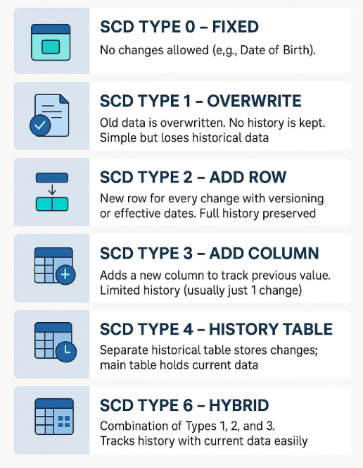
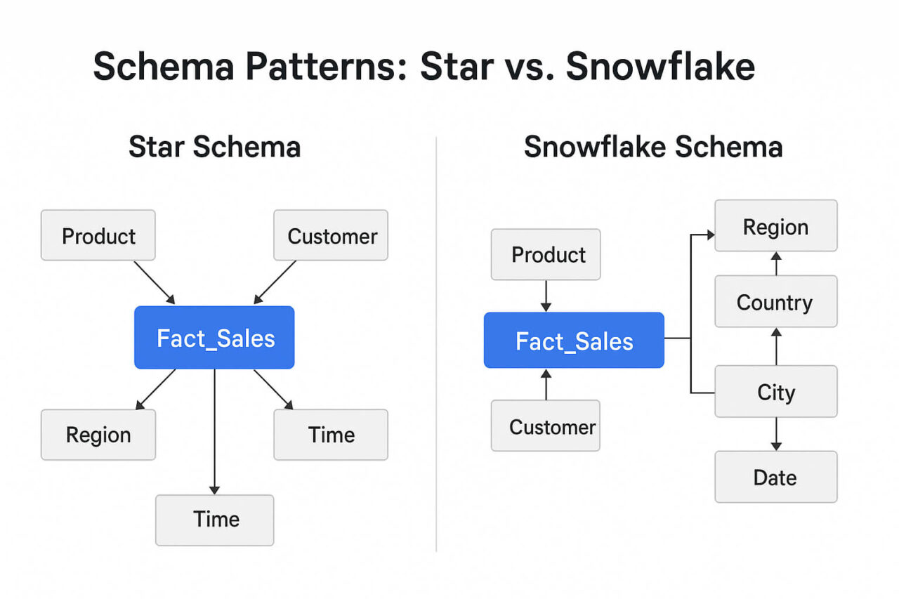
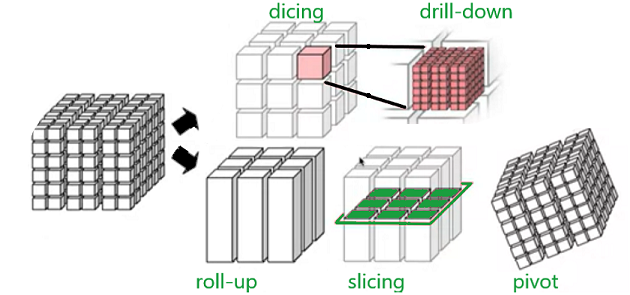
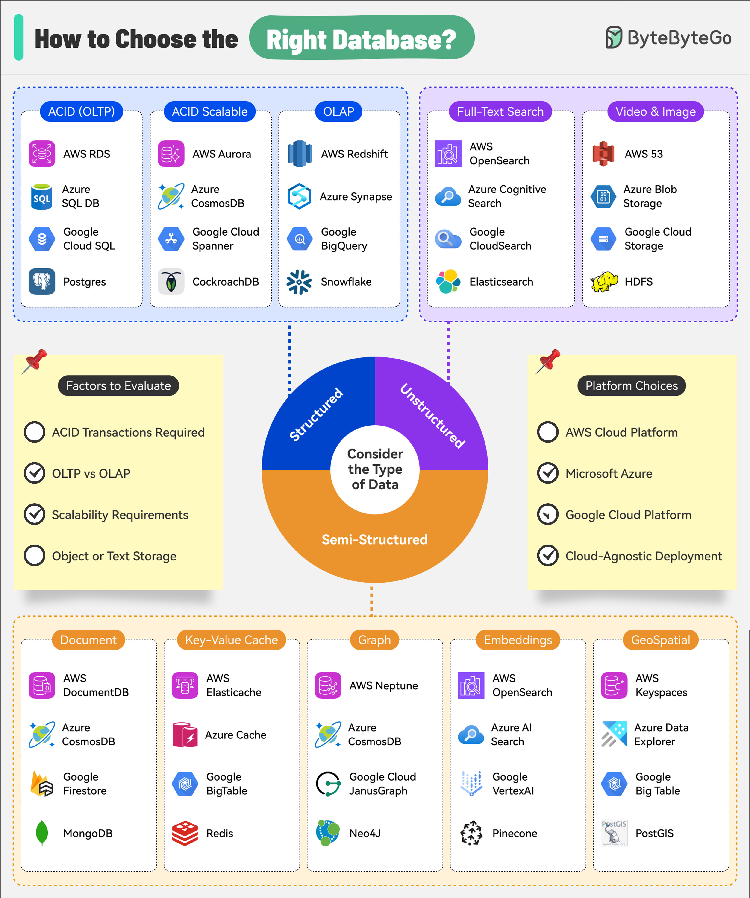

# Analýza dat

> Datové sklady a jejich životní cyklus, zúžené datové sklady (data marts), 
> dimezionální model a jeho implementace (star schema, data cube). 
> Proces extrakce, transformace a nahrávání dat (ETL), 
> profilování dat, datová integrita, kvalita dat.

## Datové sklady
*Představme si nadnárodní maloobchodní řetězec. Informace o prodejích na pokladnách běží v lokálních OLTP databázích na prodejnách, klientský věrnostní program spravuje externí CRM systém a skladové zásoby eviduje ERP systém v centrále. Pokud chce management zjistit, zda marketingová kampaň na sociálních sítích zvýšila prodeje prémiového mléka u zákazníků nad 30 let ve střední Evropě za poslední kvartál, žádný z jednotlivých provozních systémů nedokáže na tuto otázku odpovědět samostatně. Je nutné data z těchto heterogenních zdrojů extrahovat, sjednotit (např. vyřešit, že v CRM je zákazník veden pod ID a na pokladně pod číslem karty), vyčistit a uložit do datového skladu, kde nad nimi lze provést bleskovou vícedimenzionální analýzu.*

Kromě klasických datových skladů se v moderní datové architektuře jako alternativní nebo doplňující řešení využívají **Data Lakes (Datová jezera)**, **Data Lakehouses** a **Data Virtualization (Datová virtualizace)**. Tato řešení se od tradičních datových skladů liší především způsobem, jakým přistupují k formátu ukládaných dat, flexibilitě schématu a nutnosti fyzického přesunu dat:

* **Data Lake (Datové jezero):** Na rozdíl od datového skladu, který vyžaduje přísně strukturovaná a předem transformovaná data (přístup Schema-on-Write), Data Lake slouží k ukládání dat v jejich surovém, nativním formátu (strukturovaná, polostrukturovaná jako JSON/XML i nestrukturovaná jako texty či obrázky) a schéma se definuje až při samotném čtení a analýze (přístup Schema-on-Read).
* **Data Lakehouse:** Toto řešení kombinuje to nejlepší z obou světů tím, že implementuje vrstvu pro správu dat (např. pomocí formátů Delta Lake nebo Iceberg) přímo nad levným a škálovatelným cloudovým Data Lakem, což umožňuje vynucovat datovou integritu, transakce (ACID) a rychlé SQL dotazování typické pro datové sklady, ale nad surovými i strukturovanými daty zároveň.
* **Data Virtualization (Datová virtualizace):** Zatímco datový sklad vyžaduje fyzickou extrakci a centralizované sestěhování dat ze všech zdrojů na jedno místo (proces ETL), datová virtualizace vytváří pouze abstraktní, logickou vrstvu nad stávajícími zdrojovými systémy, která umožňuje dotazovat data v reálném čase přímo tam, kde fyzicky leží, bez nutnosti jejich přesunu.

### Definice a vlastnosti datového skladu
* **Subject-oriented (Subjektově orientovaný):** Data jsou organizována kolem klíčových témat/subjektů podniku (např. zákazník, produkt, prodej), nikoliv kolem provozních aplikací.
* **Integrated (Integrovaný):** Data z různých zdrojů jsou sjednocena, vyčištěna a standardizována (jednotné kódování, formáty, měrné jednotky).
* **Time-varying / Time-variant (Časově proměnný):** Data jsou vždy svázána s časovým údajem a zachycují historii (na rozdíl od OLTP, které reflektuje aktuální stav). Každý klíč v DWH musí přímo nebo nepřímo obsahovat časový prvek.
* **Non-volatile (Stálý/Neměnný):** Jakmile jsou data do skladu nahrána, jsou pouze čtena. Nedochází k jejich běžným modifikacím (`UPDATE`) nebo mazání (`DELETE`) ze strany uživatelů.

### Separace OLTP a OLAP
Hlavním důvodem vzniku DWH je oddělení provozních systémů od analytických:
* **OLTP (Operational):** Podpora každodenních byznys operací. Rychlé, detailní a izolované transakce nad aktuálními daty. Vysoký souběh uživatelů.
* **OLAP (Informational):** Podpora rozhodování a plánování. Komplexní analytické dotazy nad historickými, agregovanými daty. Nízký souběh, ale extrémní náročnost na systémové prostředky.

---

## Životní cyklus datového skladu

Proces zpracování a toku dat sestává z následujících architektonických komponent:
1.  **Source Systems (Zdrojové systémy):** Transakční OLTP databáze, ERP, CRM, ploché soubory atd.
2.  **Data Staging Area (Dočasné úložiště):** Transitní prostor mimo produkční sklad. Surová data jsou zde čištěna, transformována a integrována. Uživatelské dotazy jsou do staging area zakázány, operace probíhají striktně sekvenčně. Není vyžadováno zamykání řádků ani detailní transakční logování.
3.  **Data Warehouse Storage:** Centrální perzistentní vrstva ukládající vyčištěná atomická historická data.
4.  **Information Delivery / Presentation:** Vrstva zpřístupňující data koncovým uživatelům (OLAP kostky, Data Marts, vizualizace v Power BI).

---

## Zúžené datové sklady (Data Marts)

Zúžený datový sklad (Data Mart) je specializovaná podmnožina dat z celopodnikového datového skladu.
Je přizpůsoben požadavkům konkrétní skupiny uživatelů nebo specifickému byznys oddělení (např. marketing, finance, lidské zdroje).
Obsahuje data optimalizovaná (často předagregovaná a denormalizovaná) pro konkrétní analytické úlohy daného oddělení, což zvyšuje rychlost odezvy dotazů.

### Top-down přístup (Bill Inmon)
Tento přístup staví na myšlence, že datový sklad musí být od počátku budován jako jeden centralizovaný, korporátní celek (Enterprise Data Warehouse – EDW). Data jsou do něj importována ze zdrojových systémů přes staging area, integrována a ukládána v plně normalizované podobě (typicky ve 3. normální formě – 3NF).

Jednotlivé zúžené datové sklady (Data Marts) jsou v tomto modelu chápány jako *závislé* (Dependent Data Marts). Nevznikají samostatně, ale jsou fyzicky vyřezávány a transformovány z již existujícího, vyčištěného EDW do denormalizovaných struktur pro potřeby konkrétních oddělení.
* **Výhody:**
    * Poskytuje jedinou a nezpochybnitelnou verzi pravdy (Single Version of Truth) napříč celou společností, protože všechny Data Marty čerpají ze stejného normalizovaného základu.
    * Vysoká konzistence dat a robustní architektura odolná vůči anomáliím při aktualizacích.
    * Snadné začlenění nových, nečekaných byznys témat do stávajícího normalizovaného modelu.
* **Nevýhody:**
    * Extrémní časová a finanční náročnost na počátku projektu (analýza a návrh celého podniku může trvat měsíce až roky, než uživatelé uvidí první reporty).
    * Vysoké nároky na koordinaci mezi odděleními a riziko, že se projekt zhroutí pod vlastní komplexností.

### Bottom-up přístup (Ralph Kimball)
Tento přístup je striktně pragmatický a orientovaný na byznys procesy. Namísto budování obřího celku se datový sklad skládá z unie jednotlivých datových martů, které jsou navrhovány přímo v dimenzionálním formátu (hvězdné schéma – fakta a dimenze).

Data Marty jsou budovány inkrementálně, jeden po druhém (např. nejdříve prodeje, pak sklad, pak finance). Aby spolu tato oddělená úložiště dokázala komunikovat a tvořila konzistentní datový sklad, musí sdílet tzv. **shodné dimenze (Conformed Dimensions)** – např. jednotnou dimenzi času, zákazníka nebo produktu, která má napříč všemi Data Martifikacemi stejnou strukturu i surogátní klíče.
* **Výhody:**
    * Velmi rychlá implementace a dodání prvních výsledků (Business Value) koncovým uživatelům v řádu týdnů či měsíců.
    * Nižší počáteční náklady a flexibilita – sklad roste organicky s tím, jak firma potřebuje pokrývat další byznys oblasti.
    * Struktura je od začátku optimalizovaná pro rychlé analytické dotazy a snadno pochopitelná pro byznys uživatele.
* **Nevýhody:**
    * Pokud se na začátku striktně nenavrhnou a neudrží standardy pro *Conformed Dimensions*, hrozí vznik izolovaných datových sil (Data Silos), která mezi sebou nelze korektně propojit.
    * Správa a údržba sdílených dimenzí se s rostoucím počtem Data Martů stává velmi složitou.
---

## Dimenzionální model a jeho implementace (star schema, data cube)

Dimenzionální modelování rozděluje data do dvou typů tabulek, které mají v architektuře odlišnou roli a chování:

* **Tabulka faktů (Fact Table):** Centrální tabulka obsahující numerická měření, metriky nebo fakta popisující konkrétní byznys události (např. prodané množství, tržba). Obsahuje cizí klíče směřující do tabulek dimenzí.
    * *Granularita (Grain):* Určuje úroveň detailu zachycenou v jednom řádku tabulky faktů (např. jednotlivá položka transakce vs. denní sumář).
    * *Aditivita:* Fakta mohou být plně aditivní (lze je sčítat přes všechny dimenze), semi-aditivní (lze sčítat jen přes některé dimenze, např. stav skladu nelze sčítat přes časovou dimenzi) nebo neaditivní (poměrové ukazatele).

* **Tabulka dimenzí (Dimension Table):** Obklopuje tabulku faktů. Obsahuje textové a popisné atributy, které definují kontext faktů (kdo, co, kde, kdy, proč).
    * *Surogátní klíče (Surrogate Keys):** Uměle generované unikátní celočíselné identifikátory (integery) používané jako primární klíče dimenzí namísto přirozených klíčů z produkčních systémů. Důvody použití: nezávislost na změnách ve zdrojových systémech, vyšší výkon při operacích `JOIN`, podpora sledování historie.

### Správa změn v dimenzích (SCD)
Zatímco tabulky faktů historii nemění a pouze stabilně ukládají záznamy o událostech tak, jak se staly, atributy v tabulkách dimenzí se v průběhu času vyvíjejí. V provozních OLTP systémech se historie málokdy uchovává – když se zákazník přestěhuje, jednoduše se přepíše jeho adresa novou. V datovém skladu se však tato situace musí v rámci dimenzí striktně řešit ze dvou zásadních důvodů:

1.  **Pravdivost a konzistence historického reportingu:** Pokud by se v DWH u zákazníka, který nakupoval 5 let v Brně a nyní se přestěhoval do Prahy, použil pouhý přepis (SCD Typ 1), všechny jeho historické nákupy za posledních 5 let by se zpětně přičetly prodejně v Praze. To by zcela znehodnotilo regionální analýzy výkonnosti prodejen a manažerské reporty.
2.  **Srovnání v čase (As-Is vs. As-Was analýza):** Byznys často potřebuje vidět data ve dvou různých pohledech. Pohled *As-Was* (jak to bylo tehdy) vyžaduje, aby staré tržby zůstaly geograficky v Brně (řeší SCD2). Pohled *As-In* nebo *As-Is* (jak je to z dnešního pohledu) naopak vyžaduje možnost seskupit veškeré historické nákupy tohoto zákazníka pod jeho aktuální bydliště, což umožňují pokročilé hybridní formy SCD.

Pro řízení těchto scénářů se v tabulkách dimenzí implementují **Pomalu se měnící dimenze (Slowly Changing Dimensions - SCD)**:

* **SCD Typ 0:** Pevná hodnota (Fixed) – Hodnota atributu je nastavena při prvním vytvoření a nikdy se nemění (např. datum narození). Jakýkoliv pokus o změnu ve zdrojovém systému se v DWH ignoruje.
* **SCD Typ 1:** Přepis (Overwrite) – Stará hodnota je jednoduše přepsána novou. Historie se nezachovává a všechny historické transakce se okamžitě začnou reportovat pod novou hodnotou.
* **SCD Typ 2:** Přidání řádku (Add new row) – Vytvoří se nový záznam s novým surogátním klíčem a časovým označením platnosti (`Valid From`, `Valid To`, případně příznakem `Is Active`). Plně zachovává historii, protože staré transakce zůstávají navázané na původní surogátní klíč a nové transakce dostanou klíč nový.
* **SCD Typ 3:** Přidání sloupce (Add new column) – Stará hodnota se přesune do dedikovaného sloupce určeného pro předchozí stav (např. `Soucasne_Mesto` a `Predchozi_Mesto`). Zachovává pouze omezenou historii (aktuální a bezprostředně předcházející stav).
* **SCD Typ 4:** Využití historické tabulky (History Table) – Aktuální data se udržují v hlavní tabulce dimenze (která se chová jako SCD Typ 1), ale každá změna se paralelně zapisuje jako nový řádek do samostatné, čistě historické tabulky. Tím se udržuje hlavní dimenze malá a rychlá.
* **SCD Typ 6 (Hybridní 2+3+1):** Kombinace typů 1, 2 a 3 ($2 + 3 + 1 = 6$). Vytvoří se nový řádek pro zachování historie (jako Typ 2), tabulka obsahuje sloupec pro předchozí hodnotu (jako Typ 3) a při změně se v historických řádcích přepíše příznak aktuální hodnoty (jako Typ 1), aby bylo možné snadno reportovat historická fakta podle aktuálního i tehdejšího stavu.

### Implementace: Hvězdné schéma (Star Schema)
* Centrální tabulka faktů je přímo propojena s tabulkami dimenzí pomocí relací `1:N`.
* Tabulky dimenzí jsou záměrně **denormalizované** (obsahují redundanci), což minimalizuje počet potřebných propojení (`JOIN`) při dotazování a maximalizuje rychlost čtení.

### Implementace: Vločkové schéma (Snowflake Schema)
* Je variantou hvězdného schématu, ve které jsou tabulky dimenzí plně nebo částečně **normalizovány** do více úrovní (rozloženy do dalších podtabulek).
* Vztahy mezi tabulkami dimenzí tvoří hierarchickou strukturu (např. tabulka faktů je spojena s dimenzí `Zboží`, ta je spojena s podtabulkou `Subkategorie` a ta následně s podtabulkou `Kategorie`).
* *Výhody:* Minimalizuje redundanci dat v dimenzích a šetří diskový prostor, což zjednodušuje přímou údržbu a aktualizaci samotných dimenzí.
* *Nevýhody:* Výrazně komplikuje strukturu databáze a zpomaluje analytické dotazy, protože exekuce vyžaduje provádění velkého množství kaskádových a výpočetně drahých propojení (`JOIN`).

V moderní praxi datových skladů a Business Intelligence jednoznačně převažuje Hvězdné schéma (Star Schema) před Vločkovým schématem (Snowflake Schema). Hvězdné schéma se používá výrazně častěji, protože moderní analytické databáze a BI nástroje upřednostňují maximální rychlost čtení a srozumitelnost pro uživatele před úsporou diskového prostoru, kterou nabízí normalizované vločkové schéma za cenu drahých a komplikovaných operací JOIN

---
## Datová kostka (Data Cube / OLAP Cube)
* Symbolická vícedimenzionální reprezentace agregovaných dat odvozená z dimenzionálního modelu.
* Kostka se skládá z buněk (cells), které jsou definovány kombinací hodnot jednotlivých dimenzí. Buňka obsahuje předpočítané hodnoty faktů.
* *Hustota kostky:* Kostka může být hustá (dense - většina kombinací dimenzí má data) nebo řídká (sparse - mnoho buněk je prázdných, např. ne všechny produkty se prodávají v každém obchodě každý den). S rostoucím počtem a velikostí dimenzí se kostky stávají řidšími.

#### Základní operace nad datovou kostkou
* **Roll-up (Agregace):** Přechod od detailnějších dat k obecnějším, sumarizace podél hierarchie dimenze (např. z úrovně *Den* na úroveň *Měsíc* nebo z *Město* na *Stát*).
* **Drill-down (Rozpad):** Opak operace roll-up. Přechod od sumárních dat k detailnějším, odhalení podrobnějších struktur (např. z *Rok* na *Kvartál*).
* **Slice (Řez):** Výběr jedné konkrétní hodnoty jedné dimenze, čímž dojde k redukci dimenzionality (vznikne podmožina dat, např. "pouze data pro rok 2026").
* **Dice (Výřez/Kostka):** Výběr sub-kostky definováním omezujících podmínek (predikátů) na více dimenzích současně.
* **Pivot (Otočení):** Změna vizuální orientace zobrazení dat (např. otočení os v tabulce, záměna řádků za sloupce).

---

## Proces extrakce, transformace a nahrávání dat (ETL)

ETL představuje páteřní proces integrace dat z různých zdrojů do DWH a tvoří nejnákladnější a nejkomplexnější část implementace (často až 80 % času vývoje).

### 1. Extraction (Extrakce)
* Fáze získávání dat z heterogenních zdrojových systémů.
* Data jsou zkopírována 1:1 do dočasného úložiště (Staging Area).
* **Incremental Approach (Přírůstkové nahrávání):** Z důvodu úspory času a minimalizace zátěže produkčních systémů se stahují pouze změněná data (delty). Technika se označuje jako **Change Data Capture (CDC)** a může být realizována pomocí časových razítek (`timestamp`), triggerů nebo přímým čtením transakčních logů databáze.

### 2. Transformation (Transformace)
* Fáze úpravy dat do jednotného formátu kompatibilního se schématem DWH.
* *Čištění dat (Cleansing):* Odstranění duplicit, opravy nevalidních hodnot, standardizace formátů a kódování (např. sjednocení zápisu pohlaví na jednotné 'M'/'F').
* *Generování klíčů:* Nahrazení přirozených klíčů klíči surogátními a správa verzí u pomalu se měnících dimenzí (SCD).
* *Komplexní transformace a byznys logika:* Výpočet odvozených atributů, kalkulace metrik a agregací.

### 3. Loading (Nahrávání)
* Fáze zápisu zpracovaných dat do finálních struktur (tabulek faktů a dimenzí) v DWH.
* Při prvotním plnění se provádí **Initial Load** (masivní zápis historických dat). Při běžném provozu probíhá **Incremental Load** (pravidelný zápis nových přírůstků).
* *Optimalizace výkonu při nahrávání:* Využití hromadného nahrávání (**Bulk Load**) namísto standardních `INSERT` příkazů po jednotlivých řádcích.
    * Dočasné vypnutí nebo dropování indexů a integritních omezení (constraints) před nahráváním a jejich následné znovuvytvoření (rebuild) po dokončení importu.
    * Výpočet pre-agregací a aktualizace materializovaných pohledů.

---

## Profilování dat
* Profilování dat je analytické zkoumání datových sad ze zdrojových systémů před jejich integrací do datového skladu.
* Účelem je získat hluboké porozumění skutečné struktuře, obsahu, závislostem a anomáliím v datech. Pomáhá odhalit skryté problémy dříve, než selže ETL proces.

### Klíčové techniky profilování dat
* **Strukturální analýza (Structure Analysis):** Ověřování formálního formátu dat *(např. zda délka řetězců odpovídá definici schématu, detekce nečekaných `NULL` hodnot v polích, která by měla být povinná).*
* **Obsahová analýza (Content Analysis):** Detailní pohled na jednotlivé hodnoty atributů.
    * *Frekvenční distribuce:* Analýza četnosti výskytu jednotlivých hodnot, která odhaluje nekonzistence *(např. zápis jedné země jako "CZ", "CZE", "Czechia").*
    * *Statistické shrnutí:* Výpočet minimálních, maximálních hodnot, průměrů a směrodatných odchylek pro numerická pole, což umožňuje detekovat odlehlé hodnoty (outliers, např. záporný věk nebo nereálně vysoká prodejní cena).
* **Vztahová analýza (Relationship Analysis):** Zkoumání vazeb napříč tabulkami. Identifikace implicitních vztahů a ověřování, zda klíče mezi tabulkami skutečně lícují, čímž se zjišťuje stav referenční integrity v reálných datech (bez ohledu na to, zda je deklarována na úrovni databázového schématu).

---

## Datová integrita

Datová integrita zajišťuje, že data uložená v databázi jsou přesná, platná, vnitřně konzistentní a že odpovídají sadě definovaných strukturálních pravidel. V prostředí DWH je její striktní vynucení kritické, protože analýzy pracují s daty z mnoha různých systémů.

* **Entitní integrita (Entity Integrity):** Každá tabulka musí mít definovaný primární klíč (v DWH typicky surogátní), který jednoznačně identifikuje každý řádek a nesmí obsahovat hodnotu `NULL`.
* **Referenční integrita (Referential Integrity):** Zajišťuje správnost a existenci vztahů mezi tabulkami. Cizí klíč v tabulce faktů musí vždy odkazovat na existující primární klíč v tabulce dimenze. 
    * *Řešení porušení v ETL:* Pokud v tabulce faktů existuje záznam s klíčem, který v dimenzi chybí, ETL nesmí záznam zahodit (způsobilo by to ztrátu finančních reportů). Namísto toho se záznam naváže na speciální předem připravený řádek v dimenzi s identifikátorem např. `-1` (reprezentující hodnotu "Neznámý/Neuvedený produkt").
* **Doménová integrita (Domain Integrity):** Všechny hodnoty v daném sloupci musí splňovat definovaný typ, formát a povolený rozsah hodnot (např. věk musí být kladné celé číslo v rozmezí 0–120, datum musí odpovídat reálnému kalendáři).

---

## Kvalita dat

* Kvalita dat určuje míru vhodnosti dat pro byznys rozhodování. 
* V prostředí Business Intelligence platí pravidlo **GIGO (Garbage In, Garbage Out)** – i ten nejlepší analytický model nebo report poskytne chybné a zavádějící výsledky, pokud jsou vstupní data nekvalitní.

### Dimenze kvality dat (Data Quality Dimensions)
Kvalita se měří a vyhodnocuje pomocí několika standardních dimenzí:
* **Přesnost (Accuracy):** Míra, do jaké uložená data věrně popisují reálné objekty nebo události *(např. správně zapsané jméno a příjmení bez překlepů).*
* **Úplnost (Completeness):** Indikuje, zda jsou přítomny všechny byznysově vyžadované datové prvky *(např. zda u zákaznického profilu nechybí PSČ nebo kontaktní údaj).*
* **Konzistence (Consistency):** Zajišťuje, že identická informace nemá v různých částech systému (nebo v různých systémech) protichůdné hodnoty *(např. celkový reporting obratu musí vykazovat stejné číslo v reportu pro logistiku i v reportu pro finance).*
* **Unikátnost (Uniqueness):** Každá entita nebo událost je v databázi zachycena právě jednou. Detekce a eliminace duplicit *(např. situace, kdy je jeden zákazník v systému zaveden dvakrát pod mírně odlišnými ID).*
* **Aktuálnost (Timeliness):** Určuje, zda jsou data k dispozici v čase, kdy jsou potřeba pro rozhodování. Zpoždění dat nesmí znehodnotit jejich informační hodnotu *(např. report pro denní plánování skladových zásob nemůže pracovat s týden starými daty).*
* **Validita / Shoda s pravidly (Validity):** Míra, do jaké data odpovídají definovaným syntaktickým standardům, vzorům a regulím *(např. e-mailová adresa musí obsahovat znak `@`, rodné číslo musí splňovat dělitelnost jedenácti).*

