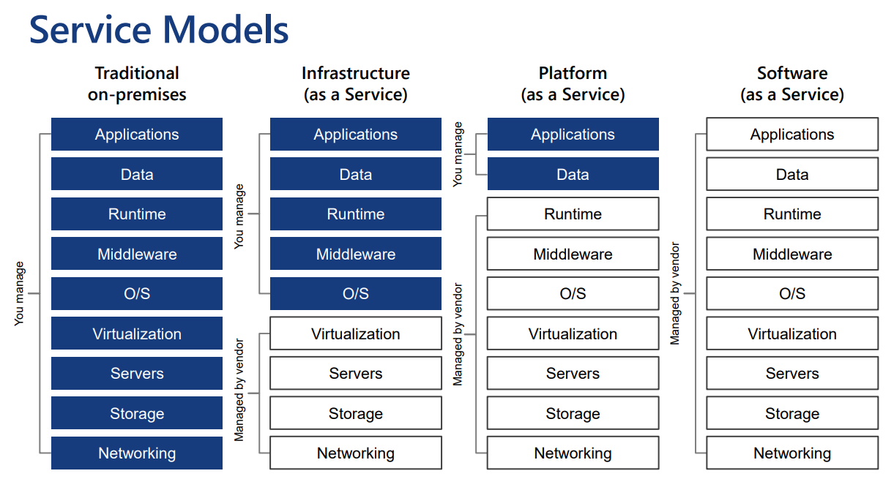
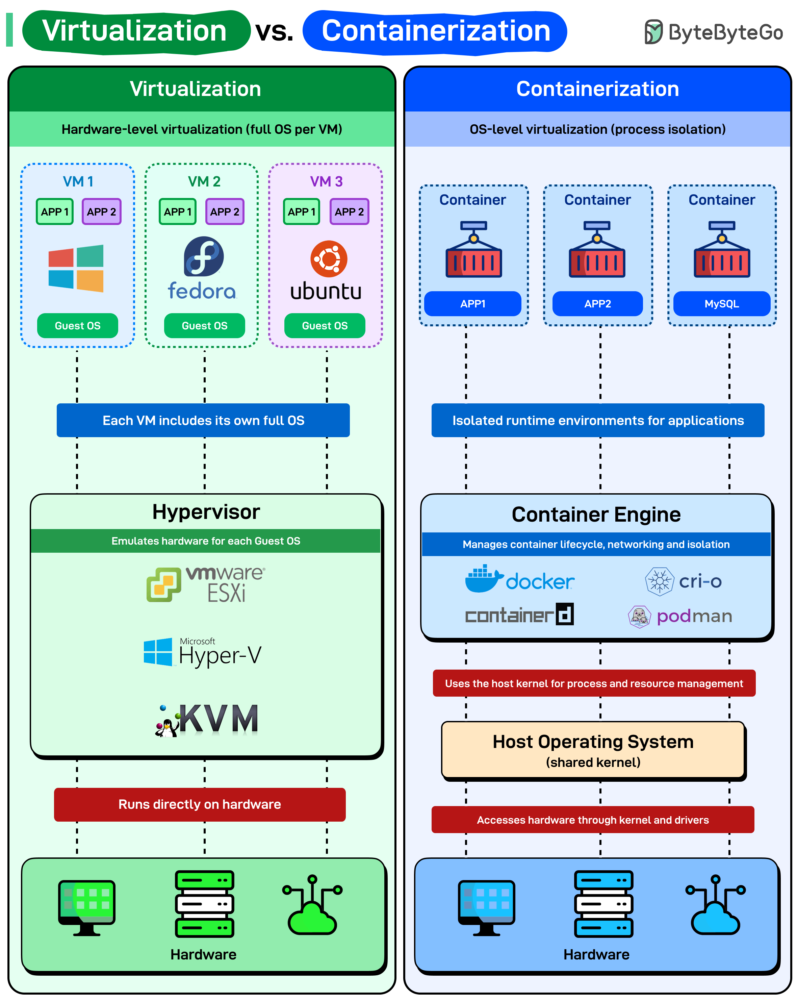
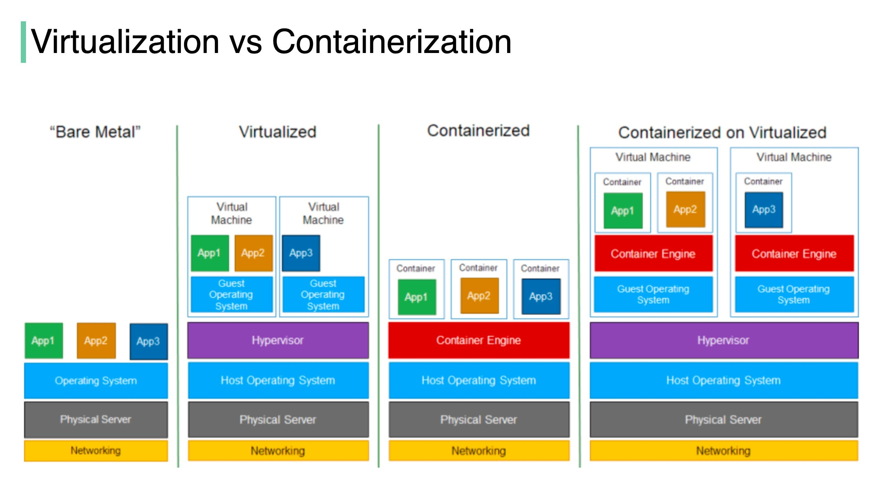
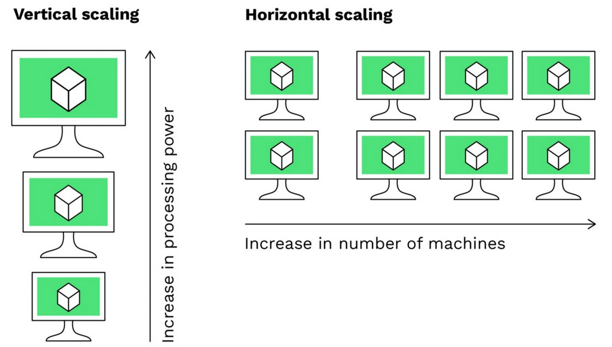
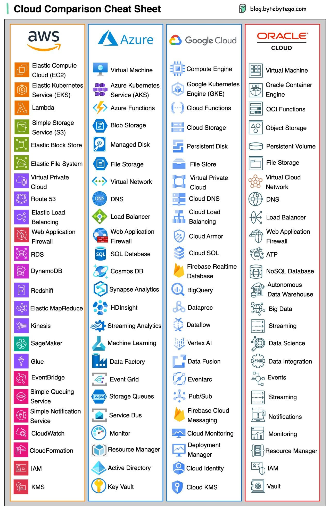
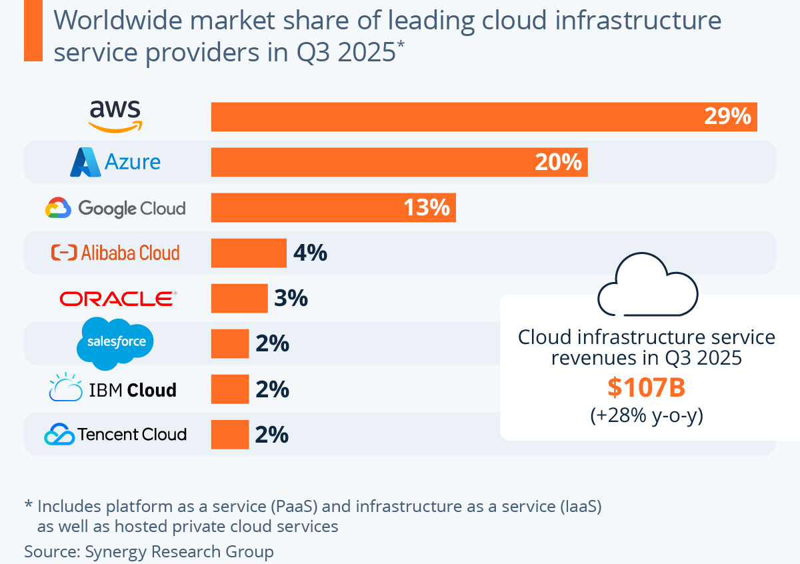
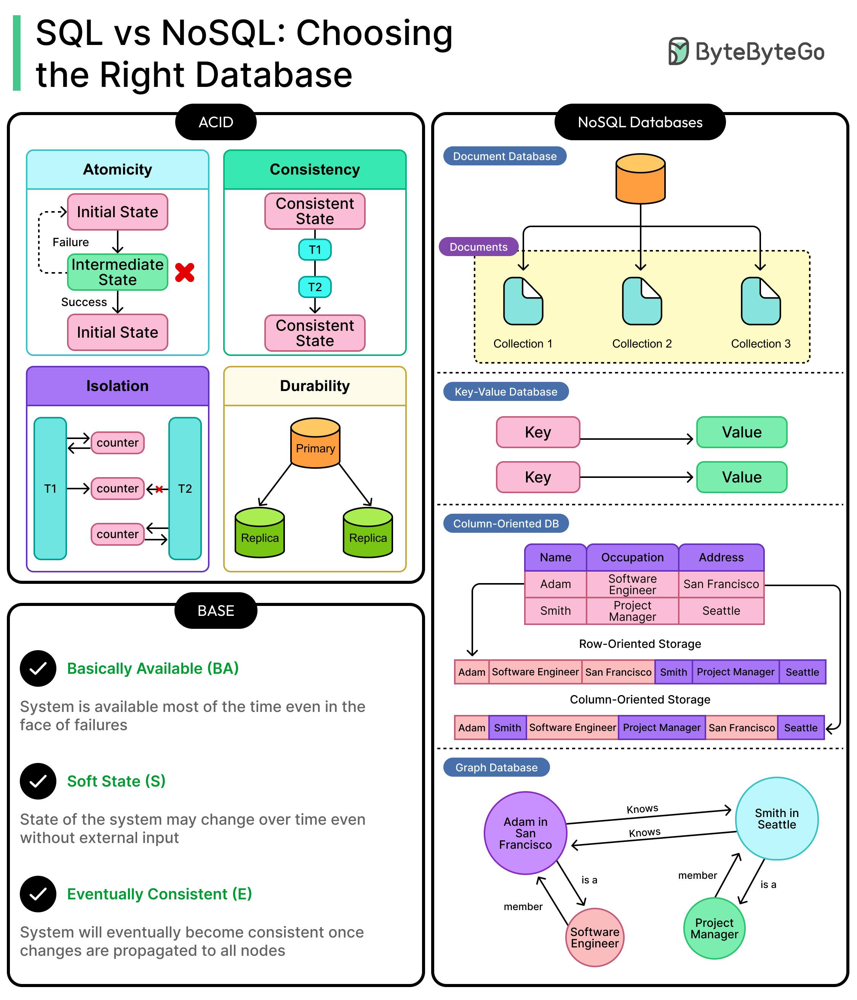

# Cloudové počítání a distribuované databáze

> Cloudové počítání: základní principy, infrastruktura jako služba (IaaS), virtualizace a kontejnery, migrace na cloud, 
> bezpečnost služeb, horizontální a vertikální škálovatelnost. 
> Současné technologie a poskytovatelé cloudových služeb. 
> Distribuované databáze: principy a výhody NoSQL přístupu, konzistence, distribuce dat. 
> Úložiště párů klíč-hodnota, dokumentové databáze, grafové databáze, sloupcově orientované databáze. (PA200, PA195)

## Základní principy cloud computingu

Cloud computing je model umožňující všudypřítomný a pohodlný síťový přístup na vyžádání ke sdílenému fondu konfigurovatelných výpočetních zdrojů. Tyto zdroje (sítě, servery, úložiště, aplikace) lze rychle poskytnout a uvolnit s minimálním úsilím při správě nebo interakci s poskytovatelem.

### Hlavní charakteristiky (dle NIST)
* **On-demand self service:** Uživatel si může automaticky sjednat výpočetní kapacity (např. čas serveru nebo síťové úložiště) bez nutnosti lidské interakce s poskytovatelem služeb.
* **Broad network access:** Služby jsou dostupné přes síť prostřednictvím standardních mechanismů, které podporují různé platformy (mobilní telefony, tablety, notebooky).
* **Resource pooling:** Výpočetní zdroje poskytovatele jsou sdíleny více spotřebiteli pomocí modelu multi-tenancy, přičemž různé fyzické a virtuální zdroje jsou dynamicky přiřazovány podle poptávky.
* **Rapid elasticity:** Kapacity mohou být elasticky uvolňovány nebo poskytovány (často automaticky), aby bylo možné rychle škálovat směrem nahoru i dolů podle aktuálních potřeb.
* **Measured service:** Cloudové systémy automaticky řídí a optimalizují zdroje pomocí měření spotřeby (např. úložiště, procesor, šířka pásma), což umožňuje transparentní vyúčtování pro poskytovatele i uživatele.

### Modely nasazení (Deployment Models)
* **Public cloud:** Infrastruktura je přístupná široké veřejnosti a vlastněna organizací prodávající cloudové služby. _např. AWS, Azure._
* **Private cloud:** Infrastruktura je provozována výhradně pro jednu organizaci. _např. interní datové centrum firmy._
* **Hybrid cloud:** Kombinace dvou nebo více cloudů (soukromých, komunitních nebo veřejných), které zůstávají unikátními entitami, ale jsou propojeny technologií umožňující přenositelnost dat a aplikací.

### Modely služeb (Service Models)
* **IaaS (Infrastructure as a Service):** Poskytování základní infrastruktury (virtuální stroje, sítě, úložiště).
* **PaaS (Platform as a Service):** Poskytování platformy pro vývoj a běh aplikací bez nutnosti správy podkladového HW a OS.
* **SaaS (Software as a Service):** Poskytování hotových aplikací běžících v cloudové infrastruktuře.
* **Serverless / FaaS (Function as a Service):** Nejvyšší abstrakce. Kód se spouští pouze na základě události (event-driven). Uživatel neřeší servery ani nečinný výkon. *Problém:* **Cold Start** – prodleva při alokaci zdrojů pro první spuštění funkce.

---
## Infrastruktura jako služba (IaaS)

IaaS představuje nejnižší a nejvíce flexibilní úroveň cloudových služeb. Poskytovatel v tomto modelu nabízí základní výpočetní zdroje, které jsou plně virtualizované. Uživatel má kontrolu nad operačním systémem, úložištěm a nasazenými aplikacemi, zatímco poskytovatel se stará o fyzickou vrstvu (servery, sítě, datová centra).

### Klíčové komponenty IaaS
* **Compute (Výpočet):** Virtuální stroje (VM) s definovaným počtem CPU jader a kapacitou RAM. *např.: Vývojář si během minuty spustí instanci Amazon EC2 s operačním systémem Ubuntu, aby na ní otestoval nový skript v Pythonu.*
* **Storage (Úložiště):** Virtuální pevné disky (blokové úložiště) nebo objektová úložiště pro nestrukturovaná data. *např.: Připojení dodatečného 500 GB SSD disku k běžícímu virtuálnímu serveru pro potřeby rostoucí databáze.*
* **Networking (Sítě):** Virtuální sítě (VPC), firewally, směrovače a přidělování IP adres. *např.: Nastavení bezpečnostních pravidel (Security Groups), která zakážou veškerý přístup k serveru z internetu kromě specifického portu 443 pro HTTPS provoz.*

### Model sdílené odpovědnosti (Shared Responsibility Model)
V modelu IaaS je hranice odpovědnosti jasně dělena mezi poskytovatele a zákazníka. Obecné pravidlo zní: poskytovatel odpovídá za bezpečnost **cloudu**, zákazník za bezpečnost **v cloudu**.

* **Odpovědnost zákazníka:** Správa a aktualizace operačního systému (patchování), konfigurace firewallů na úrovni OS, správa identity a přístupů (IAM), šifrování dat a samotné aplikace.
* **Odpovědnost poskytovatele:** Fyzická bezpečnost datových center, funkčnost hardwaru, chlazení, konektivita a správa virtualizační vrstvy (hypervisoru).

### Výhody a nevýhody
| Výhody | Nevýhody |
| :--- | :--- |
| **Škálovatelnost:** Možnost okamžitě navýšit výkon. | **Náročná správa:** Vyžaduje experty na správu OS a sítí. |
| **Nákladová efektivita:** Platba za skutečné využití (Pay-as-you-go). | **Bezpečnostní rizika:** Špatná konfigurace OS je plně na uživateli. |
| **Kontrola:** Možnost instalovat libovolný software a knihovny. | **Režie:** Nutnost řešit zálohování a aktualizace systému. |

*Příklad využití: Start-up využívá IaaS, aby nemusel kupovat drahé fyzické servery. Když se jejich aplikace stane populární, během pár kliknutí navýší počet virtuálních strojů z 2 na 20, aby zvládli nápor uživatelů.*

### Hlavní poskytovatelé a jejich služby
1.  **Amazon Web Services (AWS):** Služba **Amazon EC2** (Elastic Compute Cloud).
2.  **Microsoft Azure:** Služba **Azure Virtual Machines**.
3.  **Google Cloud Platform (GCP):** Služba **Compute Engine**.

---
## Virtualizace a kontejnery
Virtualizace a kontejnerizace jsou dvě klíčové technologie umožňující izolaci aplikací a efektivní využití fyzického hardwaru. 
Zatímco virtualizace simuluje celý hardware (včetně OS), kontejnerizace sdílí jádro operačního systému a izoluje pouze aplikaci a její závislosti.

### Virtualizace
Virtualizace vytváří abstraktní vrstvu nad fyzickým hardwarem pomocí softwaru zvaného **Hypervisor**. 
Ten umožňuje rozdělit jeden fyzický server na více nezávislých **virtuálních strojů (Virtual Machines)**.

* **Virtuální stroj (VM):** Obsahuje úplnou kopii operačního systému, aplikaci a všechny nezbytné knihovny. Každý stroj je plně izolovaný od ostatních.
* **Hypervisor:** Software, který spravuje a přiděluje fyzické zdroje (CPU, RAM, disk) jednotlivým VM.  *např: Na jednom fyzickém serveru v datovém centru běží současně virtuální Windows Server pro vnitropodnikové účetnictví a virtuální Linux pro veřejný webový server, aniž by se navzájem ovlivňovaly.*

#### Typy hypervisorů:
1.  **Typ 1 (Bare-metal):** Běží přímo na hardwaru (např. *VMware ESXi, Microsoft Hyper-V, KVM*). Používá se v profi datových centrech.
2.  **Typ 2 (Hosted):** Běží jako aplikace na hostitelském operačním systému (např. *Oracle VirtualBox, VMware Workstation*). Vhodné pro testování na lokálním PC.

### Kontejnerizace
Kontejnery jsou lehkou alternativou k virtuálním strojům. Neobsahují vlastní operační systém, ale využívají jádro (kernel) hostitelského systému. Jsou izolované na úrovni procesů.

* **Kontejner:** Balíček, který obsahuje kód aplikace a všechny její závislosti (runtime, knihovny).
* **Container Engine:** Software (např. *Docker*), který spouští a spravuje kontejnery. *Příklad: Vývojář zabalí aplikaci v Pythonu do Docker kontejneru na svém notebooku (macOS). Ten samý kontejner pak spustí na produkčním serveru (Linux) a má 100% jistotu, že aplikace poběží identicky, protože si nese své prostředí s sebou.*
* **Cloud-Native / Mikroslužby:** Moderní trend rozbíjení aplikací na malé, nezávisle nasaditelné služby. K tomu se váže metodika **12-factor app** (např. bezstavovost aplikací, konfigurace v prostředí).

### Srovnání: Virtualizace vs. Kontejnerizace

| Vlastnost | Virtuální stroje (VM) | Kontejnery |
| :--- | :--- | :--- |
| **Izolace** | Úplná (vlastní jádro OS) | Na úrovni procesů (sdílené jádro) |
| **Rychlost startu** | Minuty (bootování celého OS) | Sekundy (spuštění procesu) |
| **Velikost** | Gigabyty (GB) | Megabyty (MB) |
| **Režie (Overhead)** | Vysoká (každý VM má svůj OS) | Minimální |
| **Typické užití** | IaaS, izolace různých OS | Mikroslužby, CI/CD, DevOps |

### Orchestrace kontejnerů
V produkčním prostředí, kde běží stovky kontejnerů, je nutná automatizace jejich správy (nasazování, škálování, restartování). K tomu slouží **orchestrační nástroje**.

* **Kubernetes (K8s):** Průmyslový standard pro orchestraci. Zajišťuje, aby kontejnery běžely na správných uzlech a měly dostatek zdrojů. *Příklad: E-shop zaznamená náhlý příval zákazníků. Kubernetes automaticky alokuje počet kontejnerů s webovým rozhraním ze 3 na 10, aby web zůstal rychlý.*
* **Docker Swarm:** Jednodušší nástroj pro orchestraci, integrovaný přímo v Dockeru.

### Srovnání mechanismů nasazení aplikací

Na základě architektury vrstvení rozlišujeme čtyři základní přístupy k provozu aplikací. Hlavním rozdílem je míra izolace a efektivita využití systémových zdrojů.

#### 1. Bare Metal (Tradiční model)
Aplikace běží přímo na operačním systému, který je nainstalován na fyzickém serveru.
* **Charakteristika:** Žádná virtualizace. Aplikace sdílejí knihovny a zdroje jednoho OS.
* **Nevýhoda:** Pokud jedna aplikace vyžaduje jinou verzi knihovny než druhá, dochází ke konfliktům. Špatně se škáluje a nevyužívá plný potenciál hardwaru.
* *Příklad: Účetní software nainstalovaný přímo na firemním Windows serveru v kanceláři.*

#### 2. Virtualized (Virtualizace)
Mezi hardware a aplikace se vkládá **Hypervisor**, který umožňuje běh více izolovaných **virtuálních strojů (VM)**.
* **Charakteristika:** Každý VM má svůj vlastní "Guest OS". Je to kompletní simulace počítače.
* **Výhoda:** Vysoká bezpečnost a úplná izolace (na jednom serveru může běžet Linux i Windows zároveň).
* **Nevýhoda:** Vysoká režie (overhead) – každý VM spotřebovává RAM a CPU jen pro běh svého vlastního operačního systému.

#### 3. Containerized (Kontejnerizace)
Místo celých operačních systémů se využívá **Container Engine**, který izoluje pouze aplikace a jejich závislosti.
* **Charakteristika:** Všechny kontejnery sdílejí jedno společné jádro hostitelského OS.
* **Výhoda:** Extrémní rychlost startu a nízké nároky na zdroje (žádný Guest OS).
* *Příklad: Na jednom serveru běží 50 mikroservis v Docker kontejnerech, které se spustí během milisekund.*

#### 4. Containerized on Virtualized (Kombinovaný model)
V cloudu (AWS, Azure) se nejčastěji setkáte s touto variantou: Kontejnery běží uvnitř virtuálních strojů.
* **Charakteristika:** Poskytovatel vám pronajme virtuální stroj (IaaS), do kterého si vy nainstalujete Container Engine a v něm spouštíte kontejnery.
* **Důvod:** Spojuje výhody obou světů – silnou izolaci na úrovni IaaS (bezpečnost v cloudu) a flexibilitu kontejnerů pro vývojáře.
* *Příklad: V rámci jedné instance Azure VM provozujete 10 Docker kontejnerů s různými částmi vašeho e-shopu.*

| Prvek | Bare Metal | Virtualized | Containerized |
| :--- | :--- | :--- | :--- |
| **Izolační vrstva** | Žádná (jen OS) | Hypervisor | Container Engine |
| **Jednotka nasazení** | Aplikace (.exe, .bin) | Virtuální stroj (image OS) | Kontejner (image s lib) |
| **Rychlost** | Maximální | Pomalejší (boot OS) | Téměř nativní |

---
## Migrace na cloud

Migrace na cloud je proces přesunu digitálních aktiv (dat, aplikací, IT infrastruktury) z lokálního prostředí (on-premise) nebo jiného cloudu do cloudového prostředí. Cílem je obvykle snížení nákladů, zvýšení dostupnosti a lepší škálovatelnost.

### Strategie migrace (Model 6 R)
Gartner definoval šest základních přístupů k migraci, které se liší složitostí a mírou úprav aplikací:

1.  **Rehosting (Lift-and-Shift):** Přesun aplikace do cloudu bez jakýchkoliv změn.
    * *Příklad: Vezmete celý virtuální stroj se starším účetním systémem a prostě ho spustíte jako instanci v AWS EC2.*
2.  **Replatforming (Lift-and-Reshape):** Provedení drobných optimalizací pro využití cloudových výhod, ale bez změny architektury.
    * *Příklad: Místo správy vlastní SQL databáze na virtuálním stroji převedete data do spravované služby typu Azure SQL Database.*
3.  **Refactoring / Re-architecting:** Kompletní přepsání aplikace tak, aby byla "cloud-native" (využívala mikroslužby, kontejnery).
    * *Příklad: Rozbití monolitické aplikace na malé samostatné kontejnery spravované v Kubernetes.*
4.  **Repurchasing (Drop-and-Shop):** Ukončení používání stávajícího řešení a přechod na hotovou SaaS službu.
    * *Příklad: Firma přestane spravovat vlastní e-mailový server (Exchange) a přejde na Microsoft 365.*
5.  **Retiring:** Identifikace a vypnutí aplikací, které už nejsou potřeba.
6.  **Retaining:** Ponechání aplikace v současném stavu (on-premise), obvykle z důvodu bezpečnosti nebo regulací.

### Fáze migračního procesu
1.  **Objevování a hodnocení (Discovery):** Analýza stávající infrastruktury, závislostí mezi aplikacemi a nákladů.
2.  **Plánování a design:** Výběr migrační strategie (viz 6 R) a návrh cílové architektury v cloudu.
3.  **Samotná migrace:** Postupný přesun dat a aplikací (často nejdříve testovací prostředí).
4.  **Optimalizace:** Sledování provozu v cloudu a ladění výkonu/nákladů po migraci.

### Výzvy a rizika migrace
* **Vendor Lock-in:** Riziko přílišné závislosti na nástrojích jednoho konkrétního poskytovatele, což ztěžuje budoucí odchod.
* **Bezpečnost a compliance:** Nutnost zajistit, aby data v cloudu splňovala zákonné požadavky (např. GDPR).
* **Náklady na přenos dat (Egress fees):** Někteří poskytovatelé si účtují poplatky za stahování velkého množství dat z cloudu ven.
* **Latence:** Pokud část systému zůstane on-premise a část v cloudu, může komunikace mezi nimi zpomalit celou aplikaci.
    * *Příklad: Máte webový server v cloudu v Irsku, ale databázi v Praze – uživatel bude pociťovat pomalé načítání stránek kvůli síťovému zpoždění.*

---
## Bezpečnost služeb v cloudu

Bezpečnost v cloudu se transformuje z ochrany „fyzického perimetru“ (zdí datacentra) na ochranu **identit, dat a konfigurací**. Klíčovým konceptem je, že bezpečnost je **sdílenou odpovědností**.

### 1. Model sdílené odpovědnosti (Shared Responsibility)
Dělí úkoly mezi poskytovatele a zákazníka. Pravidlo: Poskytovatel ručí za **bezpečnost cloudu**, zákazník za **bezpečnost v cloudu**.
* **Poskytovatel (AWS/Azure/GCP):** Fyzický hardware, hypervisor, globální síť, budovy.
* **Zákazník:** Operační systém (záplaty), data, aplikace, nastavení firewallů a šifrování.
* *Příklad: Pokud v cloudu necháte otevřenou databázi bez hesla, je to vaše chyba (špatná konfigurace), nikoliv chyba Microsoftu.*

### 2. Identity and Access Management (IAM)
Identita je v cloudu novou „stěnou“. Cílem je řídit, kdo (User) může dělat co (Action) se kterým zdrojem (Resource).
* **Least Privilege (Princip nejnižších privilegií):** Uživatel má jen ta práva, která nezbytně potřebuje (např. *stážista nemůže smazat celou databázi*).
* **MFA (Vícefaktorové ověřování):** Nutnost druhého faktoru (aplikace, SMS) pro přihlášení.
* **Zero Trust Architecture:** Přístup „nikdy nedůvěřuj, vždy prověřuj“. Každý požadavek na přístup je ověřován, i když přichází z vnitřní sítě.

### 3. Ochrana dat a šifrování
Data musí být chráněna ve všech stavech:
* **At Rest (Uložená):** Šifrování disků a databází. *Příklad: Pokud by někdo fyzicky ukradl disk z datacentra, data z něj bez klíče nepřečte.*
* **In Transit (V pohybu):** Šifrování komunikace po síti (HTTPS, TLS, VPN).
* **In Use (Při zpracování):** Moderní technologie jako důvěrné výpočty (Confidential Computing).

### 4. Síťová izolace, Compliance a IaC
* **VPC / VNet:** Virtuální privátní sítě, které izolují vaše zdroje od ostatních zákazníků.
* **Security Groups:** Virtuální firewally na úrovni jednotlivých serverů (povolování portů).
* **Infrastructure as Code (IaC):** Správa a poskytování infrastruktury prostřednictvím definic v kódu (např. *Terraform, CloudFormation*).  Zabraňuje "configuration drift" (nežádoucím ručním změnám), umožňuje audit změn v Gitu a eliminuje lidské chyby při ručním klikání v administraci.
* **Compliance:** Soulad s předpisy (GDPR, ISO 27001). Cloudoví poskytovatelé mají hotové audity, které zákazník „dědí“.
---
## Horizontální a vertikální škálovatelnost
Škálovatelnost je schopnost systému efektivně zvládat rostoucí nároky (data, uživatelé, výpočetní výkon) přidáváním hardwarových prostředků bez nutnosti zásadní změny architektury.

### Vertikální škálování (Scaling Up)
Zvyšování výkonu **jednoho stávajícího uzlu** (navýšení CPU, RAM, GPU nebo kapacity disku).
* **Vlastnosti:** Architektonicky nejjednodušší přístup; aplikace běží na jednom stroji, což eliminuje síťovou latenci mezi uzly.
* **Omezení:** Má pevný **hardwarový strop** (fyzické limity serveru); představuje **SPOF** (Single Point of Failure); náklady rostou nelineárně (špičkový hardware je neúměrně drahý).
* **Kontext AI:** Ideální pro trénování modelů, které vyžadují vysokou propustnost paměti na jednom stroji a vejdou se do kapacity jedné nebo více GPU v rámci jednoho serveru.

### Horizontální škálování (Scaling Out)
Propojování **více běžných strojů** do jednoho logického celku (**clusteru**).
* **Vlastnosti:** Teoreticky **neomezený růst** přidáváním dalších uzlů; vysoká dostupnost a odolnost proti výpadku (při selhání uzlu zbytek clusteru pracuje dál).
* **Omezení:** Vyžaduje komplexní distribuční logiku (Load Balancer, Sharding); naráží na limity sítě a **CAP teorém** (kompromis mezi konzistencí a dostupností).
* **Kontext AI:** Klíčové pro Big Data a distribuované trénování (např. trénování LLM rozprostřené přes tisíce GPU pomocí frameworků jako Horovod nebo PyTorch Distributed).

### Srovnání parametrů

| Vlastnost | Vertikální (Scale-Up) | Horizontální (Scale-Out) |
| :--- | :--- | :--- |
| **Metoda** | Navýšení výkonu (silnější HW) | Navýšení počtu (více uzlů) |
| **Limit výkonu** | Pevně daný HW limity | Prakticky neomezený |
| **Dostupnost** | Nízká (výpadek stroje = výpadek všeho) | Vysoká (redundance uzlů) |
| **Cena** | Nelineární (high-end HW je drahý) | Lineární (běžný "commodity" HW) |
| **Administrace** | Snadná (správa jedné instance) | Náročná (správa clusteru a sítě) |

### Další pojmy související se škálováním

* **Load Balancer:** Rozděluje příchozí provoz mezi více serverů pro rovnoměrné vytížení.
* **Statelessness:** Architektura bez ukládání stavu na uzlu, umožňující snadné přidávání instancí.
* **Sharding:** Horizontální dělení velkých databází na menší části (shardy) napříč uzly.
* **Auto-scaling:** Automatické upravování počtu běžících instancí podle aktuální zátěže.
* **Read Replicas:** Kopie databáze vyhrazené pro čtení, odlehčující hlavnímu (zápisovému) uzlu.
* **Caching:** Ukládání dat v rychlé paměti (RAM) pro snížení počtu dotazů na úložiště.
* **Rate Limiting:** Omezení počtu požadavků na uživatele pro ochranu systému před zahlcením.
* **High Availability (HA):** Návrh systému zajišťující provoz i při selhání jednotlivých komponent.
* **Latency vs. Throughput:** Latence je doba odezvy, propustnost je množství odbavených požadavků.

---
## Současné technologie a poskytovatelé cloudových služeb
* Dominantní poskytovatelé (AWS, Azure, GCP)
* Serverless computing (FaaS)
* Cloud-native technologie a mikro-služby 
  

## Současné technologie a poskytovatelé cloudových služeb

Trhu s veřejným cloudem dominují tři hlavní poskytovatelé (tzv. "The Big Three"), které doplňují specializovaní hráči jako Oracle. Každý z nich nabízí ekvivalentní služby pro výpočet, úložiště, sítě a databáze.

### Hlavní poskytovatelé na trhu
1.  **Amazon Web Services (AWS):** Průkopník a aktuální leader trhu. Nabízí nejširší portfolio služeb a největší komunitu.
2.  **Microsoft Azure:** Silná integrace s podnikovým softwarem (Active Directory, Windows Server, Office 365). Často volba pro hybridní cloudy.
3.  **Google Cloud Platform (GCP):** Silný v oblasti analýzy velkých dat (Big Data), umělé inteligence (AI/ML) a kontejnerizace (původce Kubernetes).
4.  **Oracle Cloud (OCI):** Zaměřuje se na vysoký výkon databází a podnikovou sféru využívající Oracle technologie.

### Trendy v cloudových technologiích
* **Serverless Computing:** Uživatel se vůbec nestará o servery, pouze nahraje kód, který se spustí na základě události. *Příklad: Kód, který automaticky vytvoří náhled (thumbnail) obrázku v momentě, kdy ho uživatel nahraje do úložiště.*
* **Multi-cloud a Hybrid-cloud:** Strategie používání více poskytovatelů najednou, aby se firma vyhnula závislosti na jednom prodejci (Vendor Lock-in).
* **Edge Computing:** Přesun výpočetního výkonu blíž ke zdroji dat (např. senzory v továrně), aby se snížila latence.
* **AI a ML jako služba (AIaaS):** Poskytovatelé nabízejí hotové API pro rozpoznávání obrazu, textu nebo trénování vlastních modelů (např. *AWS SageMaker* nebo *Google Vertex AI*).

---
## Distribuované databáze

Distribuované databáze (DDB) ukládají data na více uzlech propojených sítí. Cílem je zvýšení dostupnosti, odolnosti proti chybám a výkonu při zpracování velkých objemů dat.

### CAP teorém (Brewerův teorém)
Základní teoretický limit distribuovaných systémů. Říká, že nelze současně zajistit všechny tři následující vlastnosti:

* **Consistency (Konzistence):** Všichni klienti vidí ve stejný okamžik stejná data. 
  _např.: Pokud v bankovní aplikaci vyberete peníze, zůstatek se okamžitě projeví na všech pobočkách světa stejně._
* **Availability (Dostupnost):** Každý požadavek obdrží odpověď (i za cenu, že data nejsou nejčerstvější). 
  _např.: I když vypadne polovina serverů Facebooku, stále byste měli vidět svůj feed, i kdyby chyběl nejnovější příspěvek._
* **Partition Tolerance (Odolnost proti rozdělení):** Systém funguje i při přerušení komunikace mezi uzly. 
  _např.: Servery v Evropě a USA spolu přestanou komunikovat, ale oba regiony stále lokálně obsluhují své uživatele._

**V praxi:** Protože v distribuovaném prostředí **musíme** počítat s chybami sítě ($P$), systémy se dělí na:
* **CP (Consistency + Partition):** Upřednostňují přesnost. Při rozpadu sítě raději přestanou odpovídat, než aby vracely nekonzistentní data. _(např. HBase, MongoDB v určitém nastavení)_
* **AP (Availability + Partition):** Upřednostňují rychlost a dostupnost. Při rozpadu sítě odpoví, co vědí, i když se data na různých uzlech mohou lišit. _(např. Cassandra, DynamoDB)_

**PACELC** je rozšíření CAPu. Pokud dojde k rozdělení sítě ($P$), volíme mezi **A** a **C**. Pokud systém běží normálně (**E**lse), volíme mezi Latencí (**L**) a Konzistencí (**C**).

### BASE model
Alternativa k tradičnímu modelu **ACID** (u RDBMS), typická pro NoSQL databáze, které preferují škálovatelnost před okamžitou přesností:
* **Basically Available:** Systém zaručuje dostupnost dat i při částečných výpadcích uzlů.
* **Soft state:** Stav systému se může měnit i bez uživatelských vstupů. 
  _např.: Data se na pozadí „probublávají“ z jednoho serveru na druhý, aby se srovnaly rozdíly._
* **Eventual consistency (Eventuální konzistence):** Data nejsou konzistentní hned, ale „nakonec“ se všechny uzly synchronizují. 
  _např.: Na YouTube změníte název videa – vy ho vidíte hned, ale divákovi na druhém konci světa se starý název může zobrazovat ještě dalších 10 minut._

---
## Principy a výhody NoSQL přístupu
NoSQL (Not Only SQL) systémy vznikly jako odpověď na omezení tradičních relačních databází (RDBMS) při zpracování obrovských objemů dat (**Big Data**) a potřebě extrémního horizontálního škálování.

### Základní principy NoSQL
* **Non-relational:** Data nejsou uložena v tabulkách s pevnými vztahy (cizí klíče), což eliminuje drahé operace typu `JOIN`.
* **Schema-less (Flexibilní schéma):** Záznamy v jedné kolekci mohou mít různé struktury. 
  _např.: E-shop s variabilními produkty - jiné vlastnosti má tričko a powerbanka._
* **Horizontální škálovatelnost:** Od počátku navrženo pro běh na stovkách levných serverů (clusteru), nikoliv na jednom silném stroji.
* **BASE místo ACID:** Upřednostňuje dostupnost a rychlost před okamžitou konzistencí.
* **Agregace dat:** Související data se často ukládají k sobě do jednoho objektu, místo aby byla rozprostřena v mnoha tabulkách.
  _např.: Objednávka i se všemi položkami je uložena jako jeden JSON dokument._

### Hlavní výhody
* **Vysoký výkon (Throughput):** Optimalizováno pro specifické typy dotazů (např. bleskové vyhledání podle klíče).
* **Škálovatelnost:** Snadné přidávání dalších uzlů do clusteru za provozu bez výpadku.
* **Flexibilita vývoje:** Ideální pro agilní vývoj, kde se datový model často mění. Není nutné provádět náročné migrace schématu.
* **Vysoká dostupnost:** Nativní podpora replikace a odolnost proti výpadkům jednotlivých uzlů.

### Kdy NoSQL nepoužít
* Pokud aplikace vyžaduje komplexní transakce nad mnoha různými entitami (např. účetnictví).
* Pokud jsou data silně relační a vyžadují časté a složité spojování (JOIN) napříč celou databází.

---
## Konzistence
V distribuovaných systémech určuje model konzistence pravidla pro to, jak a kdy uvidí různí uživatelé změny v datech provedené někým jiným.

* **Silná konzistence (Strong Consistency):** Po zápisu uvidí každý další čtenář okamžitě novou hodnotu bez ohledu na to, ke kterému uzlu se připojí. 
  _např.: Systém pro rezervaci letenek – jakmile je sedadlo koupeno, nikdo jiný ho nesmí vidět jako volné._
* **Eventuální konzistence (Eventual Consistency):** Systém nezaručuje okamžitou shodu, ale slibuje, že pokud přestanou zápisy, všechny uzly budou časem mít stejná data. 
  _např.: Počet „to se mi líbí“ u virálního videa – každý uživatel může vidět mírně jiné číslo, ale po čase se hodnota ustálí._
* **Konzistence čtení vlastních zápisů (Read-your-writes):** Zaručuje, že uživatel po odeslání dat uvidí své změny okamžitě, i když ostatní uživatelé je ještě nevidí. 
  _např.: Napíšete komentář pod fotku – vy ho vidíte hned, ale vašemu kamarádovi se objeví až za pár sekund._
* **Quorum ($W + R > N$):** Mechanismus, kdy operace vyžaduje potvrzení nadpoloviční většiny uzlů. Pro zápis ($W$) a čtení ($R$) musí potvrdit nadpoloviční většina uzlů ($N$).
  _např.: Aby byl zápis v Cassandře považován za platný, musí ho potvrdit alespoň 2 ze 3 replik._
* **Kauzální konzistence (Causal Consistency):** Zaručuje, že pokud operace B závisí na operaci A, každý uživatel uvidí nejdříve A a až potom B. 
  _např.: V diskusním fóru nemůžete vidět odpověď na komentář, aniž byste viděli ten původní komentář, na který reaguje._
* **Podmíněná / Laditelná konzistence (Tunable Consistency):** Možnost pro vývojáře nastavit úroveň přísnosti pro každou operaci (čtení/zápis) zvlášť podle potřeby (rychlost vs. jistota). 
  _např.: V Cassandře nastavíte `QUORUM` pro platbu (chcete shodu většiny), ale pro zobrazení jména uživatele stačí `ONE` (chcete okamžitou odezvu)._

### Distribuované transakce
Operace, které musí proběhnout atomicky (vše nebo nic) na více síťových uzlech současně.
* **Problém:** Riziko částečného selhání (jeden uzel zapíše, druhý spadne).
* **Řešení:** Koordinační protokoly jako **2PC**.

### Two-Phase Commit (2PC)
Klasický protokol pro zajištění atomicity v distribuovaném prostředí.
1. **Fáze hlasování (Prepare):** Koordinátor se zeptá všech uzlů, zda mohou provést zápis. Uzly data uzamknou a odpoví Ano/Ne.
2. **Fáze potvrzení (Commit):** Pokud všichni řekli Ano, koordinátor pošle příkaz k zápisu. Pokud někdo řekl Ne, všichni provedou Rollback.
* **Nevýhoda:** Vysoká latence a riziko zablokování celého systému, pokud koordinátor uprostřed procesu selže.

---
## Distribuce dat
Způsob, jakým jsou data fyzicky rozmístěna napříč infrastrukturou, aby se dosáhlo škálovatelnosti a odolnosti.

### Replikace (Replication)
Ukládání stejných dat na více fyzických uzlů.
* **Master-Slave (Primary-Secondary):** Zápisy jdou pouze do jednoho uzlu (Master), který je rozesílá ostatním (Slaves). Slouží k posílení výkonu čtení. 
  _např.: Čtení článků na zpravodajském webu – čtete z kopie, zatímco redaktor píše do hlavní databáze._
* **Multi-Master:** Zápis je možný na jakýkoliv uzel. Vyžaduje složité mechanismy pro řešení konfliktů. 
  _např.: Kolaborativní editory typu Google Docs – změny přicházejí od mnoha uživatelů naráz._

### Sharding (Partitioning)
Rozdělení datové sady na menší části (shardy), kde každý uzel nese jen část celkových dat.
* **Distribuční klíč (Shard Key):** Atribut, podle kterého se určuje, na který uzel data patří. 
  _např.: Rozdělení uživatelů podle počátečního písmene příjmení (A–M na serveru 1, N–Z na serveru 2)._
* **Výhoda:** Umožňuje databázi růst za hranice kapacity jednoho disku (horizontální škálování).

### Geodistribuce
Rozmístění uzlů databáze do různých geografických lokalit (regionů).
* **Účel:** Snížení latence (přiblížení dat uživateli) a odolnost proti výpadku celého datacentra.
* **Data Sovereignty:** Nutnost uchovávat data v určitém regionu kvůli legislativě. _např. GDPR vyžaduje uložení dat občanů EU v rámci Unie._

---
## Úložiště párů klíč-hodnota (Key-Value)

Nejjednodušší NoSQL model, kde jsou data organizována jako kolekce unikátních klíčů a k nim přiřazených hodnot. Databáze k hodnotě přistupuje jako k neprůhlednému celku (blobu).
Tento model je optimalizován pro situace, kdy je prioritou rychlost čtení a zápisu nad komplexností dotazování.

### Principy a charakteristika
* **Struktura:** Funguje jako obří distribuovaná hashovací tabulka.
* **Vysoký výkon:** Extrémně nízká latence a vysoká propustnost díky absenci schématu a složitých relací.
* **Škálovatelnost:** Ideální pro horizontální škálování (sharding), protože záznamy jsou na sobě nezávislé.
* **Využití:** Správa uživatelských relací (sessions), nákupní košíky, ukládání konfiguračních předvoleb nebo mezipaměť (caching).

### Služby poskytovatelů
* **Azure:** Azure Cache for Redis, Azure Storage (Table storage).
* **AWS:** Amazon DynamoDB, Amazon ElastiCache.
* **Google Cloud:** Google Memorystore, částečně Google Cloud Firestore.

_Příklady využití Key-Value úložišť_
* _**Session Management:** Ukládání stavu přihlášení uživatele v distribuovaném prostředí, kde každý požadavek může obsloužit jiný server. např. ID relace jako klíč a data o uživateli jako hodnota._
* _**Caching:** Mezipaměť pro výsledky drahých databázových dotazů nebo často zobrazovaných částí webu pro snížení latence._
* _**Nákupní košíky:** Rychlé ukládání a načítání seznamu položek, které má uživatel rozpracované, bez nutnosti složitých relací._
* _**Konfigurační data:** Ukládání nastavení aplikací nebo příznaků (feature flags), které se načítají při startu služby._

---
## Dokumentové databáze
Dokumentové databáze jsou typem NoSQL systému, který ukládá data ve formě polostrukturovaných dokumentů, nejčastěji ve formátu JSON, BSON nebo XML. Na rozdíl od relačních databází nevyžadují pevné schéma, což umožňuje ukládat různorodé datové struktury v rámci jedné kolekce.

### Charakteristika a principy
* **Hierarchická struktura:** Dokumenty mohou obsahovat vnořené objekty a pole, což umožňuje ukládat související data pohromadě v jednom celku.
* **Flexibilní schéma (Schema-less):** Každý dokument může mít odlišný počet polí a různé datové typy, což usnadňuje agilní vývoj.
* **Indexování:** Databáze umožňují indexovat libovolná pole uvnitř dokumentu, což zajišťuje vysoký výkon při vyhledávání.
* **Identifikace:** Každý dokument má unikátní klíč (ID), který slouží k jeho jednoznačnému určení v rámci kolekce.

_Praktické příklady využití dokumentových databází_
* _**Katalogy produktů:** E-shopy, kde má mobilní telefon parametry jako "kapacita baterie", zatímco tričko má "materiál" a "velikost"._
* _**Uživatelské profily:** Sociální sítě, kde si uživatelé vyplňují různé nepovinné údaje (vzdělání, koníčky, pracovní historie)._
* _**Content Management Systems (CMS):** Ukládání článků nebo blogů, které mohou obsahovat různé typy médií a metadat._
* _**Logování aplikací:** Sběr systémových logů, kde se struktura chybové zprávy liší podle modulu, který ji vygeneroval._

### Konkrétní cloudové služby
* **Microsoft Azure:** _Azure Cosmos DB (s podporou MongoDB API)._
* **Amazon Web Services (AWS):** _Amazon DocumentDB._
* **Google Cloud:** _Google Cloud Firestore._
* **Open-source:** _MongoDB, CouchDB._

---
## Grafové databáze
Grafové databáze jsou NoSQL systémy navržené pro ukládání a dotazování dat, kde jsou vztahy mezi entitami stejně důležité jako entity samotné. Data jsou reprezentována jako uzly (entity) a hrany (vztahy), které mohou mít definované vlastnosti.

### Charakteristika a principy
* **Model uzel-hrana:** Uzly reprezentují objekty a hrany definují typy propojení mezi nimi.
* **Efektivní procházení (Traversing):** Optimalizováno pro bleskové procházení složitých sítí vztahů bez nutnosti náročných JOIN operací.
* **Flexibilita:** Umožňují snadno přidávat nové typy vztahů a entit bez narušení stávajícího schématu.
* **Vlastnosti (Properties):** Jak uzly, tak hrany mohou nést další metadata (např. uzel "Osoba" má vlastnost "Jméno", hrana "Přítel" má vlastnost "Od roku").

_Praktické příklady využití grafových databází_
* _**Sociální sítě:** Mapování vztahů mezi uživateli, sledování přátelství a doporučování nových kontaktů._
* _**Detekce podvodů:** Identifikace podezřelých vzorců v bankovních transakcích (např. více účtů spojených stejným telefonním číslem)._
* _**Doporučovací systémy:** Analýza nákupního chování pro návrhy typu „zákazníci, kteří koupili toto, koupili také...“._
* _**Znalostní grafy:** Propojování různorodých informací pro vyhledávače nebo systémy umělé inteligence._

### Konkrétní cloudové služby
* **Microsoft Azure:** _Azure Cosmos DB (využívající API Gremlin)._
* **Amazon Web Services (AWS):** _Amazon Neptune._
* **Google Cloud:** _Podpora skrze partnery nebo specializované nástroje (např. Neo4j na GCP Marketplace)._
* **Open-source:** _Neo4j, ArangoDB._

---
## Sloupcově orientované databáze (Wide-column)
Sloupcově orientované databáze (nebo column-family) ukládají data po sloupcích místo po řádcích. Tento přístup je extrémně efektivní pro čtení velkých objemů specifických dat v rámci analytických úloh a Big Data operací.

### Charakteristika a principy
* **Column Families:** Související sloupce jsou seskupeny dohromady a uloženy fyzicky blízko sebe na disku.
* **Komprese:** Díky tomu, že jeden sloupec obsahuje data stejného typu, lze dosáhnout velmi vysoké komprese a úspory místa.
* **Vysoký výkon pro analytiku:** Systém čte z disku pouze ty sloupce, které jsou pro daný dotaz potřeba, což dramaticky zrychluje agregace (např. SUM, AVG).
* **Sparse data:** Efektivně nakládají s řádky, které mají mnoho prázdných (null) hodnot.

* **Wide-column (NoSQL):** Data jsou uložena v řádcích, ale sloupce jsou dynamické a seskupené. Optimalizováno pro rychlé zápisy a čtení podle klíče. (*např. Cassandra, ScyllaDB*)
* **Columnar (Analytické):** Data jsou uložena čistě po sloupcích. Nevhodné pro zápis jednotlivých řádků, ale bleskové pro výpočty nad celým sloupcem. (*např. Parquet soubory, AWS Redshift*)

_Praktické příklady využití sloupcových databází_
* _**Analýza časových řad:** Ukládání a rychlé vyhodnocování miliard záznamů z IoT senzorů (např. průměrná teplota za měsíc)._
* _**Big Data Analytics:** Zpracování rozsáhlých logů webových serverů pro statistiky návštěvnosti._
* _**Personalizace obsahu:** Sledování historie prohlížení milionů uživatelů pro okamžité přizpůsobení obsahu webu._
* _**Datové sklady (Data Lakes):** Slouží jako základ pro analytické platformy zpracovávající CSV nebo Parquet soubory._

### Konkrétní cloudové služby
* **Microsoft Azure:** _Azure Cosmos DB (Cassandra API), Azure Synapse Analytics._
* **Amazon Web Services (AWS):** _Amazon Managed Apache Cassandra Service, Amazon Redshift._
* **Google Cloud:** _Google Cloud Bigtable, Google BigQuery._
* **Open-source:** _Apache Cassandra, Apache HBase._

