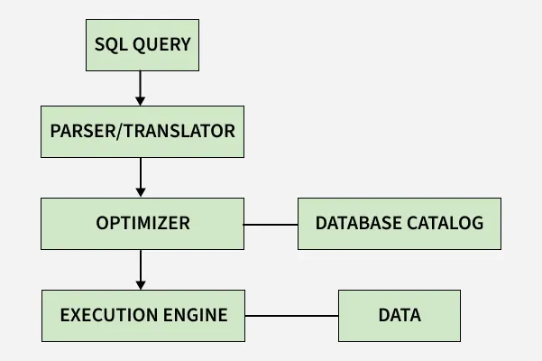

# Databáze

> Ukládání dat, adresování záznamů. 
> Indexování a hašování více atributů, rastrové (bitmap) indexy, dynamické hašování. 
> Vyhodnocování dotazu a algoritmy, statistiky a odhady nákladů. 
> Optimalizace dotazů a schémat, pravidla pro transformaci dotazů, rozdělování dat. 
> Ladění dotazů a schématu. Zpracování transakcí, výpadky a zotavení. 
> Bezpečnost, přístupová oprávnění. 


## Ukládání dat

Fyzické ukládání dat v DBMS přímo určuje výkon celého systému, který je primárně limitován počtem diskových operací (I/O úzké hrdlo).

### Paměťová hierarchie a HDD
* **Hierarchie:** Primární paměť (rychlá, drahá, volatilní RAM) vs. sekundární paměť (pomalé, levné, perzistentní HDD/SSD pracující s atomickými $4\text{ KiB}$ bloky).
* **Mechanické disky (HDD):** Přístupová doba se skládá ze seeku (přesun hlavy, $4\text{-}10\text{ ms}$), rotační latence (čekání na sektor, polovina otáčky) a přenosu. Náhodný přístup je u HDD až $300\times$ pomalejší než sekvenční z důvodu mechanické režie.

### Polovodičové disky (SSD)
* **Konstrukce:** NAND flash bez pohyblivých částí. Čtení/zápis probíhá po stránkách ($4\text{ KiB}$), mazání pouze po celých blocích ($128$ stránek).
* **Out-of-place Updates:** Přepis probíhá zápisem na novou stránku; původní se označí za neplatnou. Mazání na pozadí (*Garbage Collection*) způsobuje opotřebení buněk a nežádoucí zesílení zápisu (*Write Amplification*).

### RAID a optimalizace
* **RAID pole:** RAID 0 (proužkování, výkon), RAID 1 (zrcadlení pro logy), RAID 5 (distribuovaná parita, 1 disk výpadek), RAID 6 (dvě parity, 2 disky), RAID 10 (zrcadlené stripování). *Diff-RAID* u SSD zabraňuje simultánnímu selhání záměrným nerovnoměrným opotřebením.
* **Ladění FS:** Zarovnání velikosti bloku s DB stránkou (eliminuje *Write Amplification*), mount s `noatime`, minimalizace swapování a režim `data=writeback` pro transakční logy.


---

## Adresování záznamů

Adresování určuje transformaci logických řádků do binární formy a jejich fyzickou lokalizaci na disku.

### Reprezentace záznamů a Slotted-Page
* **Formát:** Pevná délka (konstantní ofsety) nebo proměnlivá délka (hlavička obsahuje Null Bitmap a vektor ofsetů k proměnlivým sloupcům).
* **Slotted-Page (stránka se sloty):** Adresář slotů `(fyzický ofset, délka)` roste odshora dolů, samotné datové řádky odspoda nahoru. Externí indexy odkazují výhradně na **ID slotu** (nepřímé adresování). To umožňuje fyzicky reorganizovat a setřást volné místo na stránce bez nutnosti aktualizovat indexy.

### Identifikátory a transformace
* **Record ID (RID/ROWID):** Logicko-fyzický ukazatel ve tvaru $\text{RID} = \langle \text{File ID}, \text{Page ID}, \text{Slot ID} \rangle$.
* **Pointer Swizzling:** Při načtení stránky do RAM se diskové adresy stránek ($\text{Page ID}$) nahradí přímými 64bitovými ukazateli v paměti. Při uvolnění stránky na disk probíhá zpětný *Unswizzling*.

### Organizace souborů
1. **Heap File (hromada):** Rychlý zápis $O(1)$, pomalé vyhledávání $O(N)$ (vyžaduje kompletní průchod).
2. **Sequential File (sekvenční):** Fyzicky setříděný dle klíče. Rychlé vyhledávání půlením intervalu $O(\log N)$, drahé zápisy.
3. **Hashed File (hašovaný):** Cílová stránka určena vztahem $h(\text{Klíč}) \bmod M$. Okamžitá shoda v $O(1)$, zcela nepoužitelné pro rozsahové dotazy.

---

## Indexování a hašování více atributů
Index je pomocná datová struktura (kolekce dvojic `<klíč, ukazatel na záznam/blok>`), která slouží k výraznému zrychlení přístupu k datům. Namísto pomalého sekvenčního procházení celé tabulky (Table/Sequential Scan) umožňuje databázi najít požadované řádky v řádu několika málo diskových I/O operací.

### Základní jednorozměrné indexy
* **B+ strom:** Standard pro relační DB. Vyvážený strom, kde jsou všechny datové ukazatele výhradně v listech a listy jsou obousměrně zřetězené. Výborný pro bodové i rozsahové dotazy (komplexita vyhledávání, vkládání i mazání je $O(\log N)$).
* **Hash index:** Mapuje klíč na adresu pomocí hašovací funkce. Rychlost $O(1)$, ale nepodporuje rozsahy.


### Klasické přístupy (Složené indexy)
* **Index na jeden atribut + filtrace:** Vyhledá se podle jednoho atributu a nalezené záznamy se následně dofiltrují podle druhé podmínky.
* **Kombinace samostatných indexů:** Každý index vrátí vlastní seznam ukazatelů (bucketů), které se následně protnou (průnik seznamů).
* **Index v indexu (Vnořený):** Strom první úrovně obsahuje v listech ukazatele na samostatné vnořené indexy druhé úrovně. Je efektivní pro dotazy na oba atributy nebo pouze na první atribut, ale nelze jej použít pro dotaz čistě na druhý atribut.
* **Zřetězení hodnot (Concatenation):** Hodnoty klíčů se spojí (např. spojením řetězců nebo násobením čísel) do jednoho a indexují se jako jeden atribut. Používá se vzácně, častěji u hašování.

### Dělené hašování (Partitioned Hashing)
* **Princip:** Pro vyhledávání nad více klíči se použije jedna společná výsledná adresa bloku. Ta vznikne tak, že se spojí bitové výstupy samostatných hašovacích funkcí pro jednotlivé atributy.
* **Příklad:** Atribut `Dept` má funkci $h_1$ a `Salary` funkci $h_2$. Výsledná adresa vznikne spojením jejich bitů (např. bity z $h_1$ tvoří začátek adresy, bity z $h_2$ konec).
* **Vlastnosti dotazování:** * Pokud dotaz specifikuje všechny atributy, určí se jedna přesná adresa bucketu.
    * Pokud dotaz specifikuje pouze jeden atribut, zbývající bity adresy jsou neznámé, a databáze proto musí prohledat (skenovat) všechny adresy odpovídající známému bitovému vzoru.

### Mřížkový index (Grid Index)
* **Princip:** Prostor dat je rozdělen do vícedimenzionální mřížky (matice), kde každá osa odpovídá jednomu atributu. Hodnoty na osách mohou být definovány i jako intervaly (tzv. binning). Každá buňka mřížky ukazuje na příslušný datový bucket (případně s využitím indirection/ukazatelů).
* **Vlastnosti dotazování:** Velmi efektivní pro dotazy na přesnou shodu i pro rozsahové dotazy (`range queries`), které v mřížce vyříznou celou obdélníkovou oblast buněk.
* **Nevýhody:** Rozměry mřížky musí být fixní. Při nerovnoměrném rozdělení dat hrozí plýtvání místem (prázdné buňky) nebo přeplnění omezené kapacity buněk.


### Obecná pravidla pro návrh indexů (Guidelines)
* **Dobrá selektivita:** Indexovat by se měly sloupce, kde podmínku splňuje jen malý zlomek řádků z tabulky.
* **Krátké atributy:** Kratší hodnoty atributů zvyšují větvení stromu (fan-out).
* **Cizí klíče:** Indexy jsou preferovány na join atributy (propojování tabulek).
* **Více vs. jeden:** Často je lepší mít více indexů na jeden atribut než jeden velký multi-atributový index.
* **Aktualizace a velikost:** Vysoce aktualizované tabulky by měly mít málo indexů; pro miniaturní tabulky nemá smysl tvořit indexy vůbec.
* **Pokrývající index (Covering Index):** Pokud index obsahuje všechny sloupce požadované dotazem, odpověď se přečte přímo z indexu a k samotným záznamům v tabulce se vůbec nepřistupuje.

---
## Rastrové (bitmap) indexy
Speciální databázový index, který přítomnost či nepřítomnost hodnoty reprezentuje pomocí bitových polí (sekvencí jedniček a nul) namísto klasických ukazatelů na řádky.

### Příklad

Máme tabulku se 4 řádky a dvěma sloupci (`Pohlaví` a `Město`).

| ID řádku | Jméno | Pohlaví | Město |
| :--- | :--- | :--- | :--- |
| **1** | Anna | Žena | Praha |
| **2** | Petr | Muž | Brno |
| **3** | Jana | Žena | Brno |
| **4** | Tomáš | Muž | Praha |

Pro tyto sloupce vytvoří databáze následující bitmapové indexy (vektory):

*   **Pohlaví = Muž:** `0 1 0 1` (hodnota je na 2. a 4. řádku)
*   **Pohlaví = Žena:** `1 0 1 0` (hodnota je na 1. a 3. řádku)
*   **Město = Praha:** `1 0 0 1` (hodnota je na 1. a 4. řádku)
*   **Město = Brno:** `0 1 1 0` (hodnota je na 2. a 3. řádku)

Dotaz: *Hledáme zaměstnance, kteří jsou **Muži AND z Prahy**.*
Databáze vezme příslušné vektory a provede bitovou operaci `AND` přímo v procesoru:

```text
Vektor (Muž):  0 1 0 1
Vektor (Praha): 1 0 0 1
-----------------------
Výsledek (AND): 0 0 0 1  -> Podmínku splňuje pouze 4. řádek (Tomáš).
```

### Hlavní výhody
* **Bitové operace:** Vyhledávání kombinovaných podmínek (`AND`, `OR`, `NOT`) je extrémně rychlé, protože procesor tyto operace provádí přímo na hardwarové úrovni (např. spojením vektorů pro pohlaví a město).
* **Malá velikost:** Indexy zabírají minimum místa na disku a sekvence bitů se dají výborně komprimovat.
* **Nízká kardinalita:** Ideální pro sloupce s malým počtem unikátních hodnot, jako je pohlaví, stav objednávky nebo logické hodnoty (Ano/Ne).
* **Datové sklady (OLAP):** Jsou perfektní pro analytické systémy a složité reporty, kde se data hromadně čtou, ale téměř nemění.

### Nevýhody
* **Vysoká kardinalita:** Naprosto nevhodné pro unikátní data jako rodná čísla, e-maily nebo ID, kde by index neúměrně narostl.
* **Časté zápisy (OLTP):** Zcela nevhodné pro transakční systémy s častým vkládáním a úpravou dat (`INSERT`, `UPDATE`), protože modifikace jednoho bitu často zamyká celý datový blok a blokuje ostatní operace.

---
## Dynamické hašování (Dynamic Hashing)
Používá se pro data, jejichž objem se v čase mění. Na rozdíl od statického hašování předchází vzniku dlouhých přetékajících řetězců (overflow chains), které degradují rychlost vyhledávání, a to průběžnou reorganizací adresního prostoru.

### 1. Rozšířitelné hašování (Extendible Hashing)
* **Princip:** Využívá mezistupeň – **adresář (directory)**, jehož velikost je vždy mocninou 2. Adresář obsahuje ukazatele na samotné datové bloky (buckety). Do adresáře se mapuje prvních $i$ bitů (globální hloubka) z binárního výstupu hašovací funkce. Každý bucket si drží svou lokální hloubku.
* **Vkládání a štěpení:** Pokud se bucket přeplní:
    * Je-li jeho lokální hloubka menší než globální hloubka adresáře, bucket se rozštěpí na dva, data se redistribuují podle nového bitu a adresář se pouze přenasměruje (lokální reorganizace).
    * Je-li lokální hloubka rovna globální, **velikost adresáře se zdvojnásobí** (přidá se další bit pro indexaci) a až pak se bucket rozštěpí.
* **Výhody/Nevýhody:** Vysoce efektivní využití místa, ale adresář může narůst natolik, že se nevejde do paměti RAM.

### 2. Lineární hašování (Linear Hashing)
* **Princip:** **Nepoužívá adresář.** Soubory a počet bucketů rostou lineárně (přidáváním jednoho po druhém). Pro adresaci se využívá $i$ nejnižších (koncových) bitů adresy. Rozhodování o štěpení se řídí celkovým zaplněním prostoru (např. pokud celkové zaplnění překročí 80 %).
* **Štěpení:** Když nastane trigger pro štěpení, rozštěpí se konkrétní bucket určený interním ukazatelem, **který se ale může lišit od bucketu, kam se právě zapisovalo** (může vzniknout dočasný overflow block). Jakmile se postupně rozštěpí všechny buckety v dané fázi, zvýší se počet bitů $i$ pro adresaci a proces běží nanovo od prvního bucketu.
* **Výhody/Nevýhody:** Žádná režie na adresář, ale kvůli asynchronnímu štěpení se občas nelze vyhnout krátkým overflow řetězcům.

---
## Vyhodnocování dotazu, algoritmy, statistiky a odhady nákladů

Zpracování deklarativního SQL dotazu probíhá ve třech základních krocích:
1. **Analýza a překlad (Parsing and Translation):** Kontrola syntaxe, ověření jmen tabulek/sloupců proti katalogu a překlad dotazu do interní podoby – **relačně-algebraického výrazu**.
2. **Optimalizace dotazu (Query Optimization):** Generování různých logicky ekvivalentních prováděcích plánů. Na základě **statistik a odhadu nákladů (CBO – Cost-Based Optimizer)** je vybrán plán s nejnižší cenou.
3. **Kódování a spuštění (Execution):** **Prováděcí engine (Execution Engine)** vezme zvolený optimální prováděcí plán (fyzický plán), spustí nad databází příslušné nízkoúrovňové algoritmy a vrátí výsledek.



Fyzický plán tvoří strom operátorů. Spolupráce mezi nimi při předávání dat může být implementována dvěma způsoby:
* **Materializace (Materialization):** Operátor plně zpracuje svůj vstup, zapíše celý mezivýsledek do dočasné tabulky na disk/do paměti a až poté ho předá nadřazenému operátoru. Generuje vysoké I/O náklady.
* **Pipelining (Proudové zpracování):** Operátory předávají data průběžně po jednotlivých řádcích (nebo blocích) bez zápisu na disk. Implementuje se pomocí **Iterator Modelu (Volcano architecture)**, kde každý operátor poskytuje standardní rozhraní se třemi metodami: `open()`, `next()` (vrátí jeden řádek nebo EOF) a `close()`. Ušetří obrovské množství I/O operací.


### Algoritmická implementace fyzických operátorů
Rychlost zpracování kriticky závisí na zvoleném algoritmu pro operace **Spojení (Join)**, **Seřazení (Sort)** a **Selekce (Selection)**.

#### A) Externí třídění (External Sort-Merge)
Pokud se data nevejdou do paměti RAM (velikost paměti je $M$ bloků), klasický Quicksort selže. Použije se vícedobé externí třídění:
1. **Fáze generování běhů (Runs):** Data se načítají po částech o velikosti $M$ bloků do paměti, seřadí se v RAM a zapíšou se na disk jako setříděné sub-soubory (běhy).
2. **Fáze slévání (Merge):** V každém kroku se paralelně načte začátek $M-1$ běhů do paměti, slévají se do jednoho setříděného proudu a zapisují zpět. Kroky se opakují, dokud nevznikne jediný setříděný soubor.

#### B) Algoritmy pro Spojení (Join Operators)
Mějme vnější relaci $R$ (velikost $B_R$ bloků, $V_R$ řádků) a vnitřní relaci $S$ (velikost $B_S$ bloků, $V_S$ řádků).

1. **Nested-Loop Join (Spojení vnořenými cykly):**
   * **Block Nested-Loop:** Pro každý blok relace $R$ načtený do paměti se sekvenčně projde celá relace $S$ blok po bloku a porovnají se řádky. Celková cena je $B_R + (B_R \times B_S)$ I/O operací.
   * **Indexed Nested-Loop:** Pokud má relace $S$ index nad spojovacím atributem, místo sekvenčního čtení $S$ se pro každý řádek z $R$ dotáže rovnou index nad $S$. Velmi rychlé, pokud je relace $R$ malá.
2. **Sort-Merge Join:**
   * Obě relace se nejprve setřídí podle spojovacího atributu (pokud již setříděné nejsou, např. z indexu).
   * Následně se obě relace procházejí paralelně jedním průchodem (podobně jako slévání při třídění). Velmi efektivní pro velké relace a rozsahové podmínky.
3. **Hash Join:**
   * **Fáze sestavení (Build):** Menší relace (např. $R$) se načte do paměti a vybuduje se nad ní v paměti hašovací tabulka (podle spojovacího klíče).
   * **Fáze ověření (Probe):** Větší relace ($S$) se sekvenčně čte a pro každý její řádek se hašováním klíče okamžitě ověří shoda v hašovací tabulce v paměti. Pokud se relace $R$ nevejde do paměti, provede se **Grace Hash Join** – obě relace se nejdříve stejnou funkcí rozhašují do particií na disk a spojují se particie po dvojicích.

### Statistiky a odhady nákladů (Cost Estimation)
Optimalizátor se při výpočtu nákladů (odhad počtu diskových I/O operací a CPU cyklů) spoléhá na **statistiky uložené v systémovém katalogu**:
* $V(R)$ – celkový počet řádků (kardinalita) relace $R$.
* $B(R)$ – celkový počet datových bloků relace $R$.
* $V(A, R)$ – počet unikátních hodnot atributu $A$ v relaci $R$.
* **Histogramy:** Rozdělení četnosti hodnot v daném sloupci (ekviprostanční nebo ekvifrekvenční) pro zachycení datového zešikmení (skew).

### Odhad selektivity a kardinality výsledku (Size Estimation)
**Faktor selektivity ($sf$)** udává očekávaný podíl řádků, které projdou danou podmínkou (nabývá hodnot 0 až 1). Odhadovaný počet řádků výsledku je pak Kardinalita $\times sf$.

Základní teoretické odhady (při předpokladu uniformního rozdělení dat):
* **Rovnost ($A = \text{konstanta}$):**
  $$sf = \frac{1}{V(A, R)}$$
* **Nerovnost ($A > \text{konstanta}$):** Využívá známé minimum a maximum hodnot v daném sloupci:
  $$sf = \frac{\text{max} - \text{konstanta}}{\text{max} - \text{min}}$$
* **Konjunkce (AND) nezávislých podmínek:** Selektivity se násobí:
  $$sf(C_1 \land C_2) = sf(C_1) \times sf(C_2)$$
* **Disjunkce (OR) nezávislých podmínek:** Použije se zákon pravděpodobnosti:
  $$sf(C_1 \lor C_2) = sf(C_1) + sf(C_2) - (sf(C_1) \times sf(C_2))$$


---

## Optimalizace dotazů a schémat 
Předchozí část se zabývala fyzickým prováděním operátorů a výpočtem jejich ceny. Tato fáze se posouvá o úroveň výš do oblasti logického plánování, kde se deklarativní SQL dotaz transformuje na optimální strom relační algebry ještě před volbou konkrétních algoritmů. Cílem je minimalizovat velikost mezivýsledků co nejdříve, čímž se drasticky sníží I/O náklady v pozdějších fázích.

Optimalizace využívá toho, že SQL je deklarativní jazyk. Uživatel definuje pouze výsledek, nikoli postup jeho získání, což dává optimalizátoru možnost volby z mnoha ekvivalentních cest. 

V rámci schématu se volí mezi normalizací a denormalizací. Zatímco normalizované schéma (do 3NF/BCNF) zabraňuje redundanci, denormalizace záměrně duplikuje data pro zrychlení čtení. Dalším nástrojem jsou materializované pohledy, které výsledek dotazu fyzicky ukládají na disk jako tabulku, což odstraňuje nutnost opakovaných drahých výpočtů za cenu složitější aktualizace.

---
## Pravidla pro transformaci dotazů
Transformace přepisují logický strom dotazu do efektivnější podoby pomocí zákonitostí relační algebry.

* **Včasná selekce:** Podmínky filtrace ($\sigma$) se přesouvají co nejblíže k samotným tabulkám před operace spojení. Tím se zásadně zmenšuje objem dat vstupujících do drahých joinů.
* **Včasná projekce:** Odstranění nepotřebných sloupců ($\pi$) v počátečních fázích zmenšuje šířku řádků v mezivýsledcích a šetří operační paměť.
* **Změna pořadí spojení:** Využívá se komutativita a asociativita spojení. Optimalizátor hledá takové pořadí operací, které vygeneruje nejmenší mezivýsledky.

---
## Rozdělování dat
Rozdělováním se velká logická tabulka rozčlení do menších fyzických pod-tabulek (particií).

Při horizontálním dělení se řádky distribuují do particií podle klíče, a to na základě rozsahu hodnot, definovaného seznamu nebo hašování. Hlavní výhodou je prořezávání particií, kdy optimalizátor zcela ignoruje particie, které neodpovídají podmínkám v dotazu.

Vertikální dělení naopak rozděluje tabulku podle sloupců. Málo používané nebo široké sloupce se vyčlení do samostatné tabulky, což zmenší velikost datového bloku pro nejčastější dotazy.


---
## Ladění dotazů a schématu
Tato část se zaměřuje na to, jak výkonu pomoci zvenčí (laděním), jak zajistit správnost dat při souběžném přístupu (transakce) a jak reagovat na nečekané softwarové či hardwarové havárie (zotavení).

Ladění (Query/Schema Tuning) reaguje na situace, kdy automatická optimalizace nestačí a exekuce je příliš pomalá. Cílem je upravit struktury nebo samotný zápis kódu tak, aby optimalizátor dokázal najít lepší cestu.

* **Indexy a pokrývající indexy:** Přidávají se chybějící indexy na spojovací atributy nebo sloupce s vysokou selektivitou. Využívá se pokrývající index (Covering Index), který obsahuje všechny sloupce požadované dotazem, takže exekuční plán nemusí vůbec přistupovat k samotné tabulce a čte data přímo z listů indexu.
* **Přepis dotazů:** Složité poddotazy se často přepisují na klasické operace spojení (`JOIN`), nebo se vynucuje konkrétní prováděcí postup pomocí nápověd pro optimalizátor (Hints).
* **Zpětná úprava schématu:** Pokud normalizované schéma (3NF/BCNF) kvůli velkému množství joinů neúměrně zpomaluje čtení, přistupuje se k řízené denormalizaci nebo k vytváření materializovaných pohledů, které předpočítané výsledky ukládají fyzicky na disk.

---
## Zpracování transakcí

Transakce je skupina operací, která tvoří jednu logickou jednotku práce s databází. Správné zpracování transakcí garantuje takzvané vlastnosti ACID.

* **Atomicita (Atomicity):** Transakce se provede buď celá, nebo vůbec. Pokud uprostřed dojde k chybě, všechny dosavadní změny se vrátí zpět (Rollback).
* **Konzistence (Consistency):** Transakce převádí databázi z jednoho validního stavu do druhého, přičemž nesmí být porušena žádná integritní omezení.
* **Izolovanost (Isolation):** Souběžně běžící transakce nesmí navzájem vidět své neodeslané změny. Izolovanost řeší zamykací protokoly (např. Dvoufázové zamykání – 2PL) nebo verzování (MVCC).
* **Trvanlivost (Durability):** Jakmile je transakce úspěšně potvrzena (Commit), její změny jsou trvale zapsány a nesmí být ztraceny ani při následném výpadku napájení.

---
## Výpadky a zotavení
Systém zotavení (Recovery Manager) zajišťuje atomicitu a trvanlivost transakcí v případě selhání systému. Využívá k tomu transakční log (žurnál) zapsaný na stabilním úložišti.

* **Pravidlo WAL (Write-Ahead Logging):** Žádný datový blok nesmí být zapsán na disk do primární databáze dříve, než je příslušný záznam o jeho změně bezpečně zapsán a flushnut v transakčním logu.
* **Strategie správy bufferu:** Rozhoduje o tom, kdy se data přepisují na disk. Strategie *Steal* dovoluje systému zapsat na disk změny i nepotvrzených transakcí (vyžaduje operaci UNDO při pádu). Strategie *No-Force* nevyžaduje zápis všech změn na disk okamžitě při commitu (vyžaduje operaci REDO při pádu).
* **Zotavení pomocí logu (REDO a UNDO):** Při restartu po havárii systém projde log. Operace potvrzených transakcí se provedou znovu z logu na disk (*REDO*), zatímco změny nedokončených transakcí se z databáze odstraní a vrátí zpět (*UNDO*).
* **Kontrolní body (Checkpoints):** Periodické ukládání stavu paměti na disk. Zkracují čas zotavení po havárii, protože systém ví, že operace zapsané před kontrolním bodem jsou již bezpečně na disku a nemusí log analyzovat od úplného začátku.

---
## Bezpečnost, přístupová oprávnění
Zatímco základní transakční mechanismy chrání vnitřní integritu dat před chybami a haváriemi, bezpečnostní subsystém se zaměřuje na ochranu před neautorizovaným přístupem a zneužitím informací zvenčí. Bezpečnost v databázových systémech (DBMS) se opírá o kontrolu přístupu, která určuje, kteří uživatelé mají oprávnění k jakým datům a operacím.

Přístupová oprávnění definují, jakým způsobem mohou uživatelé manipulovat s datovými objekty (jako jsou tabulky, pohledy či schémata). V moderních databázových systémech se k řízení přístupu využívají dva hlavní koncepční modely:

* **Diskreční řízení přístupu (DAC – Discretionary Access Control):** V tomto modelu má vlastník objektu (zpravidla jeho tvůrce) plnou kontrolu nad právy k tomuto objektu. Pomocí standardních SQL příkazů může udělovat nebo odebírat oprávnění ostatním subjektům v systému.
    * **GRANT:** Příkaz slouží k přidělení specifických práv (např. `SELECT`, `INSERT`, `UPDATE`, `DELETE`) nad konkrétním objektem vybranému uživateli nebo roli. Pomocí klauzule `WITH GRANT OPTION` může příjemce toto právo legálně delegovat na další uživatele.
    * **REVOKE:** Příkaz slouží k odnětí dříve udělených práv. Pokud je právo odebráno uživateli, který jej distribuoval dále pomocí `WITH GRANT OPTION`, dochází v závislosti na nastavení systému k řetězovému odebrání práv (kaskádovému efektu) u všech takto ovlivněných uživatelů.

* **Řízení přístupu na základě rolí (RBAC – Role-Based Access Control):** Tento model výrazně zjednodušuje správu oprávnění ve větších organizacích. Namísto přidělování práv jednotlivým uživatelům se oprávnění naváží na logické entity zvané **role** (např. `manažer`, `analytik`, `účetní`), které reprezentují pracovní funkce. Uživatelům jsou následně tyto role pouze přiřazovány, což minimalizuje riziko lidské chyby a usnadňuje auditování přístupu.

Z hlediska granularity se bezpečnost vynucuje na různých úrovních. Kromě klasického zabezpečení celých tabulek či schémat lze využít pohledy (`VIEWS`), které uživateli zpřístupní pouze vybranou podmnožinu sloupců a řádků, čímž efektivně skrývají citlivá data (např. plat zaměstnance) bez nutnosti měnit fyzickou strukturu podkladových tabulek. Pokročilé systémy pak integrují přímé řízení na úrovni řádků (Row-Level Security), kde jsou dotazy uživatelů na pozadí automaticky modifikovány o bezpečnostní predikáty.

