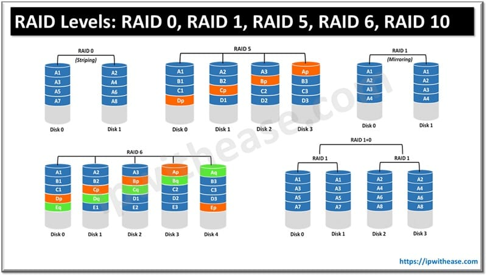
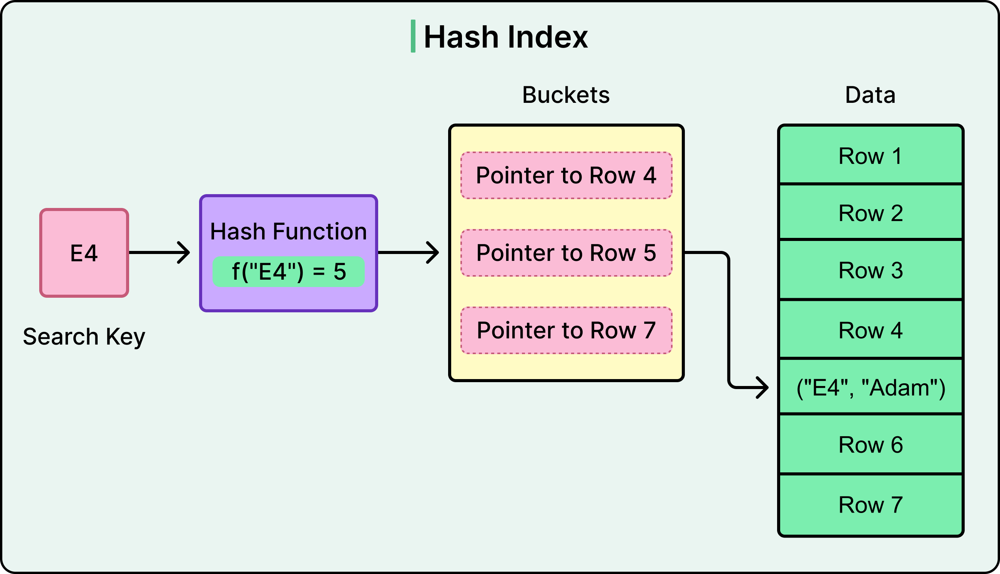
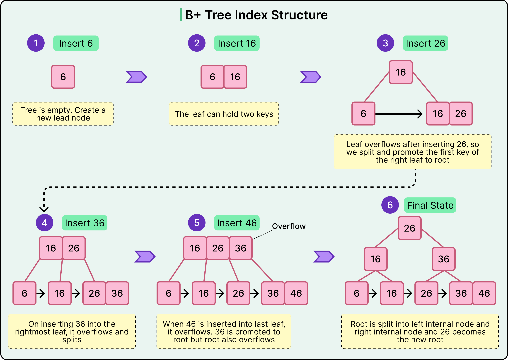
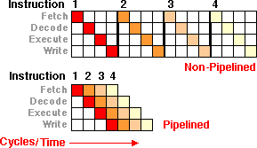
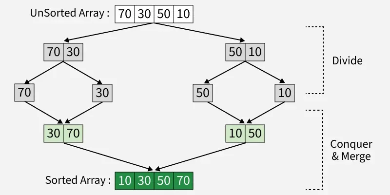
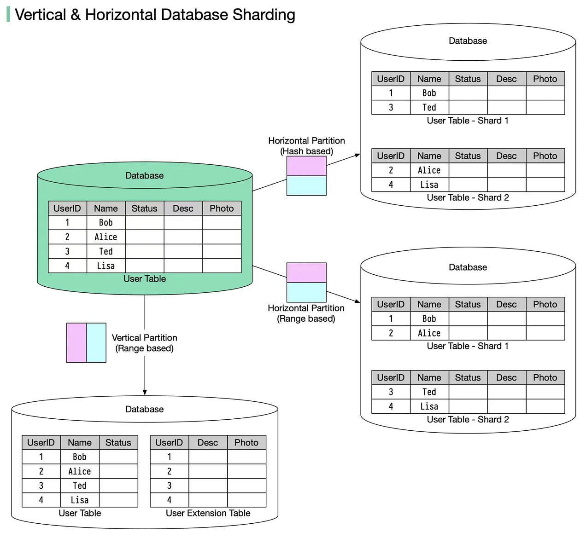
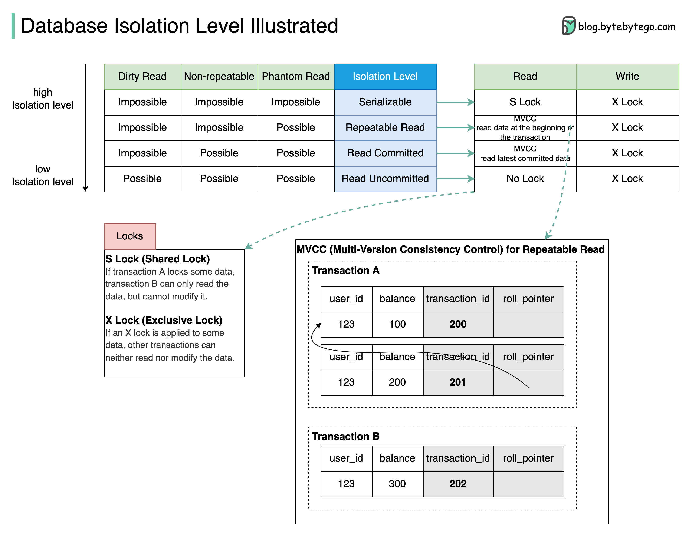
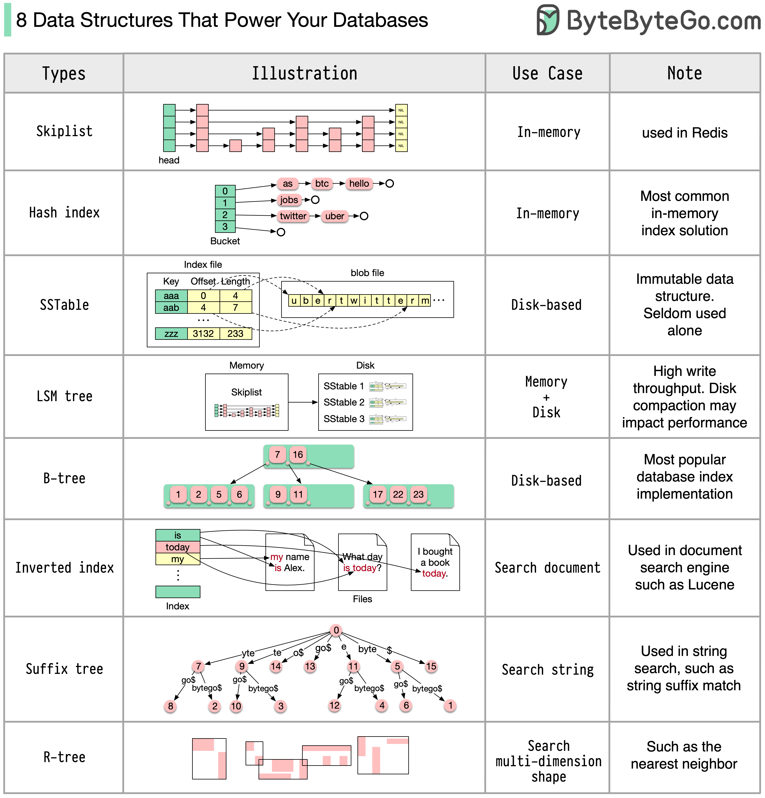

# Databáze

> Ukládání dat, adresování záznamů. 
> Indexování a hašování více atributů, rastrové (bitmap) indexy, dynamické hašování. 
> Vyhodnocování dotazu a algoritmy, statistiky a odhady nákladů. 
> Optimalizace dotazů a schémat, pravidla pro transformaci dotazů, rozdělování dat. 
> Ladění dotazů a schématu. Zpracování transakcí, výpadky a zotavení. 
> Bezpečnost, přístupová oprávnění. 


## Ukládání dat

Výkon každého databázového systému (DBMS) je primárně limitován rychlostí komunikace se sekundárním úložištěm. Tento jev se označuje jako **I/O úzké hrdlo** (I/O bottleneck), protože operace v operační paměti RAM jsou řádově rychlejší než čtení a zápis na disk. Databáze proto musí být navržena tak, aby minimalizovala počet diskových operací.

### 1. Paměťová hierarchie a specifika hardwaru
Aby mohl systém efektivně fungovat, využívá paměťovou hierarchii, kde platí: čím je paměť blíže procesoru, tím je rychlejší, dražší a má menší kapacitu.

*   **Primární paměť (RAM):** Rychlá, drahá, ale volatilní (při výpadku napájení ztrácí data). Pracuje na úrovni bajtů.
*   **Sekundární paměť (HDD/SSD):** Pomalá, levná, ale perzistentní (trvalá). Hardwarová vrstva nedokáže efektivně pracovat s jednotlivými bajty, proto komunikace mezi RAM a diskem probíhá vždy v **atomických blocích (stránkách)**, typicky o velikosti $4\text{ KiB}$ až $8\text{ KiB}$.

#### Mechanické disky (HDD)
Přístupová doba k datům na HDD je diktována mechanikou a skládá se ze:
1.  **Seeku:** Fyzický přesun čtecí hlavy nad správnou stopu ($4\text{--}10\text{ ms}$).
2.  **Rotační latence:** Čekání, než se plotna otočí pod hlavu (polovina otáčky).
3.  **Samotného přenosu dat.**

Z této konstrukce plyne zásadní pravidlo: **Náhodný přístup (Random I/O) je u HDD až $300\times$ pomalejší než sekvenční přístup (Sequential I/O).** Při sekvenčním čtení se hlava přesune pouze jednou a pak kontinuálně čte celou stopu.

#### Polovodičové disky (SSD)
NAND Flash paměti sice eliminovaly mechanický přesun hlav, ale přinesly novou asymetrii mezi čtením a zápisem:
*   **Čtení a zápis** probíhají po **stránkách** (např. $4\text{ KiB}$).
*   **Mazání** lze provést pouze po celých **blocích** (např. $128$ stránek).

Kvůli tomu nelze data jednoduše přepsat na stejném místě. Používá se strategie **Out-of-place Updates**: při změně dat se nová verze zapíše na čistou stránku a stará stránka se označí za neplatnou. Mazání na pozadí (**Garbage Collection**) pak musí neplatné bloky vyčistit. To vede k přesunům dat, opotřebení buněk a k nežádoucímu **zesílení zápisu (Write Amplification)**, kdy se fyzicky zapíše mnohem více dat, než databáze reálně požadovala.


### 2. Spolehlivost a optimalizace na úrovni OS (RAID a FS)
Pro zvýšení rychlosti I/O operací a zajištění odolnosti proti selhání hardwaru se disky sdružují do logických polí **RAID** (Redundant Array of Independent Disks):

*   **RAID 0 (Striping):** Data se střídavě dělí mezi disky. Zvyšuje výkon (čte se paralelně), ale nemá žádnou redundanci (selhání 1 disku = ztráta všech dat).
*   **RAID 1 (Mirroring):** Zrcadlení dat 1:1. Výborné pro zápis transakčních logů, poskytuje vysokou bezpečnost.
*   **RAID 5 (Distributed Parity):** Data i paritní informace jsou distribuovány napříč všemi disky (minimálně 3 disky). Přežije selhání 1 disku. Nabízí dobrý poměr ceny a výkonu pro čtení, zápis je pomalejší kvůli výpočtu parity.
*   **RAID 6 (Dual Parity):** Podobně jako RAID 5, ale se dvěma paritami. Přežije simultánní výpadek až 2 disků.
*   **RAID 10 (1+0):** Kombinace zrcadlení a proužkování. Nejvyšší výkon i spolehlivost za cenu vysokých nákladů (vyžaduje dvojnásobný počet disků).

*V praxi se u SSD polí nasazuje navíc mechanismus **Diff-RAID**. Ten záměrně opotřebovává disky v poli nerovnoměrně, aby se předešlo situaci, kdy všechna SSD selžou v tentýž den kvůli dosažení limitu zápisů.*




#### Ladění souborového systému (FS) pro potřeby DBMS
Aby souborový systém operačního systému zbytečně nezpomaloval databázi, provádí se následující optimalizace:
*   **Zarovnání velikosti bloku:** Velikost stránky databáze se nastaví jako přesný násobek clusteru souborového systému (např. $8\text{ KiB}$ DB stránka na $4\text{ KiB}$ FS blok), což eliminuje dvojené I/O operace a snižuje *Write Amplification*.
*   **`noatime` mount:** Vypnutí zaznamenávání času posledního přístupu k souboru na úrovni OS. *Bez tohoto nastavení by každý SELECT na databázi generoval skrytý zápis na disk (aktualizaci metadat souboru v OS).*
*   **Minimalizace swapování:** Paměť RAM vyhrazená pro databázový buffer se v OS uzamkne (např. pomocí `mlock`), aby ji operační systém při nedostatku paměti neodsunul na pomalý disk do swapu.

---

## Adresování záznamů

Adresování určuje, jakým způsobem jsou logické datové řádky (záznamy) transformovány do binární podoby a jak je databáze dokáže fyzicky lokalizovat na disku a následně namapovat do operační paměti.

### 1. Reprezentace záznamů na stránce
Záznamy mohou mít pevnou délku (sloupce jako `INT`, `CHAR`) nebo proměnlivou délku (`VARCHAR`, `BLOB`). U proměnlivé délky obsahuje hlavička každého řádku **vektor ofsetů** (ukazatelů na startovní pozice jednotlivých sloupců) a **Null Bitmapu** (indikaci, které sloupce jsou prázdné, aby se pro ně netratilo místo).


Fyzická organizace uvnitř jedné diskové stránky se standardně řeší architekturou **Slotted-Page (stránka se sloty)**:
*   Na samotném začátku stránky se nachází **adresář slotů**, který obsahuje dvojice `(fyzický ofset, délka záznamu)`. Tento adresář roste odshora dolů.
*   Samotné datové řádky se ukládají od konce stránky a rostou **odspoda nahoru**.
*   Jakmile se adresář slotů potká s datovými řádky, stránka je plná.

Tento design přináší zásadní výhodu: **nepřímé adresování**. Externí struktury (např. indexy) neodkazují na absolutní fyzickou bajtovou adresu řádku na disku, ale výhradně na **ID slotu** na dané stránce. Pokud se řádek uvnitř stránky změní (např. se nafoukne a databáze musí stránku setřást a řádky fyzicky posunout), změní se pouze ofset v adresáři slotů. ID slotu zůstává stejné, takže indexy není potřeba aktualizovat.

### 2. Logické identifikátory a transformace do RAM
Každý řádek v databázi má svůj jednoznačný fyzický identifikátor **Record ID (RID / ROWID)**. Tento ukazatel má strukturu:

$\text{RID} = \langle \text{File ID}, \text{Page ID}, \text{Slot ID} \rangle$

1.  `File ID`: Určuje, ve kterém souboru na disku je tabulka uložena.
2.  `Page ID`: Určuje konkrétní blok (stránku) uvnitř tohoto souboru.
3.  `Slot ID`: Určuje pořadové číslo v adresáři slotů na dané stránce.

#### Pointer Swizzling (Převracení ukazatelů)
Když databáze potřebuje se záznamem pracovat, načte příslušnou stránku z disku do vyrovnávací paměti v RAM (Buffer Pool). 
*   Na disku jsou vazby mezi stránkami reprezentovány pomocí diskových adres (`Page ID`). Vyhledávání přes diskové adresy v RAM by ale znamenalo zbytečnou režii (hledání v hash tabulce buffer poolu).
*   Proto se při načtení stránky do RAM provede **Pointer Swizzling**: diskové adresy se v paměti přímo přepíšou reálnými 64bitovými paměťovými ukazateli (pointry) na sousední objekty v RAM.
*   Při uvolnění stránky z RAM zpět na disk probíhá zpětný proces (**Unswizzling**), kdy se paměťové pointry převedou zpět na perzistentní `Page ID`.

### 3. Fyzická organizace souborů (File Organization)
Podle toho, jak jsou stránky se sloty řazeny v souboru za sebou, rozlišujeme tři základní typy organizace:

1.  **Heap File (hromada):** Řádky se ukládají na diskové stránky v takovém pořadí, v jakém přicházejí, na libovolné volné místo.
    *   *Zápis:* Extrémně rychlý, $O(1)$.
    *   *Vyhledávání:* Pomalé, $O(N)$ – vyžaduje lineární průchod všech stránek (Full Table Scan).
    *   *Použití:* Logovací tabulky a staging oblasti.

2.  **Sequential File (sekvenční soubor):** Stránky a řádky jsou fyzicky udržovány v setříděném pořadí podle určitého vyhledávacího klíče.
    *   *Vyhledávání:* Rychlé, $O(\log N)$ pomocí půlení intervalu (binární vyhledávání) nad bloky.
    *   *Zápis:* Extrémně drahý. Vložení řádku doprostřed vyžaduje fyzický posun následujících dat nebo tvorbu přetékajících logických řetězců (overflow blocks), což degraduje strukturu.

3.  **Hashed File (hašovaný soubor):** Fyzické umístění stránky na disku je striktně určeno matematickou funkcí: $\text{Číslo stránky} = h(\text{Klíč}) \bmod M$, kde $M$ je pevný počet dostupných stránek (bucketů).
    *   *Vyhledávání na přesnou shodu:* Okamžité, $O(1)$ v ideálním případě bez kolizí.
    *   *Rozsahové dotazy:* Zcela nepoužitelné. *Dotaz na hodnoty v rozmezí 10 až 20 by znamenal prohledat náhodně rozházené stránky po celém disku, protože hašovací funkce záměrně likviduje sousednost dat.*


---

## Indexování a hašování více atributů
Index je pomocná datová struktura (kolekce dvojic `<klíč, ukazatel na záznam/blok>`), která slouží k výraznému zrychlení přístupu k datům. Namísto pomalého sekvenčního procházení celé tabulky (Table/Sequential Scan) umožňuje databázi najít požadované řádky v řádu několika málo diskových I/O operací.

### Základní jednorozměrné indexy
* **B+ strom:** Standard pro relační DB. Vyvážený strom, kde jsou všechny datové ukazatele výhradně v listech a listy jsou obousměrně zřetězené. Výborný pro bodové i rozsahové dotazy (komplexita vyhledávání, vkládání i mazání je $O(\log N)$).
* **Hash index:** Mapuje klíč na adresu pomocí hašovací funkce. Rychlost $O(1)$, ale nepodporuje rozsahy.





### Klasické přístupy (Složené indexy)
* **Index na jeden atribut + filtrace:** Vyhledá se podle jednoho atributu a nalezené záznamy se následně dofiltrují podle druhé podmínky.
* **Kombinace samostatných indexů:** Každý index vrátí vlastní seznam ukazatelů (bucketů), které se následně protnou (průnik seznamů).
* **Index v indexu (Vnořený):** Strom první úrovně obsahuje v listech ukazatele na samostatné vnořené indexy druhé úrovně. Je efektivní pro dotazy na oba atributy nebo pouze na první atribut, ale nelze jej použít pro dotaz čistě na druhý atribut.
* **Zřetězení hodnot (Concatenation / Složený B+ strom):** Hodnoty klíčů se spojí do jednoho složeného klíče (např. `Příjmení + Jméno`) a indexují se společně. *Příklad: Index nad `(Příjmení, Jméno)` zafunguje pro dotaz na `WHERE Příjmení='Novák'`, ale nepomůže pro dotaz na `WHERE Jméno='Jan'` kvůli uspořádání zleva doprava.*

### Dělené hašování (Partitioned Hashing)
* **Princip:** Pro vyhledávání nad více klíči se použije jedna společná výsledná adresa bloku. Ta vznikne tak, že se spojí bitové výstupy samostatných hašovacích funkcí pro jednotlivé atributy.
* **Příklad:** *Atribut `Dept` má funkci $h_1$ a `Salary` funkci $h_2$. Výsledná adresa vznikne spojením jejich bitů (např. bity z $h_1$ tvoří začátek adresy, bity z $h_2$ konec).*
* **Vlastnosti dotazování:** Pokud dotaz specifikuje všechny atributy, určí se jedna přesná adresa bucketu. Pokud specifikuje pouze jeden, zbývající bity adresy jsou neznámé a databáze musí prohledat všechny adresy odpovídající známému bitovému vzoru.
    * Pokud dotaz specifikuje pouze jeden atribut, zbývající bity adresy jsou neznámé, a databáze proto musí prohledat (skenovat) všechny adresy odpovídající známému bitovému vzoru.

### Mřížkový index (Grid Index)
* **Princip:** Prostor dat je rozdělen do vícedimenzionální mřížky (matice), kde každá osa odpovídá jednomu atributu. Hodnoty na osách mohou být definovány i jako intervaly (tzv. binning). Každá buňka mřížky ukazuje na příslušný datový bucket (případně s využitím indirection/ukazatelů).
* **Vlastnosti dotazování:** Velmi efektivní pro dotazy na přesnou shodu i pro rozsahové dotazy (`range queries`), které v mřížce vyříznou celou obdélníkovou oblast buněk.
* **Nevýhody:** Rozměry mřížky musí být fixní. Při nerovnoměrném rozdělení dat hrozí plýtvání místem (prázdné buňky) nebo přeplnění omezené kapacity buněk.


### Obecná pravidla pro návrh indexů (Guidelines)
* **Dobrá selektivita:** Indexovat by se měly sloupce, kde podmínku splňuje jen malý zlomek řádků z tabulky.
* **Krátké atributy:** Kratší hodnoty atributů zvyšují větvení stromu (fan-out).
* **Cizí klíče:** Indexy jsou preferovány na join atributy (propojování tabulek).
* **Více vs. jeden:** Často je lepší mít více indexů na jeden atribut než jeden velký multi-atributový index.
* **Aktualizace a velikost:** Vysoce aktualizované tabulky by měly mít málo indexů; pro miniaturní tabulky nemá smysl tvořit indexy vůbec.
* **Pokrývající index (Covering Index):** Pokud index obsahuje všechny sloupce požadované dotazem, odpověď se přečte přímo z indexu a k samotným záznamům v tabulce se vůbec nepřistupuje.

---
## Rastrové (bitmap) indexy
Speciální databázový index, který přítomnost či nepřítomnost hodnoty reprezentuje pomocí bitových polí (sekvencí jedniček a nul) namísto klasických ukazatelů na řádky.

### Příklad

Máme tabulku se 4 řádky a dvěma sloupci (`Pohlaví` a `Město`).

| ID řádku | Jméno | Pohlaví | Město |
| :--- | :--- | :--- | :--- |
| **1** | Anna | Žena | Praha |
| **2** | Petr | Muž | Brno |
| **3** | Jana | Žena | Brno |
| **4** | Tomáš | Muž | Praha |

Pro tyto sloupce vytvoří databáze následující bitmapové indexy (vektory):

*   **Pohlaví = Muž:** `0 1 0 1` (hodnota je na 2. a 4. řádku)
*   **Pohlaví = Žena:** `1 0 1 0` (hodnota je na 1. a 3. řádku)
*   **Město = Praha:** `1 0 0 1` (hodnota je na 1. a 4. řádku)
*   **Město = Brno:** `0 1 1 0` (hodnota je na 2. a 3. řádku)

Dotaz: *Hledáme zaměstnance, kteří jsou **Muži AND z Prahy**.*
Databáze vezme příslušné vektory a provede bitovou operaci `AND` přímo v procesoru:

```text
Vektor (Muž):  0 1 0 1
Vektor (Praha): 1 0 0 1
-----------------------
Výsledek (AND): 0 0 0 1  -> Podmínku splňuje pouze 4. řádek (Tomáš).
```

### Hlavní výhody
* **Bitové operace:** Vyhledávání kombinovaných podmínek (`AND`, `OR`, `NOT`) je extrémně rychlé, protože procesor tyto operace provádí přímo na hardwarové úrovni (např. spojením vektorů pro pohlaví a město).
* **Malá velikost:** Indexy zabírají minimum místa na disku a sekvence bitů se dají výborně komprimovat.
* **Nízká kardinalita:** Ideální pro sloupce s malým počtem unikátních hodnot, jako je pohlaví, stav objednávky nebo logické hodnoty (Ano/Ne).
* **Datové sklady (OLAP):** Jsou perfektní pro analytické systémy a složité reporty, kde se data hromadně čtou, ale téměř nemění.

### Nevýhody
* **Vysoká kardinalita:** Naprosto nevhodné pro unikátní data jako rodná čísla, e-maily nebo ID, kde by index neúměrně narostl.
* **Časté zápisy (OLTP):** Zcela nevhodné pro transakční systémy s častým vkládáním a úpravou dat (`INSERT`, `UPDATE`), protože modifikace jednoho bitu často zamyká celý datový blok a blokuje ostatní operace.

---## Dynamické hašování (Dynamic Hashing)
Používá se pro data, jejichž objem se v čase mění. Na rozdíl od statického hašování předchází vzniku dlouhých přetékajících řetězců (overflow chains) průběžnou reorganizací adresního prostoru.

### 1. Rozšířitelné hašování (Extendible Hashing)
* **Princip:** Využívá mezistupeň – **adresář (directory)**, jehož velikost je vždy mocninou 2. Adresář obsahuje ukazatele na samotné datové bloky (buckety). Do adresáře se mapuje prvních $i$ bitů (globální hloubka) z výstupu hašovací funkce. Každý bucket si drží svou lokální hloubku $j$ ($j \le i$).
* **Vkládání a štěpení:** Pokud se bucket přeplní:
    * Je-li $j < i$, bucket se rozštěpí na dva, data se redistribuují podle nového bitu a adresář se pouze přenasměruje (lokální reorganizace).
    * Je-li $j = i$, **velikost adresáře se zdvojnásobí** (přidá se další bit pro indexaci, globální hloubka $i$ se inkrementuje) a až pak se bucket rozštěpí.
* **Výhody/Nevýhody:** Vysoce efektivní využití místa, vyhledání záznamu vyžaduje maximálně 2 diskové operace (adresář + bucket). Nevýhodou je, že adresář může narůst natolik, že se nevejde do paměti RAM.

### 2. Lineární hašování (Linear Hashing)
* **Princip:** **Nepoužívá adresář.** Počet bucketů roste lineárně (přidáváním jednoho po druhém). Pro adresaci se využívá $i$ nejnižších (koncových) bitů adresy. Rozhodování o štěpení se řídí celkovým zaplněním prostoru (faktorem zaplnění, např. překročení 80 %).
* **Štěpení:** Když nastane trigger pro štěpení, rozštěpí se konkrétní bucket určený interním ukazatelem pointeru $P$, **který se ale může lišit od bucketu, kam se právě zapisovalo** (proto mohou vzniknout dočasné overflow bloky). Pointer $P$ se posune o jedna dále. Jakmile se postupně rozštěpí všechny buckety v dané fázi, zvýší se počet bitů $i$ pro adresaci, pointer $P$ skočí na začátek (na 0) a proces běží nanovo.
* **Výhody/Nevýhody:** Žádná režie na adresář, paměť roste plynule. Kvůli asynchronnímu štěpení se ale občas nelze vyhnout krátkým overflow řetězcům.

---

## Vyhodnocování dotazu, algoritmy, statistiky a odhady nákladů

Zpracování SQL dotazu probíhá ve 3 hlavních krocích:
1. **Analýza a překlad (Parsing):** Kontrola syntaxe a sémantiky proti katalogu. Vzniká logický plán (výraz relační algebry).
2. **Optimalizace (Query Optimization):** Generování ekvivalentních plánů. Cost-Based Optimizer (CBO) vybere plán s nejnižší odhadovanou cenou na základě statistik.
3. **Kódování a spuštění (Execution):** Prováděcí engine spustí fyzický plán nad databází.

### Předávání dat mezi operátory
* **Materializace:** Operátor zapíše celý mezivýsledek do dočasné tabulky na disk/do paměti a až pak ho předá dál. Vysoké I/O náklady.
* **Pipelining (Proudové zpracování):** Operátory předávají data průběžně po jednotlivých řádcích bez zápisu na disk (Iterator Model / Volcano architecture s metodami `open()`, `next()`, `close()`).




---

### Algoritmická implementace fyzických operátorů

#### A) Externí třídění (External Sort-Merge)
Používá se, pokud se tříděná data nevejdou do paměti RAM ($M$ bloků).
1. **Fáze generování běhů (Runs):** Data se načtou po částech o velikosti $M$ bloků do RAM, seřadí se a zapíšou na disk jako setříděné běhy.
2. **Fáze slévání (Merge):** V paměti se alokuje $M-1$ bloků pro vstupní proudy a $1$ pro výstup. Data se paralelně slévají do jednoho setříděného souboru.



#### B) Algoritmy pro Spojení (Join Operators)
Mějme vnější relaci $R_1$ a vnitřní relaci $R_2$.
1. **Nested-Loop Join:** * *Block Nested-Loop:* Pro každý blok $R_1$ v paměti se sekvenčně projde celá relace $R_2$ blok po bloku.
   * *Indexed Nested-Loop:* Pokud má $R_2$ index nad spojovacím atributem, prohledává se přímo index pro každý řádek z $R_1$. Efektivní pro malou vnější relaci.
2. **Sort-Merge Join:** Obě relace se nejprve setřídí podle spojovacího atributu a následně se procházejí paralelně jedním společným průchodem.
3. **Hash Join:** * *Build fáze:* Nad menší relací se v RAM vybuduje hašovací tabulka podle spojovacího klíče.
   * *Probe fáze:* Větší relace se sekvenčně čte a pro každý řádek se hašováním klíče okamžitě ověřuje shoda.


### Statistiky a odhady nákladů

CBO vyjadřuje cenu prováděcího plánu v arbitrárních jednotkách (odhad počtu diskových I/O operací a CPU cyklů). Statistiky se udržují v systémovém katalogu a aktualizují se periodicky (např. pomocí vzorkování dat přes příkaz `ANALYZE`).

**Základní metadata v katalogu:**
* $T(R)$ – celkový počet řádků (kardinalita) relace $R$.
* $B(R)$ – celkový počet datových bloků relace $R$ na disku.
* $V(R, A)$ – počet unikátních hodnot atributu $A$ v relaci $R$.
* **Histogramy:** Rozdělení četnosti hodnot pro zachycení datového zešikmení (skew).

### Matematické odhady velikosti výsledku

Při předpokladu uniformního rozdělení dat se velikost mezivýsledků odhaduje pomocí faktoru selektivity ($sf$):

* **Kartézský součin ($W = R_1 	\times R_2$):**
  $$T(W) = T(R_1) \cdot T(R_2)$$

* **Selekce – Rovnost ($\sigma_{A = 	ext{val}}(R)$):**
  $$sf = rac{1}{V(R, A)} \quad \implies \quad T(W) = rac{T(R)}{V(R, A)}$$

* **Selekce – Rozsah ($\sigma_{A \ge 	ext{val}}(R)$):**
  $$sf = rac{	ext{Max} - 	ext{val} + 1}{	ext{Max} - 	ext{Min} + 1}$$

* **Konjunkce (AND) nezávislých podmínek:**
  $$sf(C_1 \land C_2) = sf(C_1) \cdot sf(C_2)$$

* **Disjunkce (OR) nezávislých podmínek:**
  $$sf(C_1 \lor C_2) = sf(C_1) + sf(C_2) - (sf(C_1) \cdot sf(C_2))$$

* **Přirozené spojení ($W = R_1  owtie R_2$) přes společný atribut $A$:**
  $$T(W) = rac{T(R_1) \cdot T(R_2)}{\max\{V(R_1, A), V(R_2, A)\}}$$

* **Odhad počtu unikátních hodnot v mezivýsledku $U$:**
  $$V(U, A) = \min\{V(R, A), T(U)\}$$
---

## Optimalizace dotazů a schémat 

Tato fáze se zaměřuje na strukturální úpravy databázového schématu (globální úroveň) a na přepisování samotných dotazů (lokální úroveň) s cílem odstranit úzká hrdla a dosáhnout maximálního výkonu.

### 1. Optimalizace schématu (Schema Tuning)

Volba mezi normalizovaným a denormalizovaným schématem představuje trade-off mezi úsporou místa (ochranou před anomáliemi) a rychlostí čtení.

#### A) Normalizace vs. Denormalizace
* **Normalizované schéma (3NF/BCNF):** Každá funkční závislost $X \rightarrow A$ vyžaduje, aby $X$ byl superklíč. Zabraňuje redundanci a šetří místo na disku, ale vynucuje si drahé spojování tabulek (`JOIN`).
* **Denormalizace:** Záměrné porušení normálních forem pro zrychlení kritických dotazů (eliminace `JOIN`ů za cenu redundance a složitějších zápisů).

*Příklad z praxe (TPC-H):*
*Chceme najít položky od evropských dodavatelů. Normalizovaný dotaz spojuje 4 tabulky:*
```sql
SELECT i_orderkey, r_name FROM item, supplier, nation, region
WHERE i_suppkey = s_suppkey AND s_nationkey = n_nationkey 
AND n_regionkey = r_regionkey AND r_name = 'Europe';
```
*Vytvořením denormalizované tabulky `itemdenormalized` se sloupcem `i_regionname` získáme dotaz nad jedinou tabulkou:*
```sql
SELECT i_orderkey, i_regionname FROM itemdenormalized WHERE i_regionname = 'Europe';
```
*Tato úprava přináší až 54% nárůst propustnosti systému za cenu duplikace textového řetězce u všech 600 000 řádků.*

---
## Pravidla pro transformaci dotazů

Logické transformace přepisují počáteční relačně-algebraický strom dotazu do ekvivalentní, ale výpočetně mnohem efektivnější podoby. Cílem je zmenšit velikost mezivýsledků co nejdříve v průběhu exekuce.

### 1. Komutativita a asociativita (Změna pořadí)
Pořadí vyhodnocování relací není pro konečný výsledek podstatné, protože všechny atributy jsou zachovány. Optimalizátor proto může měnit strukturu stromu tak, aby drahé operace (např. spojení velkých tabulek) proběhly co nejpozději.

* **Přirozené spojení (Natural Join):**
  $$R \bowtie S = S \bowtie R$$
  $$(R \bowtie S) \bowtie T = R \bowtie (S \bowtie T)$$

* **Kartézský součin (Cross Product):**
  $$R \times S = S \times R$$
  $$(R \times S) \times T = R \times (S \times T)$$

* **Sjednocení (Union):**
  $$R \cup S = S \cup R$$
  $$(R \cup S) \cup T = R \cup (S \cup T)$$


### 2. Pravidla pro Selekci ($\sigma$)
Selekce filtruje řádky. Lze ji rozkládat na kaskády nezávislých podmínek, což umožňuje přesouvat konkrétní jednodušší filtry hlouběji do stromu.

* **Kaskádové větvení (splitting AND):**
  $$\sigma_{p_1 \land p_2}(R) = \sigma_{p_1}[\sigma_{p_2}(R)]$$

* **Rozklad disjunkce (splitting OR):**
  Při práci s multimnožinami (bags) v SQL se pro rozklad disjunktivních predikátů využívá sjednocení typu $MAX$ pro zachování správného počtu duplicit:
  $$\sigma_{p_1 \lor p_2}(R) = \sigma_{p_1}(R) \cup_{max} \sigma_{p_2}(R)$$


### 3. Pravidla pro Projekci ($\pi$)
Projekce redukuje sloupce. Kaskádové projekce umožňují ignorovat vnější (nadbytečné) projekce, pokud jsou vnitřní projekce jejich nadmnožinou.

* **Kaskádové projekce (předpoklad $X \subseteq Y$):**
  $$\pi_{X}(\pi_{Y}(R)) = \pi_{X}(R)$$


### 4. Kombinace operátorů (Heuristiky pro optimalizaci)

#### A) Včasná selekce (Pushing Selections Down)
Přesunutí selekce pod operátor spojení ($\bowtie$) drasticky snižuje počet řádků vstupujících do drahé join operace.

* **Základní posun selekce pod spojení:**
  Mějme predikát $p$, který se odkazuje pouze na atributy z tabulky $R$. Pak platí:
  $$\sigma_{p}(R \bowtie S) = [\sigma_{p}(R)] \bowtie S$$

* **Komplexní posun selekce pod spojení:**
  Mějme predikát $p$ (obsahuje pouze atributy z $R$), predikát $q$ (pouze atributy ze $S$) a spojovací predikát $m$ (vyžaduje atributy z $R$ i $S$):
  $$\sigma_{p \land q \land m}(R \bowtie S) = \sigma_{m}[(\sigma_{p}(R)) \bowtie (\sigma_{q}(S))]$$

* **Posun selekce pod sjednocení a rozdíl:**
  $$\sigma_{p}(R \cup_{sum} S) = \sigma_{p}(R) \cup_{sum} \sigma_{p}(S)$$
  $$\sigma_{p}(R - S) = \sigma_{p}(R) - S = \sigma_{p}(R) - \sigma_{p}(S)$$

#### B) Včasná projekce (Pushing Projections Down)
Odstraněním nepotřebných sloupců co nejdříve (ještě před selekcí nebo spojením) se zúží šířka řádků v paměťových bufferech.

* **Posun projekce pod selekci:**
  Mějme podmnožinu atributů $X \subseteq R$ a predikát $P$, který se odkazuje na množinu atributů $Z$. Projekci lze posunout dolů, pokud zachováme sloupce potřebné pro vyhodnocení selekce ($X \cup Z$):
  $$\pi_{X}[\sigma_{P}(R)] = \pi_{X}(\sigma_{P}[\pi_{X \cup Z}(R)])$$

* **Posun projekce pod spojení:**
  Mějme $X \subseteq R$, $Y \subseteq S$ a množinu společných (join) atributů $Z$:
  $$\pi_{XY}(R \bowtie S) = \pi_{XY}([\pi_{X \cup Z}(R)] \bowtie [\pi_{Y \cup Z}(S)])$$

---

## Rozdělování dat (Partitioning)
Rozdělováním se velká logická tabulka rozčlení do menších, nezávisle spravovatelných fyzických pod-tabulek (particií).

* **Horizontální dělení:** Řádky se distribuují do particií podle klíče (na základě rozsahu hodnot, definovaného seznamu nebo hašování). Hlavní výhodou je **prořezávání particií (Partition Pruning)**, kdy optimalizátor zcela ignoruje particie, které neodpovídají podmínkám v dotazu. *Příklad: Pokud tabulku objednávek rozdělíme horizontálně podle let a dotaz směřuje pouze na prosinec 2025, databáze fyzicky čte pouze partici pro rok 2025.*
* **Vertikální dělení:** Tabulka se rozděluje podle sloupců. Málo používané nebo široké sloupce se vyčlení do samostatné tabulky (se vztahem 1:1), což zmenší velikost datového bloku pro nejčastější dotazy. *Příklad: Vyčlenění velkého textového sloupce `životopis_pdf` z hlavní tabulky `zaměstnanci` do vedlejší tabulky, aby se zrychlil běžný scan jmen a emailů.*


#### B) Vertikální dělení (Vertical Partitioning)
Rozdělení jedné tabulky na více menších tabulek (vztah 1:1) podle sloupců. Je výhodné, pokud jsou některé sloupce dotazovány výrazně častěji nebo jsou řádově menší než zbytek tabulky.

*Příklad z praxe:*
*Mobilní operátor eviduje u zákazníka ID, adresu a kredit: `Customer(id, address, credit)`. Kredit se mění a kontroluje mnohokrát denně, zatímco adresa se čte pouze jednou měsíčně při generování faktur. Výhodné je rozdělení na:*
* `CustAddr(id, address)`
* `CustCredit(id, credit)`
*Tabulka `CustCredit` je extrémně malá, zabírá minimum diskových bloků a může být kompletně nahrána v RAM, což dramaticky urychlí její neustálé skenování.*

#### C) Vertikální replikace (Antipartitioning)
Záměrná replikace několika málo atributů z jedné tabulky do druhé s cílem eliminovat spojení.

*Příklad z praxe:*
*Burzovní portál má tabulky `StockDetail(stock_id, company)` a `StockPrice(stock_id, date, price)`. Dotazy na aktuální cenu vyžadují drahé spojení. Pokud do `StockDetail` zavedeme redundantní sloupce `price_today` a `price_yesterday`, nejčastější dotazy vyřešíme jediným index scanem bez nutnosti joinu.*





---

## Ladění dotazů a schématu
Ladění (Query/Schema Tuning) reaguje na situace, kdy automatická optimalizace nestačí a exekuce je příliš pomalá. Cílem je upravit struktury nebo samotný zápis kódu tak, aby optimalizátor dokázal najít lepší cestu. K analýze se standardně používá příkaz `EXPLAIN`.

* **Indexy a pokrývající indexy:** Přidávají se chybějící indexy na spojovací atributy nebo sloupce s vysokou selektivitou. Využívá se pokrývající index (Covering Index), který obsahuje všechny sloupce požadované dotazem, takže exekuční plán nemusí vůbec přistupovat k samotné tabulce a čte data přímo z listů indexu.
* **Přepis dotazů:** Složité poddotazy se často přepisují na klasické operace spojení (`JOIN`), nebo se vynucuje konkrétní prováděcí postup pomocí nápověd pro optimalizátor (**Hints**). *Příklad: Vynucení použití konkrétního indexu pomocí `FORCE INDEX (index_name)` v MySQL, pokud optimalizátor chybně zvolil celostránkový scan.*
* **Zpětná úprava schématu:** Pokud normalizované schéma kvůli velkému množství joinů neúměrně zpomaluje čtení, přistupuje se k řízené denormalizaci nebo k vytváření materializovaných pohledů.

### Vliv indexů na modifikace dat
Indexy výrazně urychlují `SELECT`, ale dramaticky zpomalují zápisy (`INSERT`, `DELETE`, `UPDATE`), protože DBMS musí synchronně aktualizovat i datové struktury indexu (např. B+ strom).

*Příklad z praxe:*
*U tabulky `StarsIn` provádíme dotazy podle herce ($p_1$), podle filmu ($p_2$) a zápisy (Insert). Náklady v počtu I/O operací se mění podle konfigurace indexů:*
* *Bez indexů: Čtení = 10 I/O (Table Scan), Zápis = 2 I/O.*
* *Index na herce: Čtení podle herce = 4 I/O, Zápis = 4 I/O.*
* *Oba indexy: Čtení podle herce = 4 I/O, Čtení podle filmu = 4 I/O, Zápis = 6 I/O.*
*Zavedení obou indexů se vyplatí pouze tehdy, pokud je frekvence vyhledávání výrazně vyšší než frekvence zápisů ($p_1, p_2 \ge 0.4$).*

### Eliminace zbytečných DISTINCTů
Použití `DISTINCT` nutí databázi provést drahé řazení nebo hašování (*Unique* / *HashAggregate*) pro odstranění duplicit. Často je však `DISTINCT` v dotazu nadbytečný.

* **Pravidlo privilegovanosti:** Tabulka je privilegovaná, pokud výběr (projection) obsahuje její primární klíč.
* **Pravidlo dosažitelnosti:** Neprivilegovaná tabulka $R$ "dosáhne" na $S$, pokud je s ní spojena přes rovnost svého primárního klíče.
* **Věta o duplicitách:** Výsledek dotazu garantovaně neobsahuje duplicity (a `DISTINCT` je tedy zbytečný), pokud je každá tabulka v dotazu privilegovaná, nebo pokud každá neprivilegovaná tabulka dosáhne na nějakou privilegovanou.

*Příklad z praxe:*
```sql
SELECT DISTINCT ssnum FROM employee, tech WHERE employee.dept = tech.dept;
```
*Protože `ssnum` je primární klíč v `employee` (je privilegovaná) a `dept` je klíč v `tech`, každý zaměstnanec se spojí s nejvýše jedním oddělením. Výsledek duplicity přirozeně neobsahuje a klauzule DISTINCT je nadbytečná.*

### Správné využití indexů v klauzulích WHERE
Optimalizátory často nedokážou použít index, pokud je indexovaný sloupec obalen funkcí nebo matematickým výrazem:

* **Pomalé (nevyužije index):** `WHERE salary/12 >= 4000;`
* **Rychlé (využije index):** `WHERE salary >= 48000;`
* **Pomalé (nevyužije index):** `WHERE SUBSTR(name, 1, 1) = 'G';`
* **Rychlé (využije index):** `WHERE name LIKE 'G%';`

### Nevhodné použití HAVING
Klauzule `HAVING` slouží výhradně pro filtrování agregačních výsledků. Pro běžnou filtraci řádků před agregací se musí zásadně používat `WHERE`, což sníží počet řádků vstupujících do drahé operace `GROUP BY`.

* **Špatně:** `SELECT avg(salary), dept FROM employee GROUP BY dept HAVING dept = 'IT';`
* **Správně:** `SELECT avg(salary), dept FROM employee WHERE dept = 'IT' GROUP BY dept;`

---

## Zpracování transakcí

Transakce je skupina operací, která tvoří jednu logickou jednotku práce s databází. Správné zpracování transakcí garantuje vlastnosti **ACID**:

* **Atomicita (Atomicity):** Transakce se provede buď celá, nebo vůbec. Pokud uprostřed dojde k chybě, všechny dosavadní změny se vrátí zpět (**Rollback**).
* **Konzistence (Consistency):** Transakce převádí databázi z jednoho validního stavu do druhého, přičemž nesmí být porušena žádná integritní omezení (cizí klíče, check podmínky).
* **Izolovanost (Isolation):** Souběžně běžící transakce nesmí navzájem vidět své neodeslané změny. Izolovanost řeší zamykací protokoly (např. Dvoufázové zamykání – **2PL**, které zaručuje serializovatelnost plánu) nebo verzování (**MVCC** – Multi-Version Concurrency Control), kdy čtení neblokuje zápis a naopak, protože transakce čtou starší konzistentní verze dat.
* **Trvanlivost (Durability):** Jakmile je transakce úspěšně potvrzena (**Commit**), její změny jsou trvale zapsány a nesmí být ztraceny ani při následném výpadku napájení.

### Izolační úrovně a anomálie
SQL standard definuje 4 úrovně izolace transakcí na základě toho, jakým anomáliím zabraňují:
1. **Read Uncommitted:** Povoluje anomálii *Dirty Read* (čtení nepotvrzených dat jiné transakce).
2. **Read Committed:** Zabraňuje *Dirty Read*, ale povoluje *Non-repeatable Read* (opakované čtení stejného řádku v téže transakci vrátí jiné hodnoty, protože je jiná transakce mezitím změnila a commitla).
3. **Repeatable Read:** Zabraňuje předchozím, ale povoluje *Phantom Read* (opakovaný rozsahový dotaz vrátí nové řádky vložené mezitím jinou transakcí).
4. **Serializable:** Nejvyšší úroveň, transakce se chovají, jako by běžely striktně sériově za sebou.



---

## Výpadky a zotavení
Systém zotavení (Recovery Manager) zajišťuje atomicitu a trvanlivost transakcí v případě selhání systému (pád OS, výpadek proudu). Využívá k tomu transakční log (žurnál) zapsaný na stabilním úložišti.

* **Pravidlo WAL (Write-Ahead Logging):** Žádný datový blok nesmí být zapsán na disk do primární databáze dříve, než je příslušný záznam o jeho změně bezpečně zapsán a synchronizován (flushed) v transakčním logu.
* **Strategie správy bufferu:** Rozhoduje o tom, kdy se data přepisují na disk. 
    * Strategie **Steal** dovoluje systému zapsat na disk změny i nepotvrzených transakcí (vyžaduje operaci *UNDO* při pádu pro zachování atomicity).
    * Strategie **No-Force** nevyžaduje zápis všech změn na disk okamžitě při commitu (vyžaduje operaci *REDO* při pádu pro zachování trvanlivosti). Moderní DBMS typicky používají kombinaci **Steal / No-Force**.
* **Zotavení pomocí logu (ARIES / REDO a UNDO):** Při restartu po havárii systém projde log. Operace potvrzených transakcí se provedou znovu z logu na disk (**REDO**), zatímco změny nedokončených (aktivních) transakcí se z databáze odstraní a vrátí zpět (**UNDO**).
* **Kontrolní body (Checkpoints):** Periodické ukládání stavu paměti na disk. Zkracují čas zotavení po havárii, protože systém ví, že operace zapsané před kontrolním bodem jsou již bezpečně flushnuté na disku a nemusí log analyzovat od úplného začátku.

---

## Bezpečnost, přístupová oprávnění
Bezpečnostní subsystém se zaměřuje na ochranu před neautorizovaným přístupem a zneužitím informací zvenčí. Bezpečnost v databázových systémech (DBMS) se opírá o kontrolu přístupu, která určuje, kteří uživatelé mají oprávnění k jakým datům a operacím.

V moderních databázových systémech se k řízení přístupu využívají dva hlavní koncepční modely:

* **Diskreční řízení přístupu (DAC – Discretionary Access Control):** V tomto modelu má vlastník objektu (zpravidla jeho tvůrce) plnou kontrolu nad právy k tomuto objektu. Pomocí standardních SQL příkazů může udělovat nebo odebírat oprávnění ostatním subjektům v systému.
    * **GRANT:** Příkaz slouží k přidělení specifických práv (např. `SELECT`, `INSERT`, `UPDATE`, `DELETE`) nad konkrétním objektem vybranému uživateli nebo roli. Pomocí klauzule `WITH GRANT OPTION` může příjemce toto právo legálně delegovat na další uživatele.
    * **REVOKE:** Příkaz slouží k odnětí dříve udělených práv. Pokud je právo odebráno uživateli, který jej distribuoval dále pomocí `WITH GRANT OPTION`, dochází v závislosti na nastavení systému k řetězovému odebrání práv (kaskádovému efektu) u všech takto ovlivněných uživatelů.
* **Řízení přístupu na základě rolí (RBAC – Role-Based Access Control):** Tento model výrazně zjednodušuje správu oprávnění ve větší organizaci. Namísto přidělování práv jednotlivým uživatelům se oprávnění naváží na logické entity zvané **role** (např. *role `manažer`, `analytik`, `účetní`*), které reprezentují pracovní funkce. Uživatelům jsou následně tyto role pouze přiřazovány, což minimalizuje riziko lidské chyby a usnadňuje auditování přístupu.

Z hlediska granularity se bezpečnost vynucuje na různých úrovních. Kromě klasického zabezpečení celých tabulek či schémat lze využít pohledy (`VIEWS`), které uživateli zpřístupní pouze vybranou podmnožinu sloupců a řádků, čímž efektivně skrývají citlivá data bez nutnosti měnit fyzickou strukturu podkladových tabulek. Pokročilé systémy pak integrují přímé řízení na úrovni řádků (**Row-Level Security – RLS**), kde jsou dotazy uživatelů na pozadí automaticky modifikovány o bezpečnostní predikáty. *Příklad: V tabulce `faktury` uvidí obchodní zástupce přes RLS automaticky pouze ty řádky, kde sloupec `id_obchodnika` odpovídá jeho přihlašovacímu ID.*
