# Dobývání znalostí

> Asociační pravidla a algoritmy pro hledání frekventovaných vzorů (A-Priori, PCY). 
> Principy shlukovacích algoritmů (k-means, hierarchické shlukování, DBSCAN, Chameleon). 
> Analýza temporálních dat: vlastnosti a předzpracování časových řad, DTW, klouzavý průměr (MA). 
> pro absolventy předmětu PV056 od jara 2025 včetně

## Asociační pravidla a hledání frekventovaných vzorů

Tato oblast dolování dat se zaměřuje na objevování vztahů a souvislostí mezi položkami ve velkých datových souborech. Klasickým modelem je tzv. tržní koš, kde hledáme položky, které se v nákupních transakcích vyskytují společně častěji, než by odpovídalo náhodě.

### Model tržního koše a asociační pravidla
Model předpokládá, že data jsou uložena v souborech příliš velkých pro operační paměť, což vyžaduje efektivní průchody daty.
Pravidla pomáhají odhalit skryté kauzality nebo korelace, které nejsou na první pohled zřejmé.
Základem je množina položek (items) a množina košů (baskets), kde každý koš je malou podmnožinou všech dostupných položek. Cílem je identifikovat pravidla ve formě $I \rightarrow j$, kde $I$ je množina položek (antecedent) a $j$ je položka (konsekvent), kterou zákazník pravděpodobně koupí, pokud již má v koši položky z $I$.
- **Cíl:** Identifikovat závislosti, které lze využít pro optimalizaci prodeje, doporučovací systémy nebo analýzu chování.
- *Příklad: Analýza nákupů v supermarketu ukáže, že lidé, kteří kupují pleny a mléko, mají tendenci koupit také pivo.*

Další příklady oblastí
- ***Bioinformatika:** Hledání společně se vyskytujících genů v DNA sekvencích, které mohou indikovat náchylnost k určitým chorobám nebo sdílenou biologickou funkci.*
- ***Kybernetická bezpečnost:** Analýza síťových logů pro odhalení útočných vzorů. Například pokud se po "neúspěšném přihlášení z IP X" často vyskytuje "skenování portů", jde o podezřelé pravidlo.*
- ***Web Mining:** Analýza cest uživatelů na webu (clickstream). Pokud lidé, co navštíví "stránku produktu A", často jdou na "recenze produktu B", lze web optimalizovat.*
- ***Lékařská diagnostika:** Hledání asociací mezi symptomy a diagnózami. Pomáhá lékařům identifikovat syndromy, kde se určité příznaky vyskytují v kombinaci.*
- ***Softwarové inženýrství:** Hledání vzorů v chybových hlášeních (logs), které vedou k pádu systému, což umožňuje predikovat selhání dříve, než nastane.*
- *Příklad: V medicíně může pravidlo {vysoký tlak, obezita} -> {diabetes} pomoci při včasném screeningu rizikových pacientů.*

### Metriky: Support, Confidence a Interest
Abychom určili, která pravidla jsou významná, definujeme klíčové statistické metriky.
- **Support (Podpora):** Pravděpodobnost, že se daná množina položek $I$ vyskytuje v koši. Obvykle nastavujeme práh $s$, pod kterým množiny nepovažujeme za frekventované.
- **Confidence (Spolehlivost):** Pro pravidlo $I \rightarrow j$ udává podmíněnou pravděpodobnost $P(j | I)$. Počítá se jako poměr výskytů $I \cup \{j\}$ ku výskytům samotného $I$.
- **Interest (Zajímavost):** Rozdíl mezi spolehlivostí pravidla a celkovou pravděpodobností výskytu položky $j$, tedy $Conf(I \rightarrow j) - P(j)$. Vysoký kladný zájem značí silnou pozitivní vazbu, zatímco nula značí nezávislost.
- *Příklad: Pokud 80 % lidí, kteří koupí pleny, koupí i pivo, ale pivo kupuje celkově 90 % všech zákazníků, má pravidlo zápornou zajímavost a je zavádějící.*

## Algoritmus A-Priori
Algoritmus A-Priori řeší problém "exploze" počtu možných dvojic a trojic položek tím, že využívá **princip monotonicity**: Pokud je množina položek frekventovaná, musí být frekventované i všechny její podmnožiny.
- **Pass 1:** Procházíme koše a počítáme výskyty jednotlivých položek (singletons). Ty, které nedosáhnou prahu podpory, vyřadíme.
- **Pass 2:** Tvoříme kandidáty na dvojice pouze z položek, které prošly prvním průchodem jako frekventované. Tím drasticky omezujeme počet dvojic, které musíme v paměti počítat.
- Další průchody pokračují analogicky pro trojice, čtveřice atd., dokud nacházíme nové frekventované množiny.
- *Příklad: Pokud není frekventované "mléko", algoritmus rovnou ignoruje všechny dvojice jako {mléko, pivo} nebo {mléko, chleba}.*

### Algoritmus Apriori - příklad
Pro demonstraci použijeme následující dataset a parametry:
- **Položky:** {A, B, C, D, E}
- **Koše (5 celkem):**
  1. {A, B, C}
  2. {A, B}
  3. {A, C, D}
  4. {B, E}
  5. {A, B, C, E}
- **Práh podpory (s):** 3 výskyty.

**Průchod 1 (Pass 1):** Spočítáme výskyty jednotlivých položek.
- A: 4, B: 4, C: 3, D: 1, E: 2.
- **Frekventované (L1):** {A, B, C} (mají aspoň 3 výskyty). D a E jsou vyřazeny.

**Průchod 2 (Pass 2):** Vytvoříme kandidáty na dvojice pouze z prvků v L1.
- **Kandidáti (C2):** {A,B}, {A,C}, {B,C}.
- **Počítání v koších:**
  - {A,B}: 3x (Koš i, ii, v) -> **Frekventovaná**
  - {A,C}: 3x (Koš i, iii, v) -> **Frekventovaná**
  - {B,C}: 2x (Koš i, v) -> **Není frekventovaná**
- *Ačkoliv jsou B i C samostatně populární, spolu se nekupují dostatečně často.*

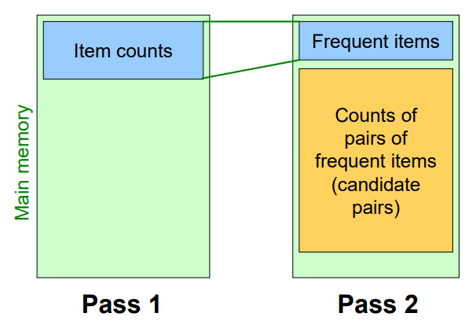

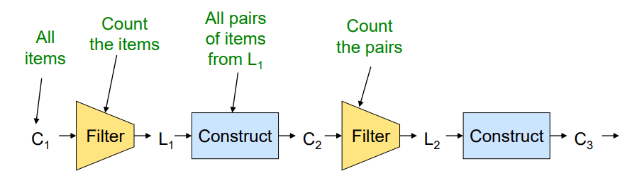

## Algoritmus PCY (Park-Chen-Yu)
PCY je vylepšením A-Priori, které lépe využívá operační paměť během prvního průchodu. Využívá fakt, že po spočítání frekvencí jednotlivých položek v Pass 1 zůstává v paměti často mnoho volného místa.
- **Hashovací tabulka:** Během Pass 1 algoritmus PCY navíc hashujeme každou dvojici v každém koši do kbelíků (buckets) v hashovací tabulce.
- **Princip:** Pokud je celková suma výskytů všech dvojic v daném kbelíku menší než práh $s$, pak žádná dvojice, která do tohoto kbelíku patří, nemůže být frekventovaná.
- V Pass 2 pak algoritmus považuje dvojici za kandidáta pouze tehdy, pokud: 1. Obě položky jsou frekventované (jako v A-Priori) A ZÁROVEŇ 2. Dvojice hashovala do "frekventovaného" kbelíku.
- *Příklad: I když jsou pivo a víno individuálně frekventované, pokud jejich společný hashovací kbelík má velmi nízký součet, v Pass 2 se jimi model vůbec nezabývá.*

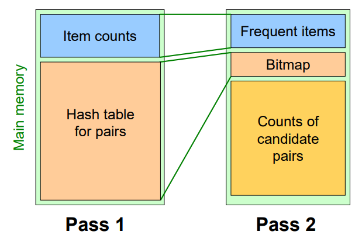

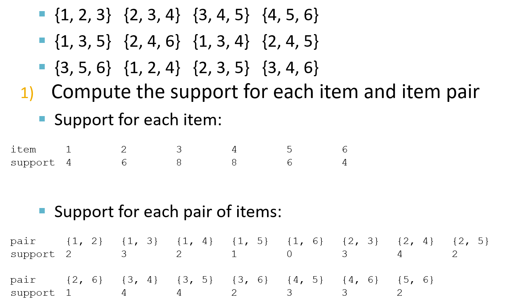
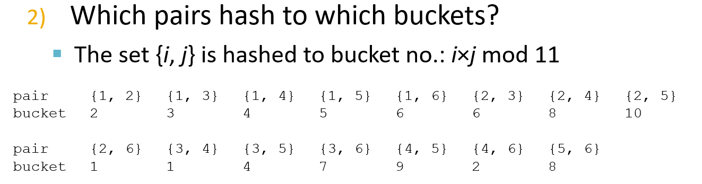
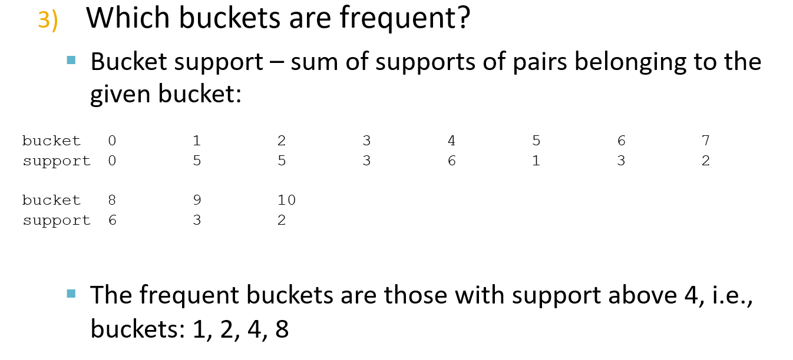

## Rozšíření PCY: Multistage a Multihash
Tyto techniky dále snižují počet falešných kandidátů ve druhém průchodu za cenu více průchodů nebo složitějšího hashování.
- **Multistage:** Mezi Pass 1 a Pass 2 přidává další průchody s novými hashovacími funkcemi, které pracují pouze s dvojicemi, jež prošly předchozími filtry. Výsledkem je bitová mapa (bitmapa), která efektivně vyřazuje nefrequentní dvojice.
- **Multihash:** Používá dvě nebo více nezávislých hashovacích tabulek přímo v prvním průchodu. Dvojice musí hashovat do frekventovaného kbelíku ve všech tabulkách, aby se stala kandidátem.
- *Příklad: Použitím dvou nezávislých hashů v Pass 1 eliminujeme dvojice, které by náhodou sdílely jeden "silný" kbelík s jinou skutečně frekventovanou dvojicí.*

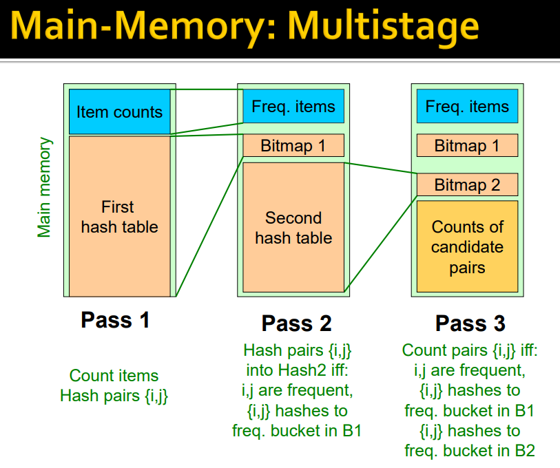
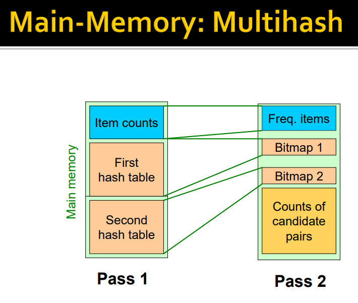

---

# Shlukovací analýza

Shlukování (clustering) je metoda učení bez učitele, jejímž cílem je rozdělit data do skupin (shluků) tak, aby si objekty uvnitř jedné skupiny byly co nejvíce podobné a objekty v různých skupinách co nejvíce odlišné.

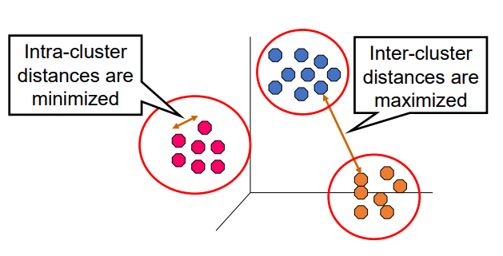

## k-means
Jedná se o nejrozšířenější rozdělovací (partitní) algoritmus, který se snaží minimalizovat součet čtverců vzdáleností mezi body a příslušným středem shluku (centroidem).

- **Princip:** Algoritmus začíná náhodným výběrem $k$ centroidů. V každém kroku přiřadí každý bod k nejbližšímu centroidu a následně přepočítá polohu centroidu jako průměr všech bodů v daném shluku. Tento proces se opakuje, dokud se poloha centroidů nemění.
- **Vlastnosti:** Algoritmus je rychlý a efektivní, ale vyžaduje předem definovaný počet shluků $k$ a je velmi citlivý na počáteční inicializaci a odlehlá pozorování (outliery).
- **Omezení:** Nedokáže dobře zachytit shluky, které nemají kulovitý tvar nebo mají výrazně odlišnou hustotu.
- *Příklad: Rozdělení zákazníků e-shopu do 5 skupin podle věku a průměrné útraty pro účely cíleného marketingu.*

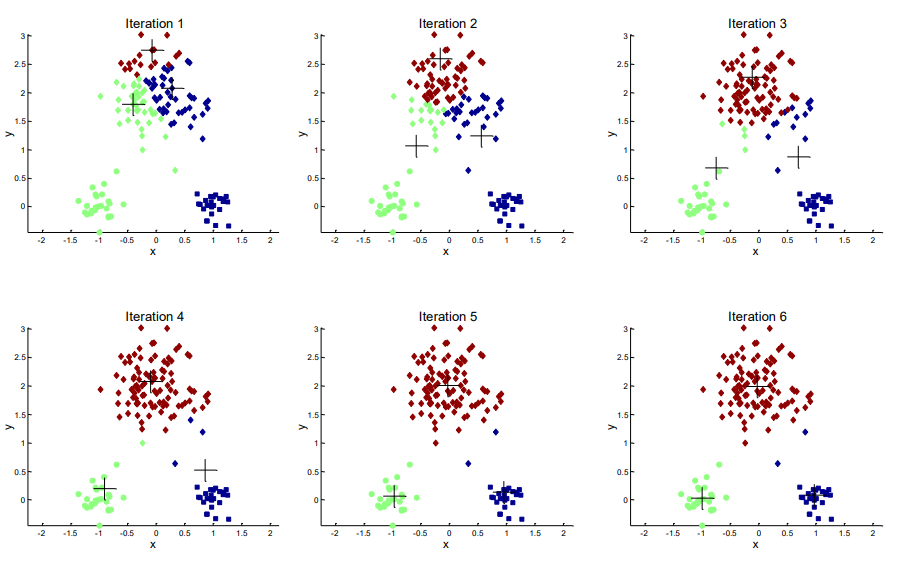

## Hierarchické shlukování
Tento přístup vytváří hierarchii shluků, kterou lze vizualizovat pomocí stromové struktury zvané dendrogram. Nejčastěji se používá aglomerativní (zdola nahoru) přístup.

- **Princip:** Na začátku je každý bod samostatným shlukem. V každém kroku se spojí dva "nejbližší" shluky na základě definovaného kritéria (linkage). Proces končí, když jsou všechny body v jednom velkém shluku.
- **Kritéria spojování (Linkage):** - **Single link:** Vzdálenost dvou nejbližších bodů (náchylné k řetězení).
  - **Complete link:** Vzdálenost dvou nejvzdálenějších bodů (vytváří kompaktní shluky).
  - **Average link:** Průměrná vzdálenost mezi všemi páry bodů.
- **Výhoda:** Není nutné předem znát počet shluků; ten lze určit dodatečným "uříznutím" dendrogramu v určité výšce.
- *Příklad: Sestavení evolučního stromu organismů na základě genetické podobnosti.*

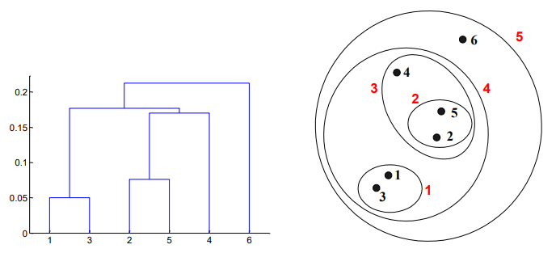

## DBSCAN
DBSCAN (Density-Based Spatial Clustering of Applications with Noise) je algoritmus založený na hustotě, který dokáže identifikovat shluky libovolného tvaru a efektivně odfiltrovat šum.

- **Parametry:** Vyžaduje dva parametry: poloměr okolí $Eps$ a minimální počet bodů $MinPts$.
- **Kategorizace bodů:**
  - **Core point:** Bod, který má ve svém okolí $Eps$ alespoň $MinPts$ bodů.
  - **Border point:** Bod, který není jádrový, ale leží v sousedství jádrového bodu.
  - **Noise point:** Bod, který není ani jádrový, ani hraniční.
- **Výhody:** Automaticky detekuje počet shluků a je odolný vůči outlierům. Má však potíže v datech s výrazně proměnlivou hustotou.
- *Příklad: Detekce shluků hvězd v astronomických datech, kde hvězdy mimo shluky jsou považovány za šum.*

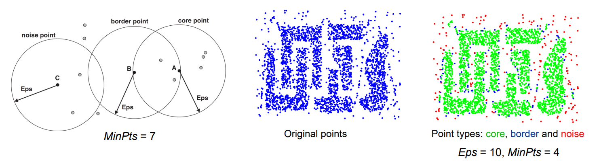
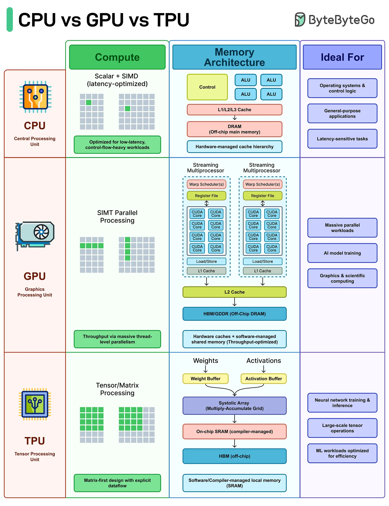

## Chameleon
Chameleon je sofistikovaný hierarchický algoritmus, který překonává omezení statických modelů tím, že používá dynamické modelování pro spojování shluků.

- **Dvoufázový proces:**
  1. **Fáze rozdělení:** Data jsou reprezentována jako graf (k-nearest neighbor graph), který je rozdělen na velké množství malých podshluků (sub-clusters) pomocí efektivního grafového řezání (např. algoritmus METIS).
  2. **Fáze spojování:** Podshluky jsou postupně spojovány na základě jejich **relativní propojenosti (Relative Interconnectivity)** a **relativní blízkosti (Relative Closeness)**.
- **Princip:** Dva shluky jsou spojeny pouze tehdy, pokud je jejich vzájemné propojení a blízkost vysoká ve srovnání s vnitřním propojením a blízkostí uvnitř samotných shluků.
- **Vlastnosti:** Velmi robustní vůči šumu a schopný modelovat velmi složité a do sebe zaklesnuté tvary shluků, které DBSCAN nebo k-means nezvládnou.
- *Příklad: Shlukování prostorových dat v geografických informačních systémech (GIS), kde tvary územních celků mohou být velmi nepravidelné a protáhlé.*

---
        