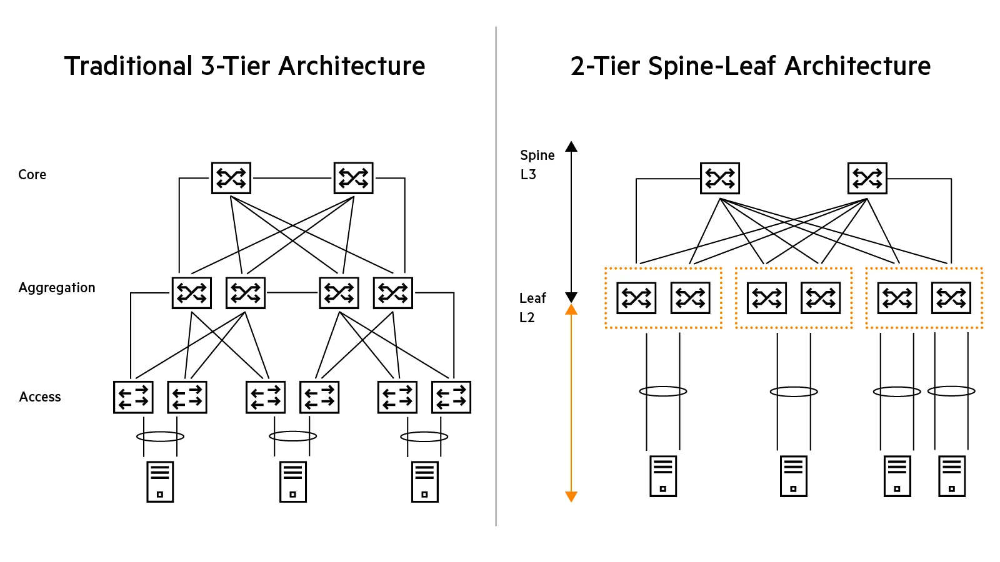
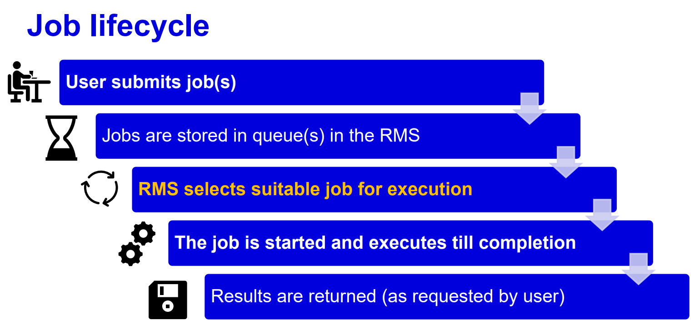
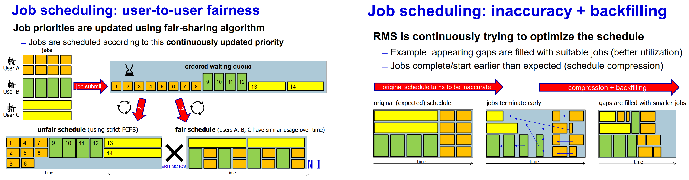
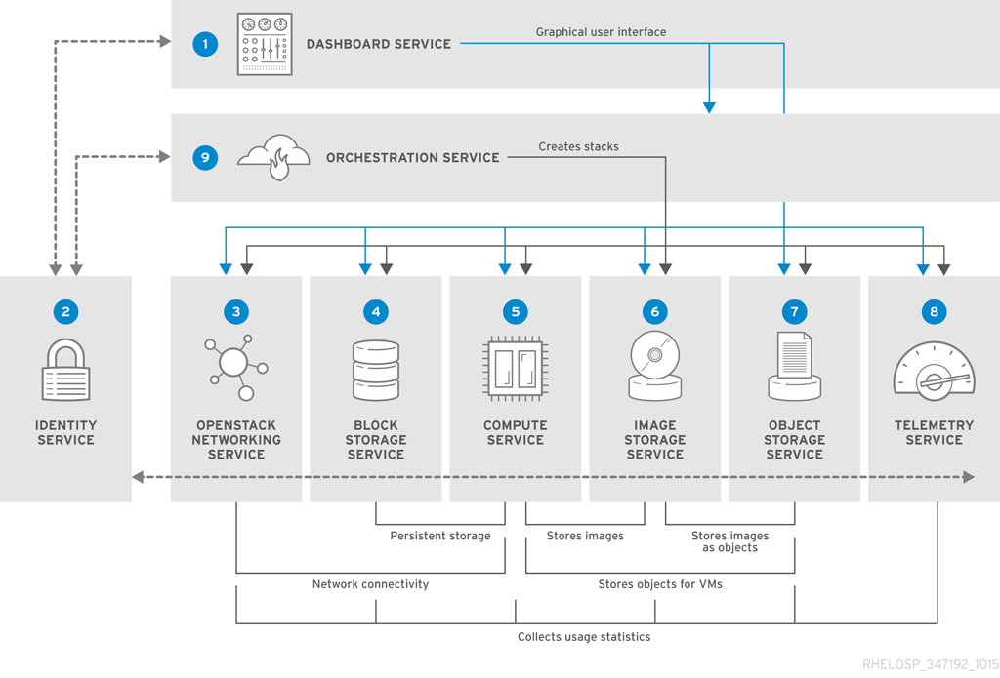
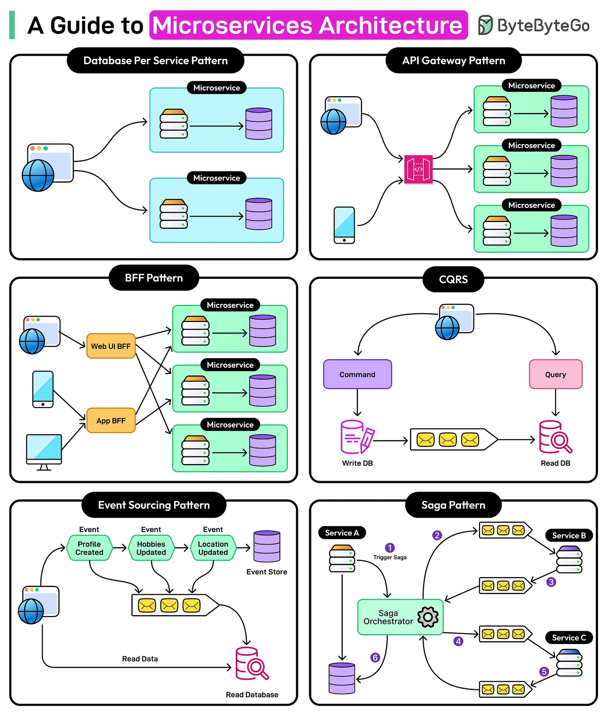
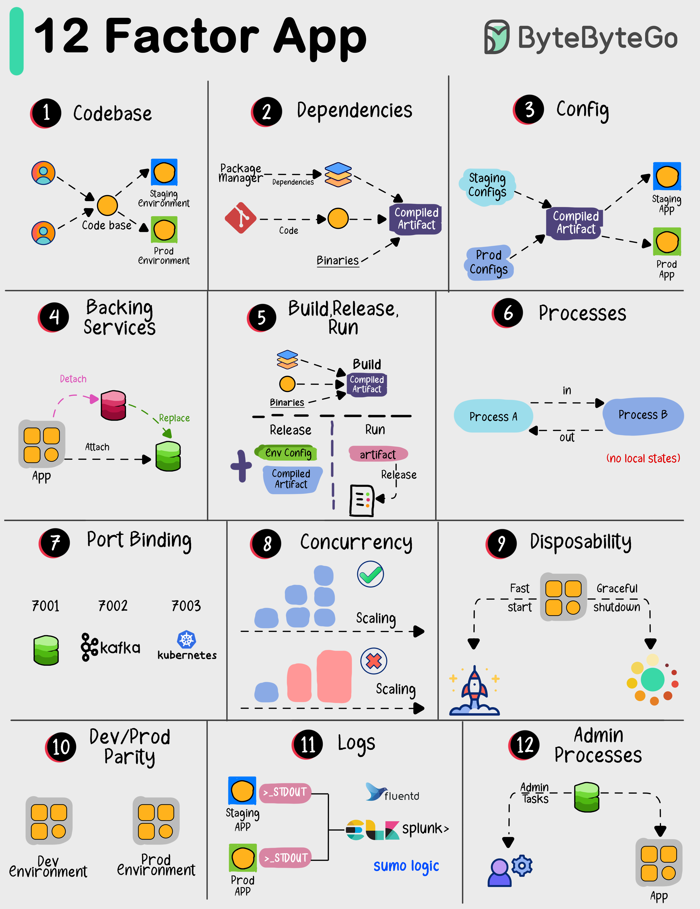
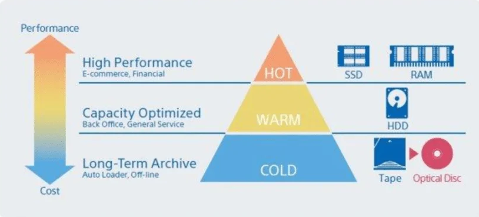
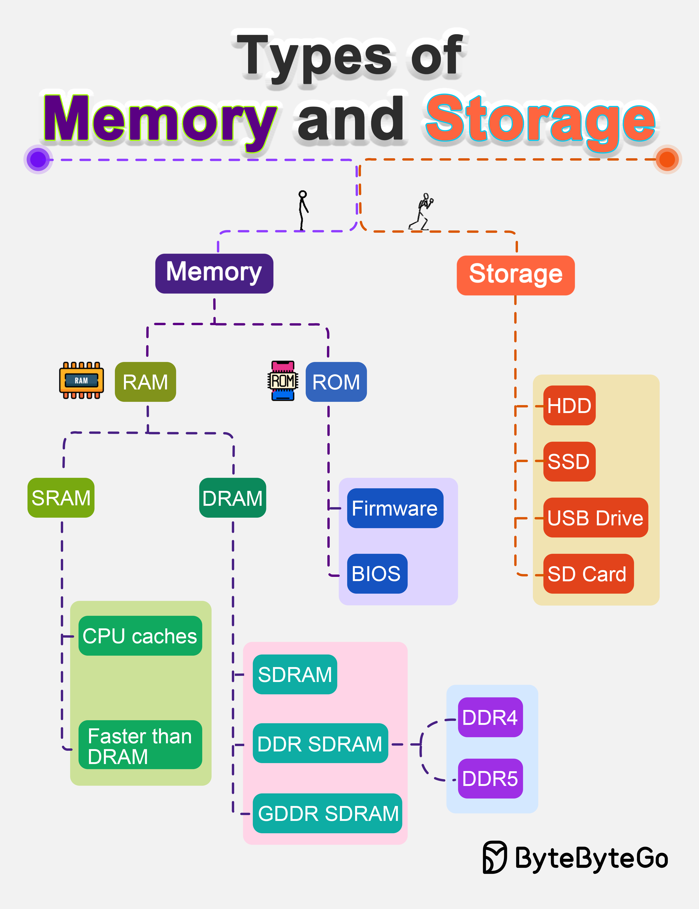
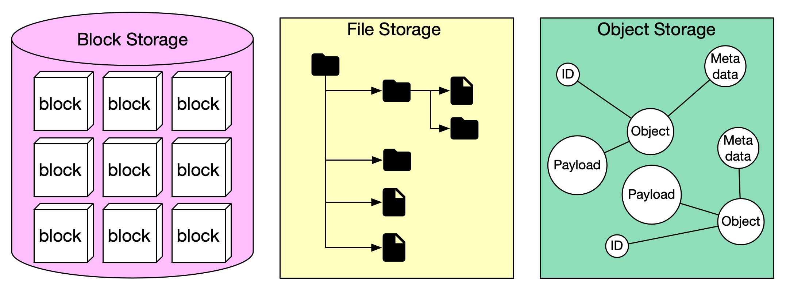

# Infrastrukturní a cloudové systémy

> Data-center architecture; supercomputers vs. heterogeneous clusters; orchestration architectures (PBS/grids, Kubernetes, OpenStack); 
> GPU vs. CPU computing and workloads that benefit from massive parallelism; scalable application models; 
> storage tiers, technologies, data temperature and movement; infrastructure resilience and reliability; 
> automation, DevOps/GitOps and SRE; workflow managers and workload portability; identity, SSO, and AAI. (PA234) (povinné pro studium dle kontrolní šablony 2024/2025 nebo novější)

## Architektura datových center (Data-center architecture)

Moderní datové centrum (DC) je navrženo pro maximální hustotu výkonu, efektivitu chlazení a propustnost sítě.

### IT Vybavení (IT Equipment)
*  Superpočítače / Výpočetní clustery / Servery 
* Úložiště dat (Storage Devices)
* Síťové prvky (Networking Equipment)
* Virtualizační infrastruktura
* Napájecí jednotky (PDU)
* Záložní zdroje (UPS)
* Chladicí systémy
* Zabezpečení (Security Systems)
* Nástroje pro správu a monitoring

### Zázemí budovy (Facilities Infrastructure)
* Energetická infrastruktura (Power Infrastructure)
* HVAC (Vytápění, ventilace a klimatizace)
* Design a rozložení datacentra
* Protipožární ochrana (Fire Suppression)
* Fyzická bezpečnost
* Redundance a záložní systémy
* Správa kabeláže (Cable Management)
* Environmentální monitoring

* **Efektivita (PUE):** Klíčovou metrikou je **PUE (Power Usage Effectiveness)**. Vyjadřuje poměr celkové energie spotřebované DC k energii spotřebované IT vybavením. Ideál je 1.0. Moderní DC (Google, Azure) dosahují ~1.1; běžná DC kolem 1.5–2.0.
* **Síťová topologie (Spine-Leaf):**
    * Na rozdíl od tradiční hierarchické struktury (Core-Agg-Access) využívá cloudová éra **Spine-Leaf (Clos)** architekturu. 
    * Každý **Leaf** switch (v racku) je připojen ke každému **Spine** switchi. To zajišťuje konstantní latenci (vždy max. 2 hopy) a vysokou propustnost pro **East-West traffic** (komunikace mezi servery v DC), který dnes dominuje nad komunikací ven (North-South).
* **Disagregace:** Trend oddělování CPU, RAM a úložiště do samostatných fondů propojených ultra-rychlou sítí, což umožňuje efektivnější využití zdrojů.
  

---

## Superpočítače vs. heterogenní clustery (Supercomputers vs. heterogeneous clusters)
* **Superpočítače (HPC - High Performance Computing):**
    * Jednotlivé, vysoce specializované systémy určené pro maximální výkon
    * Navrženy pro **těsně vázané (tightly-coupled)** úlohy *např. simulace počasí, dynamika kapalin, virtuální crash testy, vývoj léků,...*
    * Využívají **MPI (Message Passing Interface)** pro neustálou komunikaci mezi tisíci jádry.
    * Klíčová je **nízká latence sítě** (technologie jako InfiniBand nebo HPE Slingshot).
    * *např.: El Capitan (USA), Karolina v Ostravě*

* **Heterogenní clustery (HTC - High Throughput Computing):**
    * Soubory standardních počítačů spolupracujících za účelem dosažení vysokého výkonu prostřednictvím paralelního zpracování
    * Skládají se z různorodého HW (různé generace CPU, různé GPU).
    * Vhodné pro **volně vázané (loosely-coupled)** nebo „embarrassingly parallel“ úlohy, které lze rozdělit na nezávislé části *např.: zpracování obrazu, Monte Carlo simulace, trénování LLM, renderování animovaných filmů, analýza velkých dat*
    * *např.: Infrastruktura e-INFRA CZ (MetaCentrum, CERIT-SC).*

* Pozor, ani superpočítače, ani výpočetní clustery nemohou výrazně zrychlit vaši práci, pokud nejsou implementovány pro paralelní/distribuované zpracování.
---

## Orchestrační architektury

Orchestrace řeší "plánování" (scheduling) – kdy a kde se co spustí. V moderních datových centrech a superpočítačových střediscích se nepoužívá jen jeden přístup. 
Výběr závisí na tom, zda potřebujete spočítat složitou simulaci (HPC), provozovat webovou aplikaci (Cloud) nebo spravovat celou infrastrukturu (IaaS).

* **PBS (Portable Batch System) / Slurm:** * **Batch processing:** Uživatel pošle úlohu do fronty. Plánovač ji spustí, až jsou zdroje volné.
* **OpenStack (IaaS):** * Správa virtuálních strojů (VM). Uživatel má "on-demand" přístup a root práva k OS.
* **Kubernetes (K8s / CaaS):** Orchestrace kontejnerů. **Deklarativní přístup**: definujete cílový stav (např. "chci 5 instancí webu"), K8s zajistí jeho udržení (*Self-healing*).

---

## PBS (Portable Batch System) / Slurm
Standard pro HPC (High Performance Computing) a superpočítače.

* **Batch processing (Dávkové zpracování):** Uživatel neinteraguje se strojem přímo v reálném čase. Pošle úlohu (skript) do fronty a specifikuje požadavky (např. 16 uzlů, 4 GPU, 24 hodin). Plánovač (Scheduler) ji spustí, až jsou zdroje volné.
* **Klíčové mechanismy:**
    * **Fairshare:** Prioritizační algoritmus. Pokud uživatel v poslední době vyčerpal hodně prostředků, jeho priorita klesá, aby systém zůstal spravedlivý pro ostatní.
    * **Backfilling:** Strategie pro maximalizaci využití. Pokud velká úloha čeká na uvolnění zdrojů, plánovač do vzniklé časové mezery "vsune" menší, krátké úlohy, které stihnou doběhnout dříve, než začne hlavní výpočet.
* **Využití:** Simulace počasí, CFD (dynamika kapalin), vývoj léků, trénování obřích AI modelů.
* **Příklady:** Slurm (na Karolině v Ostravě), PBS Professional, Torque.
  

---

## OpenStack 
Platforma pro budování privátních i veřejných cloudů a správa virtualizace. IaaS - Infrastructure as a Service.

* **Správa virtuálních strojů (VM):** Umožňuje rozdělit fyzický hardware na mnoho nezávislých virtuálních serverů. Uživatel má k OS "on-demand" přístup a plná **root práva**.
* **Modulární komponenty:**
    * **Nova:** Hlavní "compute" modul, který vytváří a spravuje životní cyklus virtuálních strojů.
    * **Neutron:** Zajišťuje síťovou konektivitu (L2/L3 vrstvy, IP adresy, firewally).
    * **Keystone:** Modul pro identitu, autentizaci uživatelů a správu oprávnění.
    * **Cinder:** Poskytuje blokové úložiště (virtuální pevné disky), které lze za běhu připojovat k VM.
* **Využití:** Podnikové IT systémy, vývojová prostředí, hosting webových služeb.
  

---

## Kubernetes 
Nástroj pro orchestraci kontejnerů, zaměřený na automatizaci a škálování. CaaS - Container as a Service.

* **Orchestrace kontejnerů:** Spravuje aplikace zabalené v lehkých kontejnerech (např. Docker). Na rozdíl od VM kontejnery sdílejí jádro OS, což je činí extrémně rychlými na spuštění.
* **Deklarativní přístup:** Uživatel definuje v konfiguračním souboru (YAML) cílový stav (např. "vždy chci mít 10 aktivních instancí této služby"). Kubernetes se postará o jeho dosažení a udržení.
* **Klíčové funkce:**
    * **Self-healing (Samohojení):** Pokud kontejner spadne nebo uzel (node) selže, K8s automaticky restartuje pody na jiném funkčním hardwaru.
    * **Horizontální škálování:** Automaticky přidává nebo ubírá instance aplikace podle aktuálního vytížení CPU/RAM.
    * **Service Discovery:** Automaticky propojuje pody a vyrovnává zátěž (Load Balancing) mezi nimi.
* **Využití:** Microservices, moderní webové aplikace (Netflix, Spotify), CI/CD potrubí.
* Pojmy: 
  * Pod (nejmenší jednotka v K8s, obsahuje jeden nebo více kontejnerů), 
  * Node (fyzický nebo virtuální stroj, na kterém běží pody), 
  * Control Plane (řídící věž celého clusteru).

---

## CPU vs. GPU výpočty a Massive Parallelism Workloads

Základní rozdíl spočívá v tom, na co jsou čipy optimalizovány:

* **CPU (Latency Oriented):** Navrženo pro co nejrychlejší vykonání **sekvenčního** kódu. Obsahuje složité řídicí jednotky (Control Unit), velkou vyrovnávací paměť (Cache) a propracované mechanismy jako *branch prediction* (předpovídání skoků) a *out-of-order execution*. Cílem je minimalizovat čas (latenci) vykonání jedné instrukce. Složitá rozhodovací logika, rekurze, kód s mnoha podmínkami (`if-else`), úlohy citlivé na odezvu (real-time).
* **GPU (Throughput Oriented):** Navrženo pro zpracování **obrovského množství dat** současně. Většina tranzistorů je věnována samotným výpočetním jednotkám (ALU) na úkor řídicí logiky a cache. Cílem je maximalizovat celkový objem vykonané práce (propustnost) za jednotku času, i za cenu vyšší latence u jednotlivých vláken. Vektorové a maticové operace, zpracování obrazu a videa, vědecké simulace, trénování neuronových sítí (hluboké učení).

Při nasazení GPU je nutné brát v úvahu dva hlavní limity:

1.  **Amdahlův zákon:** Celkové zrychlení systému je omezeno jeho sekvenční částí. Pokud 10 % algoritmu nelze paralelizovat a musí běžet na CPU, maximální teoretické zrychlení je 10x, i kdyby zbytek běžel na nekonečně mnoha jádrech GPU.
2.  **PCIe Bottleneck:** Přenos dat mezi systémovou RAM (u CPU) a Video RAM (u GPU) přes sběrnici PCIe je relativně pomalý. Pokud je výpočet na GPU příliš krátký, může režie přenosu dat smazat veškerý výkonnostní zisk.

| Vlastnost | CPU (Central Processing Unit) | GPU (Graphics Processing Unit) |
| :--- | :--- | :--- |
| **Počet jader** | Jednotky až desítky (komplexní jádra) | Tisíce (jednodušší, menší jádra) |
| **Model paralelismu** | **MIMD** (Multiple Instruction, Multiple Data) | **SIMT** (Single Instruction, Multiple Threads) |
| **Správa vláken** | Těžká (vysoký režijní náklad na kontext) | Velmi lehká (HW plánovač spravuje tisíce vláken) |
| **Paměť (Cache)** | Velká L1/L2/L3 pro skrytí latence RAM | Malá cache, důraz na extrémní šířku pásma VRAM |
| **Vhodné úlohy** | Logika OS, větvený kód, databáze | Maticové operace, rendering, Deep Learning |

### Multi-Instance GPU (MIG)

MIG je technologie (představená společností NVIDIA u architektury Ampere a novějších), která řeší problém **podvytížení** výkonných GPU.

* **Princip:** Umožňuje fyzické GPU hardwarově rozdělit až na 7 samostatných, plně izolovaných instancí.
* **Hardwarová izolace:** Každá instance má svou vlastní přidělenou paměť (VRAM), cache a výpočetní jádra (SM - Streaming Multiprocessors).
* **Hlavní výhody:**
    * **Quality of Service (QoS):** Úloha v jedné instanci neovlivňuje výkon úlohy v jiné instanci (na rozdíl od softwarového multitaskingu).
    * **Efektivita:** Na jednom silném GPU (např. NVIDIA A100/H100) může běžet současně 7 různých uživatelů nebo 7 různých typů úloh (např. inference AI, rendering a simulace).
    * **Bezpečnost:** Data mezi instancemi jsou na úrovni hardwaru oddělena.
* **Využití:** Klíčové pro cloudové poskytovatele a Kubernetes clustery, kde je potřeba dynamicky a bezpečně porcovat výkon mezi více kontejnerů.

### Massive Parallelism Workloads

Masivně paralelní úlohy jsou takové, které lze rozdělit na tisíce nezávislých podúloh. GPU pro tyto účely využívá specifické techniky:

* **Datový paralelismus:** Stejná operace se provádí nad různými daty (např. úprava jasu u každého pixelu v obraze zvlášť).
* **Skrývání latence (Latency Hiding):** GPU nečeká na data z paměti tak, že by zastavilo výpočet. Místo toho HW plánovač okamžitě přepne na jinou skupinu vláken (*warp* u NVIDIA nebo *wavefront* u AMD), která má data připravená. Proto GPU vyžaduje **tisíce aktivních vláken**, aby bylo plně vytíženo.
* **GPGPU (General-Purpose GPU):** Využití grafických karet pro obecné výpočty (věda, AI, simulace). Klíčovými technologiemi jsou **CUDA** (proprietární pro NVIDIA) a **OpenCL** (otevřený standard).

  
Obrázek - CPU, GPU, TPU architektura 

  
  

---

## Škálovatelné aplikační modely (Scalable application models)

Škálovatelnost je schopnost systému efektivně využívat dodatečné zdroje k udržení nebo zvýšení výkonu při rostoucí zátěži. Nejde jen o hardware, ale o celkový návrh systému, který umožní lineární růst výkonu bez proporcionálního nárůstu nákladů či chybovosti.

### Způsob navyšování výkonu
* **Vertikální (Scale-up):** Navýšení výkonu stávajícího uzlu (silnější CPU, více RAM). Je jednoduché na implementaci, ale má pevný hardwarový strop a představuje "Single Point of Failure".
* **Horizontální (Scale-out):** Přidávání dalších uzlů do clusteru. Je teoreticky neomezené a tvoří základ cloudu, vyžaduje však distribuovanou architekturu a load balancing.

### Teoretické modely a limity
* **Amdahlův zákon (Strong Scaling)**: Zaměřuje se na zrychlení fixní úlohy. Říká, že celkové zrychlení je limitováno sériovou (neparalelizovatelnou) částí kódu. I s nekonečným počtem procesorů zůstane čas výpočtu roven času sériové části.
* **Gustafsonův zákon (Weak Scaling)**: Zaměřuje se na rostoucí úlohu. Předpokládá, že s větším výkonem chceme řešit detailnější/větší problém ve stejném čase. Paralelní část zde roste s velikostí problému, což umožňuje efektivnější využití zdrojů než u Amdahla.
* **Paralelní režie (Brzdy)**: Výkon neroste lineárně kvůli **latenci komunikace** (posílání dat mezi uzly), **synchronizaci** (čekání na nejpomalejší uzel) a **serializaci** (zámky v DB, zápisy do logu).

### Architektonické principy
Moderní škálovatelný software využívá specifické vzory (Patterns) pro distribuci zátěže:
* **Mikroslužby (Microservices):** Rozdělení monolitu na nezávisle škálovatelné celky.
* **Database per Service:** Izolace dat zajišťuje, že úzké hrdlo jedné služby neovlivní ostatní.
* **CQRS (Command Query Responsibility Segregation):** Oddělení zápisových a čtecích operací pro nezávislou optimalizaci propustnosti čtení.
* **Event Sourcing & Saga:** Zajištění konzistence dat v distribuovaném prostředí bez nutnosti těsné vazby (tight coupling) mezi servery.
* **Bezstavovost (Statelessness):** Aplikace neukládá session data lokálně na disk nebo do paměti RAM konkrétního serveru. Stav je v externí DB nebo v tokenu (JWT). Díky tomu může jakýkoliv uzel odbavit jakýkoliv požadavek.

  
Obrázek - Architektura mikroslužeb

  
  

### Metodika pro škálovatelné webové služby: Twelve-Factor App 
Soubor 12 principů pro vývoj a nasazení škálovatelných, udržitelných a přenositelných webových aplikací. Tyto principy jsou navrženy tak, aby umožnily snadné škálování a správu aplikací v cloudu.

1) **Codebase**: Jedna verze kódu v Gitu nasazená do mnoha prostředí (dev, test, prod).
2) **Dependencies**: Explicitní deklarace všech knihoven; aplikace nepředpokládá přítomnost ničeho v systému.
3) **Config**: Veškeré nastavení a citlivé údaje uloženy v proměnných prostředí, nikdy v kódu.
4) **Backing services**: Databáze a API jsou brány jako připojené zdroje zaměnitelné pomocí URL.
5) **Build, release, run**: Přísné oddělení fází od kompilace po spuštění; do běžícího kódu se nezasahuje.
6) **Processes**: Aplikace je bezstavová (stateless); nic nesdílí a data ukládá pouze do externích služeb.
7) **Port binding**: Aplikace je zcela samostatná a vystavuje své služby přímo na určitém portu.
8) **Concurrency**: Škálování probíhá přidáváním dalších kopií procesů (horizontálně), nikoliv jejich zvětšováním.
9) **Disposability**: Rychlý start a korektní vypnutí (graceful shutdown) pro maximální robustnost systému.
10) **Dev/prod parity**: Udržování vývojového a produkčního prostředí v co největší shodě.
11) **Logs**: Logy jsou chápány jako proud událostí; aplikace neřeší jejich ukládání ani rotaci.
12) **Admin processe**s: Správcovské úkoly (migrace DB) běží jako jednorázové procesy ve stejném prostředí.

  
Obrázek - 12-factor app

  
  

---

## Úrovně úložišť, technologie, teplota dat a přesun 
Tato sekce řeší efektivní správu dat skrze hierarchii úložišť, kde se vyvažuje **rychlost (výkon)** a **cena (kapacita)**.

Data se v čase přirozeně "ochlazují", což vyžaduje jejich přesun mezi různými vrstvami (Tiers) pro optimalizaci nákladů.

* **Hot Data (Horká):** Aktivní výpočty a databáze. Vyžadují minimální latenci a maximální propustnost.
    * *Technologie:* **HBM / RAM**, **NVMe / SSD (Flash)**.
    * *Úroveň:* **Tier 0** (Performance) a **Tier 1** (Standard).
* **Warm Data (Teplá):** Méně častý přístup (uživatelské dokumenty, starší záznamy). Balance mezi cenou a rychlostí.
    * *Technologie:* **HDD (Magnetické disky)** (SAS/SATA).
    * *Úroveň:* **Tier 2** (Capacity).
* **Cold Data (Studená / Archivní):** Téměř se nečtou (zálohy, audity). Prioritou je nejnižší cena za GB.
    * *Technologie:* **Páskové knihovny (Tape)**, levný Cloud Storage (Glacier).
    * *Úroveň:* **Tier 3** (Archive).

* Klíčové metriky a vlastnosti
  * **Vztah Memory vs. Storage:** Paměť (**Memory**) je volatilní (po vypnutí proudu se smaže) a slouží k výpočtům. Úložiště (**Storage**) je persistentní (trvalé).
  * **IOPS:** Počet operací za sekundu (kritické pro databáze a malé soubory).
  * **Throughput (Propustnost):** Rychlost v MB/s až GB/s (kritické pro velké simulace).
  * **Latency (Latence):** Časová odezva před zahájením přenosu (kritické pro interaktivitu).

  
Obrázek - Memory and Sotrage

  
  

### Architektura propojení a logický přístup
Způsob, jakým jsou úložiště fyzicky zapojena a jak s nimi aplikace komunikují.

* **Typy přístupu (Storage Systems):**
    * **Block Storage:** Data uložena v surových blocích bez metadat. Nejvyšší výkon a nejnižší latence. Ideální pro **databáze** a **VM (OpenStack Cinder)**. Přístup přes protokoly jako iSCSI nebo Fibre Channel.
    * **File Storage:** Data organizována v hierarchické struktuře (složky/soubory). Snadné sdílení a čitelnost pro člověka. Standard pro **clusterové sdílení** (NFS, SMB).
    * **Object Storage:** Data uložena jako plochý seznam "objektů" s unikátním ID a bohatými metadaty. Extrémně škálovatelné (miliardy souborů), dostupné přes **HTTP/REST API (S3, Ceph)**. Ideální pro nestrukturovaná data (videa, logy, archivy).

* **Síťová infrastruktura:**
    * **DAS:** Disky přímo v serveru (nízká latence, nesdílené).
    * **NAS:** Úložiště v běžné síti Ethernet (sdílení souborů).
    * **SAN:** Dedikovaná vysokorychlostní síť (Fibre Channel) pro blokový přenos.
* **HPC Specialita (Paralelní souborové systémy):** Systémy jako **Lustre** nebo **GPFS** umožňují tisícům procesorů současný přístup k jednomu souboru s extrémní propustností.

### Přesun dat (Data Movement)
Automatizace a efektivita ukládání dat pomocí pokročilých algoritmů.

* **ILM (Information Lifecycle Management):** Komplexní správa životního cyklu dat na základě byznys pravidel (např. automatický přesun na pásku po 6 měsících neaktivity).
* **HSM (Hierarchical Storage Management):** Samotný technologický proces automatického přesouvání dat mezi vrstvami.
* **Erasure Coding (EC):** Odolnost dat bez nutnosti zrcadlení (RAID). Data jsou rozdělena na $k$ bloků s $m$ paritními bloky. Šetří místo při zachování bezpečnosti.
* **Caching vs. Tiering:**
    * **Caching:** Dočasná kopie dat v rychlejší vrstvě pro zrychlení (originál zůstává dole).
    * **Tiering:** Fyzický přesun dat mezi vrstvami (existují jen na jednom místě).
* **Recall Latency:** Zpoždění při "probouzení" dat z hlubších archivních vrstev.

* **Data Locality (Lokalita dat)**: Princip, kdy se snažíme posunout výpočet co nejblíže k datům (nebo data k výpočtu), aby se minimalizoval síťový provoz.
* **Data Integrity (Integrita dat)**: Mechanismy jako Checksums (kontrolní součty), které hlídají, zda se při přesunu mezi vrstvami nebo při dlouhodobém ležení na pásce data nepoškodila (bit rot).

---

## Odolnost a spolehlivost infrastruktury

Cílem je eliminovat **SPOF (Single Point of Failure)** – jediné místo selhání, které by mohlo zastavit celý systém.

### Úrovně dostupnosti (Data Center Tiers)
Standardizovaná klasifikace (podle Uptime Institute) definující spolehlivost zázemí:
* **Tier I:** Základní infrastruktura bez redundance (99,671 % dostupnost).
* **Tier II:** Částečná redundance (N+1) napájení a chlazení.
* **Tier III:** Souběžná udržitelnost. Každý komponent lze opravit bez přerušení provozu (99,982 % dostupnost).
* **Tier IV:** Úplná odolnost proti chybám (Fault Tolerance). Systém vydrží jakoukoliv poruchu bez dopadu na IT (99,995 % dostupnost).

### Mechanismy redundance
* **N+1:** Máte o jeden záložní komponent více, než je nutné pro provoz (např. 4 klimatizace, přičemž stačí 3).
* **2N / 2(N+1):** Úplné zdvojení celých větví (např. dvě nezávislé trafostanice, dva UPS systémy).
* **High Availability (HA) Cluster:** Skupina serverů, kde při pádu jednoho okamžitě přebírá jeho práci jiný (např. v Kubernetes nebo OpenStacku).

### Ochrana dat a kontinuita
* **RAID (Redundant Array of Inexpensive Disks):** Ochrana proti výpadku jednotlivých disků v rámci jednoho serveru.
* **Erasure Coding (EC):** Pokročilejší ochrana rozprostírající data přes více fyzických uzlů (vhodné pro velké distribuované systémy).
* **Backup vs. Disaster Recovery (DR):**
    * **Backup:** Pravidelná záloha dat pro obnovu (např. po smazání souboru).
    * **Disaster Recovery:** Plán a infrastruktura pro obnovu celého provozu v jiném datacentru po totální katastrofě (požár, povodeň).
* **RTO vs. RPO (Klíčové metriky):**
    * **RTO (Recovery Time Objective):** Jak dlouho trvá systém znovu nahodit?
    * **RPO (Recovery Point Objective):** Kolik dat (v čase) si můžeme dovolit ztratit? (např. 15 minut záznamů).

### Fyzická a environmentální spolehlivost
* **UPS & Generátory:** Baterie pro okamžité vykrytí výpadku a dieselagregáty pro dlouhodobý provoz bez sítě.
* **Fire Suppression:** Plynové hašení (FM-200, Novec), které uhasí oheň, ale nepoškodí citlivou elektroniku vodou.
* **Hot/Cold Aisles:** Design uliček v sále, který zabraňuje míchání teplého a studeného vzduchu, čímž předchází přehřátí (thermal stress).

---

## Automatizace, DevOps/GitOps a SRE

* **DevOps:** Kultura spojující vývoj a provoz. Cílem je **CI/CD** (Continuous Integration/Deployment).
* **GitOps:** Stav infrastruktury je popsán kódem v Gitu (**Single Source of Truth**). Nástroje jako *Flux* nebo *ArgoCD* automaticky synchronizují realitu v cloudu s kódem v Gitu.
* **SRE (Site Reliability Engineering):** Inženýrský přístup k provozu.
    * **SLI** (Indicator), **SLO** (Objective - např. 99.9% uptime).
    * **Error Budget:** Prostor pro chyby (0.1%). Pokud je vyčerpán, zastavuje se vývoj nových funkcí a řeší se pouze stabilita.

---

## Workflow manažeři a přenositelnost úloh (Workflow managers and workload portability)

* **Workflow manažeři (Snakemake, Nextflow):** Automatizují komplexní výpočetní řetězce (DAG - Directed Acyclic Graph). Zajišťují, že pokud krok 5 selže, nemusí se po opravě spouštět kroky 1–4 znovu.
* **Kontejnery pro HPC:** Zatímco v cloudu vládne *Docker*, v HPC se používá **Apptainer (Singularity)**.
    * *Důvod:* Singularity nevyžaduje root práva, neřeší síťovou izolaci (latence!) a snadno mapuje souborový systém hostitele.
* **Portability:** Možnost spustit stejný vědecký výpočet kdekoli (notebook -> cloud -> superpočítač).

---

## Identita, SSO a AAI (Identity, SSO, and AAI)

* **AAI (Authentication and Authorisation Infrastructure):**
    * *AuthN (Kdo jsi?):* Ověření identity (heslo, MFA).
    * *AuthZ (Co smíš?):* Oprávnění k přístupu ke zdrojům.
* **SSO (Single Sign-On):** Uživatel se přihlásí jednou a získá přístup k mnoha nezávislým systémům.
* **Federace:** Spojení identit různých institucí (např. **eduGAIN**). Umožňuje studentovi MUNI přihlásit se ke službám univerzity v Oxfordu pomocí jeho MUNI hesel.
* **Protokoly:**
    * **SAML:** Starší, XML, robustní, používaný ve federacích.
    * **OpenID Connect (OIDC):** Moderní, postavený nad **OAuth2**, využívá JSON a JWT tokeny. Populární v cloudu.
