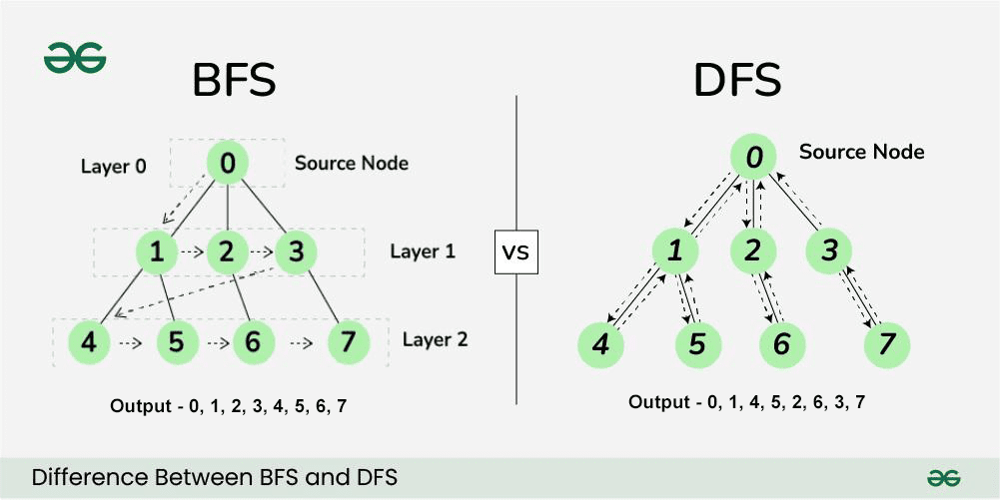
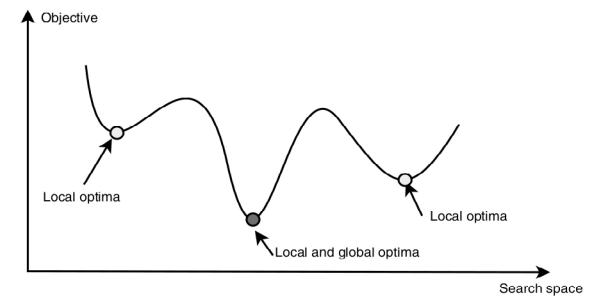
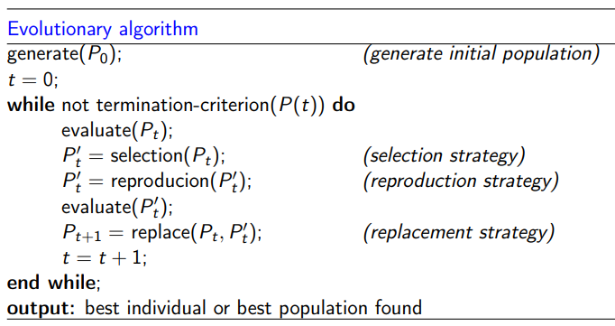
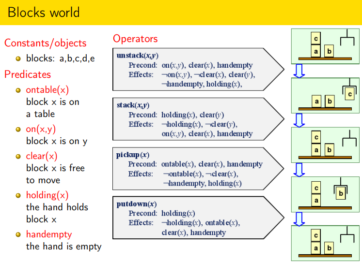
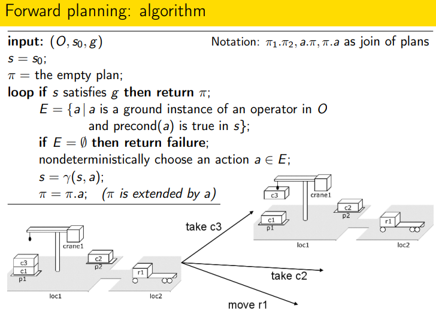
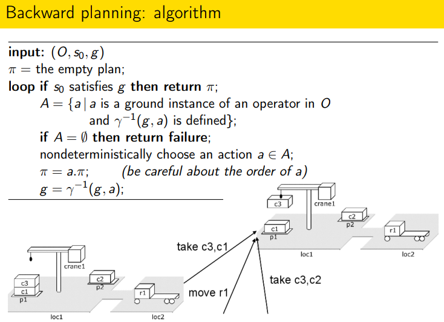

# Metody umělé inteligence

> Prohledávání stavového prostoru, lokální prohledávání a metaheuristiky s jedním řešením, 
> populační metaheuristiky (evoluční algoritmy, inteligence hejna). 
> Plánování, reprezentace problému, plánování se stavovým prostorem. 
> Práce s neurčitostí, Bayesovské sítě, exaktní a aproximační odvozování, čas a neurčitost, 
> teorie užitku, Markovský rozhodovací proces, iterace hodnot, iterace strategie. 
> Robotika, plánování pohybu robota (konfigurační prostor, kombinatorické a pravděpodobnostní přístupy). (IV126)

## Prohledávání stavového prostoru (State Space Search)

Mnoho problémů v umělé inteligenci (hry, dokazování vět, plánování cest) lze modelovat jako hledání v grafu, kde vrcholy jsou stavy a hrany jsou akce. Cílem je najít sekvenci akcí, která nás dovede z počátku do cíle při minimalizaci ceny.

**Formální definice problému**

Problém prohledávání je definován::

* **Množina stavů (**$S$**):** Obsahuje všechny možné konfigurace systému.
* **Počáteční stav (**$s_0 \in S$**):** Stav, ve kterém agent začíná.
* **Akce (**$A(s)$**):** Množina akcí použitelných ve stavu $s$.
* **Přechodový model (**$Result(s, a)$**):** Popisuje stav, který vznikne provedením akce $a$ ve stavu $s$.
* **Funkce sousedství N** je zobrazení $N : S → 2^S$, které každému řešení s rozlohy S přiřazuje množinu řešení $N(s) ⊂ S$.
* **Cílový test (**$GoalTest(s)$**):** Rozhoduje, zda je stav $s$ cílový.
* **Cena akce (***$ActionCost(s, a, s')$***)**, která určuje numerickou váhu přechodu (typicky* $c(s, a, s') \ge 0$*).*

**Základní algoritmy a jejich vlastnosti**

Algoritmy vyvíjejí **strom prohledávání**, kde kořenem je $s_0$. Rozlišujeme mezi **stromovým vyhledáváním** (může cyklit) a **grafovým vyhledáváním**, které využívá *Explored set* (uzavřený seznam) pro eliminaci duplicitních stavů. Kvalitu algoritmů měříme pomocí: **Úplnosti** (najde vždy řešení?), **Optimality** (najde nejlevnější?), **Časové a prostorové složitosti**.

* **Neinformované (slepé) prohledávání:** Nemá informaci o vzdálenosti k cíli.

  * **BFS (Breadth First Search - do šířky):** Expanduje nejmělčí uzly. Je úplný a optimální pro konstantní ceny akcí. Paměťová náročnost $O(b^d)$ je hlavním limitem.

  * **DFS (Depth-first search - do hloubky):** Expanduje nejhlubší uzly. Nízká paměť $O(b \cdot m)$, ale není úplný (v nekonečných prostorech) ani optimální.

  * **UCS (Uniform-cost search):** Expanduje uzel $n$ s nejmenší cenou cesty $g(n)$. Je optimální pro libovolné nezáporné ceny.

* **Informované (heuristické) prohledávání:** Využívá **heuristickou funkci** $h(n)$, která odhaduje cenu nejlevnější cesty z $n$ do cíle.

  * **A* Search:*\* Nejdůležitější algoritmus, expanduje uzel s minimální hodnotou $f(n) = g(n) + h(n)$.

  * **Podmínky optimality A*:*\* Heuristika musí být **přípustná** (nikdy nepřeceňuje skutečnou cenu, $h(n) \le h^*(n)$) pro stromové hledání a **konzistentní** ($h(n) \le c(n, a, n') + h(n')$) pro grafové hledání.

  * *Příklad: V problému hledání trasy v mapě je přípustnou heuristikou vzdušná vzdálenost do cíle.*

---
## Lokální prohledávání a metaheuristiky s jedním řešením

V mnoha úlohách (např. *problém 8 dam* nebo *rozvrhování*) nás nezajímá cesta k cíli, ale pouze koncový stav. Lokální prohledávání pracuje pouze s **aktuálním stavem** a jeho sousedy, což drasticky snižuje nároky na paměť ($O(1)$).

**Krajina stavového prostoru (State-space landscape)**

Stavy si představujeme jako body v krajině, kde výška odpovídá **cílové funkci** (maximalizace) nebo **cenové funkci** (minimalizace). Cílem je najít globální maximum/minimum. Problémem jsou **lokální maxima**, **hřebeny (ridges)** a **plošiny (plateaux)**.

**Klíčové algoritmy**

* **Hill-climbing (Horolezecký algoritmus):** "Hladový" algoritmus, který se neustále pohybuje ve směru největšího stoupání.

  * *Příklad: V problému 8 dam posuneme dámu v sloupci tak, aby se co nejvíce snížil počet vzájemných ohrožení.*

  * Varianty: **Stochastický** (náhodný výběr z lepších), **First-choice** (první lepší soused), **Random-restart** (restartuje hledání z náhodných míst pro nalezení globálního maxima).

* **Simulované žíhání (Simulated Annealing):** Algoritmus inspirovaný metalurgií, který dovoluje "kroky zpět" (do horšího stavu), aby unikl z lokálního optima.

  * Pravděpodobnost přijetí horšího stavu je $e^{\Delta E / T}$, kde $\Delta E$ je zhoršení a $T$ je **teplota**. Teplota se postupně snižuje podle plánu ochlazování. Na začátku (vysoké $T$) algoritmus skáče náhodně, na konci (nízké $T$) se chová jako Hill-climbing.

* **Tabu prohledávání (Tabu Search):** Využívá krátkodobou paměť (**Tabu list**) k uchování nedávno navštívených stavů nebo provedených změn. Tím zabraňuje cyklení a nutí algoritmus prozkoumávat nové oblasti, i za cenu dočasného zhoršení.

* **Local Beam Search:** Udržuje $k$ stavů současně. V každém kroku vygeneruje všechny sousedy všech $k$ stavů a vybere $k$ nejlepších z celého souboru. Nejde o $k$ nezávislých hledání, protože stavy mezi sebou "sdílejí" informace o nejlepších oblastech.

---
## Populační metaheuristiky (Evoluční algoritmy a inteligence hejna)

Populační algoritmy pracují s množinou řešení současně, což umožňuje efektivnější prohledávání komplexních prostorů díky kombinaci informací z různých jedinců.

**Evoluční algoritmy (EA)**

Inspirovány biologickou evolucí (Darwinův princip přežití nejzdatnějších). Základní cyklus: **Inicializace populace** $\to$ **Ohodnocení (fitness)** $\to$ **Selekce** $\to$ **Variace (křížení a mutace)** $\to$ **Nahrazení.**

* **Genetické algoritmy (GA):** Jedinci jsou kódováni jako řetězce (chromozomy, často bitové).

  * **Selekce:** Výběr rodičů pro další generaci (např. *ruletový výběr* – pravděpodobnost úměrná fitness, nebo *turnajový výběr*).

  * **Křížení (Crossover):** Kombinuje části dvou rodičů (např. *jednobodové*, *dvoubodové* nebo *uniformní křížení*). Slouží k exploitaci (využití známých dobrých prvků).

  * **Mutace:** Náhodná změna v chromozomu (např. otočení bitu). Slouží k exploraci (udržení diverzity a objevování nových oblastí).
  * populace: sada řešení (asi 20–100)
  * chromozom/jedinec: kódované řešení 
  * gen: rozhodovací proměnná v řešení 
  * alela: hodnota rozhodovací proměnné

**Inteligence hejna (Swarm Intelligence)**

Studuje kolektivní chování decentralizovaných, samoorganizovaných systémů.

* **Optimalizace částicemi (PSO - Particle Swarm Optimization):** Každý jedinec (částice) má v prostoru svou **polohu (**$x$**)** a **rychlost (**$v$**)**.

  * Částice si pamatuje své dosavadní nejlepší řešení (**personal best**) a zná nejlepší řešení celého hejna (**global best**).

  * Rychlost částice je v každém kroku ovlivněna její setrvačností, směrem k *personal best* a směrem k *global best*.

  * *Využití: Optimalizace spojitých funkcí, kde částice "létají" prostorem k optimu.*

* **Optimalizace mravenčí kolonií (ACO - Ant Colony Optimization):** Inspirováno mravenci hledajícími cestu k potravě pomocí **feromonových stop**.

  * Mravenci se pohybují stochasticky, ale preferují cesty s vyšší koncentrací feromonu.

  * Po nalezení cíle mravenec cestu "označkuje". Kratší cesta je projita rychleji více mravenci, čímž se na ní feromon kumuluje dříve (pozitivní zpětná vazba).

  * Feromon se postupně odpařuje, což umožňuje zapomínat staré, neoptimální cesty.

  * *Příklad: Velmi úspěšné u diskrétních problémů jako Problém obchodního cestujícího (TSP).*

---
## Plánování a reprezentace problému

Klasické prohledávání stavového prostoru (BFS, A*) vnímá stav jako "černou skříňku". Plánování naproti tomu otevírá strukturu stavu a využívá logickou reprezentaci. To umožňuje agentovi lépe rozumět vztahům mezi akcemi a cíli a využívat pokročilejší heuristiky. Předpokládáme deterministické, plně pozorovatelné a statické prostředí.

**Reprezentace stavů a cílů**

V klasickém plánování využíváme k popisu světa prvořádovou logiku, ale s omezeními (bez funkcí, konečný počet objektů).
- **Stav:** Množina pozitivních literálů (atomů), které jsou v daném čase pravdivé. Platí **předpoklad uzavřeného světa (Closed World Assumption)** – co není v seznamu, je nepravdivé.
- **Cíl:** Konjunkce literálů. Stav $s$ splňuje cíl $g$, pokud $g \subseteq s$.

**Reprezentace akcí (Operátory)**

Akce jsou definovány pomocí schémat (operátorů), které obsahují:
- **Jméno a parametry:** Identifikace akce (např. *Fly(p, from, to)*).
- **Prekondenice (Pre):** Literály, které musí být v aktuálním stavu pravdivé, aby bylo možné akci provést.
- **Efekty (Eff):** Popisují, jak se svět změní. Dělí se na **Add-list** (literály, které se stanou pravdivými) a **Delete-list** (literály, které přestanou platit).

*Příklad: Akce pro naložení nákladu do letadla v Air Cargo doméně:*
*Load(c, p, a):*
*Pre: At(c, a) ∧ At(p, a) ∧ Cargo(c) ∧ Plane(p) ∧ Airport(a)*
*Eff: ¬At(c, a) ∧ In(c, p)*

### PDDL  a STRIPS

**STRIPS (Stanford Research Institute Problem Solver)**

Historicky první a nejjednodušší formální jazyk pro plánování. Má velmi striktní omezení (např. efekty mohou být pouze konjunkce literálů, žádné proměnné v cíli). STRIPS položil základy pro reprezentaci akcí pomocí seznamů "přidej" a "smaž".

**PDDL (Planning Domain Definition Language)**

Moderní standardizovaný jazyk pro definici domén a problémů. Rozděluje popis na dvě části:
1.  **Domain file:** Definuje typy objektů, predikáty a operátory (akce). Je společný pro více instancí problému.
2.  **Problem file:** Definuje konkrétní objekty, počáteční stav a cílovou podmínku.

**Sémantika přechodu**

Provedení akce $a$ ve stavu $s$ (pokud $Pre(a) \subseteq s$) definuje nový stav následovně:
**$s' = (s \setminus Del(a)) \cup Add(a)$**
Tento mechanismus řeší **problém rámce (Frame Problem)** – vše, co není výslovně změněno efekty, zůstává v platnosti.

---

## Plánování se stavovým prostorem

Plánování ve stavovém prostoru hledá cestu v grafu, kde uzly jsou stavy popsané jako množiny literálů a hrany jsou instancované akce.

**Dopředné prohledávání (Progression / Forward Search)**

Začíná v počátečním stavu $s_0$ a aplikuje akce, jejichž prekondenice jsou splněny.
- **Výhody:** Snadno se implementuje, stavy jsou plně specifikované (vždy víme, co platí).
- **Nevýhody:** Obrovský faktor větvení. Mnoho akcí může být irelevantních vzhledem k cíli.
- *Příklad: Chceme-li letět z Prahy do New Yorku, dopředné hledání může zvažovat i akci "koupit si v Praze kávu", protože je v daném stavu možná, i když k cíli nepomáhá.*

 
**Zpětné prohledávání (Regression / Backward Search)**

Začíná od cíle $g$ a postupuje směrem k počátečnímu stavu. Uzly v grafu reprezentují **množiny cílů (podcíle)**, které je třeba splnit.
- **Relevantní akce:** Akce $a$ je relevantní pro cíl $g$, pokud:
    1.  Alespoň jeden z efektů akce $a$ sjednocuje s nějakým literálem v $g$.
    2.  Žádný z efektů akce $a$ není v konfliktu s ostatními literály v $g$ (nepopírá je).
- **Regresní krok:** Nový stav (množina podcílů) vznikne jako: $g' = (g \setminus Add(a)) \cup Pre(a)$.
- **Lifting:** Významná technika pro zpětné hledání. Místo abychom hned dosazovali konkrétní objekty (např. letadlo *Plane1*), pracujeme s proměnnými a dosazujeme je až v momentě, kdy je to nutné pro splnění prekondenic. To dramaticky zmenšuje prohledávaný prostor.

**Plánovací heuristiky**

Efektivita plánování závisí na kvalitě heuristiky $h(s)$. Častým přístupem je **uvolnění problému (Relaxation)**:
- **Heuristika s vypuštěním smazaných literálů (Empty-delete-list):** Předpokládáme, že akce nic neničí (nemají Delete-list). Problém se stává mnohem jednodušším a cena řešení v tomto relaxovaném světě je přípustnou heuristikou pro původní problém.

## Práce s neurčitostí
V reálném světě jsou akce nespolehlivé a senzory nepřesné. Motivací je vytvořit agenty, kteří se dokáží racionálně rozhodovat i za neúplné informace. Agent místo jednoho stavu udržuje **stav víry** (belief state), což je rozdělení pravděpodobnosti přes všechny možné stavy světa. K popisu těchto vztahů se využívá teorie pravděpodobnosti.

## Bayesovské sítě
Bayesovské sítě jsou grafický model, který reprezentuje pravděpodobnostní vztahy mezi proměnnými. Motivací je drastické snížení výpočetní náročnosti oproti úplným pravděpodobnostním tabulkám díky využití podmíněné nezávislosti. Síť je tvořena orientovaným grafem (DAG), kde uzly jsou proměnné a hrany značí přímý vliv. Každý uzel obsahuje tabulku podmíněné pravděpodobnosti (CPT).

## Exaktní a aproximační odvozování
Odvozování (inference) je proces výpočtu pravděpodobnosti dotazu na základě známých důkazů. **Exaktní odvozování** (např. Variable Elimination) poskytuje matematicky přesný výsledek, ale v rozsáhlých sítích je výpočetně neúnosné. Proto se používá **aproximační odvozování** pomocí vzorkování (sampling), kde generujeme tisíce scénářů a sledujeme četnost výsledků. Metody jako Likelihood Weighting zajišťují, aby vzorky odpovídaly známým faktům.

## Čas a neurčitost
Mnoho systémů vyžaduje sledování stavu, který se mění v čase. K tomu slouží modely časových řad, kde stav v čase $t$ závisí na stavech předchozích. Základem je **Markovský předpoklad**, který říká, že budoucí stav závisí pouze na stavu současném, nikoliv na celé historii. To umožňuje efektivní výpočty úloh jako je filtrování (odhad aktuálního stavu), predikce (budoucnost) a vyhlazování (analýza minulosti).

## Teorie užitku
Samotná pravděpodobnost agentovi neříká, co má dělat. Teorie užitku zavádí funkci $U(s)$, která kvantifikuje, jak moc je daný stav pro agenta žádoucí. Motivací je vytvoření racionálního agenta, který se rozhoduje podle principu **maximálního očekávaného užitku** (MEU) – vybírá akci, která v průměru vede k nejlepším výsledkům, i když výsledek akce není jistý.

## Markovský rozhodovací proces (MDP)
MDP je matematický rámec pro modelování sekvenčního rozhodování v prostředích, kde jsou výsledky akcí částečně náhodné. Skládá se ze stavů, akcí, přechodového modelu $P(s' | s, a)$ a funkce odměny $R(s)$. Cílem je najít **strategii** (policy) $\pi(s)$, která agentovi určí optimální akci v každém možném stavu tak, aby maximalizoval dlouhodobý součet odměn.

## Iterace hodnot
Iterace hodnot je algoritmus pro řešení MDP. Využívá Bellmanovu rovnici k postupnému výpočtu užitku každého stavu. Algoritmus opakovaně aktualizuje hodnotu stavu na základě odměny a očekávaného užitku budoucích stavů, dokud se hodnoty neustálí (nekonvergují). Výsledné hodnoty pak přímo určují optimální strategii.

## Iterace strategie
Na rozdíl od iterace hodnot se tento přístup zaměřuje přímo na vylepšování strategie. Skládá se ze dvou kroků: **evaluace strategie** (výpočet užitků stavů pro aktuálně zvolené akce) a **zlepšení strategie** (přehodnocení akcí v každém stavu). Tento proces často vede k nalezení optimální strategie v mnohem menším počtu kroků než iterace hodnot.

## Robotika
Robotika představuje propojení AI s fyzickým světem. Robot musí vnímat své okolí (senzory), vytvářet modely světa, plánovat své akce a fyzicky je provádět (efektory). Klíčovým problémem je zvládání chyb v pohybu a šumu v senzorech, což se řeší pomocí technik pravděpodobnostního vnímání a lokalizace (např. SLAM).

## Plánování pohybu robota
Cílem plánování pohybu je nalezení spojité cesty v prostoru tak, aby robot nenarazil do žádné překážky. Motivací je oddělení vysoké úrovně plánování (kde se má robot nacházet) od nízké úrovně řízení (jaké napětí poslat do motorů).

## Konfigurační prostor (C-space)
Konfigurační prostor je klíčová abstrakce v robotice. Zatímco v reálném světě má robot složitý geometrický tvar, v C-space je reprezentován jako **jediný bod**. Každý stupeň volnosti robota (např. posun, rotace, úhel v kloubu) představuje jednu dimenzi tohoto prostoru. Úloha hledání cesty se tak mění na nalezení trajektorie bodu ve volném konfiguračním prostoru $C_{free}$.

## Kombinatorické přístupy
Tyto metody se snaží o exaktní vyřešení geometrie volného prostoru. **Graf viditelnosti** propojuje rohy překážek a hledá nejkratší cestu (která ale vede nebezpečně blízko hran). **Dekompozice na buňky** rozděluje prostor na jednoduché geometrické tvary (např. lichoběžníky), ve kterých se lze pohybovat přímočaře. Tyto přístupy jsou přesné, ale pro vysoké dimenze výpočetně nezvládnutelné.

## Pravděpodobnostní přístupy
V moderní robotice se pro komplexní úkoly (např. ramena s mnoha klouby) využívají pravděpodobnostní metody založené na vzorkování. **PRM** (Probabilistic Roadmaps) náhodně vzorkuje konfigurační prostor a staví síť cest. **RRT** (Rapidly-exploring Random Trees) rychle rozšiřuje strom z počáteční polohy do neprobádaných oblastí. Tyto metody jsou velmi rychlé a efektivní i ve složitých prostorech, i když nezaručují vždy nejkratší možnou cestu.