# Metody umělé inteligence

> Prohledávání stavového prostoru, lokální prohledávání a metaheuristiky s jedním řešením, 
> populační metaheuristiky (evoluční algoritmy, inteligence hejna). 
> Plánování, reprezentace problému, planning se stavovým prostorem. 
> Práce s neurčitostí, Bayesovské sítě, exaktní a aproximační odvozování, čas a neurčitost, 
> teorie užitku, Markovský rozhodovací proces, iterace hodnot, iterace strategie. 
> Robotika, planning pohybu robota (konfigurační prostor, kombinatorické a pravděpodobnostní přístupy).

---

## Prohledávání stavového prostoru

Reálné inženýrské problémy (rozvrhování výroby, logistika, vyhledávání tras) často obsahují tak velké množství kombinací, že je 
nelze řešit exaktně hrubou silou. Prohledávání stavového prostoru představuje systematický způsob, jak formalizovat strukturu 
problému a efektivně procházet množinu možných řešení.

$s$ představuje stav (řešení), $s_i$ je konkrétní rozhodovací proměnná, $m$ značí počet agentů 
a $n$ počet úloh či prvků.

* **Heuristické algoritmy (Heuristic algorithms):** Specifické postupy navržené pro konkrétní problém. Využívají jeho vnitřní 
strukturu a specifické vlastnosti (tzv. „art of discovering“). Neposkytují teoretickou záruku kvality výsledku ani dosažení 
globálního optima, ale vynikají výpočetní rychlostí. *Příklad:* Pravidlo *Earliest Due Date* v rozvrhování úloh (jako první se zpracuje úloha s nejbližším termínem dokončení) 
nebo přiřazování prostorově nejbližší zastávky u plánování tras vozidel.
* **Metaheuristiky (Metaheuristics):** Obecné řídicí strategie a šablony vyšší úrovně, které jsou nezávislé na konkrétní 
problémové doméně. Neřeší problém přímo, ale vedou a propojují podřízené heuristiky. Díky této abstrakci jsou široce 
aplikovatelné (např. stejný algoritmus simulovaného žíhání lze aplikovat na rozvrhování zkoušek i na problém obchodního cestujícího).

**Diversifikace vs. intenzifikace:** Při návrhu a nastavení metaheuristik je klíčové dosáhnout rovnováhy mezi dvěma 
protichůdnými kritérii, aby algoritmus předčasně neuvízl v suboptimálním stavu, nebo naopak neprohledával prostor neefektivně. 
*Diversifikace (Průzkum / Exploration)* je schopnost algoritmu opustit aktuální lokální oblasti a prohledávat dosud neprozkoumané, 
vzdálené části stavového prostoru. Poskytuje globální pohled a zabraňuje uvíznutí v lokálním optimu. *Intenzifikace (Využití / Exploitation)* je zaměření algoritmu na detailní prohledání slibného lokálního okolí aktuálního řešení s cílem nalézt lokální optimum v dané oblasti.

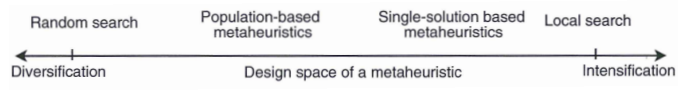

**Reprezentace (Kódování / Encoding):** Způsob, jakým je řešení reálného problému v algoritmu zakódováno, zásadně určuje 
velikost prohledávacího prostoru a výpočetní složitost matematických operátorů.
* **Lineární reprezentace:** Využívá řetězce symbolů.
    * *Binární kódování (Binary encoding):* Každá rozhodovací proměnná nabývá hodnoty $s_i \in \{0, 1\}$. Vhodné pro Problém batohu 
    (Knapsack problem), kde hodnoty indikují zařazení či nezařazení předmětu.
    * *Diskrétní kódování (Discrete encoding):* Zobecnění binárního kódování do konečných diskrétních domén. Vhodné pro alokaci zdrojů (vektor udává, kterému z $m$ agentů je přiřazena $i$-tá úloha). *Vektor `[2, 1, 3, 2, 1]` přiřazuje pěti nezávislým úlohám konkrétní ID agentů (1, 2 nebo 3), kteří je budou zpracovávat.*
    * *Reprezentace permutací (Permutation representation):* Každý prvek se v zápisu vyskytuje právě jednou. Modeluje sekvenční úlohy, 
    jako je Problém obchodního cestujícího (Traveling Salesperson Problem - TSP).*Vektor `[4, 1, 3, 2]` určuje přesné pořadí návštěvy čtyř měst na uzavřené okružní trase bez možnosti jakékoliv duplicity.*

* **Nelineární reprezentace (Non-linear representation):** Využívá složitější struktury, nejčastěji grafy nebo stromy (např. v 
genetickém programování).

**Redukce reprezentačního prostoru:** Vhodně zvolené kódování dokáže matematicky eliminovat zjevně neplatná řešení a výrazně 
zmenšit velikost prohledávaného prostoru ještě před spuštěním samotného výpočtu. Ukažme si to na příkladu rozmístění 8 šachových dam:
1. Kartézské pozice: Vektor souřadnic $s_i = (x_i, y_i) \rightarrow 64^8 \approx 2.81 \times 10^{14}$ možných stavů.
2. Jedna dáma na sloupec: Vektor řádkových pozic $(y_1, \dots, y_8)$, kde index fixuje sloupec $\rightarrow 8^8 = 16\,777\,216$ stavů.
3. Permutace: Zákaz sdílení stejného řádku omezuje prostor na čistou permutaci indexů $\rightarrow 8! = 40\,320$ stavů.

**Práce s omezeními (Constraint Handling):** Reálné optimalizační úlohy obsahují omezující podmínky. Pokud algoritmus vygeneruje 
nepřípustné řešení, uplatňují se následující strategie. 
* *Reject strategie (Reject strategy)* generuje a udržuje striktně pouze přípustná 
řešení a jakýkoli nepřípustný krok okamžitě zahazuje. *Přidání dalšího zákazníka na trasu kamionu by překročilo jeho maximální kapacitu 10 tun, takže je tento rozvrh okamžitě smazán a algoritmus musí zkusit jinou možnost.*
* *Penalizační strategie (Penalty strategy)* rozšiřuje prohledávací prostor 
i o nepřípustná řešení, ale hodnota účelové funkce je penalizována za každé porušené omezení. Váhy penalizací bývají vysoké, aby byl 
algoritmus směrován zpět do přípustné oblasti. *Rozvrh zkoušek, ve kterém profesor zkouší 6 hodin namísto povolených 4, se nezahodí, ale jeho výsledná kvalita se drasticky sníží o trestné body.*
* *Opravné strategie (Repair strategy)* aplikují specifickou opravnou heuristiku, která 
nepřípustné řešení transformuje na platný stav. *Pokud celková váha věcí v batohu překročí limit, specifické pravidlo začne ty nejméně hodnotné předměty z batohu vyhazovat, dokud se hmotnost nedostane do povolené normy.*

**Účelová funkce (Objective Function):** Účelová funkce přiřazuje každému stavu číselné hodnocení, které definuje kvalitu řešení 
a určuje směr prohledávání. Může být *samospustitelná (self-sufficient)*, kdy původní matematické kritérium problému lze přímo použít 
pro optimalizaci (např. minimalizace celkové ujeté vzdálenosti v kilometrech u TSP). Pokud je původní vyhodnocení pouze typu True/False 
(např. u splnitelnosti logických formulí SAT), využívá se funkce *naváděcí (guiding)*. Ta se transformuje tak, aby poskytovala jemnější 
gradient pro lokální prohledávání (např. maximalizace počtu aktuálně splněných klauzulí u $k$-SAT).

**Ukončovací kritéria (Stopping criteria):** Každá metaheuristika (jak s jedním řešením, tak populační) vyžaduje jasně definovanou podmínku pro ukončení výpočetního cyklu. Tato kritéria dělíme na dvě hlavní skupiny:
* *Statické procedury (Static procedure):* Konec prohledávání je znám předem (*a priori*). Výpočet se zastaví po dosažení fixního parametru – např. po pevném počtu iterací, vyčerpání stanoveného času procesoru (CPU limit), nebo po dosažení maximálního počtu vyhodnocení účelové funkce.
* *Adaptivní procedury (Adaptive procedure):* Konec prohledávání závisí na aktuálním průběhu výpočtu a nelze ho určit předem. Algoritmus končí, pokud nastane specifický stav – např. uplyne fixní počet iterací bez jakéhokoli zlepšení (stagnace), je dosaženo optimální/uspokojivé hodnoty, nebo dojde k kritickému poklesu diverzity v populaci.

---

## Lokální prohledávání

Pokud není známá globální struktura stavového prostoru, využívá se lokální prohledávání. Algoritmus začíná v jednom kompletním 
počátečním bodě a samostatně se posouvá do bezprostředního okolí, dokud nenarazí na lokální optimum, ze kterého už žádná cesta 
ke zlepšení nevede. Základním typem je **Hill Climbing (Horolezecký algoritmus)**, který pracuje nad jedním kompletním řešením:

```pascal
s := s0; // Vygenerování počátečního řešení s0
while stopping condition not satisfied do
    generate(N(s)); // Vygenerování kandidátních sousedů z okolí N(s)
    if no better neighbor exist then 
        terminate; // Dosaženo lokální optimum
    s := s'; // Náhrada aktuálního stavu lepším sousedem s' ∈ N(s)
end while
```

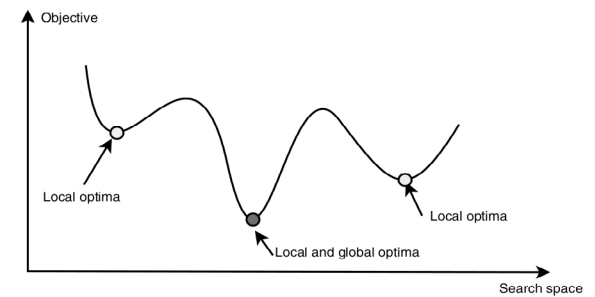

$S$ je stavový prostor (množina všech řešení), $s, s'$ jsou konkrétní stavy, $N(s)$ představuje 
okolí stavu $s$, $d(s, s')$ je vzdálenost mezi stavy, $\epsilon$ je poloměr okolí, $f(s)$ značí hodnotu účelové funkce a $\Delta f$ 
je její diferenční změna.

**Strategie výběru souseda:** Při generování okolí aktuálního stavu určuje tato strategie způsob výběru kandidáta pro následující krok:
* *Best improvement (Steepest descent):* Prohledá kompletně celé dostupné okolí a vybere souseda, který přináší největší možné zlepšení. 
Pro rozsáhlá okolí je tato strategie časově velmi náročná.
* *First improvement:* Prochází okolí sekvenčně a okamžitě vybere prvního nalezeného souseda, který zlepšuje aktuální stav. Výrazně 
zrychluje výpočetní čas jedné iterace.
* *Random selection:* Náhodně vybere menší vzorek sousedů a z nich zvolí stav, který aktuální situaci nejvíce vylepší.

**Koncepty okolí (Neighborhood) a lokální optimum:** Funkce okolí $N$ přiřazuje každému řešení $s \in S$ množinu sousedních řešení 
na základě definovaného přechodového operátoru (*move operator*): $N(s) = \{s' \in S \mid d(s', s) \le \epsilon\}$. Řešení je 
*lokálním optimem* vzhledem k okolí $N$, pokud žádný z jeho sousedů nemá lepší hodnotu účelové funkce. Pro minimalizační problém platí: 
$$f(s) \le f(s') \quad \forall s' \in N(s)$$

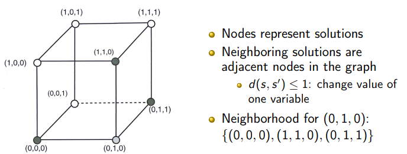

U permutačních problémů využíváme *poziční okolí* založené na operátoru vkládání (**insertion** – prvek se vyjme a vloží na jinou pozici) 
nebo *pořadové okolí* využívající operátor výměny (**swap/exchange** – prohození dvou prvků) či otočení podsekvence (**inversion**). 
U Problému obchodního cestujícího (TSP) definujeme okolí jako $k$-distance (výměna pozic $k$ měst, kde pro $2$-distance je velikost 
okolí $\frac{n(n - 1)}{2}$) nebo $k$-opt (odstranění $k$ hran a jejich nahrazení jinými tak, aby vznikla nová platná okružní cesta, 
kde pro $2$-opt je velikost okolí rovna $\left[\frac{n(n - 1)}{2} - n\right]$ ).


**Inkrementální vyhodnocování okolí (Incremental Evaluation):** Výpočet hodnoty účelové funkce od nuly pro každého kandidáta v okolí 
je výpočetně velmi náročný. Efektivní algoritmy implementují inkrementální vyhodnocení pomocí výpočtu pouhé diferenční změny $\Delta f$. 
Například u 2-opt u TSP se namísto sčítání délky celé trasy spočítá pouze rozdíl způsobený odebráním starých hran a přidáním nových: 
$$\Delta f = \text{dist}(A, E) + \text{dist}(C, D) - \text{dist}(A, D) - \text{dist}(C, E) \implies f(s') = f(s) + \Delta f$$

**Iterované lokální prohledávání (ILS):** Základní algoritmus Hill Climbing uvízne v prvním dosaženém lokálním optimu. Pro pokračování 
v prohledávání se používají techniky restartu. *Multistart local search* provádí opakované spouštění z nových, zcela náhodně vygenerovaných 
počátečních řešení (dochází ke ztrátě informací). *Iterated Local Search (ILS)* staví na historii; na nalezené lokální optimum aplikuje 
cílené strukturální narušení (**perturbaci**) a z tohoto modifikovaného stavu spustí nové lokální prohledávání. Perturbace musí být 
dostatečně velká pro únik z lokálního optima, ale zároveň přiměřeně malá, aby se neztratila cenná informace z dosavadního průběhu.

```pascal
s = s0; s* = local_search(s); // Dosažení prvního lokálního optima
repeat
    s' = perturb(s*, search_history); // Aplikace perturbace
    s'_* = local_search(s'); // Lokální prohledávání z narušeného stavu
    s* = accept(s*, s'_*, search_memory); // Akceptační kritérium
until stopping_criteria;
```

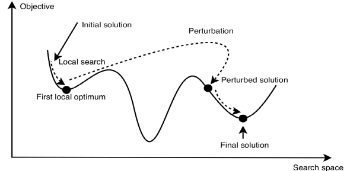

---

## Metaheuristiky s jedním řešením

Pokročilé metody s jedním řešením umožňují průběžný únik z lokálních optim tím, že za určitých podmínek dovolují přechod na horší 
sousední stav, čímž rozšiřují pole působnosti algoritmu.

$T$ představuje globální parametr teploty, $\Delta f$ značí míru zhoršení účelové funkce ( $f(s') - f(s)$ ), 
$D$ je pevná prahová odchylka a `LEVEL` představuje aktuální výšku hladiny (strop).

**Simulované žíhání (Simulated Annealing - SA):** Stochastická metaheuristika inspirovaná procesem ochlazování kovů v metalurgii. 
Zlepšující krok je přijat vždy. Horší krok je přijat stochasticky s pravděpodobností: $P(\text{přijetí}) = e^{-\frac{\Delta f}{T}}$. 
Teplota $T$ se v čase postupně snižuje; na začátku je vysoká (vysoká diversifikace), na konci konverguje k nule (čistá intenzifikace).

**Record-to-record travel (RRT):** Deterministická metaheuristika odvozená od simulovaného žíhání. Algoritmus si udržuje hodnotu 
historicky nejlepšího nalezeného řešení (`RECORD`). Nové náhodně vygenerované sousední řešení $s'$ je akceptováno, pokud jeho hodnota 
nepřekročí stávající rekord o více než pevně stanovenou prahovou odchylku $D > 0$: $f(s') < \text{RECORD} + D$.

**Algoritmus Velké potopy (Great Deluge - GD):** Deterministická metaheuristika založená na analogii s hledačem cesty, 
který se snaží před stoupající vodou unikat na co nejvyšší vrcholy. V této maximalizační verzi představuje parametr `LEVEL` 
průběžně stoupající minimální povolený práh účelové funkce. Každé nové náhodné řešení $s'$ je akceptováno pouze tehdy, 
pokud je jeho hodnota (zisk/skóre) vyšší než tato aktuální hladina ($f(s') > \text{LEVEL}$). Hladina se v každém kroku zvyšuje 
(`LEVEL = LEVEL + UP`), což ke konci výpočtu nutí algoritmus přijímat už jen ta nejkvalitnější řešení.

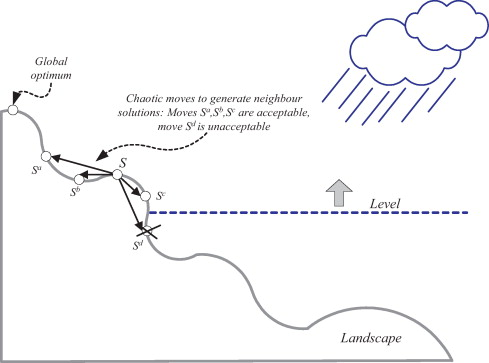

**Zakázané prohledávání (Tabu Search - TS):** Deterministická metoda využívající paměťové struktury. V každé iteraci vybere nejlepšího 
přípustného souseda ze všech dostupných, i když přináší zhoršení účelové funkce. *Tabu list* je FIFO fronta uchovávající atributy posledních 
provedených tahů (např. prohozené dvojice prvků u TSP). Tyto atributy jsou po určitý počet iterací zakázané, což brání zacyklení výpočtu. 
*Aspirační kritérium (Aspiration criterion)* představuje podmínku umožňující ignorovat tabu status, nejčastěji pokud daný tah vede na 
řešení lepší než dosavadní historické maximum ( $f(s') < f(s_{best})$ ).

**Prohledávání s velmi velkým okolím (Very Large-Scale Neighborhood Search - VLNS):** Využívá se, pokud velikost okolí roste exponenciálně 
nebo jako vysoký polynom. Cílem je najít zlepšujícího souseda efektivně bez kompletní enumerace.
Od klasického lokálního prohledávání se liší tím, že místo postupného procházení malých změn (např. prohození 2 měst u TSP) 
mění obrovské části řešení naráz (např. 30 měst) a k nalezení zlepšení využívá chytřejší algoritmy namísto kompletní enumerace všech sousedů.

* *Vyhazovací řetězce (Ejection chains):* Sekvence lokálních opravných operací (přesunů). První krok odstraní aktuální defekt (porušení omezení), 
ale vyvolá vznik sekundárního defektu. Následující krok opraví ten sekundární, přičemž vyvolá terciární. Řetězec úspěšně končí, když se 
defekt v nějakém kroku zcela eliminuje bez generování nového.

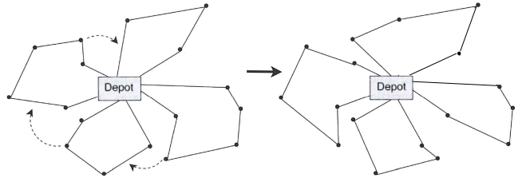

* *Large Neighborhood Search (LNS):* Metaheuristika založená na opakované destrukci (**Destroy**) a následné opravě (**Repair**) aktuálního řešení. Algoritmus záměrně znehodnotí část aktuálního stavu (odebere přiřazení podmnožiny rozhodovacích proměnných) a následně ji rekonstruuje výhodnějším způsobem. 

    * **Míra destrukce (Degree of destruction):** Klíčový parametr určující velikost okolí (zpravidla závislý na velikosti instance). Pokud je smazaná část *příliš malá*, algoritmus má problém efektivně prozkoumat prostor a uniknout z lokálních optim. Pokud je *příliš velká*, LNS degraduje na neefektivní *multistart local search*. V praxi se proto míra destrukce buď volí náhodně z určitého rozsahu, nebo se v průběhu výpočtu postupně zvyšuje.

    * **Metody destrukce (Destroy):**
        * *Random removal:* Náhodné odebrání proměnných/entit (jednoduché, vysoká diverzifikace).
        * *Worst-case removal:* Odebrání prvků s nejhorším příspěvkem k účelové funkci (např. vyřazení nejdražších tras v logistice).
        * *Shaw removal:* Odebrání prvků, které jsou si vzájemně podobné (geometricky, časově či strukturálně). Myšlenkou je, že podobné entity lze při následné opravě nejsnáze prohodit a najít lepší kombinaci. *Příklad:* **Skládání krabic do prostoru (3D Bin Packing)** – vyjmeme krabice podobných rozměrů umístěné blízko sebe, abychom je v daném rohu palety poskládali těsněji a bez mezer. V **plánování tras (VRP)** takto odebereme zákazníky, kteří jsou blízko sebe a mají podobná časová okna.

    * **Metody opravy (Repair):** Hledají nové optimální přiřazení pro uvolněné proměnné. Exaktní oprava bývá výpočetně neúnosná, proto se volí heuristiky:
        * *Greedy insertion:* Vkládání entit na jejich lokálně nejlepší pozice.
        * *Regret insertion:* Upřednostňuje entity s nejvyšší hodnotou „lítosti“ (*regret*) – tedy ty, které vykazují největší bodovou ztrátu (skóre) mezi svým prvním (nejlepším) a druhým nejlepším možným umístěním. Algoritmus tuto entitu zařadí na její nejlepší pozici prioritně, aby v dalších krocích nelitoval, že mu toto slibné místo obsadil někdo jiný.

    * **Akceptace (Acceptance):** Nově zrekonstruované řešení je přijato buď čistě deterministicky (pouze pokud přináší zlepšení), nebo stochasticky (přijímají se i horší stavy pro únik z lokálního optima, např. podle šablony simulovaného žíhání).

```pascal
s := initialSolution; s_best := initialSolution;
repeat
    s' := s;
    destroy part of s' using a destroy heuristic;
    repair s' using a repair heuristic;
    if f(s') < f(s_best) then s_best := s';
    if accept(s', s) then s := s';
until stopping_criteria_satisfied;
return s_best;
```

* *Variable Neighborhood Search (VNS):* Strategie postavená na systematické změně struktur okolí během prohledávání. *Variable Neighborhood Descent (VND)* je čistě deterministická verze, která prohledává řadu okolí $N_1, N_2, \dots$ sekvenčně. Při nalezení zlepšení se vrací k $N_1$, při selhání 
přechází na širší strukturu okolí ($N_{l+1}$). *Basic VNS* kombinuje stochatickou fázi „třesení“ (**shaking**) pro únik ze stávajícího lokálního 
minima s následným intenzivním lokálním prohledáváním (nejčastěji pomocí VND).

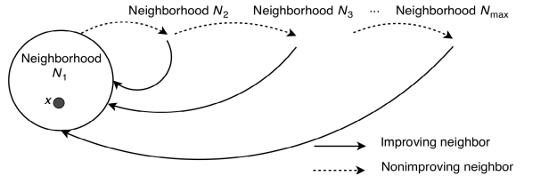

Jednotlivé metody s jedním řešením lze efektivně kombinovat (hybridizovat) pro dosažení rovnováhy 
mezi diversifikací a intenzifikací. Typickým příkladem je ALNS (Adaptive Large Neighborhood Search), kde algoritmus provádí velké skoky pomocí fází destrukce a opravy (LNS), ale o stochastickém přijetí výsledného řešení rozhoduje kritérium simulovaného žíhání.

---

## Populační metaheuristiky

Na rozdíl od metod s jedním řešením pracují populační metaheuristiky (Population-based metaheuristics) s celou množinou (populací) 
kandidátních řešení současně. To jim umožňuje efektivně diversifikovat prohledávání stavového prostoru a snižovat riziko uvíznutí 
v lokálním optimu.

Podle charakteru vnitřní interakce se populační algoritmy dělí do dvou hlavních kategorií:
* **Založené na evoluci (Evolution-based):** Jedinci z aktuální populace jsou přímo vybráni a reprodukováni pomocí biologicky 
inspirovaných operátorů (křížení, mutace). Dochází k přenosu a míchání genetické informace konkrétních jedinců (např. Genetické 
algoritmy, Evoluční strategie).
* **Založené na sdílené paměti (Blackboard-based):** Jedinci přímo nereprodukují své řetězce, ale svými vlastnostmi přispívají do 
společně sdílené paměti. Nová populace kandidátů se v dalším kroku generuje čistě na základě aktuálního stavu této sdílené paměti 
(např. feromonová matice u optimalizace mravenčí kolonou).

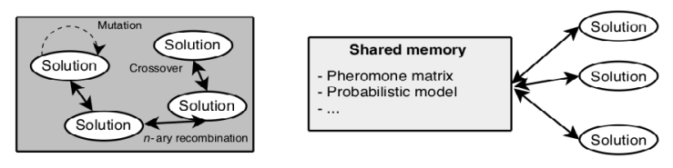

Kvalita výpočtu silně závisí na inicializaci populace. *Náhodné generování* je jednoduché, ale pro silně omezené problémy je náročné 
nalézt platné počáteční stavy. *Sekvenční či paralelní diversifikace* umisťuje jedince cíleně tak, aby maximalizovala jejich vzájemnou 
vzdálenost a pokryla co největší plochu prostoru, což však přináší **vysokou výpočetní složitost** (u paralelního přístupu může být vygenerování diverzifikované populace stejně obtížné jako vyřešení původního problému samotného). 
*Heuristická inicializace* předvyplní populaci výsledky rychlých lokálních algoritmů, 
což urychlí start, ale zvyšuje riziko předčasné ztráty diverzity.

---

## Evoluční algoritmy

Evoluční algoritmy (Evolutionary Algorithms - EA) modelují optimalizační proces jako digitální simulaci biologické evoluce, 
postavené na přírodním výběru a přežití nejsilnějších (*survival of the fittest*). 

**Reprezentace a názvosloví:**
* **Populace (Population):** Množina kandidátních řešení běžících v algoritmu současně (typicky v rozsahu 20–100 jedinců).
* **Chromozom / Jedinec (Chromosome / Individual):** Konkrétní zakódované řešení problému.
* **Gen (Gene):** Jedna rozhodovací proměnná v rámci řešení (konkrétní pozice/prvek v řetězci chromozomu - název proměnné nebo index v poli).
* **Alela (Allele):** Konkrétní hodnota dané rozhodovací proměnné (hodnota přiřazená genu - proměnné).

*Příklad (Přiřazení zaměstnanců na 4 dny): Máme-li konkrétní řešení ve tvaru vektoru **`[3, 1, 4, 1]`**:*
* *Chromozom: Celý řetězec `[3, 1, 4, 1]` představující jeden kompletní rozvrh.*
* *Gen: Konkrétní pozice v poli (např. 3. pozice vyjadřující 3. pracovní den).*
* *Alela: Hodnota zapsaná na této pozici (číslo `4` značící, že 3. den má službu zaměstnanec ID 4).*

**Hlavní větve evolučních výpočtů:**
* *Genetické algoritmy (Genetic Algorithms - GA):* Původně navržené pro binární řetězce. Kladou hlavní důraz na operátor křížení nad 
dvěma rodiči, zatímco mutace slouží pouze jako sekundární operátor pro udržení diverzity. Pracují s fixními pravděpodobnostmi $p_c$ a $p_m$.
* *Evoluční strategie (Evolution Strategies - ES):* Vyvinuty primárně pro kontinuální optimalizaci a vektory reálných čísel. Křížení je 
méně časté, hlavní evoluční pohon zajišťuje mutace. Používají striktní elitářské nahrazování. U strategií $(\mu + \lambda)$-ES se nová 
generace vybírá ze spojené a setříděné množiny rodičů i potomků dohromady. U verzí $(\mu, \lambda)$-ES se nová generace vybírá striktně 
pouze z řad potomků, rodiče bezpodmínečně vymírají (vhodné pro dynamická prostředí).
* *Genetické programování (Genetic Programming - GP):* Jedinci jsou přímo vykonatelné programy reprezentované nelineárně pomocí stromových 
grafových struktur (např. symbolická regrese, kde je cílem nalézt matematický vzorec nejlépe odpovídající naměřeným datům).

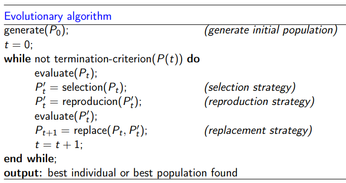

$\mu$ značí počet rodičů v populaci, $\lambda$ je počet potomků, $p_c$ představuje pravděpodobnost 
křížení, $p_m$ je pravděpodobnost mutace, $f_i$ vyjadřuje zdatnost (fitness) $i$-tého jedince a $p_i$ je pravděpodobnost jeho výběru.

**Strategie výběru rodičů:** Selekční tlak určuje, jakým způsobem jsou upřednostňováni zdatnější jedinci před slabšími při výběru rodičů.
* *Ruletový výběr (Roulette wheel selection):* Pravděpodobnost výběru jedince je přímo úměrná jeho fitness vůči sumě fitness celé populace: 
$p_i = f_i / \sum f_j$. Pokud se v populaci objeví jeden dominantní jedinec, strategie ho volí opakovaně, což vede k rychlému zaplavení 
populace jeho kopiemi a k předčasné konvergenci (premature convergence).
* *Stochastické univerzální vzorkování (Stochastic Universal Sampling - SUS):* Používá pomyslné ruletové kolo s více rovnoměrně rozmístěnými 
ukazateli. Jedním roztočením vybere celou sadu rodičů naráz, což dává stabilnější selekční tlak a šanci i slabším jedincům.
* *Turnajový výběr (Tournament selection):* Náhodně vybere $k$ jedinců z populace, kteří mezi sebou porovnají fitness. Vítěz turnaje se stává 
rodičem. Proces se nezávisle opakuje $\mu$-krát, přičemž velikost turnaje $k$ přímo řídí sílu selekčního tlaku.
* *Výběr podle pořadí (Rank-based selection):* Jedinci se seřadí podle výkonnosti a pravděpodobnost se počítá z jejich pořadového indexu (ranku), 
nikoli z absolutní hodnoty fitness. Tím se eliminuje vliv extrémních rozdílů ve fitness hodnotách.

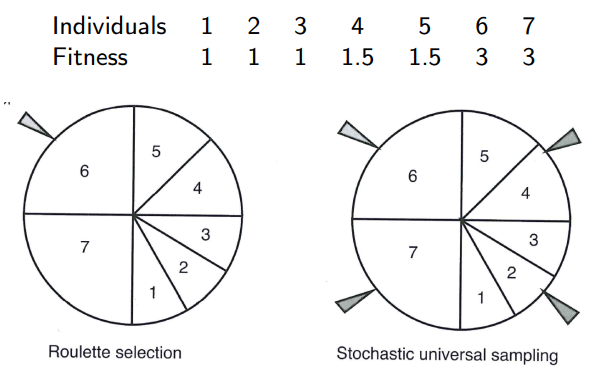

**Reprodukční strategie:** Genetické operátory (křížení a mutace) zajišťují vznik nového potomstva prostřednictvím kombinace a drobných úprav genetické informace rodičů.
* *Křížení lineárních řetězců (Linear crossover):* Kombinuje genetickou informaci dvou rodičů s pravděpodobností $p_c \in [0.45, 0.95]$. 
Používá se jednobodové, vícebodové nebo uniformní křížení, kde se o každém genu potomka rozhoduje nezávisle s 50% pravděpodobností.
* *Pořadové křížení (Order Crossover - OX):* Specifická metoda pro permutační křížení. Standardní metody by u permutací způsobily duplicitu prvků, OX proto zachovává vybraný souvislý úsek od prvního rodiče a zbytek pozic doplní z druhého rodiče cyklicky bez vzniku duplicit.
* *Mutace (Mutation):* Představuje malé stochastické narušení jednoho jedince. Pravděpodobnost se záměrně nastavuje nízko, typicky $p_m \approx 1/k$, kde $k$ vyjadřuje celkový počet genů.

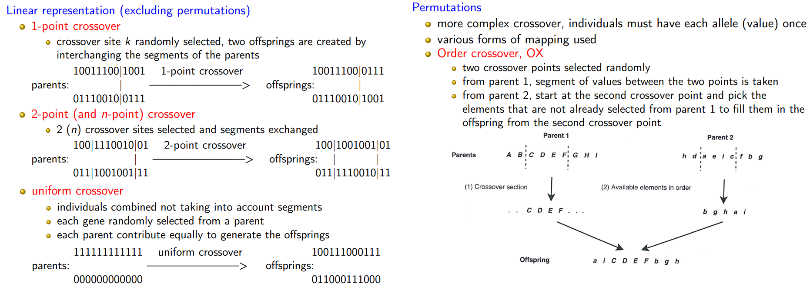

**Nahrazovací strategie:** Určují mechanismus a pravidla, podle kterých nově vytvoření potomci nahrazují stávající jedince v populaci pro další generaci.
* *Generační nahrazování (Generational replacement):* Strategie, při které nově vzniklí potomci kompletně nahradí celou původní generaci rodičů.
* *Ustálený stav (Steady-state):* Konzervativní přístup, kde noví potomci v populaci nahradí pouze vybrané nejhorší jedince, zatímco zbytek populace zůstává.
* Mezi těmito extrémy existuje řada schémat:
    * *Nahrazování pevného počtu jedinců:* Nahrazuje se přesně definovaný počet $\lambda$ jedinců v populaci o velikosti $\mu$ (kde $1 < \lambda < \mu$).
    * *Elitářství (Elitism):* Strategie, která vybírá ty nejlepší jedince napříč populací rodičů i potomků dohromady. Zajišťuje, že o nejkvalitnější řešení nepřijdeme, což sice urychluje konvergenci, ale zvyšuje riziko předčasného uvíznutí (premature convergence) v lokálním optimu.
---

## Inteligence hejna

Subdisciplína inspirovaná kolektivním, decentralizovaným chováním sociálně žijících biologických druhů. Systémy se skládají z velkého 
množství jednoduchých agentů bez centrálního řízení. Komunikace probíhá lokálně a nepřímo prostřednictvím modifikace okolního 
prostředí – tento jev se označuje jako **stigmergie (stigmergy)**.

$\tau_{ij}$ představuje množství feromonu na hraně mezi uzly $i$ a $j$, $\rho$ je koeficient odpařování feromonu, 
$\Delta$ značí přírůstek feromonu, $p_{ij}$ je pravděpodobnost přechodu z uzlu $i$ do $j$, $\eta_{ij}$ vyjadřuje lokální viditelnost uzlu $j$ 
($1/d_{ij}$), $d_{ij}$ je fyzická vzdálenost hran a $\alpha, \beta$ jsou parametry určující relativní vliv feromonu a viditelnosti.

**Optimalizace mravenčí kolonou (Ant Colony Optimization - ACO)** simuluje vyhledávání nejkratší cesty mezi mraveništěm a zdrojem potravy 
pomocí vylučování chemické stopy – feromonu. Feromon se v čase přirozeně odpařuje. Na kratší trati se mravenci otočí rychleji, feromonová 
stopa se tam vrství intenzivněji a vyšší koncentrace následně přitahuje další mravence.
* Odpařování: Provádí se plošně na všech hranách optimalizačního grafu, což umožňuje únik z lokálních optim: 
$$\tau_{ij} = (1 - \rho)\tau_{ij}$$
* Posílení: Přidání feromonu na hrany. Nejčastější je *offline aktualizace* na konci generace, kdy se posílení provede pouze na hranách, které tvoří nejlepší nalezenou trasu dané iterace (případně historicky nejlepší trasu):

$$
\tau_{ij} = \tau_{ij} + \Delta \quad \forall (i, j) \in \text{best-iteration-solution}
$$

Při aplikaci na Problém obchodního cestujícího (TSP) si mravenec v uzlu $i$ vybírá následující město $j$ z množiny dosud nenavštívených měst 
$S$ na základě kombinace feromonové stopy a lokální viditelnosti $\eta_{ij} = 1/d_{ij}$:
$$p_{ij} = \frac{\tau_{ij}^\alpha \times \eta_{ij}^\beta}{\sum_{k \in S} \tau_{ik}^\alpha \times \eta_{ik}^\beta}$$
Explicitní parametry $\alpha$ a $\beta$ definují relativní váhu obou složek. Pokud je $\alpha = 0$, algoritmus se chová jako čistě stochastické 
greedy prohledávání podle geografické blízkosti.

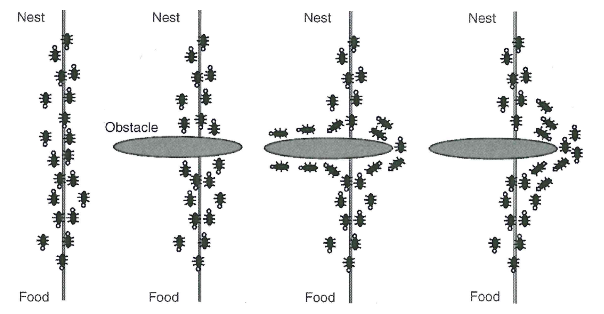

Kromě ACO existují i další algoritmy inteligence hejna, jako je **PSO (Particle Swarm Optimization)** 
inspirovaný chováním ptačích hejn, kde se částice v kontinuálním prostoru pohybují na základě 
své setrvačnosti a kombinace vlastního a globálního historického maxima roje. 
Dalším významným zástupcem je **ABC (Artificial Bee Colony)** modelující včelí kolonii, 
která rozděluje agenty na dělnice prohledávající lokální okolí, diváky posilující slibné 
zdroje nektaru a průzkumníky zajišťující diversifikaci náhodným hledáním nových řešení.

---

## Plánování

Klasické prohledávání stavového prostoru nebere v úvahu **sémantiku akcí** – operátory přechodu považuje za neprůhledné „černé skříňky“ a slepě generuje uzly bez znalosti vnitřní logiky kroků. Automatické plánování (Automated Planning) dává agentovi schopnost uvažovat o vnitřní struktuře a budoucích důsledcích svého chování na základě explicitního modelu světa, což umožňuje doménově nezávislým algoritmům porozumět významu akcí (jejich předpodmínkám a efektům) a efektivně nalézt optimální posloupnost kroků pro dosažení cíle.

Formálně je plánovací prostředí modelováno jako stavový transformační systém o čtyřech prvcích: 
$$\Sigma = (S, A, E, \gamma)$$

$\Sigma$ představuje stavový transformační systém, $S$ je rekurzivně spočetná množina stavů, $A$ značí rekurzivně spočetnou množinu akcí pod kontrolou plánovače, $E$ je rekurzivně spočetná množina vnějších událostí a $\gamma$ vyjadřuje přechodovou funkci.

V rámci tohoto systému rozlišujeme dva typy přechodových prvků:
* **Akce ($A$):** Změny stavu, které jsou plně pod kontrolou plánovače (jejich součástí je i prázdná akce `no-op`).
* **Události ($E$):** Vnější vlivy okolního prostředí, které plánovač nedokáže kontrolovat (jejich součástí je neutrální událost $\epsilon$).

Změnu stavu realizuje přechodová funkce $\gamma$, přičemž akce a události mohou být aplikovány buď samostatně, nebo společně:
$$\gamma: S \times A \times E \rightarrow 2^S \quad \text{případně} \quad \gamma: S \times (A \cup E) \rightarrow 2^S$$

Plánovací úloha hledá posloupnost kroků vedoucí z počátečního stavu do cíle, přičemž cíl může být definován jako koncový stav, omezení nad trajektorií stavů nebo optimalizace účelové funkce (celkový čas trvání, finanční náklady).

---

## Reprezentace problému

Aby bylo možné plánovací problémy řešit univerzálními, doménově nezávislými algoritmy, je nutné zavést formální reprezentaci stavů 
a akcí. Klasický přístup staví na **predikátové logice**, která se od výrokové logiky liší tím, že namísto práce s nedělitelnými True/False výroky dokáže reprezentovat konkrétní objekty, proměnné a vztahy mezi nimi (predikáty), což umožňuje vytvářet univerzální parametrické šablony akcí (např. koncept STRIPS).

Tyto predikáty se v konkrétních stavech projevují jako **atomy** (*Příklad atomu: `at(truck1, brno)` – vyjadřuje konkrétní fakt, že kamion s ID `truck1` se nachází v uzlu `brno`.*). Aby mohl plánovač logicky odvozovat, definuje stav jako konečnou množinu plně instanciovaných atomů (neobsahuje volné proměnné). 
*Fluenty (Fluents)* jsou atomy, jejichž pravdivostní hodnota se v závislosti na akcích mění (např. `at(robot, location)`). *Rigidní atomy (Rigid atoms)* jsou konstantní a nezávislé na stavu systému (např. `adjacent(loc1, loc2)`). Při vyhodnocování platí **Předpoklad uzavřeného světa (Closed World Assumption - CWA)** – jakýkoli atom, který není explicitně uveden v popisu daného stavu, je považován za nepravdivý.

**Plánovací operátor ($o$):** Parametrická šablona definovaná jako trojice $(\text{name}(o), \text{precond}(o), \text{effects}(o))$. Název obsahuje proměnné, 
předpodmínky určují literály nutné pro spuštění a efekty definují změny po provedení. Jakmile proměnné v operátoru nahradíme konkrétními objekty 
z domény, vzniká plně instanciovaná **akce ($a$)**.

Předpodmínky i efekty každé akce $a$ se interně dělí na **pozitivní** ($^+$) a **negativní** ($^-$):
* $\text{precond}^+(a)$ / $\text{precond}^-(a)$: Literály, které ve stavu musí platit / nesmí platit.
* $\text{effects}^+(a)$ / $\text{effects}^-(a)$: Atomy, které se do stavu nově přidají / ze stavu vymažou.

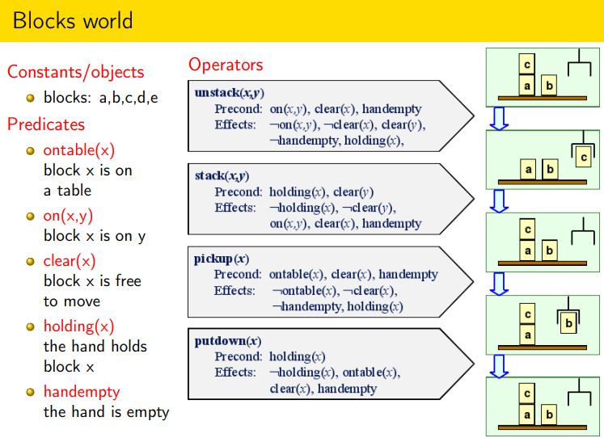

Akce je aplikovatelná na stav $s$, pokud platí: $\text{precond}^+(a) \subseteq s \ \land \ \text{precond}^-(a) \cap s = \emptyset$. Výsledný stav po aplikaci 
akce definuje přechodová funkce jako odebrání negativních a přidání pozitivních efektů: 
$$\gamma(s, a) = (s \setminus \text{effects}^-(a)) \cup \text{effects}^+(a)$$

**Sestavení plánovacího úkolu:** Celé prostředí se striktně dělí na obecná pravidla světa a konkrétní instanci zadání:
* **Doménový model ($O$):** Popisuje neměnnou „fyziku“ světa – definuje typy objektů, povolené predikáty a šablony parametrických operátorů $o$ bez vazby na konkrétní situaci.
* **Plánovací problém $P = (O, s_0, g)$:** Definuje konkrétní instanci zadání, která bere doménový model $O$, doplňuje do něj reálné objekty, definuje výchozí konfiguraci prvků jako počáteční stav $s_0$ a stanovuje cílové literály $g$. 

Výsledný *plán* $\pi$ je pak uspořádaná sekvence plně instanciovaných akcí, jejíž sekvenční aplikace na počáteční stav $s_0$ vede do množiny cílových stavů: 
$$\gamma(s_0, \pi) \in S_g$$

Pro kódování klasických plánovacích úloh se využívá standardizovaný formální jazyk **PDDL (Planning Domain Definition Language)**. Ten striktně 
odděluje fyzikální vlastnosti světa (*Domain File* – typy objektů, predikáty a akce) od konkrétního zadání (*Problem File* – objekty, výchozí stav 
`:init` a cílové podmínky `:goal`).

```lisp
;; Ukázka z Domain souboru (Gripper)
(:action move
   :parameters (?x ?y)
   :precondition (and (ROOM ?x) (ROOM ?y) (at-robby ?x))
   :effect (and (at-robby ?y) (not (at-robby ?x))))

;; Ukázka z Problem souboru (Gripper)
(:init (ROOM rooma) (ROOM roomb) (at-robby rooma) (at-ball ball1 rooma))
(:goal (at-ball ball1 roomb))
```

---

## Plánování se stavovým prostorem

Při plánování se stavovým prostorem (State Space Planning) představují uzly prohledávacího stromu konkrétní stavy světa a hrany 
reprezentují přechody realizované aplikací akcí. Cílem je vyhledat propojení mezi startem a cílem.

$s_0$ vyjadřuje počáteční stav, $g$ značí cíl plánování, $a$ je akce a $\gamma^{-1}(g, a)$ představuje regresní množinu (nový podcíl).

**1. Dopředné plánování (Forward Planning / Progression):** Algoritmus začíná v počátečním stavu $s_0$ a rozbaluje strom směrem dopředu k cíli 
aplikací všech akcí, které jsou v daném uzlu proveditelné. Je korektní a úplné. Hlavním úskalím je velký faktor větvení (branching factor) 
– počáteční stav může generovat množství aplikovatelných akcí nesouvisejících s cílem. V reálných plánovačích se proto dopředné prohledávání 
kombinuje s algoritmem $A^*$, pokročilými doménově nezávislými heuristikami a detekcí duplicitních stavů.
*Např.: Řízení autonomního vozidla na křižovatce. 
Počáteční stav je dokonale znám (přesná pozice auta, rychlost, semafor). 
Počet možných akcí v daný moment je velmi malý (jet rovně, odbočit, brzdit). 
Dopředný plánovač dokáže bleskově nasimulovat několik kroků dopředu a vybrat bezpečnou trajektorii. 
Zpětné plánování by zde selhalo, protože cíl („bezpečně projet“) je příliš obecný a pozpátku by 
generoval miliony teoretických kombinací stavů silnice.*

**2. Zpětné plánování (Backward Planning / Regression):** Startuje od popisu cíle $g$ a postupuje pozpátku k počátečním stavům vytvářením 
podcílů. V každém kroku vybere pouze takovou akci, která je pro aktuální cíl relevantní ($g \cap \text{effects}(a) \neq \emptyset$ a efekty 
nejsou v přímém konfliktu s cílem). Výsledkem je regresní množina, která reprezentuje nový podcíl: 
$$\gamma^{-1}(g, a) = (g \setminus \text{effects}(a)) \cup \text{precond}(a)$$
Zpětný přístup vykazuje menší faktor větvení než dopředné plánování, protože vůbec neuvažuje irelevantní akce, ale vyžaduje striktní 
implementaci detekce cyklů na prohledávané větvi. 
*Např.: Globální logistika se 100 kamiony po celé Evropě, kde je cílem doručit jeden jediný balík z Brna do 
Prahy. Zpětné plánování vyjde z cíle `at(balík, praha)` a okamžitě ví, že ho zajímá pouze akce 
`vyložit(balík)`. Zbytek světa a zbylých 99 kamionů úplně ignoruje. Dopředný plánovač by v počátečním 
stavu začal zbytečně simulovat pohyby všech kamionů po celé Evropě.*

**3. Částečně instanciované zpětné plánování (Lifted Backward Planning):** Tato technika odstraňuje zbytečné větvení zpětného plánování 
tím, že nedosazuje konstanty okamžitě, ale ponechává parametry akcí jako volné proměnné, dokud to není nutné. Využívá 
**MGU (Most General Unifier - nejobecnější unifikátor)**, což je minimální nutná substituce proměnných, která sjednotí atom v cíli s atomem v efektech operátoru. 
Tímto způsobem dokáže algoritmus v jednom kroku pokrýt celou sadu potenciálních objektů bez větvení stromu, výměnou za složitější 
správu unifikačních omezení. *Např.: Máme cíl doručit balík do Prahy: `at(balík1, praha)`. 
Standardní zpětné plánování by se větvilo pro každý jednotlivý kamion v doméně 
(akce `vylož(balík1, praha, kamion1)`, `vylož(balík1, praha, kamion2)`, atd.). 
Lifted přístup aplikuje MGU a vytvoří jedinou obecnou zpětnou akci `vylož(balík1, praha, ?kamion)`. 
Identita konkrétního kamionu zůstává otevřená proměnná `?kamion` a specifikuje se až v 
pozdějších krocích, kdy se prohledávání propojí s reálnou počáteční pozicí nějakého vozu.*

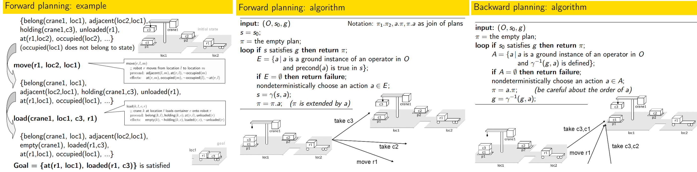

---

## Práce s neurčitostí

Čistě logické odvozování v reálném světě naráží na neúplnost informací a šum senzorů. Teorie pravděpodobnosti poskytuje exaktní matematický 
aparát pro reprezentaci neurčitosti, kvantifikaci rizika a optimální rozhodování.

$Y$ představuje dotazovanou proměnnou, $Z$ značí množinu skrytých proměnných, $z$ je konkrétní stav skrytých 
proměnných, $x, y$ vyjadřují konkrétní jevy a $P(x \mid y)$ je podmíněná pravděpodobnost jevu $x$ za předpokladu $y$.

* **Sdružená pravděpodobnostní distribuce (Joint probability distribution):** Tabulka pokrývající pravděpodobnosti všech možných kombinací 
stavů v doméně. Umožňuje odpovědět na jakýkoli dotaz, ale její velikost roste exponenciálně ($2^n$).
* **Marginalizace (Marginalization / Summing out):** Výpočet pravděpodobnosti menší množiny proměnných sečtením (integrováním) pravděpodobností 
přes všechny možné hodnoty ostatních (skrytých) proměnných $Z$: 
$$P(Y) = \sum_{z \in Z} P(Y, z)$$
* **Bayesův teorém (Bayes' theorem):** Základní vztah umožňující otočit směr podmínění, což je klíčové pro diagnostické systémy určující 
pravděpodobnost skryté příčiny na základě pozorovaných efektů: 
$$P(\text{příčina} \mid \text{efekt}) = \frac{P(\text{efekt} \mid \text{příčina}) \times P(\text{příčina})}{P(\text{efekt})}$$

---

## Bayesovské sítě

Plná sdružená distribuce je kvůli své velikosti v praxi nepoužitelná. Bayesovská síť (Bayesian Network) řeší tento problém tím, že 
explicitně reprezentuje vztahy podmíněné nezávislosti mezi náhodnými proměnnými pomocí grafu.

$X_i$ představuje náhodnou proměnnou (uzel v grafu), $\text{parents}(X_i)$ značí přímé rodiče uzlu $X_i$ 
a $x_i$ vyjadřuje konkrétní hodnotu proměnné.

Jedná se o **Orientovaný acyklický graf (Directed Acyclic Graph - DAG)**. Uzly představují náhodné proměnné a hrany vyjadřují přímou závislost. 
Každý uzel obsahuje vlastní **Tabulku podmíněné pravděpodobnosti (Conditional Probability Table - CPT)**, která definuje distribuci 
$P(X_i \mid \text{Parents}(X_i))$ vůči všem kombinacím hodnot jeho přímých rodičů. Hodnotu libovolného globálního stavu lze spočítat jako součin 
lokálních tabulek: 
$$P(x_1, \dots, x_n) = \prod_{i=1}^{n} P(x_i \mid \text{parents}(X_i))$$
Díky této dekompozici klesá paměťová náročnost z původních $2^n$ na pouhých $n \cdot 2^k$ parametrů (kde $k$ je maximální počet rodičů uzlu). 
Při stavbě sítě se doporučuje volit *kauzální směr* (od příčin k efektům) $\rightarrow$ vede k řídkým grafům s minimem hran. Diagnostické 
řazení (od efektů k příčinám) generuje hustě propojené sítě s mnoha redundantními závislostmi.

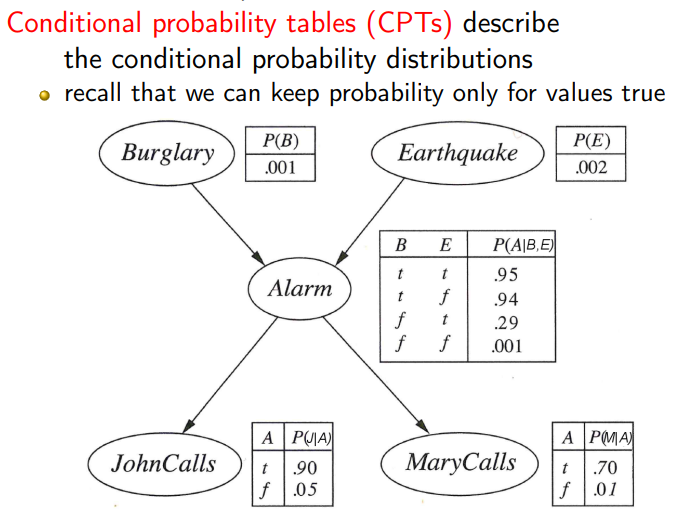

---

## Exaktní a aproximační odvozování

Odvozování (Inference) v Bayesovských sítích spočítá výslednou podmíněnou distribuci dotazované proměnné $X$ na základě pozorované evidence 
$e$, přičemž volné proměnné $Y$ jsou eliminovány marginalizací: 
$$P(X \mid e) = \alpha \sum_{y} P(X, e, y)$$

$X$ představuje dotazovanou proměnnou, $e$ značí pozorovanou pevnou evidenci, $Y$ vyjadřuje skryté proměnné 
určené k eliminaci, $y$ je konkrétní hodnota skrytých proměnných, $\alpha$ je normalizační konstanta a $w$ vyjadřuje přiřazenou váhu vzorku.


**1. Exaktní odvozování (Exact Inference):** Cílem exaktních metod je určit matematicky přesný výsledek distribuce.
* *Odvozování výčtem (Inference by enumeration):* Top-down rekurzivní procházení stromu možných stavů. Je neefektivní, protože opakovaně 
počítá identické podvýrazy v různých větvích.
* *Eliminace proměnných (Variable elimination):* Algoritmus založený na principu dynamického programování. Pravděpodobnostní tabulky (CPTs) 
jsou uvažovány jako matematické faktory (matice). Výpočet probíhá zdola nahoru pomocí operace bodového součinu souvisejících faktorů a následného 
vysčítání (eliminace) skrytých proměnných. Pro sítě s topologií stromu (poly-trees) je složitost lineární vůči velikosti sítě ( $O(n \cdot d^k)$ ). 
Pro obecné, vícenásobně propojené sítě je tento problém NP-těžký, přičemž náročnost diktuje velikost největšího faktoru vytvořeného během eliminace.

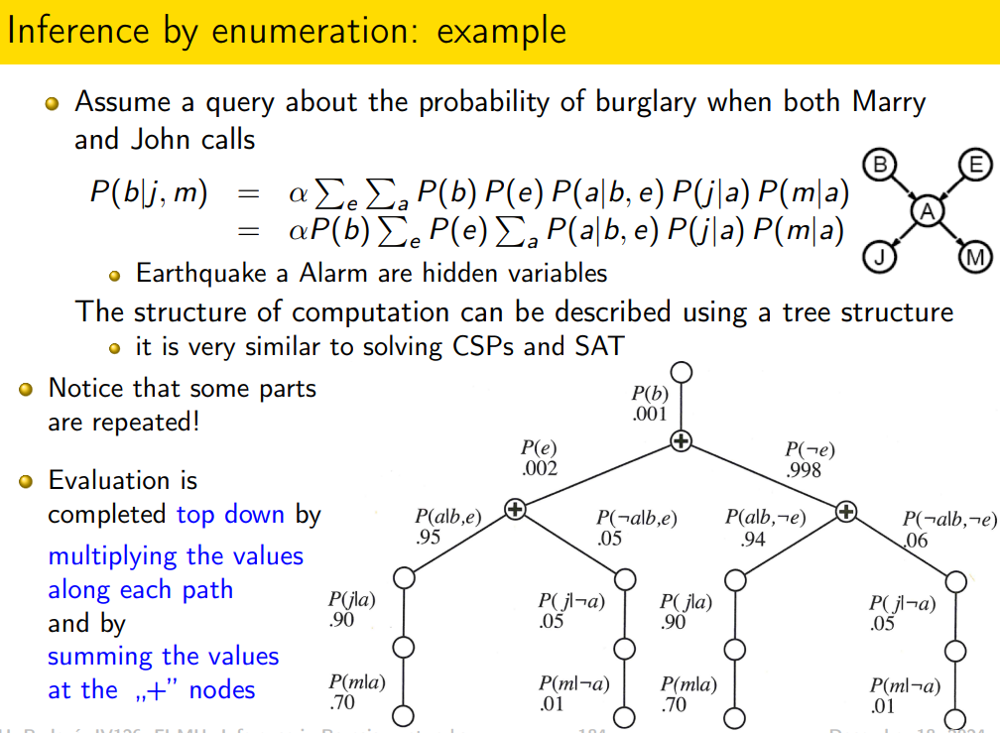

**2. Aproximační odvozování (Approximate Inference):** Pro rozsáhlé sítě je exaktní výpočet nezvládnutelný, využívají se proto stochastické 
Monte Carlo algoritmy, které generují velké množství náhodných vzorků a výsledek odhadují z jejich statistické četnosti.
* *Přímé vzorkování (Direct sampling):* Generuje vzorky od kořenů k listům v topologickém uspořádání grafu podle pravděpodobností v CPT. 
Neumí nativně zakomponovat pevnou evidenci.
* *Zamítavé vzorkování (Rejection sampling):* Generuje kompletní vzorky pomocí přímého vzorkování, ale jakmile je vygenerovaný vzorek v rozporu 
s pozorovanou evidencí $e$, okamžitě ho zamítne (zahodí). Pokud je evidence vzácná, algoritmus zlikviduje většinu vzorků a efektivita prudce klesá.
* *Váhová věrohodnost (Likelihood weighting):* Algoritmus, který předchází plýtvání vzorky. Proměnné obsažené v evidenci $e$ zafixuje napevno 
a náhodně vzorkuje pouze volné proměnné. Každému vzorku přiřadí váhu $w$, jež odpovídá součinu podmíněných pravděpodobností všech fixovaných 
proměnných v momentě průchodu. Výsledná distribuce se následně normalizuje přes sumu těchto vah.

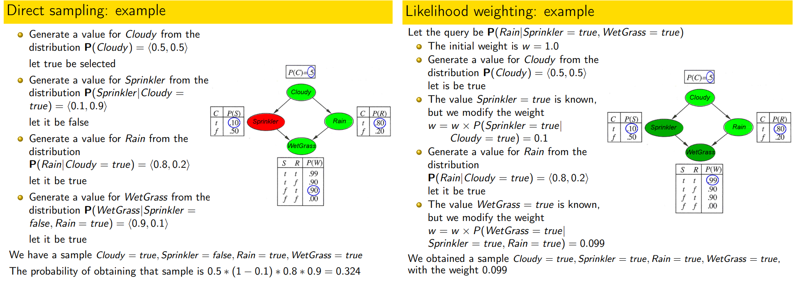

---

## Čas a neurčitost

Při modelování dynamického světa v čase se využívá rozdělení na diskrétní časové řezy (*time slices*). Rozlišujeme skryté náhodné 
proměnné $X_t$ (stav systému) a pozorovatelné proměnné $E_t$ (evidence/měření ze senzorů).

$X_t$ představuje skrytou stavovou proměnnou v čase $t$, $E_t$ značí pozorovatelnou proměnnou v čase $t$, 
$e_t$ vyjadřuje konkrétní hodnotu pozorování, $X_{0:t}$ je sekvence skrytých stavů od času 0 do $t$ a $E_{1:t}$ vyjadřuje sekvenci pozorování 
od času 1 do $t$.

Aby byl model výpočetně realizovatelný, zavádí se dva základní předpoklady:
* *Markovský předpoklad (Markov property / assumption):* Aktuální skrytý stav systému závisí striktně pouze na stavu bezprostředně předcházejícím: 
$P(X_t \mid X_{0:t-1}) = P(X_t \mid X_{t-1})$. Starší historie nemá na budoucnost vliv. Pokud se pravidla přechodů v čase nemění, jde o stacionární proces.
* *Senzorický Markovský předpoklad (Sensor Markov assumption):* Evidence $E_t$ v čase $t$ závisí výhradně na současném skrytém stavu světa $X_t$: 
$P(E_t \mid X_{0:t}, E_{1:t-1}) = P(E_t \mid X_t)$.


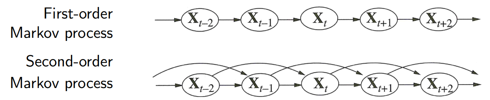

Celý časový vývoj lze popsat dynamickou Bayesovskou sítí jako součin lokálních přechodových a senzorických modelů: 
$$P(X_{0:t}, E_{1:t}) = P(X_0) \prod_{i=1}^{t} P(X_i \mid X_{i-1}) P(E_i \mid X_i)$$

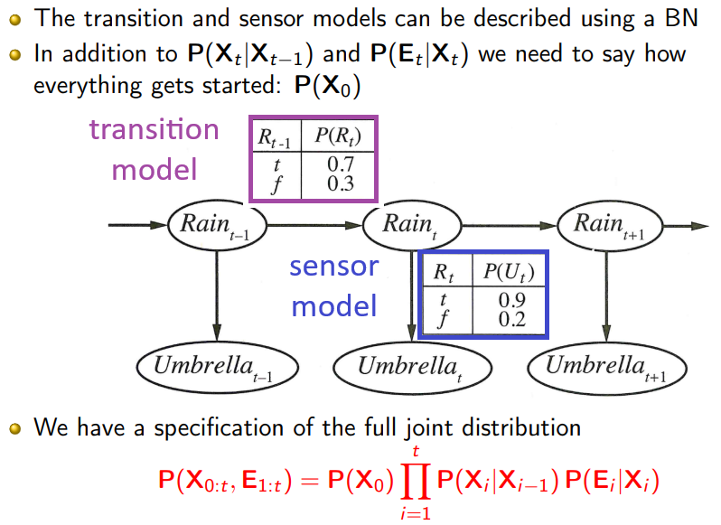


Nad tímto časovým modelem rekurzivně řešíme čtyři základní úlohy:
1. Filtrace (Filtering): Výpočet aktuálního stavu víry na základě všech dosavadních pozorování: $P(X_t \mid e_{1:t})$. Využívá rekurzivní odhad 
(*forward message passing*) bez nutnosti procházet celou historii od nuly.
2. Predikce (Prediction): Výpočet pravděpodobnostního rozdělení budoucího stavu $k$ kroků dopředu: $P(X_{t+k} \mid e_{1:t})$. Bez přísunu nové 
evidence distribuce v čase konverguje ke stacionárnímu rozdělení.
3. Vyhlazování (Smoothing): Výpočet pravděpodobnosti stavu v minulosti na základě evidence až do současnosti: $P(X_k \mid e_{1:t})$ pro $0 \le k < t$. 
Počítá se pomocí obousměrného posílání zpráv (*forward-backward* průchod).
4. Nejpravděpodobnější vysvětlení (Most likely explanation): Hledání ucelené sekvence skrytých stavů, která s nejvyšší pravděpodobností 
vygenerovala danou sekvenci pozorování (řeší se Viterbiho algoritmem).


<details>
<summary>Zobrazit případovou studii: Uvažování v čase (Svět s deštníkem)</summary>


### Případová studie: Uvažování v čase (Svět s deštníkem)

Pro demonstraci temporálního odvozování použijeme klasický učebnicový příklad **Umbrella World**. 

**Kontext:** Strážný v podzemním bunkru bez oken se pokouší zjistit aktuální počasí venku. Jedinou dostupnou evidencí (pozorováním) je, zda si jeho nadřízený ráno přinese do práce deštník.

* **Skrytý stav ($X_t \rightarrow R_t$):** $R_t$ (venku prší), $\neg R_t$ (venku neprší).
* **Pozorování / Evidence ($E_t \rightarrow U_t$):** $u_t$ (nadřízený má deštník), $\neg u_t$ (nadřízený nemá deštník).
* **Zápis vektorů:** Pravděpodobnostní distribuce zapisujeme jako dvousložkové vektory: $\langle \text{prší}, \text{neprší} \rangle$.

#### Vstupní pravděpodobnostní modely:
1.  **Počáteční stav (Den 0):** Na začátku předpokládáme čistou padesátiprocentní šanci:
    $$P(R_0) = \langle 0.5, \ 0.5 \rangle$$
2.  **Přechodový model (Pravděpodobnost změny počasí):**
    * Pokud včera pršelo, dnes bude pršet s pravděpodobností $0.7$ (nepršet $0.3$).
    * Pokud včera nepršelo, dnes bude pršet s pravděpodobností $0.3$ (nepršet $0.7$).
3.  **Senzorický model (Spolehlivost pozorování):**
    * Pokud prší, nadřízený si vezme deštník s pravděpodobností $0.9$.
    * Pokud neprší, nadřízený si vezme deštník s pravděpodobností $0.2$ (např. jako módní doplněk).
    * Vektorově pro případ, že vidíme deštník ($u_t$): $P(u_t \mid R_t) = \langle 0.9, \ 0.2 \rangle$.

---

### 1. Filtrace (Filtering)

**Definice:** Výpočet aktuálního stavu víry na základě všech dosavadních pozorování od začátku až do současnosti: $P(X_t \mid e_{1:t})$. Výpočet probíhá rekurzivně dopředu v čase krok po kroku skrze cyklus **Predikce $\rightarrow$ Aktualizace**.

**Úloha:** Spočítej aktuální stav počasí ve 2. dni, pokud nadřízený přinesl deštník v 1. i ve 2. dni. Hledáme $P(R_2 \mid u_1, u_2)$.

#### DEN 1
* **Krok 1a (Predikce):** Promítneme stav z Dne 0 $\langle 0.5, 0.5 \rangle$ skrze přechodový model:
    * $\text{Prší}: (0.7 \times 0.5) + (0.3 \times 0.5) = 0.5$
    * $\text{Neprší}: (0.3 \times 0.5) + (0.7 \times 0.5) = 0.5 \implies P(R_1) = \langle 0.5, \ 0.5 \rangle$
* **Krok 1b (Aktualizace):** Zapojíme dnešní deštník ($u_1$). Vynásobíme složky naší predikce a senzorického modelu $\langle 0.9, 0.2 \rangle$:
    * Nenormalizovaný vektor: $\langle 0.9 \times 0.5, \ 0.2 \times 0.5 \rangle = \langle 0.45, \ 0.10 \rangle$
    * Normalizace ($\alpha$): Složky podělíme jejich součtem ($0.45 + 0.10 = 0.55$).
    * **Filtrovaný stav pro Den 1:** $P(R_1 \mid u_1) = \langle \frac{0.45}{0.55}, \frac{0.10}{0.55} \rangle = \mathbf{\langle 0.818, \ 0.182 \rangle}$ (Jistota deště je 81,8 %).

#### DEN 2
* **Krok 2a (Predikce):** Promítneme upřesněný stav z konce Dne 1 do přechodového modelu:
    * $\text{Prší}: (0.7 \times 0.818) + (0.3 \times 0.182) = 0.5726 + 0.0546 = 0.6272$
    * $\text{Neprší}: (0.3 \times 0.818) + (0.7 \times 0.182) = 0.2454 + 0.1274 = 0.3728$
    * $P(R_2 \mid u_1) = \langle 0.627, \ 0.373 \rangle$ (Přes noc jistota mírně klesla, protože mohlo přestat pršet).
* **Krok 2b (Aktualizace):** Zapojíme deštník z druhého dne ($u_2$) s váhou $\langle 0.9, 0.2 \rangle$:
    * Nenormalizovaný vektor: $\langle 0.9 \times 0.6272, \ 0.2 \times 0.3728 \rangle = \langle 0.5645, \ 0.0746 \rangle$
    * Normalizace ($\alpha$): Součet složek je $0.5645 + 0.0746 = 0.6391$.
    * **Finální filtrovaný stav pro Den 2:** $P(R_2 \mid u_1, u_2) = \langle \frac{0.5645}{0.6391}, \frac{0.0746}{0.6391} \rangle = \mathbf{\langle 0.883, \ 0.117 \rangle}$

**Závěr:** Pravděpodobnost, že ve 2. dni prší, je **88,3 %**. Díky dvěma po sobě jdoucím deštníkům jistota strážného stoupla.

---

### 2. Predikce (Prediction)

**Definice:** Výpočet pravděpodobnostního rozdělení budoucího stavu $k$ kroků dopředu na základě dosavadní evidence: $P(X_{t+k} \mid e_{1:t})$ pro $k > 0$. Chová se identicky jako filtrace, ale **zcela bez zapojení nové evidence** (neprovádí se krok aktualizace, pouze se rekurzivně řetězí krok predikce).

**Úloha:** Na konci 2. dne (s historií deštníků $u_1, u_2$) chce strážný předpovědět, jaká je šance, že bude pršet ve **Dni 3** a ve **Dni 4**. Vycházíme z konce filtrovaného Dne 2: $\langle 0.883, 0.117 \rangle$.

#### PREDIKCE NA DEN 3 ($k=1$)
Aplikujeme pouze přechodový model počasí na stav z konce Dne 2:
* $\text{Prší}: (0.7 \times 0.883) + (0.3 \times 0.117) = 0.6181 + 0.0351 = 0.6532$
* $\text{Neprší}: (0.3 \times 0.883) + (0.7 \times 0.117) = 0.2649 + 0.0819 = 0.3468$
* **Předpověď na Den 3:** $P(R_3 \mid u_1, u_2) = \mathbf{\langle 0.653, \ 0.347 \rangle}$ (Šance na déšť je 65,3 %).

#### PREDIKCE NA DEN 4 ($k=2$)
Vezmeme právě vypočtenou předpověď pro Den 3 a znovu ji pošleme přes přechodový model:
* $\text{Prší}: (0.7 \times 0.6532) + (0.3 \times 0.3468) = 0.4572 + 0.1040 = 0.5612$
* $\text{Neprší}: (0.3 \times 0.6532) + (0.7 \times 0.3468) = 0.1960 + 0.2428 = 0.4388$
* **Předpověď na Den 4:** $P(R_4 \mid u_1, u_2) = \mathbf{\langle 0.561, \ 0.439 \rangle}$ (Šance na déšť klesla na 56,1 %).

**Důležitá vlastnost (Mixing time):** S rostoucím $k$ (předpověď dál do budoucnosti) vliv původních pozorování slábne. Distribuce nevyhnutelně konverguje ke stacionárnímu rozdělení samotného Markovského řetězce (zde k čisté padesátiprocentní šanci $\langle 0.5, 0.5 \rangle$).

---

### 3. Vyhlazování (Smoothing)

**Definice:** Výpočet pravděpodobnostního rozdělení stavu v minulosti na základě evidence nasbírané až do současnosti: $P(X_k \mid e_{1:t})$ pro $0 \le k < t$. 

**Úloha:** Nabízí se situace, kdy je strážný na konci Dne 2 a ví, že nadřízený měl deštník v Den 1 i v Den 2. Chce zpětně přehodnotit, jaká byla pravděpodobnost, že pršelo v **Den 1**. Hledáme $P(R_1 \mid u_1, u_2)$.

Vyhlazování kombinuje dopředný průchod (filtraci do času $k$) a zpětný průchod (zpětná zpráva z budoucnosti od času $t$ do $k+1$):

$$P(R_1 \mid u_1, u_2) = \alpha \times P(R_1 \mid u_1) \times P(u_2 \mid R_1)$$

* Kde **$P(R_1 \mid u_1)$** je dopředná zpráva $f_{1:1}$
* Kde **$P(u_2 \mid R_1)$** je zpětná zpráva $b_{2:2}$

1.  **Dopředná zpráva (z Filtrace):** Známe z prvního dne: $f_{1:1} = \langle 0.818, \ 0.182 \rangle$.
2.  **Výpočet zpětné zprávy ($b_{2:2}$):** Zpětná zpráva zjišťuje, jak pravděpodobné je pozorování zítřejšího deštníku ($u_2$) pro obě varianty dnešního počasí ($R_1$):
    * *Pokud dnes* ($R_1$) *prší:* Zítra bude pršet s šancí $0.7$ (deštník $0.9$) OR zítra nebude pršet s šancí $0.3$ (deštník $0.2$).
        $$b_2(\text{true}) = (0.7 \times 0.9) + (0.3 \times 0.2) = 0.63 + 0.06 = 0.69$$
    * *Pokud dnes* ($R_1$) *neprší:* Zítra bude pršet s šancí $0.3$ (deštník $0.9$) OR zítra nebude pršet s šancí $0.7$ (deštník $0.2$).
        $$b_2(\text{false}) = (0.3 \times 0.9) + (0.7 \times 0.2) = 0.27 + 0.14 = 0.41 \implies b_{2:2} = \langle 0.69, \ 0.41 \rangle$$
3.  **Sjednocení (Bodový součin složek):**
    * Nenormalizovaný vektor: $\langle 0.818 \times 0.69, \ 0.182 \times 0.41 \rangle = \langle 0.5644, \ 0.0746 \rangle$
    * Normalizace: Součet složek je $0.5644 + 0.0746 = 0.6390$.
    * **Vyhlazený odhad pro Den 1:** $P(R_1 \mid u_1, u_2) = \langle \frac{0.5644}{0.6390}, \frac{0.0746}{0.6390} \rangle = \mathbf{\langle 0.883, \ 0.117 \rangle}$

**Závěr:** Původní filtrovaný odhad pro Den 1 byl $81.8\ \% $. Protože ale víme, že i druhý den ředitel přinesl deštník (což indikuje vysokou šanci, že pršelo i druhý den a počasí má setrvačnost), zpětně se naše jistota o dešti v Den 1 zvýšila na **88,3 %**.

---

### 4. Nejpravděpodobnější vysvětlení (Most Likely Explanation)

**Definice:** Hledání ucelené historické *posloupnosti* skrytých stavů, která s nejvyšší pravděpodobností vygenerovala danou řadu pozorování jako celek: $\arg\max_{x_{1:t}} P(x_{1:t} \mid e_{1:t})$. Algoritmus (Viterbi) porovnává pravděpodobnosti celých cest, nikoli pouze nezávislé dny odděleně.

**Úloha:** Pro pozorování $[u_1, u_2]$ existují 4 teoretické sekvence počasí:
1.  `[prší, prší]`
2.  `[prší, neprší]`
3.  `[neprší, prší]`
4.  `[neprší, neprší]`
Který z těchto historických scénářů je matematicky nejpravděpodobnější?

Výpočet provádí rekurzivní vyhodnocování maximální cesty (Viterbiho algoritmus). Pro každou finální možnost drží informaci o té nejlepší trajektorii, která do ní vedla:

#### DEN 1 (Začátek z $P(R_0) = \langle 0.5, 0.5 \rangle$)

* **Cesta končící v $R_1 = \text{true}$ (přes start $R_0$):**
  $$\max [ 0.5 \times 0.7, \ 0.5 \times 0.3 ] \times 0.9 = 0.35 \times 0.9 = 0.315$$
  *(Poznámka: první člen = bylo pršet, druhý člen = bylo nepršet, 0.9 = deštník. Nejlepší předchůdce: prší)*

* **Cesta končící v $R_1 = \text{false}$:**
  $$\max [ 0.5 \times 0.3, \ 0.5 \times 0.7 ] \times 0.2 = 0.35 \times 0.2 = 0.070$$
  *(Poznámka: 0.2 = deštník. Nejlepší předchůdce: neprší)*

#### DEN 2 (Vycházíme z hodnot Dne 1: true $\rightarrow$ 0.315, false $\rightarrow$ 0.070)

* **Cesta končící v $R_2 = \text{true}$:**
  $$\max [ 0.315 \times 0.7, \ 0.070 \times 0.3 ] \times 0.9 = \max [0.2205, \ 0.0210] \times 0.9 = 0.2205 \times 0.9 = \mathbf{0.19845}$$
  *(Poznámka: první člen =* $R_1$ *pršelo, druhý člen =* $R_1$ *nepršelo, 0.9 = deštník. Vítězná cesta do stavu "2. den prší" vede přes stav "1. den pršelo".)*

* **Cesta končící v $R_2 = \text{false}$:**
  $$\max [ 0.315 \times 0.3, \ 0.070 \times 0.7 ] \times 0.2 = \max [0.0945, \ 0.0490] \times 0.2 = 0.0945 \times 0.2 = \mathbf{0.01890}$$
  *(Poznámka: 0.2 = deštník)*

#### Zpětný průchod (Backpointer tracking)
1.  Porovnáme finální hodnoty pro Den 2: $0.19845$ (pro déšť) > $0.01890$ (pro sucho). Den 2 byl tedy **déšť ($R_2 = \text{true}$)**.
2.  Podíváme se, kdo byl nejlepším předchůdcem pro déšť ve Dni 2. Z výpočtu výše vidíme, že to byl stav, kdy v Den 1 rovněž pršelo.

**Závěr:** Nejpravděpodobnějším celkovým vysvětlením pro sekvenci dvou deštníků je historický scénář **`[prší, prší]`** s absolutní (nenormalizovanou) pravděpodobností přibližně $0.198$.


</details>

---

## Teorie užitku

Zatímco teorie pravděpodobnosti popisuje, čemu by měl agent věřit, teorie užitku definuje jeho vnitřní cíle a preference. Jejich spojením 
vzniká **teorie rozhodování (Decision theory)**, která poskytuje rámec pro racionální chování agenta v neurčitém prostředí.

$s$ představuje konkrétní stav světa, $U(s)$ vyjadřuje hodnotu užitku stavu $s$, $a$ značí akci vybranou 
agentem, $e$ je pozorovaná evidence a $EU(a \mid e)$ představuje očekávaný užitek akce $a$ za předpokladu evidence $e$.

* **Princip maximalizace očekávaného užitku (Maximum Expected Utility - MEU):** Každému stavu přiřadí užitková funkce $U(s)$ reálné číslo 
vyjadřující jeho atraktivitu. Očekávaný užitek akce $a$ při znalosti evidence $e$ je dán váženým průměrem užitků všech jejích možných výsledných stavů: 
$$EU(a \mid e) = \sum_{s} P(\text{Result}(a) = s \mid a, e) U(s)$$
Racionální agent bezpodmínečně volí akci, která tento očekávaný užitek maximalizuje: $a = \arg\max_a EU(a \mid e)$.
* **Odpor k riziku (Risk aversion):** Vyjadřuje fakt, že finanční hodnoty nerostou lineárně s užitkem. Užitek z peněz má konkávní charakter, 
což znamená, že přírůstek bohatství přináší klesající marginální užitek.
* **Rozhodovací sítě (Decision Networks / Influence Diagrams):** Mechanismus pro výpočet optimálních rozhodnutí, který rozšiřuje klasické 
Bayesovské sítě o rozhodovací uzly (obdélníky – body volby akce agenta) a užitkové uzly (kosočtverce – vyjadřují užitkovou funkci).


---

## Markovský rozhodovací proces

Markovský rozhodovací proces (Markov Decision Process - MDP) formalizuje sekvenční rozhodovací problém v plně pozorovatelném, 
stochastickém prostředí s Markovským přechodovým modelem a aditivními odměnami $R(s)$. 

$S$ představuje množinu všech stavů, $A(s)$ značí množinu akcí dostupných ve stavu $s$, $P(s' \mid s, a)$ 
vyjadřuje pravděpodobnost přechodu ze stavu $s$ do $s'$ pomocí akce $a$, $R(s)$ představuje funkci odměny, $\pi(s)$ značí strategii, $\pi^*$ 
vyjadřuje optimální strategii a $\gamma$ představuje diskontní faktor.

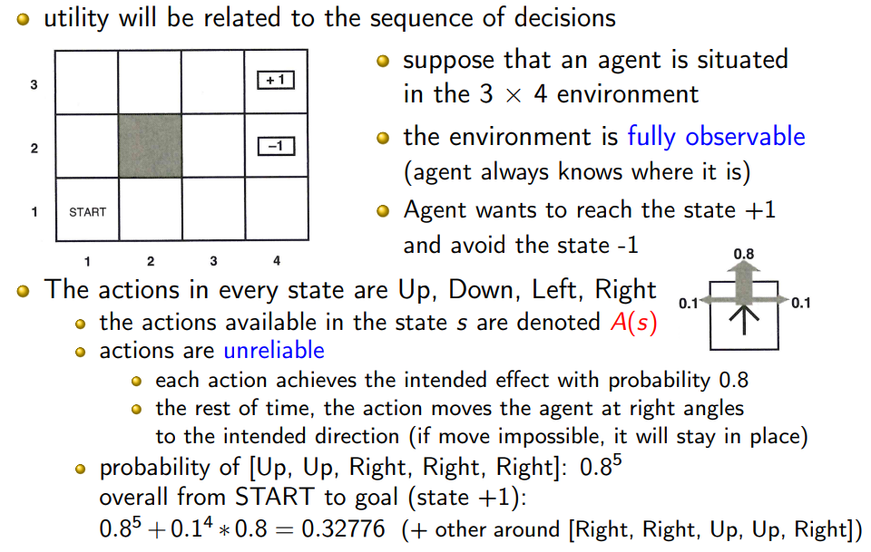

Řešením MDP není fixní posloupnost akcí, ale strategie $\pi(s)$ – funkce, která doporučuje nejlepší akci pro každý představitelný stav. 
Optimální strategie $\pi^*$ maximalizuje očekávaný kumulativní užitek. Při nekonečném časovém horizontu modeluje preferenci okamžitých 
odměn před budoucími pomocí diskontního faktoru $\gamma \in (0, 1)$, což matematicky zaručuje konvergenci nekonečné řady: 
$$U([s_0, s_1, s_2, \dots]) = \sum_{t=0}^{\infty} \gamma^t R(s_t) \le \frac{R_{max}}{1 - \gamma}$$

Základním vztahem pro výpočet užitků stavů je **Bellmanova rovnice (Bellman equation)**. Určuje, že užitek stavu je roven okamžité odměně 
plus očekávanému diskontovanému užitku následného stavu za předpokladu, že agent zvolí optimální akci: 
$$U(s) = R(s) + \gamma \max_{a \in A(s)} \sum_{s'} P(s' \mid s, a) U(s')$$

---

## Iterace hodnot

Iterace hodnot (Value Iteration) je iterativní numerický algoritmus pro řešení MDP a výpočet optimálních hodnot užitků jednotlivých stavů.

$U_i(s)$ vyjadřuje odhad užitku stavu $s$ v $i$-té iteraci, $R(s)$ značí okamžitou odměnu, $\gamma$ představuje 
diskontní faktor, $A(s)$ vyjadřuje množinu dostupných akcí, $P(s' \mid s, a)$ značí pravděpodobnost přechodu, $\delta$ je maximální změna 
užitku a $\epsilon$ představuje mez přesnosti.

Algoritmus začíná s libovolnými počátečními hodnotami užitků a v každém kroku provádí tzv. **Bellmanovu aktualizaci (Bellman update)** pro všechny stavy: 
$$U_{i+1}(s) = R(s) + \gamma \max_{a \in A(s)} \sum_{s'} P(s' \mid s, a) U_i(s')$$
Bellmanova aktualizace vykazuje matematickou vlastnost kontrakce s faktorem $\gamma$, což garantuje konvergenci k jedinému optimálnímu řešení 
nezávisle na počátečních hodnotách. Iterace končí, jakmile je maximální změna užitku menší než stanovená mez: $\delta < \epsilon(1-\gamma)/\gamma$. 
Odvozená strategie $\pi_i$ v praxi konverguje k optimální verzi mnohem dříve, než plně zkonvergují samotné numerické hodnoty užitků $U_i$.

### Příklady využití z praxe:
* **Optimalizace skladových zásob při stochastické poptávce:** Sklady potřebují znát přesnou dlouhodobou finanční hodnotu (užitek) stavu „mám aktuálně na skladě $X$ kusů zboží“. Iterace hodnot pomáhá přesně spočítat očekávané náklady na skladování a ztráty z nedostatku zboží v situaci, kdy se nákupní chování zákazníků mění podle pravděpodobnostního modelu. Přesná hodnota užitku každého stavu je zde kritická pro správné účetní a logistické plánování.*
* **Navigace mobilního robota v měnícím se prostředí:** Pokud se robot (např. autonomní vysavač nebo doručovací rover) pohybuje po diskretizované mřížce, kde hrozí uklouznutí kol nebo neočekávané zablokování cesty, iterace hodnot průběžně přepočítává absolutní bezpečnostní ohodnocení každého čtverce prostoru. Výsledná mapa užitků dává robotovi přesné vodítko, jak moc riskantní je dané místo v porovnání s alternativami.*
* **Oceňování finančních derivátů a opcí:** V ekonomických modelech se iterace hodnot využívá k určení exaktní vnitřní hodnoty finanční opce v závislosti na stochastickém vývoji tržních cen (např. u amerických opcí, které lze uplatnit kdykoli před vypršením). Pro investora je klíčové znát přesnou peněžní hodnotu stavu, aby věděl, zda opci držet, nebo prodat.*

*Protože optimální chování konverguje mnohem dříve než přesné číselné hodnoty užitků, je v praxi často výhodnější se namísto zdlouhavého zpřesňování čísel zaměřit přímo na stabilizaci pravidel v navazující **Iteraci strategie**.*

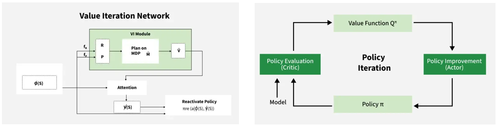

---

## Iterace strategie

Iterace strategie (Policy Iteration) je alternativní přístup k řešení MDP založený na myšlence, že pro nalezení optimálního chování 
není nutné znát zcela přesné hodnoty užitků. 

$\pi_i(s)$ vyjadřuje strategii v $i$-té iteraci, $U^{\pi_i}(s)$ značí přesný užitek stavu $s$ při dodržování 
strategie $\pi_i$, $R(s)$ představuje okamžitou odměnu, $\gamma$ vyjadřuje diskontní faktor a $P(s' \mid s, a)$ značí pravděpodobnost přechodu.

Algoritmus začíná s náhodnou výchozí strategií a cyklicky střídá dva dedikované kroky:
1. **Evaluace strategie (Policy evaluation):** Pro aktuální fixní strategii $\pi_i$ se spočítají přesné užitky stavů $U^{\pi_i}$. Protože akce 
jsou pevně dané strategií, Bellmanova rovnice ztrácí operátor maxima a zjednoduší se na systém lineárních rovnic s kubickou složitostí $O(n^3)$: 
$$U^{\pi_i}(s) = R(s) + \gamma \sum_{s'} P(s' \mid s, \pi_i(s)) U^{\pi_i}(s')$$
2. **Greedy aktualizace (Greedy update / Policy improvement):** Na základě nově spočtených užitků se aktualizuje doporučená akce pro každý stav: 
$$\pi_{i+1}(s) = \arg\max_{a \in A(s)} \sum_{s'} P(s' \mid s, a) U^{\pi_i}(s')$$

Algoritmus končí v momentě, kdy v kroku greedy aktualizace nedojde k žádné změně strategie. Jelikož je počet možných stacionárních strategií 
konečný a každá iterace přináší strukturální zlepšení, algoritmus garantovaně konverguje a v praxi vyžaduje podstatně méně iterací než čistá 
iterace hodnot.

### Příklady využití z praxe:
* **Řízení robotických paží a manipulátorů (Motion Control):** Pro mechanické systémy s mnoha stupni volnosti je prohledávání všech možných silových akcí v každém kroku (operátor max u iterace hodnot) výpočetně neúnosné. Iterace strategie vezme stávající stabilní chování (např. „udržuj plynulý směr k cíli“), vyhodnotí jeho celkový efekt a v jednom kroku ho globálně vylepší. Hledá se stabilní fyzická odezva, přičemž přesná čísla užitku jednotlivých mikropozic nejsou podstatná.*
* **Dynamické směrování paketů v počítačových sítích:** Síťové routery vyžadují stabilní pravidla (strategii) pro předávání dat, která nezačnou chaoticky oscilovat při každém drobném zakolísání šířky pásma. Pomocí iterace strategie se vyhodnotí aktuální směrovací tabulky, a pokud se prokáže, že pro daný uzel existuje dlouhodobě propustnější cesta, pravidla se skokově aktualizují. Algoritmus konverguje v minimu kroků, což je pro vysokorychlostní sítě klíčové.*
* **Hraní deskových her a herní AI (např. Backgammon):** Herní agent nepotřebuje znát absolutní matematickou hodnotu šachovnice na tisíciny procenta, ale potřebuje jasnou a stabilní strategii – vědět, jakým konkrétním tahem reagovat na tah soupeře. Iterace strategie umožňuje AI zkonvergovat k optimálnímu hernímu stylu mnohem dříve, než by se stihly dopočítat přesné hodnoty všech miliard teoreticky možných herních stavů.*

---

## Robotika

Robotika studuje fyzikální agenty provádějící úkoly manipulací s reálným světem. K tomu jsou vybaveni efektory (kola, klouby, chapadla) pro 
působení silou na okolí a senzory pro vnímání prostředí. Senzory rozlišujeme na pasivní, které pouze zachycují externí signály (kamery), 
a aktivní, které vysílají energii do okolí a měří její odraz (LiDAR, sonar).

Stav robota se dělí na *kinematický stav* (geometrická pozice a orientace kloubů) a *dynamický stav* (přidaná rychlost, zrychlení a působící síly). 
Percepce (vnímání) je proces mapování měření ze senzorů (zatížených šumem) do vnitřní reprezentace světa. Tento proces se typicky modeluje jako 
temporální odvozování pomocí Dynamických Bayesovských sítí, které pokrývá lokalizaci (zjišťování polohy robota v mapě), mapování (konstrukce 
mapy neznámého prostředí) a **SLAM (Simultaneous Localization and Mapping)**, kdy robot současně staví mapu i odhaduje svou polohu v ní.

---

## Plánování pohybu robota

Základním problémem plánování pohybu (Motion Planning) je nalézt spojitou sekvenci konfigurací, která bezpečně převede robota 
z počátečního stavu $q_I$ do cíle $q_G$ bez kolize s překážkami. Autonomní chování se dělí do tří integrovaných úrovní:
1. Plánování úloh (Task planning): Rozhoduje o sekvencích vysokoúrovňových akcí (např. jdi k objektu $\rightarrow$ uchop objekt).
2. Plánování pohybu (Motion planning): Hledá konkrétní bezkolizní geometrickou dráhu pro splnění akce.
3. Řízení (Control): Generuje nízkoúrovňové příkazy (napětí v motorech) pro akční členy, aby robot pohyb fyzicky vykonal.

$q_I$ představuje počáteční stav (konfiguraci) robota a $q_G$ vyjadřuje cílový stav (konfiguraci) robota.

Spojitý prostor nelze prohledávat přímo, proto je nutné provést jeho diskretizaci (převod na graf či mřížku) a následně aplikovat vyhledávací 
algoritmy typu $A^*$ nebo prohledávání do šířky (BFS).

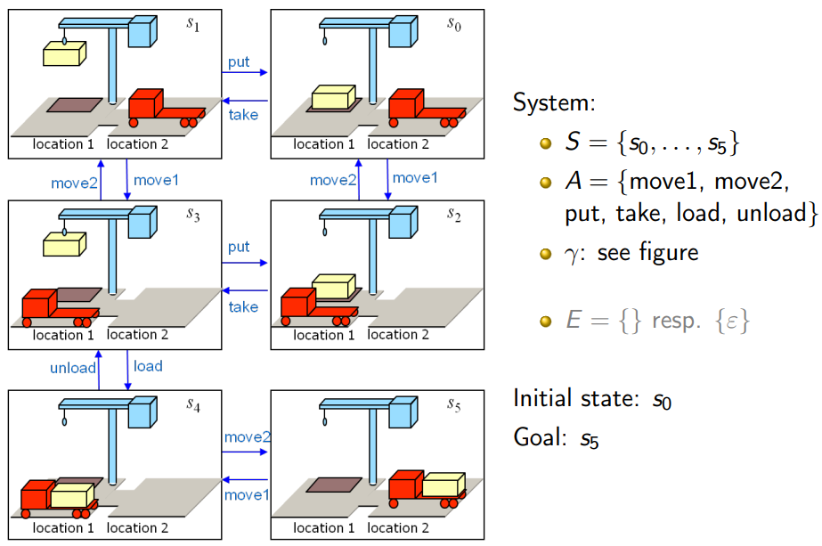

---

## Konfigurační prostor

Počítat kolize pro složité reálné těleso v trojrozměrném Pracovním prostoru (Workspace) s geometrickými překážkami je výpočetně neúnosné. 
Konfigurační prostor (Configuration space - C-space) přináší transformaci, kde je celá struktura robota reprezentována jako **jeden jediný bod**. 

$O$ představuje geometrické překážky v pracovním prostoru, $C$ vyjadřuje celkový konfigurační prostor, 
$C_{obs}$ značí prostor překážek a $C_{free}$ vyjadřuje bezpečný volný prostor konfigurací.

Počet dimenzí $C$-prostoru odpovídá přesně počtu stupňů volnosti (Degrees of Freedom - DoF) robota (např. pozice a orientace mobilního robota 
v rovině $(x, y, \theta)$ tvoří 3D prostor).
* **$C_{obs}$ (Obstacle space):** Množina všech konfigurací, ve kterých robot koliduje s překážkou $O$ nebo sám se sebou.
* **$C_{free}$ (Free space):** Bezpečný prostor konfigurací, kde ke kolizím nedochází: $C_{free} = C \setminus C_{obs}$.

Přepočet mezi souřadnicemi zajišťuje *Dopředná kinematika (Forward kinematics)*, která přepočítává známou konfiguraci kloubů na přesné souřadnice 
efektoru v pracovním prostoru. *Inverzní kinematika (Inverse kinematics)* naopak hledá potřebnou konfiguraci kloubů na základě požadované pozice 
efektoru v pracovním prostoru. Protože explicitní konstrukce celého $C_{obs}$ je analyticky téměř nemožná, v praxi se prostor pouze sonduje 
(probing) – vygenerovaný bod se pomocí dopředné kinematiky otestuje v pracovním prostoru přes "black-box" kolizní detektor.


---

## Kombinatorické a pravděpodobnostní přístupy

Při diskretizaci konfiguračního prostoru pro následné vyhledávání bezkolizní trajektorie se uplatňují dva základní metodické přístupy.

$\rho$ představuje definovaný poloměr pro spojování sousedních uzlů, $n$ značí počet náhodných bodů, 
$q_{init}$ vyjadřuje počáteční konfiguraci, $q_{new}$ je náhodně vygenerovaná konfigurace a $q_{near}$ představuje uzel stromu geometricky nejbližší k $q_{new}$.

**1. Kombinatorické (deterministické) přístupy:** Diskretizují volný prostor $C_{free}$ exaktními geometrickými či algebraickými metodami.
* *Graf viditelnosti (Visibility graph):* Spojuje úsečkami start, cíl a všechny vrcholy polygonálních překážek. Hrany protínající překážky jsou 
eliminovány. Vždy garantuje nalezení nejkratší možné cesty, ale dráha vede těsně kolem hran překážek (nulová bezpečnostní rezerva). Výpočetně náročné 
ve vyšších dimenzích.
* *Voronoiův diagram (Voronoi diagram):* Generuje cestovní mapu složenou z bodů, které mají přesně stejnou vzdálenost od dvou nebo více 
nejbližších překážek. Maximalizuje bezpečnostní odstup (*clearance*), ale cesty nejsou nejkratší a jsou vysoce citlivé na změny v pozici překážek.


* *Dekompozice na buňky (Cell Decomposition):* Rozdeluje prostor na konečný počet nepřekrývajících se legálních oblastí (buněk). Exaktní dekompozice 
řeší svislé řezy v místech geometrických vrcholů a středy buněk propojí do grafu. Aproximační dekompozice (např. Quadtree/Octree) rekurzivně 
dělí prostor na pravidelné sub-buňky; smíšené buňky se dělí hlouběji, dokud se nenajde čistá cesta nebo se nenarazí na limit rozlišení.
* *Potenciálová pole (Potential Field Methods):* Pohyb je řízen virtuálními silovými poli. Cíl generuje atraktivní pole (přitahuje robota), 
překážky generují repulzivní pole (odtlačují ho). Robot se pohybuje ve směru gradientu výsledného pole. Metoda je rychlá, ale hrozí uvíznutí 
v lokálních minimech, kde se síly navzájem vyruší před dosažením cíle.

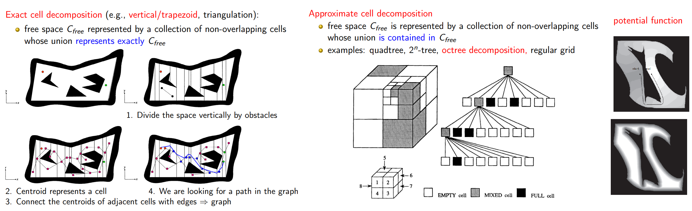


**2. Pravděpodobnostní přístupy (Sampling-based):** Namísto exaktní konstrukce překážek náhodně vzorkují konfigurace v $C$-prostoru a testují je kolizním detektorem. Poskytují pravděpodobnostní úplnost – s rostoucím počtem vzorků pravděpodobnost nalezení existujícího řešení konverguje k 1. Jsou vysoce efektivní ve vysokých dimenzích (4 a více DoF), ale jejich hlavní slabinou je prohledávání úzkých průchodů (*narrow passages*).
Podle způsobu využití vytvořených map se pravděpodobnostní algoritmy dělí na dvě základní strategie:
* **Multi-query strategie:** Algoritmus nejprve vybuduje jednu robustní, reprezentativní cestovní mapu (graf) celého prostředí. Tuto hotovou mapu pak plánovač využívá opakovaně pro rychlé odbavování různých plánovacích dotazů (změny startu a cíle) v konstantním prostředí. Typickým představitelem je **PRM**.
* **Single-query strategie:** Pro každé jedno konkrétní zadání (jeden dotaz) se staví zcela nová, samostatná vyhledávací struktura (strom). Zaměřuje se pouze na charakteristický podprostor relevantní pro danou trasu, což je ideální pro dynamická prostředí. Typickým představitelem je **RRT** (Rapidly-exploring Random Trees).

*Strategie vzorkování (Sampling strategies)*
Pravděpodobnostní plánovače implicitně nevyjadřují překážky $C_{obs}$, ale využívají geometrické modely jako „black-box“ pro ověřování kolizí. Distribuce a způsob generování vzorků zásadně ovlivňují schopnost algoritmu najít cestu (zejména skrze úzké průchody):

* *Uniformní / Náhodné vzorkování (Uniform / Random sampling):* Základní naivní přístup, kde má každé místo v prostoru stejnou pravděpodobnost výběru. Vyžaduje opatrnost při parametrizaci – například uniformní vzorkování rotací v 3D pomocí Eulerových úhlů paradoxně nevede k rovnoměrnému pokrytí, nýbrž k nežádoucímu shlukování vzorků (slajd 287).
* *Vzorkování u překážek (Obstacle-based sampling):* Cíleně generuje větší množství vzorků v těsné blízkosti hranic překážek ($C_{obs}$). Pomáhá odhalit volné štěrbiny tam, kde by uniformní distribuce statisticky selhala.
* *Gaussovské vzorkování (Gaussian sampling):* Generuje dvojice vzorků v těsné blízkosti. Pokud jeden bod leží v překážce a druhý mimo ni, vzorek se zachová. Tím se body přirozeně koncentrují podél stěn překážek a v úzkých průchodech.
* *Mřížkové vzorkování (Grid-based sampling):* Deterministická alternativa k čisté náhodnosti. Využívá sekvence s nízkým nesouladem (low-discrepancy sequences), které prostor pokrývají rovnoměrněji, bez vzniku prázdných děr nebo naopak shluků bodů.


Konkrétní algoritmy:
* **Probabilistická cestovní mapa (Probabilistic Roadmap - PRM):** Konkrétní implementace *Multi-query* strategie. 
Ve fázi učení se vygeneruje $n$ náhodných bodů v $C_{free}$ a lokální plánovač 
se pokusí propojit blízké uzly v definovaném poloměru $\rho$ do grafu. Klasické PRM vytvoří vazbu pouze tehdy, pokud kandidáti dosud neleží ve stejné 
komponentě souvislosti (šetří se drahé kolizní testy). Ve fázi dotazu se startovní a cílová konfigurace připojí k hotové mapě a cesta se vyhledá 
pomocí grafového vyhledávání ($A^*$, Dijkstra). *sPRM (Simplified PRM):* Zjednodušená verze, která na rozdíl od klasické PRM zkouší propojit každý vzorek se všemi sousedy v poloměru $\rho$ bez ohledu na komponenty souvislosti. Je asymptoticky optimální, ale výpočetně dražší na kolizní testy.

* **Rychle se rozrůstající náhodné stromy (Rapidly-exploring Random Trees - RRT):** Konkrétní implementace *Single-query* strategie. Konstruuje nový graf (strom) z počáteční konfigurace $q_{init}$ a inkrementálně roste směrem do neprozkoumaných oblastí volného prostoru. Je vhodný pro zohlednění kinodynamických limitů a řízení robotů.
Algoritmus vygeneruje náhodnou konfiguraci $q_{new}$ v $C_{free}$, ve stromu vyhledá 
uzel $q_{near}$, který je geometricky nejblíže k $q_{new}$ a strom rozšíří z bodu $q_{near}$ malým krokem směrem k $q_{new}$ (vzniká nový platný uzel, 
ověřený kolizním detektorem). Proces se opakuje, dokud se větev stromu nedostane do dostatečné blízkosti cíle. Poskytuje přípustné, ale často 
neoptimální (klikaté) řešení.


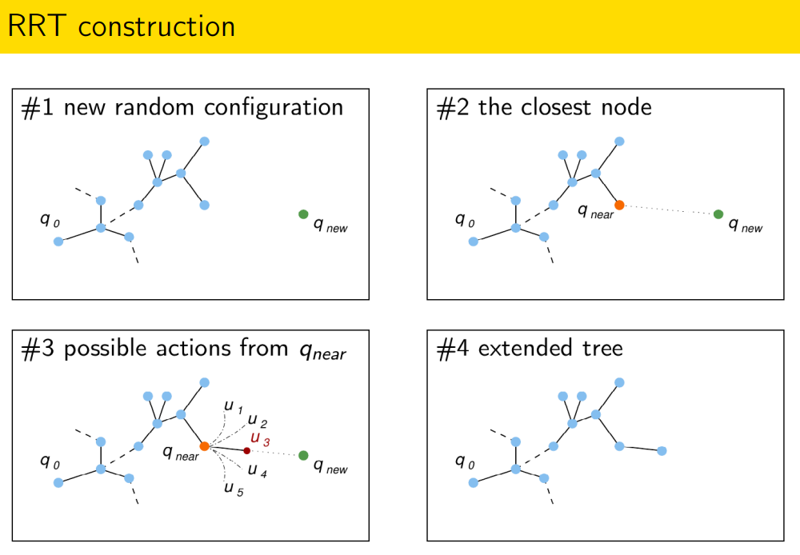
