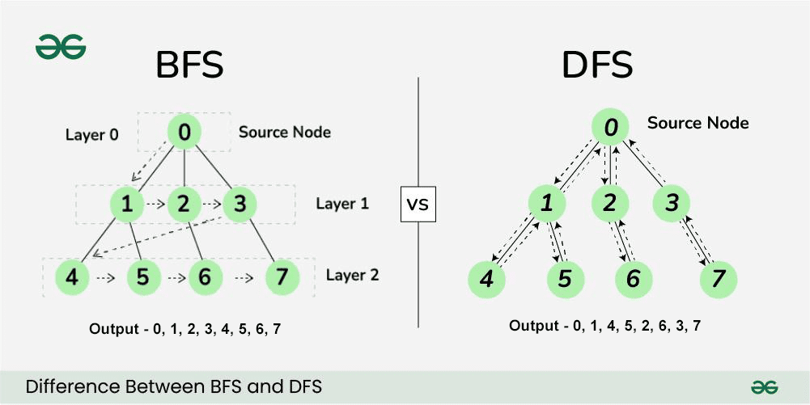

# Metody umělé inteligence

> Prohledávání stavového prostoru, lokální prohledávání a metaheuristiky s jedním řešením, 
> populační metaheuristiky (evoluční algoritmy, inteligence hejna). 
> Plánování, reprezentace problému, plánování se stavovým prostorem. 
> Práce s neurčitostí, Bayesovské sítě, exaktní a aproximační odvozování, čas a neurčitost, 
> teorie užitku, Markovský rozhodovací proces, iterace hodnot, iterace strategie. 
> Robotika, plánování pohybu robota (konfigurační prostor, kombinatorické a pravděpodobnostní přístupy).

---

## Prohledávání stavového prostoru

Mnoho úloh v umělé inteligenci lze formálně modelovat jako hledání cesty v orientovaném grafu, kde vrcholy představují stavy systému a hrany reprezentují přípustné akce (přechody).

### Formální definice problému
Prohledávání stavového prostoru je exaktně definováno jako pětice:
* **Množina stavů ($S$):** Množina všech teoreticky možných konfigurací systému.
* **Počáteční stav ($s_0 \in S$):** Fixní stav, ve kterém agent zahajuje prohledávání.
* **Množina akcí ($A(s)$):** Soubor operátorů/akcí aplikovatelných v daném stavu $s \in S$.
* **Přechodový model ($Result(s, a)$):** Deterministická funkce určující následníka stavu $s$ po provedení akce $a$:
  $$Result(s, a) = s'$$
* **Cílový test ($GoalTest(s)$):** Booleovská funkce určující, zda je stav $s$ cílovým stavem ($GoalTest(s) \to \{true, false\}$).
* **Cena cesty ($g(n)$):** Numerická hodnota definovaná jako kumulativní suma cen jednotlivých akcí na cestě od počátečního stavu $s_0$ do daného uzlu $n$ vyhledávacího stromu či grafu. Algoritmy prohledávání generují uzly reprezentující konkrétní cesty, nikoli pouze izolované stavy. Cena jednotlivého přechodu se značí $c(s, a, s')$.

### Stromové vs. Grafové prohledávání
Algoritmy generují **strom prohledávání** (search tree), kde kořenem je $s_0$. 
* **Stromové vyhledávání (Tree Search):** Exploruje stavy bez paměti na již navštívené vrcholy. V grafech s cykly může uvíznout v nekonečné smyčce.
* **Grafové vyhledávání (Graph Search):** Navíc eviduje tzv. **Explored set** (uzavřený seznam / Closed List). Pokud je uzel vygenerován a nachází se v uzavřeném seznamu, je okamžitě zahozen.

Kvalitu algoritmů měříme pomocí čtyř kritérií: **Úplnost**, **Optimalita**, **Časová složitost** a **Prostorová složitost** (vyjádřené pomocí faktoru větvení $b$, hloubky cíle $d$ a maximální hloubky prostoru $m$).

### Neinformované (slepé) prohledávání
Algoritmy nemají žádné explicitní znalosti o tom, jak blízko či daleko se nacházejí od cílového stavu.
* **BFS (Breadth-First Search – do šířky):** Využívá pro ukládání frontu typu **FIFO**. Expanduje vždy nejmělčí uzly. Je úplný. Výstup je optimální tehdy a jen tehdy, pokud jsou ceny všech akcí identické (konstantní) a striktně kladné (obecně platí, že celková cena cesty musí být neklesající funkcí hloubky uzlu). Pokud by konstantní cena akce byla nulová nebo záporná, BFS optimální nebude. Časová i prostorová složitost jsou $O(b^d)$.
* **DFS (Depth-First Search – do hloubky):** Využívá zásobník nebo frontu typu **LIFO**. Expanduje nejhlubší uzly. Nízká prostorová složitost $O(b \cdot m)$, ale není úplný v nekonečných prostorech ani optimální.
* **UCS (Uniform-Cost Search):** Zobecnění BFS pro variabilní ceny hran (Dijkstrův algoritmus). Využívá prioritní frontu řazenou podle celkové dosavadní ceny cesty $g(n)$. Je úplný a optimální za předpokladu, že ceny všech akcí jsou **striktně kladné** ($c \ge \varepsilon > 0$). Pokud by ceny byly nulové, algoritmus by mohl uvíznout v nekonečných cyklech bez nárůstu ceny cesty.

### Informované (heuristické) prohledávání
Využívá doménově specifickou znalost zakódovanou do **heuristické funkce** $h(n)$, která odhaduje cenu nejlevnější cesty z aktuálního uzlu $n$ do cíle. 
* **A\* Search:** Klíčový algoritmus informovaného hledání. Uzly v prioritní frontě řadí podle celkové odhadované ceny:
  $$f(n) = g(n) + h(n)$$
* **Podmínky optimality a důsledky konzistence:** Heuristika musí být **přípustná** ($0 \le h(n) \le h^*(n)$) pro stromové vyhledávání a **konzistentní** ($h(n) \le c(n, a, n') + h(n')$) pro grafové vyhledávání. 
  Klíčovým důsledkem konzistence je, že hodnoty $f(n)$ podél jakékoli cesty **neklesají**. Jakmile grafová varianta algoritmu A\* expanduje uzel, našla již **optimální cestu** do daného stavu, a uzly nacházející se v uzavřeném seznamu (Closed List) není nikdy třeba znovu otevírat a přehodnocovat.

---

## Lokální prohledávání a metaheuristiky s jedním řešením

V mnoha optimalizačních úlohách (např. rozvrhování) nás nezajímá cesta, kterou jsme se k řešení dostali, ale pouze finální konfigurace (stav), která splňuje kritéria nebo maximalizuje/minimalizuje zadanou funkci. Lokální prohledávání pracuje pouze s **jedním aktuálním stavem** (a jeho bezprostředními sousedy), což snižuje prostorovou složitost na stabilní $O(1)$.

### Krajina stavového prostoru (State-space landscape)
Topologii prostoru si lze představit jako geometrickou krajinu, kde vertikální osa reprezentuje hodnotu **účelové funkce** (při maximalizaci) nebo **cenové funkce** (při minimalizaci). Hlavními překážkami jsou lokální optima, úzké hřebeny (ridges) a plošiny (plateaux) s nulovým gradientem.

### Klíčové algoritmy s jedním řešením
* **Hill-climbing (Horolezecký algoritmus):** Čistě lokální, "hladový" algoritmus. V každém kroku se přesune do souseda s nejlepším zlepšením. Pokud žádný soused není lepší než aktuální stav, algoritmus uvízne v lokálním optimu a končí. Využívají se varianty jako stochastický, first-choice či random-restart hill-climbing.
* **Simulované žíhání (Simulated Annealing):** Algoritmus inspirovaný fyzikálním procesem ochlazování kovu. V kontextu klasifikace metaheuristik uvažujeme **minimalizační úlohu**. Vědomě povoluje kroky do **horšího** stavu s cílem uniknout z lokálních optim. Zhoršující krok znamená, že $f(s') > f(s)$, tedy změna hodnoty vykazuje kladný nárůst $\Delta f = f(s') - f(s) > 0$. Pravděpodobnost přijetí tohoto horšího řešení je definována s využitím záporného exponentu:
  $$P(\text{přijetí}) = e^{-\frac{\Delta f}{T}}$$
  Teplota $T$ se v čase postupně snižuje podle zadaného plánu ochlazování.
* **Tabu prohledávání (Tabu Search):** Implementuje krátkodobou paměť zvanou **Tabu list**, kde uchovává $k$ posledních provedených změn (nebo navštívených stavů). Pohyb zpět do stavu v tabu seznamu je zakázán, což nutí algoritmus opustit lokální optimum a prohledávat jiné oblasti. Zákaz lze přebít aspiračním kritériem.
* **Local Beam Search (Lokální svazkové prohledávání):** Paralelně udržuje fixní počet $k$ stavů. Pokud se v každém kroku vygenerují všichni sousedé všech $k$ stavů a striktně se vybere $k$ nejlepších jedinců podle jejich deterministické kvality, jedná se o **lokální deterministický Beam Search**. Přednášky však zdůrazňují jeho **stochatickou variantu**, kde se následníci nevybírají striktně deterministicky, ale s pravděpodobností úměrnou jejich kvalitě (podobně jako v genetických algoritmech). Tento stochastický prvek pomáhá efektivně udržet diverzitu kandidátních řešení a uniknout z lokálních optim.

---

## Populační metaheuristiky

Populační algoritmy (Population-based metaheuristics) pracují s celou množinou (populací) řešení současně. To umožňuje efektivní paralelní prozkoumávání komplexních vyhledávacích prostorů díky kombinaci a sdílení informací mezi jedinci.

---

## Evoluční algoritmy

Metody inspirované biologickou evolucí, přirozeným výběrem a genetikou. Základní iterační smyčka: Inicializace $\to$ Ohodnocení $\to$ Selekce rodičů $\to$ Křížení a Mutace $\to$ Selekce přeživších.

### Genetické algoritmy (GA)
Klasická podtřída evolučních algoritmů vyžadující explicitní reprezentaci jedince. Jedinec (chromozom) je zakódované řešení problému (např. binární řetězec), gen je konkrétní rozhodovací proměnná a alela představuje její konkrétní hodnotu.

### Hlavní operátory GA
* **Selekce (Selection):** Výběr nadprůměrných jedinců, kteří se stanou rodiči. Používá se **ruletový výběr**, kde pravděpodobnost výběru $P_i$ závisí na poměru fitness jedince vůči sumě fitness hodnot celé populace o rozsahu $N$. Index v sumě jmenovatele běží přes odlišnou proměnnou $j$:
  $$P_i = \frac{f_i}{\sum_{j=1}^{N} f_j}$$
  Alternativou je *turnajový výběr*, který přímo řídí selekční tlak velikostí turnaje $k$.
* **Křížení (Crossover):** Rekombinační operátor kombinující genetickou informaci dvou rodičů. V klasifikaci metaheuristik (dle Talbiho) je křížení operátorem, který provádí **exploraci / diverzifikaci**. Kombinuje dvě odlišná řešení, což umožňuje provádět skoky do zcela nových, dosud neprozkoumaných oblastí stavového prostoru. Rozlišujeme křížení jednobodové, dvoubodové nebo uniformní.
* **Mutace (Mutation):** Operátor zavádějící do populace drobné varianty. V klasifikaci metaheuristik (dle Talbiho) mutace provádí **exploitaci / intenzifikaci**. Prohledává blízké, bezprostřední lokální okolí aktuálního řešení za účelem lokálního doladění a zpřesnění nalezeného stavu.

---

## Inteligence hejna

Studuje decentralizované systémy složené z jednoduchých autonomních agentů interagujících mezi sebou a s prostředím, vykazující emergentní inteligentní chování bez přítomnosti centrálního řízení.

### Optimalizace částicemi (PSO - Particle Swarm Optimization)
Algoritmus inspirovaný chováním hejna ptáků či ryb při hledání potravy v kontinuálním prostoru. Každá částice $i$ si udržuje vektory aktuální **polohy** $\mathbf{x}_i^{(t)}$ a **rychlosti** $\mathbf{v}_i^{(t)}$, přičemž si pamatuje svou dosud nejlepší polohu $\mathbf{p}_i$ (*personal best*) a nejlepší polohu celého hejna $\mathbf{g}$ (*global best*). V každém kroku probíhá aktualizace podle rovnic:
$$\mathbf{v}_i^{(t+1)} = w \cdot \mathbf{v}_i^{(t)} + c_1 \cdot r_1 \cdot (\mathbf{p}_i - \mathbf{x}_i^{(t)}) + c_2 \cdot r_2 \cdot (\mathbf{g} - \mathbf{x}_i^{(t)})$$
$$\mathbf{x}_i^{(t+1)} = \mathbf{x}_i^{(t)} + \mathbf{v}_i^{(t+1)}$$

### Optimalizace mravenčí kolonií (ACO - Ant Colony Optimization)
Stochastická metaheuristika inspirovaná mechanizmem nepřímé komunikace reálných mravenců pomocí chemických stop – **stigmergie**. Vhodná pro diskrétní kombinatorické problémy. Pravděpodobnost přechodu z uzlu $i$ do uzlu $j$ závisí na koncentraci feromonu $\tau_{ij}$ a lokální heuristické výhodnosti $\eta_{ij}$:
$$P_{ij} = \frac{[\tau_{ij}]^\alpha \cdot [\eta_{ij}]^\beta}{\sum_{k \in \text{allowed}} [\tau_{ik}]^\alpha \cdot [\eta_{ik}]^\beta}$$

### Klíčové dynamické procesy ACO
* **Kumulace feromonu:** Mravenci, kteří úspěšně dokončí validní cestu, uloží na navštívené hrany dodatečný feromon. Kratší cesty jsou projity rychleji, což generuje pozitivní zpětnou vazbu.
* **Odpařování feromonu (Evaporation):** V každém kroku se koncentrace feromonu sníží podle koeficientu odparu $\rho \in (0, 1]$, což působí jako negativní zpětná vazba a zabraňuje uvíznutí v suboptimálních cestách:
  $$\text{\tau}_{ij} \leftarrow (1 - \rho)\tau_{ij}$$

---

## Plánování

Klasické prohledávání stavového prostoru vnímá stav jako neprůhlednou strukturu (black-box). Plánování otevírá vnitřní strukturu stavů a přechodů pomocí formální logické reprezentace. To umožňuje analyticky odvozovat heuristiky bez nutnosti doménových znalostí programátora. Předpokládá se klasické prostředí: deterministické, plně pozorovatelné, statické a konečné.

---

## Reprezentace problému

Svět je popsán konečnou množinou vztahů a objektů.

### Reprezentace stavů a cílů
* **Stav:** V klasickém plánování (např. STRIPS) je stav definován jako množina instanciovaných (**ground**) atomů / literálů. Tyto literály jsou striktně **bez proměnných** a obsahují výhradně konkrétní objekty domény (např. $at(r1, loc2)$). Predikáty obsahující proměnné (např. $at(x, y)$) se vyskytují až na úrovni schémat operátorů akcí. Platí **předpoklad uzavřeného světa (Closed World Assumption)** – jakýkoliv literál, který není explicitně uveden v definici stavu, je nepravdivý.
* **Cíl ($g$):** Konjunkce literálů. Stav $s$ splňuje cíl $g$, pokud platí inkluze $g \subseteq s$.

### Reprezentace akcí (Operátory)
Akce jsou definovány schématy operátorů, které zobecňují akce pomocí proměnných. Každý operátor obsahuje název, parametry, prekondice a efekty.

### Formální jazyky: STRIPS vs. PDDL
Hlavním rozdílem mezi těmito jazyky je jejich **expresivita** (vyjadřovací schopnost):
* **STRIPS:** Historický základ. Striktně vyžaduje, aby prekondice i efekty byly tvořeny výhradně konjunkcemi pozitivních literálů. Proměnné nejsou povoleny v cíli a efekty nemohou obsahovat negace ani disjunkce.
* **PDDL:** Moderní standardizovaný syntax s výrazně bohatší sémantikou. Umožňuje definovat komplexní podmíněné efekty (conditional effects), univerzální i existenční kvantifikátory (např. `forall`, `exists`), typové hierarchie a fluidy pro práci s numerickými hodnotami. Rozděluje zadání na *Domain file* a *Problem file*.

### Sémantika přechodu a problém rámce
Provedení akce $a$ ve stavu $s$ je formálně definováno pomocí přechodové funkce $\gamma(s, a)$ s využitím pozitivních a negativních efektů akce:
$$\gamma(s, a) = (s \setminus effects^-(a)) \cup effects^+(a)$$
Kde $effects^-(a)$ představuje seznam literálů, které přestávají platit (delete-list), a $effects^+(a)$ je seznam literálů, které se stávají pravdivými (add-list). Tento mechanismus řeší *problém rámce* – vše nezmíněné zůstává invariantní.

---

## Plánování se stavovým prostorem

Prohledávání stavového prostoru v plánování reprezentuje konstrukci sekvence akcí, které transformují počáteční stav do stavu splňujícího cílové podmínky.

### Dopředné prohledávání (Progression / Forward State-Space Search)
Hledání postupuje v přirozeném směru kauzality. Začíná v počátečním stavu $s_0$. Algoritmus hledá všechny akce, jejichž prekondice jsou splněny, a generuje následníky.
* *Výhody:* Stavy jsou plně definovány (víme přesně, co platí a co ne), což usnadňuje vyhodnocování složitých podmínek.
* *Nevýhody:* Trpí enormním faktorem větvení. Algoritmus uvažuje akce, které jsou v daném stavu sice legální, ale jsou naprosto irelevantní vzhledem k požadovanému cíli.

### Zpětné prohledávání (Regression / Backward State-Space Search)
Postupuje proti směru kauzality. Začíná od specifikace finálního cíle $g$. 
* **Definice uzlu:** Uzel v regresním plánování nepředstavuje obecnou „množinu podcílů“, ale **regresní množinu (regression set)**. Jedná se o konjunkci literálů, které musí být splněny, aby bylo z daného bodu možné dosáhnout finálního stanoveného cíle.

Akce $a$ je uznána jako **relevantní** pro cíl $g$, pokud s ním není v konfliktu a zároveň k němu prokazatelně přispívá, což je vyjádřeno podmínkou:
$$g \cap effects^+(a) \neq \emptyset$$

Inverzní přechodová funkce $\gamma^{-1}(g, a)$ definující regresní krok je specifikována vzorcem:
$$\gamma^{-1}(g, a) = (g \setminus effects(a)) \cup precond(a)$$
Z aktuálního cílového stavu $g$ odstraňujeme ty efekty ($effects(a)$), které daná akce úspěšně uspokojila a doručila, nikoli kompletní add-list promítnutý bez vazby na cíl. Následně unifikujeme s prekondicemi ($precond(a)$) aplikované akce.

#### Technika Liftingu (Lifting)
Zásadní optimalizace zpětného plánování. Namísto prohledávání s plně instancovanými akcemi se pracuje s operátory obsahujícími volné **proměnné**. Konkrétní objekty jsou dosazovány unifikací až v momentě, kdy je to nezbytně nutné pro provázání s prekondicemi jiné akce. Tím se dramaticky redukuje faktor větvení.

### Plánovací heuristiky a Uvolnění (Relaxation)
Efektivita plánování závisí na kvalitě heuristiky $h(s)$, která se často generuje pomocí uvolnění problému:
* **Heuristika s vypuštěním smazaných literálů (Empty-delete-list heuristic):** Matematická abstrakce, kde z efektů všech akcí kompletně vymažeme jejich $effects^-(a) = \emptyset$. V tomto fiktivním světě akce pouze přidávají nové skutečnosti a nikdy nic neničí. Problém se stává monotónním a délka optimálního plánu v tomto uvolněném prostoru tvoří perfektní přípustnou heuristiku $h^+(s)$ pro reálný svět.

---

## Práce s neurčitostí

V reálném světě se agenti potýkají s neúplnou pozorovatelností, šumem v senzorech a nedeterministickými efekty akcí. Čistá logika zde selhává, protože nedokáže kvantifikovat míru nejistoty. Agent si proto namísto udržování jednoho konkrétního stavu světa udržuje **stav víry (Belief State)** – pravděpodobnostní rozdělení přes všechny teoreticky možné stavy stavového prostoru:
$$b(s) = P(S_t = s \mid e_{1:t})$$
kde $e_{1:t}$ reprezentuje historii všech dosud získaných senzorických dat a důkazů. K exaktnímu popisu těchto vztahů a rozhodování se využívá teorie pravděpodobnosti.

---

## Bayesovské sítě

Acyklické orientované grafy (DAG) sloužící k efektivní reprezentaci sdruženého rozdělení pravděpodobnosti nad množinou náhodných proměnných $X_1, \dots, X_n$.

### Strukturální komponenty
1. **Uzly:** Reprezentují náhodné proměnné (diskrétní či spojité).
2. **Orientované hrany:** Hrana z uzlu $X$ do $Y$ indikuje přímý statistický vliv ($X$ je rodičem $Y$).
3. **Tabulky podmíněných pravděpodobností (CPT - Conditional Probability Tables):** Každý uzel $X_i$ má přidruženou tabulku $P(X_i \mid Parents(X_i))$, která plně kvantifikuje vliv rodičů na tento uzel.

### Využití podmíněné nezávislosti
Bayesovské sítě využívají topologické vlastnosti: **každý uzel je podmíněně nezávislý na svých nenaslednících, pokud jsou fixovány hodnoty jeho rodičů**. Celé sdružené rozdělení se pak spočítá jako součin lokálních podmíněných distribucí:
$$P(X_1, \dots, X_n) = \prod_{i=1}^{n} P(X_i \mid Parents(X_i))$$
Pokud má každý uzel maximálně $k$ rodičů, klesá paměťová náročnost z exponenciální $O(2^n)$ na lineární růst $O(n \cdot 2^k)$.

---

## Exaktní a aproximační odvozování

Odvozování (inference) v Bayesovských sítích znamená výpočet podmíněné distribuce dotazovaných proměnných $\mathbf{X}$ na základě fixovaných pozorovaných důkazů $\mathbf{e}$: $P(\mathbf{X} \mid \mathbf{e})$.

### Exaktní odvozování
* **Inference enumerací (Inference by enumeration):** Základní naivní přístup k exaktnímu odvozování. Výpočet probíhá striktně shora dolů procházením celého stromu sdruženého rozdělení pravděpodobnosti a sčítáním přes všechny skryté proměnné. Metoda vykazuje extrémní výpočetní časovou složitost, která je v nejhorším případě NP-těžká.
* **Eliminace proměnných (Variable Elimination):** Reaguje na naivní enumeraci jako pokročilá optimalizace využívající principy **dynamického programování**. Namísto opakovaného přepočítávání stejných členů shora dolů fixuje mezivýsledky (tzv. faktory) a sdílí je napříč výpočetními větvemi. Distributivním zákonem přesouvá sumace co nejhlouběji do součinu, čímž eliminuje redundantní operace.

### Aproximační odvozování
Pro obří sítě se exaktní výpočet stává nerealizovatelným. Využívají se stochastické simulace založené na vzorkování (sampling):
* **Vzorkování s věrohodnostní váhou (Likelihood Weighting):** Algoritmus začíná s inicializací počáteční váhy vzorku na hodnotu $w = 1.0$ a prochází síť v přirozeném topologickém uspořádání. Kdykoli během průchodu narazí na standardní skrytou proměnnou, náhodně vygeneruje její hodnotu na základě lokální distribuce z CPT. Pokud však narazí na evidenční proměnnou (proměnná $E_i$, která je fixní součástí pozorovaného důkazu $\mathbf{e}$), její hodnota se **nevzorkuje**, ale pevně zafixuje podle pozorované reality $e_i$. Aktuální běžná váha vzorku se v tom okamžiku vynásobí podmíněnou pravděpodobností tohoto pozorování:
  $$w \leftarrow w \times P(E_i = e_i \mid Parents(E_i))$$
  Výsledná finální váha jednoho vygenerovaného vzorku je součinem těchto dílčích hodnot přes všechny přítomné evidenční proměnné v síti. Cílová distribuce se následně získá normalizací váženého součtu všech nasbíraných vzorků.

---

## Čas a neurčitost

Při modelování dynamického světa, který se mění v čase, reprezentujeme stav jako sekvenci náhodných proměnných $\mathbf{X}_0, \mathbf{X}_1, \mathbf{X}_2, \dots$ v diskrétních krocích. Platí Markovský předpoklad: $P(\mathbf{X}_t \mid \mathbf{X}_{0:t-1}) = P(\mathbf{X}_t \mid \mathbf{X}_{t-1})$.

### Algoritmy odvozování v čase
Inference v časových modelech se opírá o specifické algoritmické průchody:
* **Filtrování (Filtering):** Odhad aktuálního stavu $P(\mathbf{X}_t \mid \mathbf{e}_{1:t})$ se striktně opírá o **Forward algoritmus** (dopředný průchod). Jedná se o rekurzivní proces, který kombinuje predikci stavu pro krok $t$ na základě přechodového modelu a následný senzorický update (korekci) v momentě, kdy dorazí nový sensorický důkaz $e_t$.
* **Vyhlazování (Smoothing):** Rekonstrukce minulých stavů $P(\mathbf{X}_k \mid \mathbf{e}_{1:t})$ pro $k < t$ využívá pokročilejší **Forward-Backward algoritmus**. Výpočet kombinuje dopředný průchod (forward message) se zpětným průchodem (backward message). Zpětná zpráva shromažďuje a sčítá veškeré pravděpodobnostní důkazy získané z "budoucnosti" vůči bodu $k$, což umožňuje přesně zpětně zpřesnit odhad historického stavu.

---

## Teorie užitku

Samotná pravděpodobnost agentovi neříká, jakou akci má reálně zvolit. Teorie užitku zavádí funkci $U(s)$, která kvantifikuje, jak moc je daný stav pro agenta žádoucí. Racionální agent se v prostředích s neurčitostí řídí **principem maximálního očekávaného užitku (MEU - Maximum Expected Utility)**. Volí akci $a$, která maximalizuje průměrný očekávaný užitek přes všechny možné následné stavy:
$$\text{Action} = \arg\max_{a} \sum_{s'} P(s' \mid s, a) \cdot U(s')$$

---

## Markovský rozhodovací proces

Markovský rozhodovací proces (MDP) je formální matematický rámec pro modelování sekvenčního rozhodování v plně pozorovatelném, nedeterministickém prostředí se stacionárními přechody. Je definován jako čtveřice:
* Množina stavů $S$.
* Množina akcí $A$.
* **Přechodový model $P(s' \mid s, a)$:** Pravděpodobnost, že aplikace akce $a$ ve stavu $s$ povede do stavu $s'$.
* **Funkce odměny $R(s)$:** Okamžitá numerická odměna získaná za příchod do stavu $s$.

Cílem řešení MDP je nalézt **strategii (Policy)** $\pi(s)$, což je zobrazení $\pi: S \to A$, určující optimální akci pro každý stav $s$ tak, aby se maximalizoval dlouhodobý sumární zisk odměn s využitím diskontního faktoru $\gamma \in [0, 1)$:
$$U(s_0, s_1, s_2, \dots) = \sum_{t=0}^{\infty} \gamma^t R(s_t)$$

---

## Iterace hodnot

Iterace hodnot (Value Iteration) je algoritmus pro výpočet optimálního užitku stavů $U(s)$ založený na **Bellmanově rovnici optimality**:
$$U(s) = R(s) + \gamma \max_{a \in A} \sum_{s'} P(s' \mid s, a) U(s')$$

### Algoritmus a podmínka ukončení
Začíná s libovolnými počátečními hodnotami (např. $U_0(s) = 0$). V každé iteraci provede synchronní aktualizaci všech stavů podle pravidla:
$$U_{i+1}(s) \leftarrow R(s) + \gamma \max_{a \in A} \sum_{s'} P(s' \mid s, a) U_i(s')$$
Sleduje se maximální zaznamenaná změna hodnoty $\delta$ napříč všemi stavy. Podle Bellmanova teorému je exaktní **podmínka ukončení** algoritmu pro dosažení maximální povolené chyby odhadu $\epsilon$ definována vzorcem:
$$\text{until } \delta < \epsilon \frac{1 - \gamma}{\gamma}$$
Po splnění této podmínky je výpočet zastaven a je extrahována optimální strategie.

---

## Iterace strategie

Na rozdíl od iterace hodnot se tento přístup zaměřuje přímo na vylepšování strategie v rámci makro-kroků. Cyklí mezi dvěma fázemi:
1. **Evaluace strategie (Policy Evaluation):** Pro aktuální strategii $\pi_i$ spočítá fixní hodnoty užitků $U^{\pi_i}(s)$. Bellmanův operátor ztrácí maximum, což transformuje problém na systém lineárních rovnic řešitelný v polynomiálním čase:
   $$U_i(s) = R(s) + \gamma \sum_{s'} P(s' \mid s, \pi_i(s)) U_i(s')$$
2. **Zlepšení strategie (Policy Improvement):** Na základě nově spočítaných užitků $U_i$ aktualizuje strategii pro každý stav dosazením lokálně nejlepší akce:
   $$\pi_{i+1}(s) \leftarrow \arg\max_{a \in A} \sum_{s'} P(s' \mid s, a) U_i(s')$$

Algoritmus garantovaně konverguje k absolutnímu optimu a ukončí se v momentě, kdy $\pi_{i+1}(s) = \pi_i(s)$ pro všechny stavy.

---

## Robotika

Robotika představuje realizaci AI metod a algoritmů ve fyzickém světě. Robot musí uzavírat smyčku vnímání-plánování-akce (Perception-Planning-Action) v kontinuálním a chybovém prostředí. Klíčovým problémem je zvládání chyb v pohybu a šumu v senzorech, což se řeší pomocí technik pravděpodobnostního vnímání a lokalizace (např. SLAM).

---

## Plánování pohybu robota

Cílem plánování pohybu je nalezení spojité cesty v prostoru tak, aby robot nenarazil do žádné překážky. Úloha se zaměřuje na transformaci geometrie reálného světa do abstraktního matematického modelu, kde lze efektivně aplikovat prohledávací algoritmy.

---

## Konfigurační prostor

Konfigurační prostor (Configuration Space / C-space) je klíčová abstrakce v robotice. Zatímco v reálném světě má robot složitou geometrickou strukturu, v C-space je reprezentován jako **jediný bod**.

### Dimenze C-prostoru vs. Stupně volnosti (DoF)
Je nutné striktně rozlišovat mezi počtem konfiguračních parametrů (dimenzí C-prostoru) a okamžitými stupni volnosti (DoF) robota:
* *Dimenze C-prostoru:* Odpovídá celkovému počtu parametrů nutných pro plný popis polohy a orientace tělesa. Například běžný mobilní podvozek (auto) vyžaduje 3 konfigurační dimenze – souřadnice polohy a úhel orientace $[x, y, \theta]$.
* *Stupně volnosti (DoF):* Představují počet nezávislých směrů, kterými se může robot v daném okamžiku reálně pohnout. Kvůli **neholonomním omezením** (auto má pevná kola a nemůže se pohybovat čistě kolmo na směr své podélné osy, tj. bokem) vykazuje toto vozidlo pouze **2 okamžité stupně volnosti** (akcelerace vpřed/vzad a rotace volantu). Dimenze C-prostoru je tedy v tomto případě vyšší než počet reálných DoF.

Prostor se dělí na $C_{obs}$ (konfigurace v kolizi) a $C_{free}$ (bezpečný volný prostor):
$$C_{free} = C \setminus C_{obs}$$

---

## Kombinatorické přístupy

Snaží se o přesné analytické vyřešení geometrické struktury volného prostoru $C_{free}$. Jsou úplné, ale vykazují vysokou výpočetní složitost v prostorech s vysokou dimenzí.

* **Graf viditelnosti (Visibility Graph):** Vrcholy grafu jsou počáteční stav, cíl a rohy překážek. Hrany propojují ty vrcholy, které se vzájemně lineárně vidí. 
  * *Garantovaná optimalita:* Tento přístup striktně garantuje nalezení absolutně **nejkratší eukleidovské cesty v 2D** prostoru pro případ **polygonálních překážek a bodového robota** (případně pro reálného robota transformovaného na bod pomocí geometrické operace Minkowského sumy).
* **Dekompozice na buňky (Cell Decomposition):** Rozděluje volný prostor $C_{free}$ na konečný počet jednoduchých, nekřížících se geometrických oblastí (buněk, např. lichoběžníků). Uvnitř každé buňky je pohyb triviálně lineární. Zkonstruuje se adlační graf sousedství buněk, ve kterém se najde cesta standardními metodami typu A\*.

---

## Pravděpodobnostní přístupy

Pro prostory s vysokým počtem stupňů volnosti (např. kloubová ramena) je exaktní geometrický výpočet výpočetně nezvládnutelný. Pravděpodobnostní přístupy nepočítají přesné hranice překážek, ale testují náhodně generované konfigurace pomocí rychlých implicitních **detektorů kolizí**.

### Pravděpodobnostní úplnost (Probabilistic Completeness)
Všechny vzorkovací algoritmy v této kategorii jsou definovány jako **pravděpodobnostně úplné**. To znamená, že pravděpodobnost nalezení validního řešení (pokud v reálném světě prokazatelně existuje) se s rostoucím časem výpočtu / počtem vygenerovaných vzorků limitně blíží k 1. 
Klíčovým omezením však zůstává, že **pokud validní řešení neexistuje**, algoritmus běží donekonečna v nekonečné smyčce a nedokáže jeho neexistenci sám o své vůli detekovat a korektně ohlásit.

### PRM (Probabilistic Roadmaps)
Metoda určená pro plánování ve stejném prostředí pro více dotazů (multi-query). Sestává ze dvou fází:
1. **Fáze učení (Learning phase):** Náhodně vzorkuje konfigurace v C-prostoru. Volné konfigurace (mimo $C_{obs}$) se stanou vrcholy grafu a algoritmus se pokusí propojit lokální sousedy hranou ověřenou lokálním plánovačem. Výsledkem je robustní síť cest pokrývající $C_{free}$.
2. **Fáze dotazování (Query phase):** Počáteční stav a cíl robota se propojí s nejbližšími uzly vybudované sítě a cesta se najde pomocí algoritmu A\*.

### RRT (Rapidly-exploring Random Trees)
Inkrementální metoda navržená pro rychlé vyřešení jednoho konkrétního dotazu (single-query), vysoce efektivní i v prostorech s neholonomními omezeními. Strom se rozšiřuje generováním náhodného bodu $q_{rand}$, vyhledáním nejbližšího stávajícího uzlu $q_{near}$ a provedením kroku o délce $\epsilon$ směrem k náhodnému bodu, čímž vzniká nový uzel $q_{new}$. S fixní pravděpodobností se namísto náhodného bodu dosazuje přímo cílová konfigurace $q_{goal}$ (tzv. *Goal bias*).

### Přehledový "Cheat Sheet" algoritmů plánování pohybu a Asymptotická optimalita
Základní verze algoritmů PRM a RRT sice generují geometricky zubaté a neoptimální trajektorie. Moderní pokročilé varianty **PRM\*** a **RRT\*** však přidávají podmínku dynamického přehodnocování a propojování uzlů v přesně definovaném poloměru okolí, díky čemuž dosahují **asymptotické optimality** (s rostoucím počtem vzorků délka nalezené cesty matematicky konverguje k absolutnímu teoretickému optimu).

| Metoda | Typ | Třída úloh | Hlavní výhoda | Klíčové omezení / Vlastnost |
| :--- | :--- | :--- | :--- | :--- |
| **Graf viditelnosti** | Kombinatorická | 2D, Polygonální překážky | Garantuje nejkratší možnou cestu pro bodový robot | Exponenciální růst se složitostí geometrie |
| **Dekompozice** | Kombinatorická | Jednoduché 2D/3D prostory | Snadná implementace adlačních grafů | Nevhodné pro vysoké dimenze (DoF) |
| **PRM / PRM\*** | Pravděpodobnostní | Vysoké DoF, statické prostředí | Rychlé opakované dotazy (Multi-query) | Verze PRM\* dosahuje asymptotické optimality |
| **RRT / RRT\*** | Pravděpodobnostní | Vysoké DoF, dynamické/komplexní | Extrémně rychlý single-query, zvládá DoF | Verze RRT\* dosahuje asymptotické optimality |