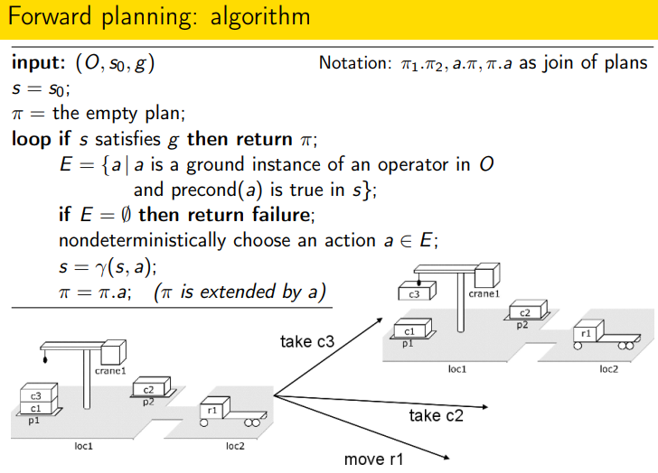
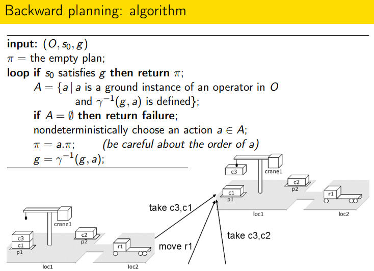

# Metody umělé inteligence

> Prohledávání stavového prostoru, lokální prohledávání a metaheuristiky s jedním řešením, 
> populační metaheuristiky (evoluční algoritmy, inteligence hejna). 
> Plánování, reprezentace problému, plánování se stavovým prostorem. 
> Práce s neurčitostí, Bayesovské sítě, exaktní a aproximační odvozování, čas a neurčitost, 
> teorie užitku, Markovský rozhodovací proces, iterace hodnot, iterace strategie. 
> Robotika, plánování pohybu robota (konfigurační prostor, kombinatorické a pravděpodobnostní přístupy).

---

## Prohledávání stavového prostoru

* **Heuristické algoritmy:** Specifické pro konkrétní problém. Bez teoretické záruky kvality či globálního optima. Využívají vnitřní strukturu problému („art of discovering“).
    * *Příklad:* Earliest Due Date (rozvrhování), Nearest Neighbor (směrování vozidel).
* **Metaheuristiky:** Obecné šablony nezávislé na problému. Řídí podřízené heuristiky pro efektivní prohledávání (např. simulované žíhání).

#### Diversifikace vs. Intenzifikace
* **Diversifikace (Průzkum / Exploration):** Schopnost opustit lokální oblasti a prohledávat nové, vzdálené části prostoru (globální pohled).
* **Intenzifikace (Využití / Exploitation):** Detailní prohledání slibného lokálního okolí s cílem nalézt lokální optimum (lokální pohled).


#### Reprezentace (Kódování / Encoding)
* **Lineární reprezentace (řetězce symbolů):**
    * **Binární:** $s_i \in \{0, 1\}$ (např. problém batohu: $1$ = předmět v batohu, $0$ = mimo).
    * **Diskrétní:** Hodnoty z konečných domén (např. alokace $n$ úloh $m$ agentům, vektor velikosti $n$, kde $s_i = j$).
    * **Permutace:** Prvek nejvýše jednou. Vhodné pro sekvenční problémy (TSP, rozvrhování na 1 stroji).
* **Nelineární reprezentace:** Grafy, stromy (využití v genetickém programování).

#### Redukce reprezentačního prostoru (Příklad: 8 dam)
1.  **Kartézské pozice:** Vektor $s = (s_1, \dots, s_8)$, kde $s_i = (x_i, y_i) \rightarrow 64^8 \approx 2.81 \times 10^{14}$ stavů.
2.  **Jedna dáma na sloupec:** Vektor řádkových pozic $(y_1, \dots, y_8) \rightarrow 8^8 = 16\,777\,216$ stavů.
3.  **Permutace:** Zákaz sdílení stejného řádku $\rightarrow 8! = 40\,320$ stavů.

#### Práce s omezeními (Constraint Handling)
1.  **Reject strategie:** Generuje a udržuje pouze přípustná řešení. Nepřípustné kroky zahazuje.
2.  **Penalizační strategie:** Povoluje nepřípustná řešení, ale účelová funkce je penalizována za porušení omezení.
3.  **Opravné strategie:** Nepřípustné řešení transformuje specifickou heuristikou na přípustné.

#### Účelová funkce (Objective Function)
* **Samospustitelná (Self-sufficient):** Původní matematické kritérium (např. délka trasy u TSP).
* **Naváděcí (Guiding):** Pokud je výsledek typu True/False (SAT), transformuje se na jemnější gradient (např. maximalizace počtu splněných klauzulí).

---

## Lokální prohledávání

**Hill Climbing (Horolezecký algoritmus):** Pracuje nad jedním kompletním řešením. V každém kroku se ho pokouší nahradit lepším sousedním řešením.

```pascal
s := s0; // Počáteční řešení
while stopping condition not satisfied do
    generate(N(s)); // Sousedství N(s)
    if no better neighbor exist then terminate; // Lokální optimum
    s := s'; // s' ∈ N(s) je lepší soused
end while
output: finální nalezené řešení (lokální optimum)
```
### Strategie výběru souseda
* **Best improvement (Steepest descent):** Prohledá celé okolí $N(s)$, vybere nejlepší zhoršení/zlepšení. Časově náročné.
* **First improvement:** Prochází sekvenčně, vybere prvního souseda, který zlepšuje stav. Rychlé.
* **Random selection:** Náhodný výběr podmnožiny sousedů, z nich zvolí zlepšujícího.

### Koncepty okolí (Neighborhood) a lokální optimum
* **Formální definice okolí:** Zobrazení $N: S \rightarrow 2^S$. V diskrétní optimalizaci dáno přechodovým operátorem: $N(s) = \{s' \in S \mid d(s', s) \le \epsilon\}$.
* **Lokální optimum:** Pro minimalizaci platí: $f(s) \le f(s') \quad \forall s' \in N(s)$.
* **Okolí pro permutace:** Posun (*insertion*), výměna (*swap/exchange*), inverze (*inversion*).
* **Okolí pro TSP:**
    * $k$-distance: Výměna pozic $k$ měst. Pro $2$-distance je velikost okolí $\frac{n(n - 1)}{2}$.
    * $k$-opt: Odstraní $k$ hran a nahradí je jinými. Pro $2$-opt je velikost okolí $\frac{n(n - 1)}{2} - n$.

#### Inkrementální vyhodnocování okolí
Místo drahého přepočtu celé účelové funkce od nuly se počítá pouze diferenční změna $\Delta f$.
* *Příklad (2-opt u TSP):* $\Delta f = \text{dist}(A, E) + \text{dist}(C, D) - \text{dist}(A, D) - \text{dist}(C, E) \rightarrow f(s') = f(s) + \Delta f$.

### Iterované lokální prohledávání (ILS)
* **Multistart local search:** Opakované spouštění z nových náhodných počátečních řešení (ztráta historie).
* **Iterated Local Search (ILS):** Na nalezené lokální optimum aplikuje narušení (**perturbaci**) a spustí lokální prohledávání znovu. Perturbace musí být dostatečně velká (únik z lokálního optima), ale přiměřeně malá (aby nedegradovala na náhodný restart).

```pascal
s = s0; s* = local_search(s);
repeat
    s' = perturb(s*, search_history);
    s'_* = local_search(s');
    s* = accept(s*, s'_*, search_memory);
until stopping_criteria;
output: nejlepší globálně nalezené řešení
```

#### Koncept perturbace
Perturbace představuje velký náhodný krok v aktuálním řešení (např. část prvků se fixuje a část se promíchá). Musí být:
* **Dostatečně velká:** Aby algoritmus dokázal vyskočit z lůžka přitažlivosti aktuálního lokálního optima (příliš malá změna způsobí, že lokální prohledávání zkolabuje zpět do stejného bodu).
* **Přiměřeně malá:** Pokud by byla změna stoprocentní, ILS degraduje na čistý náhodný *Multistart*.

## Metaheuristiky s jedním řešením

Pokročilé metody umožňující únik z lokálních optim povolením přechodu na horší sousední stav.

#### Simulované žíhání (Simulated Annealing - SA)
Stochastická metoda inspirovaná ochlazováním kovů. Zlepšující krok přijme vždy, horší stochasticky s pravděpodobností:
$$P(\text{přijetí}) = e^{-\frac{\Delta f}{T}}$$
Teplota $T$ se v čase postupně snižuje. Na začátku je vysoká (vysoká diversifikace), na konci konverguje k nule (čistý Hill Climbing / intenzifikace).

#### Record-to-record travel (RRT)
Deterministická alternativa SA. Nové náhodné řešení $s'$ je akceptováno, pokud nepřekročí historicky nejlepší hodnotu (`RECORD`) o více než pevnou odchylku $D > 0$:
$$f(s') < \text{RECORD} + D$$

#### Algoritmus Velké potopy (Great Deluge - GD)
Deterministický algoritmus. `LEVEL` představuje neustále klesající strop (hladinu vody). Nové řešení musí být pod hladinou ($f(s') < \text{LEVEL}$). Parametr rychlosti poklesu hladiny určuje kompromis mezi časem a kvalitou výpočtu.

#### Zakázané prohledávání (Tabu Search - TS)
Deterministická metoda využívající paměť. V každém kroku vybere nejlepšího přípustného souseda, i když přináší zhoršení.
* **Tabu list:** FIFO fronta uchovávající atributy posledních provedených tahů (např. prohozené dvojice prvků u TSP). Tyto tahy jsou po určitý počet iterací zakázané, což brání cyklení.
* **Ašpirační kritérium:** Umožňuje ignorovat tabu status, pokud daný tah vede na řešení lepší než dosavadní historické maximum ($f(s') < f(s_{best})$).

---

### Prohledávání s velmi velkým okolím (VLNS)
Velikost okolí (počet sousedů) roste exponenciálně nebo jako vysoký polynom. Cílem je najít zlepšujícího souseda efektivně bez kompletní enumerace.

* **Vyhazovací řetězce (Ejection chains):** Sekvence lokálních oprav. První oprava odstraní defekt, ale vyvolá jiný (sekundární). Řetězec úspěšně končí, když se defekt v nějakém kroku zcela eliminuje bez generování nového.
* **Large Neighborhood Search (LNS):** Metaheuristika založená na opakované destrukci (**Destroy**) a opravě (**Repair**) aktuálního řešení.
    * *Metody destrukce:* Random removal, Worst-case removal, Shaw removal (odebrání strukturně podobných entit, které lze nejsnáze zaměnit).
    * *Metody opravy:* Greedy insertion, Regret insertion (přednostně umisťuje entity s nejvyšší ztrátou skóre mezi prvním a druhým nejlepším přiřazením).
    * *Pseudokód LNS:*
```pascal
s := initialSolution; s_best := initialSolution;
repeat
    s' := s;
    destroy part of s' using a destroy heuristic;
    repair s' using a repair heuristic;
    if f(s') < f(s_best) then s_best := s';
    if accept(s', s) then s := s';
until stopping_criteria_satisfied;
return s_best;
```
* **Variable Neighborhood Search (VNS):** Strategie postavená na systematické změně struktur okolí během prohledávání.
    * *VND (Variable Neighborhood Descent):* Čistě deterministické. Prohledává řadu okolí $N_1, N_2, \dots$ sekvenčně. Při nalezení zlepšení se vrací k $N_1$, při selhání přechází na širší strukturu okolí ($N_{l+1}$).
    * *Basic VNS:* Kombinuje stochastické „třesení“ (**shaking**) pro únik z optima s následným intenzivním lokálním prohledáváním (nejčastěji právě pomocí VND).

---

## Populační metaheuristiky

Pracují s celou množinou (populací) řešení současně. Excelují v **diversifikaci** (globálním průzkumu).

### Klasifikace: Evoluce vs. Sdílená paměť
1.  **Založené na evoluci:** Přímá reprodukce jedinců pomocí biologických operátorů (křížení, mutace). Přenáší se konkrétní genetická informace (GA, Evoluční strategie).
2.  **Založené na sdílené paměti (Blackboard):** Jedinci přímo nereprodukují své řetězce, ale přispívají do společné paměti. Nová generace kandidátů se generuje čistě na základě stavu této paměti (ACO - feromony, EDA - pravděpodobnostní model).

### Inicializace populace a ukončení
* *Inicializace:* Náhodná, Sekvenční/Paralelní diversifikace (maximalizace vzdáleností mezi generovanými jedinci), Heuristická (předpřipravení hladovou heuristikou – riskuje předčasnou konvergenci).
* *Ukončení:* Statické (pevný čas, iterace), Adaptivní (generace bez zlepšení, pokles diverzity pod kritickou mez).

---

## Evoluční algoritmy (EA)

Modelují optimalizaci jako digitální simulaci přirozeného výběru a přežití nejsilnějších.
* **Terminologie:** Jedinec (řešení), Gen (proměnná), Alela (hodnota), Fitness (účelová funkce, obvykle se maximalizuje).

### Hlavní větve
* **Genetické algoritmy (GA):** Hlavní důraz je kladen na **křížení** nad dvěma rodiči. Mutace je pouze sekundární operátor pro udržení diverzity. Používá fixní pravděpodobnosti $p_c$ a $p_m$.
* **Evoluční strategie (ES):** Vyvinuty pro kontinuální optimalizaci (vektory reálných čísel). Hlavní pohon zajišťuje **mutace**. Používá se striktní elitářské nahrazování.
    * $(\mu + \lambda)$-ES: Výběr $\mu$ přeživších se volí spojením a setříděním rodičů i potomků dohromady (čistý elitismus).
    * $(\mu, \lambda)$-ES: Nová populace $\mu$ jedinců se vybírá striktně pouze z $\lambda$ potomků (rodiče nepřežívají, vhodné pro dynamická prostředí).
* **Genetické programování (GP):** Jedinci jsou přímo **vykonatelné programy** reprezentované nelineárně pomocí stromových grafových struktur (např. symbolická regrese – hledání matematického vzorce odpovídajícího datům).

### Strategie výběru rodičů
* **Ruletový výběr:** Pravděpodobnost výběru je přímo úměrná fitness: $p_i = f_i / \sum f_j$. Dominantní jedinec může populaci rychle zaplavit svými kopiemi, což vede k **předčasné konvenci**.
* **Stochastické univerzální vzorkování (SUS):** Ruleta s více rovnoměrně rozmístěných ukazateli. Jedním roztočením vybere všechny rodiče naráz, což dává šanci i slabším a stabilizuje selekční tlak.
* **Turnajový výběr:** Náhodný výběr $k$ jedinců z populace, nejlepší z nich se stává rodičem. Proces se nezávisle opakuje $\mu$-krát. Parametr $k$ řídí intenzitu selekčního tlaku.
* **Výběr podle pořadí (Rank-based selection):** Jedinci se seřadí podle výkonnosti a pravděpodobnost se počítá z jejich pořadí, nikoli z absolutní fitness. Eliminuje vliv obřích rozdílů ve fitness hodnotách.

### Reprodukční strategie
* **Mutace:** Malé stochastické narušení jednoho jedince ($p_m \approx 1/k$, kde $k$ je počet genů). Bitový invert, změna znaku, permutační swap/inverze.
* **Křížení (Crossover):** Binární operátor kombinující genetickou informaci dvou rodičů ($p_c \in [0.45, 0.95]$).
    * *Lineární (mimo permutace):* Jednobodové (prohození segmentů za náhodným bodem $k$), Vícebodové, Uniformní (každý gen potomka se zkopíruje nezávisle z rodiče 1 nebo 2 s $50\%$ pravděpodobností).
    * *Permutační:* Standardní křížení selhává (duplicity prvků). Používá se např. **Pořadové křížení (OX)**, které zachovává vybraný vnitřní segment z prvního rodiče a zbylé prvky doplní z druhého rodiče cyklicky bez duplicit.

### Strategie nahrazování
* **Generační:** Populace potomků kompletně a bezpodmínečně nahradí rodiče (risk ztráty nejlepšího jedince).
* **Ustálený stav (Steady-state):** Generuje se pouze jeden (nebo velmi málo) potomků, kteří v původní populaci nahradí prokazatelně nejhorší jedince.
* **Elitismus:** Garantovaný automatický postup nejlepších jedinců z obou generací dál. Urychluje konvergenci, ale zvyšuje riziko uvíznutí v lokálním optimu.


---

## Inteligence hejna

Decentralizované systémy složené z velkého množství jednoduchých agentů. Neexistuje centrální řízení, komunikace je lokální a nepřímá prostřednictvím modifikace prostředí (**stigmergie**).

### Optimalizace mravenčí kolonou (Ant Colony Optimization - ACO)
Simulace vyhledávání nejkratší cesty pomocí vylučování chemického **feromonu** ($\tau$). Na kratší trati se mravenci otočí rychleji, feromonová stopa tam sílí intenzivněji a vyšší koncentrace následně přitahuje další mravence.

#### Matematické operace s feromonem
1.  **Odpařování:** Provádí se plošně na všech hranách, aby se zabránilo kumulování a umožnil únik z optim:
$$\tau_{ij} = (1 - \rho)\tau_{ij} \quad \text{kde } \rho \in [0, 1] \text{ je koeficient odpařování.}$$
2.  **Posílení:** Přidání feromonu. Nejpopulárnější je *off-line update* na konci generace, kdy se posílení provede pouze na hranách, které tvoří historicky nejlepší trasu:
$$\tau_{ij} = \tau_{ij} + \Delta \quad \forall (i, j) \in \text{best\_solution}$$

#### Aplikace na TSP
Pravděpodobnost volby následujícího města $j$ z uzlu $i$ s integrací lokální viditelnosti (heuristická kvalita nezávislá na feromonu $\eta_{ij} = 1/d_{ij}$):
$$p_{ij} = \frac{\tau_{ij}^\alpha \times \eta_{ij}^\beta}{\sum_{k \in S} \tau_{ik}^\alpha \times \eta_{ik}^\beta}$$
Parametry $\alpha$ (vliv feromonu) a $\beta$ (vliv geografické blízkosti) určují chování. Pro $\alpha=0$ jde o čistě stochastické hladové vyhledávání.

---

## Plánování a reprezentace problému

**Automatické plánování:** Výběr a časová organizace akcí s cílem transformovat aktuální stav světa do stavu požadovaného.
* **Formální model:** Plánovací prostředí je modelováno jako stavový transformační systém $\Sigma = (S, A, E)$, kde $S$ je množina všech stavů, $A$ množina akcí pod kontrolou plánovače, $E$ množina vnějších neovlivnitelných událostí. Změna stavu je řízena přechodovou funkcí $\gamma: S \times (A \cup E) \rightarrow 2^S$.

### Reprezentace problému
* **Stavy:** Konečná množina **plně instanciovaných atomů** (bez volných proměnných).
    * *Fluenty:* Atomy, jejichž pravdivost se v závislosti na akcích mění (např. `at(robot, location)`).
    * *Rigidní atomy:* Konstantní, nezávislé na stavu systému (např. `adjacent(loc1, loc2)`).
    * Striktně se uplatňuje **Předpoklad uzavřeného světa (CWA):** Jakýkoli atom, který není explicitně uveden v popisu stavu, je považován za nepravdivý.
* **Plánovací operátor ($o$):** Parametrická šablona $(\text{name}(o), \text{precond}(o), \text{effects}(o))$.
* **Akce ($a$):** Plně instanciovaný plánovací operátor (proměnné nahrazeny konstantami).


Akce je aplikovatelná na stav $s$, pokud $\text{precond}^+(a) \subseteq s \land \text{precond}^-(a) \cap s = \emptyset$. Výsledný stav určuje přechodová funkce:
$$\gamma(s, a) = (s \setminus \text{effects}^-(a)) \cup \text{effects}^+(a)$$

### Jazyk PDDL (Planning Domain Definition Language)
Striktně odděluje fyzikální vlastnosti světa od konkrétního zadání rozdělením do dvou souborů:
1.  **Domain File:** Definuje typy objektů, predikáty a univerzální operátory (akce).
2.  **Problem File:** Definuje konkrétní instance objektů, výchozí stav světa (`:init`) a cílové podmínky (`:goal`).

*Zkrácený příklad (Úloha Gripper):*
```lisp
;; Domain soubor
(:action move
   :parameters (?x ?y)
   :precondition (and (ROOM ?x) (ROOM ?y) (at-robby ?x))
   :effect (and (at-robby ?y) (not (at-robby ?x))))

;; Problem soubor
(:init (ROOM rooma) (ROOM roomb) (at-robby rooma) (at-ball ball1 rooma))
(:goal (at-ball ball1 roomb))
```

---

## Plánování se stavovým prostorem

Uzly prohledávacího stromu představují konkrétní stavy světa, hrany představují přechody realizované aplikací akcí.

### 1. Dopředné plánování (Forward Planning / Progression)
Algoritmus začíná v počátečním stavu $s_0$ a prohledává prostor směrem dopředu k cíli aplikací akcí, jejichž předpodmínky jsou v aktuálním stavu splněny. Je **korektní** a **úplné**.
* *Nevýhoda:* Obrovský **faktor větvení** (množství aplikovatelných akcí nesouvisejících s cílem). V reálných plánovačích se prohledává pomocí algoritmu $A^*$ s pokročilými doménově nezávislými heuristikami a prořezáváním duplicitních stavů.



### 2. Zpětné plánování (Backward Planning / Regression)
Začíná od popisu cíle $g$ a postupuje pozpátku k $s_0$ pomocí vytváření podcílů. Akce musí být **relevantní** ($g \cap \text{effects}(a) \neq \emptyset$ a nesmí být v konfliktu s cílem).
* **Regresní množina (nový podcíl):** $\gamma^{-1}(g, a) = (g \setminus \text{effects}(a)) \cup \text{precond}(a)$. Mívá menší faktor větvení než dopředné plánování, ale deterministická implementace vyžaduje striktní detekci cyklů.



### 3. Částečně instanciované zpětné plánování (Lifted Backward Planning)
Řeší problém velkého větvení zpětného plánování tím, že akce neinstancuje na konkrétní konstanty okamžitě, ale ponechává parametry akcí jako volné proměnné, dokud to není nezbytně nutné. Využívá **MGU (Most General Unifier)** — minimální nutnou substituci proměnných, která sjednotí atom v cíli s atomem v efektech operátoru. Výrazně zmenšuje faktor větvení za cenu náročnější kontroly unifikačních omezení.

---

## Práce s neurčitostí a Bayesovské sítě

Jako dominantní standard pro práci s neurčitostí se prosadila **teorie pravděpodobnosti**.
* **Sdružená pravděpodobnostní distribuce:** Tabulka pravděpodobností všech kombinací stavů v doméně. Roste exponenciálně s počtem proměnných ($2^n$).
* **Marginalizace (Summing out):** Výpočet pravděpodobnosti menší množiny proměnných sečtením (integrováním) přes všechny možné hodnoty ostatních (skrytých) proměnných $Z$:
$$P(Y) = \sum_{z \in Z} P(Y, z)$$
* **Bayesův teorém:** Základní kámen umožňující otočit směr podmínění (např. určení pravděpodobnosti příčiny na základě pozorovaných symptomů):
$$P(\text{příčina} \mid \text{efekt}) = \frac{P(\text{efekt} \mid \text{příčina}) \times P(\text{příčina})}{P(\text{efekt})}$$

### Bayesovské sítě
Strukturovaný reprezentativní model, který explicitně zachycuje vztahy podmíněné nezávislosti mezi náhodnými proměnnými. Jedná se o **Orientovaný acyklický graf (DAG)**, kde uzly jsou proměnné a orientované hrany reprezentují přímou závislost. Každý uzel obsahuje **Tabulku podmíněné pravděpodobnosti (CPT)** definující distribuci $P(X \mid \text{Parents}(X))$.

* **Sémantika a kompaktnost:** Plná sdružená distribuce je dána součinem lokálních podmíněných pravděpodobností: $P(x_1, \dots, x_n) = \prod_{i=1}^{n} P(x_i \mid \text{parents}(X_i))$. Pokud je síť řídká a má nejvýše $k$ rodičů, klesá paměťová náročnost z $2^n$ na pouhých $n \cdot 2^k$ parametrů.
* **Konstrukce:** Výsledná podoba kriticky závisí na pořadí zadávání uzlů. Doporučuje se **kauzální směr** (od příčin k efektům) $\rightarrow$ vede k přirozeným, řídkým grafům. Diagnostický směr (od efektů k příčinám) generuje hustě propojené sítě s mnoha redundantními závislostmi.

---

## Exaktní a aproximační odvozování

Cílem odvozování (Inference) je spočítat výslednou podmíněnou distribuci dotazované proměnné $X$ na základě pozorované evidence $e$ (proměnné $Y$ jsou skryté / marginalizované): $P(X \mid e) = \alpha \sum_{y} P(X, e, y)$.

### 1. Exaktní odvozování (Přesný výsledek)
* **Odvozování výčtem:** Top-down rekurzivní procházení stromu možných stavů. Extrémně neefektivní, protože opakovaně počítá identické podvýrazy v různých větvích.
* **Eliminace proměnných:** Algoritmus založený na principu dynamického programování. Pravděpodobnostní tabulky (CPTs) jsou uvažovány jako **faktory** (matice). Výpočet probíhá zdola nahoru pomocí *bodového součinu* souvisejících faktorů a následného *vysčítání* (eliminace) skrytých proměnných.
* **Složitost:** Pro stromy (poly-trees) je časová i prostorová složitost lineární vůči velikosti sítě: $O(n \cdot d^k)$. Pro obecné, vícenásobně propojené sítě je problém **NP-těžký** (až #P-těžký), přičemž složitost je dána velikostí největšího faktoru vytvořeného během eliminace.

### 2. Aproximační odvozování (Stochastické Monte Carlo algoritmy)
Pro rozsáhlé a husté sítě je exaktní výpočet nezvládnutelný, využívá se statistická četnost z velkého množství náhodných vzorků.
* **Přímé vzorkování:** Generuje vzorky od kořenů k listům v topologickém uspořádání grafu podle pravděpodobností v CPT. Neumí nativně pracovat s pevnou evidencí.
* **Zamítavé vzorkování (Rejection sampling):** Generuje kompletní vzorky pomocí přímého vzorkování. Jakmile je ale vzorek v rozporu s pozorovanou evidencí $e$, je okamžitě **zamítnut (zahozen)**. Pokud je evidence vzácná, algoritmus zahodí drtivou většinu vzorků a efektivita drasticky padá.
* **Váhová věrohodnost (Likelihood weighting):** Zabraňuje plýtvání vzorky. Proměnné, které jsou součástí evidence $e$, se **zafixují napevno** a vůbec se nenasazují do náhodného vzorkování (vzorkují se jen volné proměnné). Každému vygenerovanému vzorku se přiřadí **váha $w$**, která odpovídá součinu podmíněných pravděpodobností všech fixovaných proměnných v momentě průchodu. Výsledná distribuce se pak normalizuje přes sumu těchto vah.

---

## Čas a neurčitost

Při modelování dynamického světa v čase se využívá rozdělení na diskrétní časové řezy. Rozlišujeme skryté náhodné proměnné $X_t$ (stav systému) a pozorovatelné proměnné $E_t$ (evidence/měření).
* **Markovský předpoklad (1. řádu):** Aktuální stav závisí striktně pouze na stavu bezprostředně předcházejícím: $P(X_t \mid X_{0:t-1}) = P(X_t \mid X_{t-1})$. Pokud se pravidla přechodů v čase nemění, jde o *stacionární proces*.
* **Senzorický Markovský předpoklad:** Evidence $E_t$ v čase $t$ závisí pouze na skrytém stavu $X_t$ ve stejném časovém řezu: $P(E_t \mid X_{0:t}, E_{1:t-1}) = P(E_t \mid X_t)$.
* **Sdružená distribuce:** Celý časový model lze reprezentovat dynamickou Bayesovskou sítí:
$$P(X_{0:t}, E_{1:t}) = P(X_0) \prod_{i=1}^{t} P(X_i \mid X_{i-1}) P(E_i \mid X_i)$$

### Základní inferenční úlohy
1.  **Filtrace (Filtering):** Výpočet aktuálního stavu víry na základě všech dosavadních pozorování: $P(X_t \mid e_{1:t})$. Využívá rekurzivní odhad (*forward message passing*) bez nutnosti procházet celou historii od nuly.
2.  **Predikce (Prediction):** Výpočet pravděpodobnostního rozdělení budoucího stavu $k$ kroků dopředu: $P(X_{t+k} \mid e_{1:t})$. Bez přísunu nové evidence distribuce v čase konverguje ke stacionárnímu rozdělení Markovského procesu.
3.  **Vyhlazování (Smoothing):** Výpočet pravděpodobnosti stavu v minulosti na základě evidence až do současnosti: $P(X_k \mid e_{1:t})$ pro $0 \le k < t$. Počítá se pomocí obousměrného posílání zpráv (*forward-backward* průchod).
4.  **Nejpravděpodobnější vysvětlení:** Hledání ucelené sekvence skrytých stavů, která s nejvyšší pravděpodobností vygenerovala danou sekvenci pozorování (řeší se např. Viterbiho algoritmem).

---

## Teorie užitku a rozhodování

Zatímco teorie pravděpodobnosti popisuje, čemu by měl agent věřit, teorie užitku definuje jeho preference a cíle. Jejich spojením vzniká **teorie rozhodování**.

### Princip maximalizace očekávaného užitku (MEU)
Každému stavu $s$ přiřadí užitková funkce $U(s)$ reálné číslo vyjadřující jeho atraktivitu. Očekávaný užitek akce $a$ při znalosti evidence $e$ je dán váženým průměrem užitků všech možných výsledných stavů:
$$EU(a \mid e) = \sum_{s} P(\text{Result}(a) = s \mid a, e) U(s)$$
Racionální agent volí akci, která tento očekávaný užitek maximalizuje: $a = \arg\max_a EU(a \mid e)$.

* **Užitek peněz:** Peníze nerostou lineárně s užitkem. Většina lidí vykazuje odpor k riziku (*risk aversion*), protože užitek z peněz má konkávní charakter (přírůstek bohatství přináší klesající marginální užitek).
* **Rozhodovací sítě (Decision Networks / Influence Diagrams):** Mechanismus pro vizualizaci a výpočet racionálních rozhodnutí rozšiřující klasické Bayesovské sítě o **rozhodovací uzly** (obdélníky – body přímé volby akce) a **užitkové uzly** (kosočtverce – reprezentují agentovu užitkovou funkci).

---

## Markovský rozhodovací proces (MDP)

Formalizuje sekvenční rozhodovací problém v plně pozorovatelném, stochastickém prostředí s Markovským přechodovým modelem a aditivními odměnami $R(s)$.
* **Komponenty:** Množina stavů $S$, množina akcí $A(s)$, přechodový model $P(s' \mid s, a)$ vyjadřující pravděpodobnost, že akce $a$ ve stavu $s$ povede do $s'$, a funkce odměny $R(s)$.
* **Strategie $\pi(s)$:** Funkce, která doporučuje nejlepší akci pro každý představitelný stav. Optimální strategie $\pi^*$ maximalizuje očekávaný kumulativní užitek.
* **Horizont:** Při nekonečném horizontu (bez pevného časového limitu) je optimální strategie stacionární a pro výpočet užitku sekvence stavů se používá **diskontovaná odměna** s diskontním faktorem $\gamma \in (0, 1)$, což zajišťuje konvergenci nekonečné řady:
$$U([s_0, s_1, s_2, \dots]) = \sum_{t=0}^{\infty} \gamma^t R(s_t) \le \frac{R_{max}}{1 - \gamma}$$

#### Bellmanova rovnice
Základní teoretický pilíř. Říká, že užitek stavu $s$ je roven okamžité odměně $R(s)$ plus očekávanému diskontovanému užitku následného stavu za předpokladu, že agent zvolí optimální akci (systém $n$ nelineárních rovnic kvůli operátoru max):
$$U(s) = R(s) + \gamma \max_{a \in A(s)} \sum_{s'} P(s' \mid s, a) U(s')$$

### Algoritmy pro řešení MDP

#### 1. Iterace hodnot (Value Iteration)
Iterativní numerický algoritmus pro výpočet užitků. Začne se s libovolnými hodnotami a v každém kroku se provede tzv. **Bellmanův update** pro všechny stavy:
$$U_{i+1}(s) = R(s) + \gamma \max_{a \in A(s)} \sum_{s'} P(s' \mid s, a) U_i(s')$$
* **Vlastnosti a konvergence:** Bellmanův update vykazuje vlastnost *kontrakce* s faktorem $\gamma$, což garantuje konvergenci k jedinému stabilnímu řešení nezávisle na počátečních hodnotách. Iterace se zastaví, jakmile je maximální změna $\delta < \epsilon(1-\gamma)/\gamma$. V praxi doporučená strategie $\pi_i$ konverguje k optimální verzi $\pi^*$ mnohem dříve, než plně dokongvergují samotné numerické hodnoty užitků $U_i$.

#### 2. Iterace strategie (Policy Iteration)
Alternativní přístup založený na myšlence, že pro nalezení optimálního chování není nutné znát zcela přesné hodnoty užitků stavů. Střídá dva dedikované kroky:
1.  **Evaluace strategie (Policy evaluation):** Pro aktuální fixní strategii $\pi_i$ se spočítají přesné užitky stavů $U^{\pi_i}$. Protože akce jsou pevně dané strategií, Bellmanova rovnice se zjednoduší na **systém lineárních rovnic** s kubickou složitostí $O(n^3)$, což lze pro velké prostory aproximovat sérií hodnotových kroků bez operátoru max:
$$U^{\pi_i}(s) = R(s) + \gamma \sum_{s'} P(s' \mid s, \pi_i(s)) U^{\pi_i}(s')$$
2.  **Zlepšení strategie (Policy improvement):** Na základě nově spočtených užitků se hladově aktualizuje doporučená akce pro každý stav (vybere se akce s nejvyšším očekávaným užitkem):
$$\pi_{i+1}(s) = \arg\max_{a \in A(s)} \sum_{s'} P(s' \mid s, a) U^{\pi_i}(s')$$
* **Vlastnosti:** Algoritmus se zastaví v momentě, kdy v kroku zlepšení nedojde k žádné změně strategie. Jelikož je počet možných stacionárních strategií konečný a každá iterace přináší strukturální zlepšení, algoritmus garantovaně konverguje a v praxi bývá často podstatně rychlejší než čistá iterace hodnot (vyžaduje méně iterací).


---

## Robotika a plánování pohybu

* **Percepce (Vnímání):** Proces mapování měření ze senzorů (zatížených šumem) do vnitřní reprezentace světa. Modeluje se jako temporální odvozování pomocí Dynamických Bayesovských sítí (filtrace, lokalizace, mapování a SLAM – simultánní lokalizace a mapování v neznámem prostředí).
* **Hierarchie úloh:** Plánování úloh (sekvence vysokoúrovňových akcí) $\rightarrow$ Plánování pohybu (geometrická trajektorie/cesta bez kolizí) $\rightarrow$ Řízení (generování nízkoúrovňových příkazů motorům, např. napětí).

### Konfigurační prostor
* **Pracovní prostor (Workspace):** Fyzický reálný prostor (2D nebo 3D), ve kterém se robot pohybuje a kde se nacházejí překážky $O$. Kontrola kolizí pro složité těleso robota je zde výpočetně extrémně drahá.
* **Konfigurační prostor (C-space):** Abstraktní vícerozměrný prostor, kde je celá struktura robota reprezentována jako **jeden jediný bod**. Počet dimenzí $C$-prostoru odpovídá počtu stupňů volnosti (DoF) robota.
    * $C_{obs}$ (Obstacle space): Množina všech konfigurací, ve kterých robot koliduje s překážkou nebo sám se sebou.
    * $C_{free}$ (Free space): Bezpečný prostor konfigurací, kde ke kolizím nedochází ($C_{free} = C \setminus C_{obs}$).
* **Kinematika:** *Dopředná* (přepočítává známou konfiguraci kloubů na přesné souřadnice efektoru v pracovním prostoru) vs. *Inverzní* (hledá potřebnou konfiguraci kloubů na základě požadované cílové pozice v pracovním prostoru).
* **Sondování (Probing):** Protože explicitní konstrukce celého $C_{obs}$ je analyticky téměř nemožná, v praxi se prostor pouze "sonduje" — vygeneruje se bod v $C$-prostoru a v pracovním prostoru se otestuje na kolize ("black-box" kolizní detektor).


---

### Přístupy k plánování pohybu

### 1. Kombinatorické (deterministické) přístupy
Diskretizují volný prostor $C_{free}$ exaktními geometrickými či algebraickými metodami.
* **Graf viditelnosti (Visibility graph):** Spojuje úsečkami start, cíl a všechny vrcholy polygonálních překážek. Hrany protínající překážky jsou eliminovány. Vždy garantuje nalezení **nejkratší možné cesty**, ale cesta vede těsně kolem vrcholů překážek (nulová bezpečnostní rezerva). Výpočetně drahé ve vyšších dimenzích.
* **Voronoiův diagram:** Generuje cestovní mapu složenou z bodů, které mají přesně stejnou vzdálenost od dvou nebo více nejbližších překážek. **Maximalizuje bezpečnostní odstup** (*clearance*) od překážek, ale cesty nejsou nejkratší a malá změna v pozici překážky může radikálně změnit podobu celého diagramu.
* **Dekompozice na buňky (Cell Decomposition):** Rozděluje $C_{free}$ na konečný počet nepřekrývajících se spojitých oblastí (buněk), uvnitř kterých je plánování triviální.
    * *Exaktní dekompozice:* Prostor se svisle rozdělí v místech kritických geometrických událostí (středy buněk se propojí do grafu).
    * *Aproximační dekompozice:* Prostor se rekurzivně dělí na pravidelné sub-buňky (např. Quadtree/Octree). Smíšené buňky se dělí hlouběji, dokud se nenajde čistá cesta nebo se nenarazí na limit rozlišení. Následně se prohledává pomocí $A^*$.
* **Potenciálová pole (Potential Field Methods):** Pohyb robota je řízen virtuálními silovými poli. Cíl generuje atraktivní pole (táhne robota k sobě), překážky generují repulzivní pole (odtlačují ho). Robot se pohybuje ve směru gradientu výsledného pole. Metoda je lokální a hrozí uvíznutí v **lokálních minimech**.


### 2. Pravděpodobnostní přístupy (Sampling-based)
Místo exaktní konstrukce překážek náhodně vzorkují konfigurace v $C$-prostoru a testují je kolizním detektorem. Poskytují **pravděpodobnostní úplnost** (s rostoucím počtem vzorků pravděpodobnost nalezení řešení konverguje k 1). Jsou velmi úspěšné ve vysokých dimenzích, ale jejich hlavní slabinou je prohledávání **úzkých průchodů** (*narrow passages*).

* **Probabilistická cestovní mapa (PRM) — Multi-query strategie:** Navržena pro statická prostředí, kde se plánuje opakovaně (vytvoří se jedna robustní mapa a nad ní se provádějí dotazy).
    1.  *Fáze učení:* Vygeneruje se $n$ náhodných bodů v $C_{free}$ a lokální plánovač se pokusí propojit blízké uzly v definovaném poloměru $\rho$ do grafu. Klasické PRM vytvoří vazbu pouze tehdy, pokud kandidáti dosud neleží ve stejné komponentě souvislosti (šetří se drahé kolizní testy).
    2.  *Fáze dotazu:* Startovní a cílová konfigurace se lokálním plánovačem připojí k hotové mapě a cesta se vyhledá pomocí klasického grafového vyhledávání ($A^*$, Dijkstra).
* **Rychle se rozrůstající náhodné stromy (RRT) — Single-query strategie:** Konstruuje nový graf (strom) pro každou úlohu zvlášť, přičemž se rozrůstá z počáteční konfigurace $q_{init}$ přímo směrem do volného prostoru (velmi rychle expanduje do neprozkoumaných oblastí). Je ideální pro dynamická prostředí.
    1.  Počáteční stav $q_{init}$ se stane kořenem stromu.
    2.  Náhodně se vygeneruje konfigurace $q_{new}$ v $C_{free}$.
    3.  Ve stromu se vyhledá uzel $q_{near}$, který je geometricky nejblíže k $q_{new}$.
    4.  Strom se rozšíří z bodu $q_{near}$ malým krokem směrem k $q_{new}$ (vzniká nový platný uzel, ověřený kolizním detektorem).
    5.  Proces se opakuje, dokud se větev stromu nedostane do dostatečné blízkosti cíle. Poskytuje přípustné řešení, ale neoptimální (dráha bývá dlouhá a klikatá).

