# Neuronové sítě

> Vícevrstvé sítě a jejich výrazové schopnosti. 
> Učení neuronových sítí: Gradientní sestup, zpětná propagace, 
> praktické otázky učení (příprava dat, inicializace vah, volba a adaptace hyperparametrů). 
> Regularizace. Konvoluční sítě. Rekurentní sítě.
 

Neuronové sítě jsou výpočetní modely inspirované strukturou biologického mozku. Skládají se z propojených uzlů (neuronů), které zpracovávají signály pomocí vah a aktivačních funkcí. Zatímco jednoduchý perceptron dokáže řešit pouze lineárně separabilní problémy, vícevrstvé sítě otevírají dveře ke komplexnímu strojovému učení.

## Vícevrstvé sítě (MLP)
Vícevrstvý perceptron (Multilayer Perceptron – MLP) je dopředná neuronová síť (feed-forward), která obsahuje kromě vstupní a výstupní vrstvy také jednu nebo více **skrytých vrstev**. Právě skryté vrstvy umožňují síti vytvářet vnitřní reprezentace dat a chápat hierarchické vztahy.
- **Architektura:** Každý neuron v jedné vrstvě je typicky spojen se všemi neurony v následující vrstvě (fully connected). Každý spoj má svou **váhu** ($w$) a každý neuron má svůj **práh/bias** ($b$).
- **Nelineární aktivační funkce:** Klíčem k síle vícevrstvých sítí je použití nelineárních funkcí (např. Sigmoida, ReLU, tanh). Bez nich by se celá síť, bez ohledu na počet vrstev, chovala pouze jako lineární transformace.
- **Tok dat:** Výpočet probíhá ve směru od vstupu k výstupu, kde výstupem neuronu je aplikovaná aktivační funkce na vážený součet vstupů.
- *Příklad: MLP síť může mít 784 vstupních neuronů pro obrázek 28x28 pixelů, dvě skryté vrstvy po 100 neuronech a výstupní vrstvu s 10 neurony pro klasifikaci číslic 0–9.*
- **Klíčové aktivační funkce:**
    - **ReLU:** $\max(0, x)$ – nejpoužívanější, řeší problém mizejícího gradientu u hlubokých sítí.
    - **Sigmoida/Tanh:** Klasické funkce, náchylné k saturaci (nulový gradient při velkých/malých vstupech).
    - **Softmax:** Používá se v **výstupní vrstvě** pro klasifikaci do více tříd (převádí výstupy na pravděpodobnosti, jejichž součet je 1).

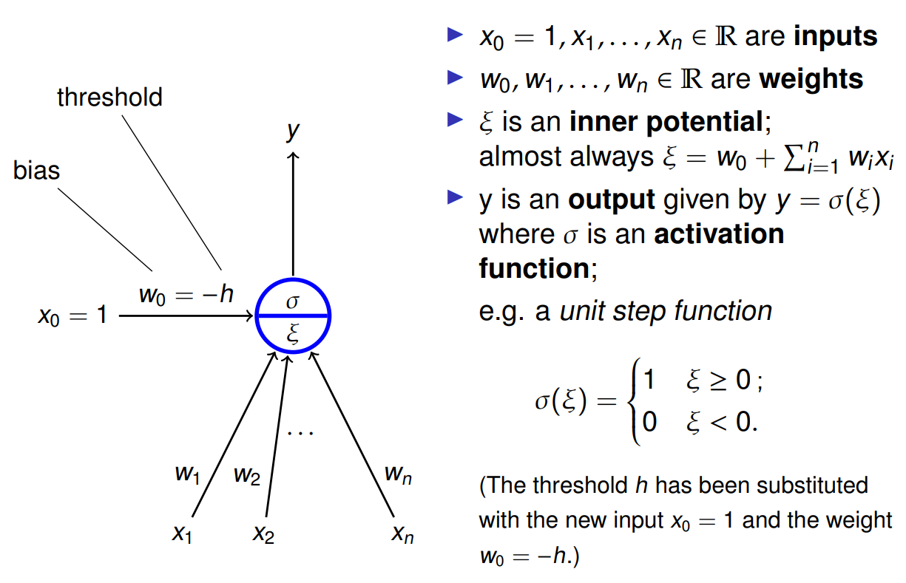

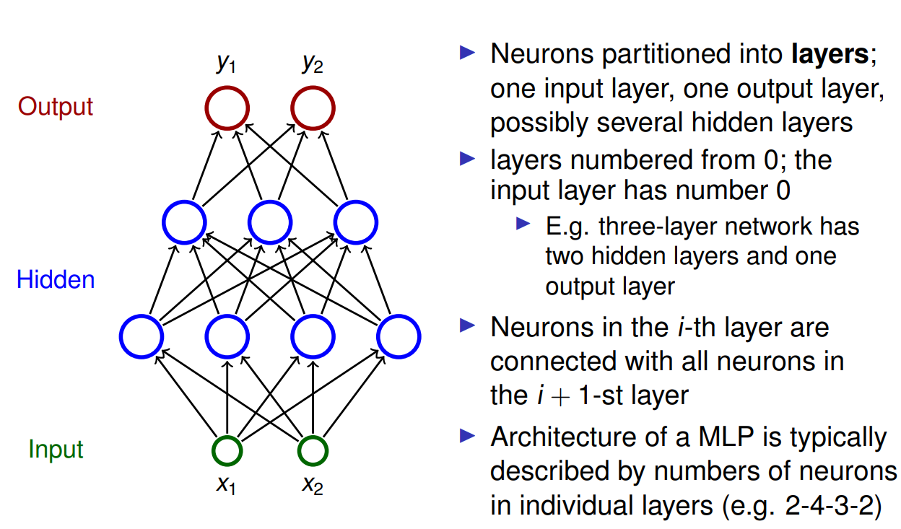

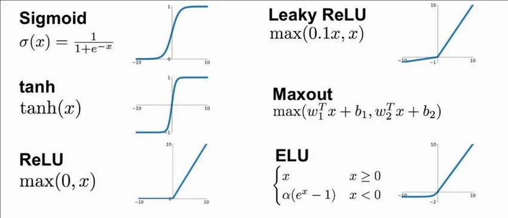

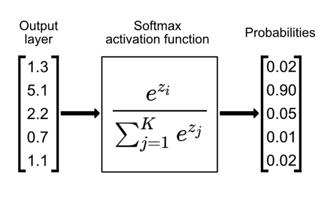

## Výrazové schopnosti
Výrazová schopnost sítě určuje, jak složité funkce je daná architektura schopna reprezentovat. Zatímco jednoduchý perceptron neumí vyřešit ani logickou operaci XOR (protože není lineárně separabilní), vícevrstvé sítě tento limit překonávají.
- **Řešení XOR:** MLP s alespoň jednou skrytou vrstvou dokáže transformovat vstupní prostor tak, že body operace XOR (vstupy [0,0], [1,1] vs. [0,1], [1,0]) se stanou lineárně oddělitelnými.
- **Univerzální aproximační věta:** Jedná se o zásadní teoretický výsledek, který říká, že dopředná síť s **jedinou skrytou vrstvou** (obsahující dostatečný počet neuronů) a nelineární aktivační funkcí dokáže s libovolnou přesností aproximovat jakoukoli spojitou funkci na kompaktní množině.
- **Hloubka vs. šířka:** Ačkoliv teoreticky stačí jedna vrstva, v praxi jsou hluboké sítě (více vrstev) mnohem efektivnější. Dokáží se naučit hierarchické rysy, kdy první vrstvy hledají hrany, další tvary a poslední celé objekty.
- *Příklad: Aproximace sinusoidy – zatímco lineární model vytvoří pouze přímku, MLP síť s pár neurony ve skryté vrstvě dokáže věrně kopírovat zakřivení této vlnovky.*

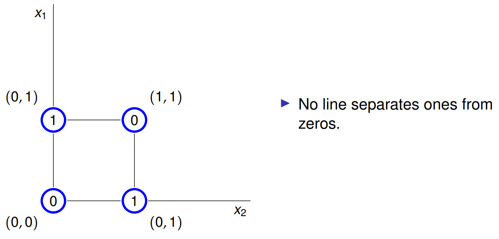

## Učení neuronových sítí

Učení neuronové sítě je proces optimalizace, jehož cílem je najít takové nastavení vah $w$ a biasů $b$, které minimalizuje chybovou funkci (Loss Function) $E$ na trénovací množině dat. Tento proces je typicky realizován pomocí iterativních algoritmů založených na výpočtu gradientu.

## Gradientní sestup (Gradient Descent)
Gradientní sestup je základní optimalizační algoritmus používaný k hledání lokálního minima chybové funkce. Algoritmus využívá faktu, že gradient funkce $\nabla E(w)$ určuje směr nejstrmějšího růstu funkce, a proto pohyb proti směru gradientu vede k jejímu poklesu.

* **Aktualizační pravidlo:** V každém kroku učení aktualizujeme váhy podle vzorce:
  $w_{t+1} = w_t - \eta \nabla E(w_t)$
  kde $\eta$ (eta) je **learning rate** (rychlost učení), která určuje délku kroku v daném směru.
* **Typy gradientního sestupu:**
    * **Batch Gradient Descent:** Gradient se počítá z celé trénovací množiny najednou. Je stabilní, ale u velkých dat extrémně pomalý.
    * **Stochastic Gradient Descent (SGD):** Gradient se počítá po každém jednotlivém trénovacím vzorku. Je velmi rychlý, ale trajektorie k minimu je velmi "šumivá".
    * **Mini-batch Gradient Descent:** Kompromis, kde se gradient počítá z malých skupin vzorků (batches). Aktuálně nejpoužívanější metoda.
* **Problém lokálních minim:** U nelineárních sítí je chybová funkce nekonvexní, což znamená, že gradientní sestup může uvíznout v lokálním minimu nebo sedlovém bodě.
* *Příklad: Představte si horolezce v husté mlze, který se snaží najít nejnižší bod údolí. Jediné, co cítí, je sklon země pod nohama, a tak se vydává směrem, kde svah nejvíce klesá.*

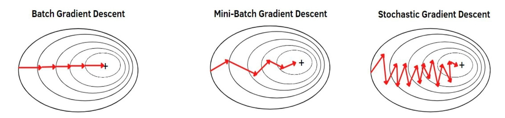
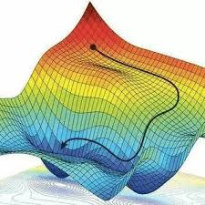

https://youtu.be/IHZwWFHWa-w?si=SnQzatDbKhrtbOst

## Zpětná propagace (Backpropagation)
Zpětná propagace je efektivní algoritmus pro výpočet parciálních derivací chybové funkce vzhledem ke všem vahám v síti ($\frac{\partial E}{\partial w_{ij}}$). Bez tohoto algoritmu by byl výpočet gradientu u hlubokých sítí s miliony parametrů prakticky nemožný.

* **Princip řetězového pravidla (Chain Rule):** Algoritmus je založen na derivaci složené funkce. Pokud výstup neuronu závisí na vstupech z předchozí vrstvy, můžeme chybu "přenášet" zpětně z výstupu ke vstupu.
* **Fáze algoritmu:**
    1. **Forward pass:** Data projdou sítí od vstupu k výstupu, vypočítají se aktivace všech neuronů a hodnota chybové funkce $E$.
    2. **Backward pass:** Počítáme chybu (error signal) $\delta$ od výstupní vrstvy směrem zpět.
* **Klíčové vzorce:**
    * **Chyba na výstupu:** $\delta_j^{(L)} = \frac{\partial E}{\partial y_j} \cdot \sigma'(z_j^{(L)})$, kde $z$ je vážený součet a $y$ je aktivace.
    * **Propagace chyby do skryté vrstvy:** $\delta_i^{(l)} = \sigma'(z_i^{(l)}) \sum_j w_{ij}^{(l+1)} \delta_j^{(l+1)}$.
    * **Výpočet gradientu váhy:** $\frac{\partial E}{\partial w_{ij}^{(l)}} = y_i^{(l-1)} \delta_j^{(l)}$.
* **Výpočetní efektivita:** Díky tomu, že si během dopředného průchodu pamatujeme aktivace neuronů, stačí pro výpočet všech gradientů pouze jeden zpětný průchod sítí.

https://youtu.be/tIeHLnjs5U8?si=4IoMuedi2SJ0W7j5

## Praktické otázky učení neuronových sítí

Úspěch učení neuronové sítě nezávisí pouze na algoritmu backpropagation, ale také na správném nastavení experimentu. Nevhodná příprava dat nebo špatná inicializace mohou vést k uvíznutí v sedlových bodech nebo k problému mizejícího gradientu.

## Příprava dat
Kvalita a formát vstupních dat přímo ovlivňují tvar chybové funkce a rychlost konvergence gradientního sestupu. Cílem přípravy je zajistit, aby síť nepřikládala některým vstupům neúměrně velký význam jen kvůli jejich číselnému rozsahu.

* **Normalizace a Standardizace:** Vstupy by měly mít podobné číselné rozsahy. Často se používá **Z-score normalizace** (odečtení průměru a vydělení směrodatnou odchylkou), která zajistí průměr 0 a rozptyl 1.
* **Proč to děláme:** Pokud mají vstupy různé rozsahy, chybová funkce je v některých směrech velmi protáhlá. Gradientní sestup pak "osciluje" a postupuje k minimu velmi pomalu.
* **Rozdělení dat:** Data se dělí na tři množiny:
    1. **Trénovací (Training):** Pro aktualizaci vah.
    2. **Validační (Validation):** Pro ladění hyperparametrů a sledování overfittingu.
    3. **Testovací (Test):** Pro finální, nestranný odhad kvality modelu.
* *Příklad: Při analýze realitního trhu má rozloha bytu hodnoty v řádu stovek, zatímco počet koupelen v řádu jednotek. Bez normalizace by síť reagovala téměř výhradně na rozlohu a ignorovala počet koupelen.*

## Inicializace vah
Nastavení počátečních hodnot vah před spuštěním učení je kritické. Pokud jsou váhy inicializovány špatně, signál se může při průchodu vrstvami ztratit (mizející gradient) nebo nekontrolovaně narůst (explodující gradient).

* **Symetrie:** Váhy nesmí být inicializovány na stejnou hodnotu (např. samé nuly). V takovém případě by se všechny neurony v dané vrstvě učily identicky a síť by se chovala jako jediný neuron. Tomuto se říká "breaking the symmetry".
* **Xavier (Glorot) inicializace:** Váhy jsou vybírány z distribuce s nulovým průměrem a rozptylem, který závisí na počtu vstupních a výstupních neuronů vrstvy. Je ideální pro sigmoidální a tanh funkce.
* **He inicializace:** Podobná jako Xavier, ale rozptyl je upraven pro funkci **ReLU**, která polovinu signálu nuluje.
* *Příklad: Pokud inicializujeme váhy příliš velkými čísly u sítě se sigmoidou, neurony se okamžitě "nasytí" (vstoupí do oblastí, kde je derivace sigmoidy téměř nulová) a učení se zastaví dříve, než začalo.*

## Volba a adaptace hyperparametrů
Hyperparametry jsou proměnné, které nenastavuje učící algoritmus sám, ale musí je zvolit programátor. Jejich správná volba je často otázkou iterativního testování.

* **Learning Rate ($\eta$):** Nejdůležitější parametr. 
    - Příliš velký $\eta$ způsobuje, že algoritmus minimum "přestřeluje" a diverguje.
    - Příliš malý $\eta$ vede k extrémně pomalému učení nebo uvíznutí v mělkých lokálních minimech.
* **Batch Size:** Počet vzorků zpracovaných před aktualizací vah. Menší batch size (např. 32) vnáší do učení šum, který pomáhá uniknout z lokálních minim (stochastický charakter).
* **Adaptace (Optimizer):** Moderní algoritmy upravují learning rate automaticky během učení pro každý parametr zvlášť:
    - **Momentum:** Přidává setrvačnost z předchozích kroků, pomáhá překonat sedlové body.
    - **RMSProp / AdaGrad:** Snižují learning rate pro váhy, které mají velké gradienty.
    - **Adam:** Kombinuje momentum a adaptivní learning rate. Aktuálně nejpopulárnější volba.
* **Early Stopping:** Ukončení učení v momentě, kdy chyba na validační množině začne stoupat, zatímco na trénovací klesá (prevence overfittingu).
* *Příklad: Pokud vidíme, že se chyba sítě s každou epochou prudce mění nahoru a dolů (cik-cak), je to signál, že musíme snížit learning rate nebo použít optimizer s lepším tlumením.*

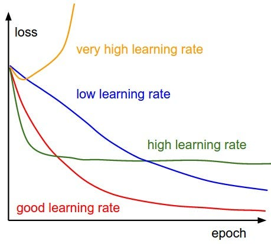

## Regularizace

Regularizace je soubor technik navržených k omezení přeučení (overfittingu) modelu. Cílem není minimalizovat chybu na trénovacích datech, ale maximalizovat schopnost generalizace na nová data. Regularizace vnáší do učení určitou formu omezení nebo preference pro "jednodušší" modely (Occamova břitva).

### Penalizace norem (L2 a L1 regularizace)
Jedná se o nejrozšířenější formu regularizace, která modifikuje chybovou funkci $E$ přidáním penalizačního členu závislého na velikosti vah $w$.
* **L2 regularizace (Weight Decay):** K chybové funkci se přičte člen $\frac{\lambda}{2} \sum w^2$. Tato penalizace brání vahám v extrémním nárůstu. Malé váhy znamenají, že výstup sítě se mění hladce při malých změnách vstupu.
* **L1 regularizace:** Přidává člen $\lambda \sum |w|$. Tato technika vede k "řídkým" vahám (sparsity), což znamená, že mnoho vah se během učení vynuluje. Efektivně tak provádí automatický výběr příznaků.
* **Parametr $\lambda$:** Určuje sílu regularizace. Příliš velké $\lambda$ vede k podvečení (underfitting), příliš malé k přeučení.
* *Příklad: U lineární regrese L2 regularizace (hřebenová regrese) zajistí, že model nebude vytvářet extrémně strmé křivky jen proto, aby proložil šum v datech.*

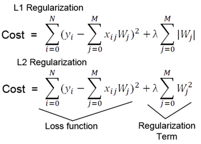

### Dropout
Dropout je moderní a velmi efektivní technika, která během každého kroku trénování náhodně "vypíná" (nastavuje na nulu) určitou část neuronů (typicky 20–50 %) v dané vrstvě.
* **Princip:** V každé iteraci se síť učí v jiné konfiguraci. Tím se zabraňuje sémantickému "spiknutí" neuronů (co-adaptation), kdy se jeden neuron spoléhá na konkrétní výstup jiného.
* **Robustnost:** Neurony jsou nuceny učit se robustnější rysy, které jsou užitečné nezávisle na přítomnosti ostatních specifických neuronů.
* **Testování:** Během testování (inference) jsou zapnuty všechny neurony, ale jejich výstupy jsou vynásobeny pravděpodobností jejich zapnutí během tréninku, aby byla zachována intenzita signálu.
* *Příklad: Dropout funguje podobně jako tým expertů, kde v každé fázi projektu náhodně chybí polovina lidí. Ostatní musí mít dostatečné znalosti, aby práci dokončili i bez chybějících kolegů.*

### Včasné ukončení (Early Stopping)
Tato technika využívá rozdělení dat na trénovací a validační množinu. Během učení sledujeme chybu na obou množinách současně.
* **Mechanismus:** Zatímco chyba na trénovací množině neustále klesá, chyba na validační množině po určité době začne stagnovat nebo stoupat. To je signál, že se model začíná přeučovat na šum v trénovacích datech.
* **Implementace:** Algoritmus si ukládá nejlepší dosažené váhy a učení ukončí ve chvíli, kdy se validační chyba nezlepší po určitý počet epoch (tzv. patience).
* *Příklad: Je to jako student, který se učí na zkoušku. Pokud začne memorovat pořadí slov v učebnici místo smyslu látky, jeho schopnost odpovědět na nové otázky (validační množina) se zhorší.*

### Rozšiřování dat (Dataset Augmentation)
Nejlepším způsobem regularizace je více dat. Pokud jich nemáme dostatek, můžeme je uměle vytvořit transformací stávajících vzorků.
* **Transformace:** V počítačovém vidění se používají rotace, ořezy (cropping), změny jasu, převrácení (flipping) nebo přidání šumu.
* **Vliv:** Model se díky tomu učí invariantnosti – pozná kočku bez ohledu na to, zda je vlevo, vpravo nebo vzhůru nohama.
* *Příklad: Pokud trénujeme čtečku SPZ, můžeme obrázky záměrně rozmazat nebo naklonit, aby si systém poradil i s nekvalitními záběry z reálných kamer.*

### Další techniky
* **Ensemble methods (Bagging):** Trénování více modelů nezávisle na sobě a následné průměrování jejich výsledků. Chyby jednotlivých modelů se vzájemně vyruší.
* **Noise Injection:** Přidávání šumu přímo do vah nebo do aktivací během trénování.
* **Batch Normalization:** Ačkoliv jde primárně o optimalizační techniku, má i mírný regularizační účinek díky šumu vnášenému výpočtem statistik přes malé dávky dat.

## Konvoluční neuronové sítě (CNN)

Konvoluční neuronové sítě jsou specializovaným typem dopředných sítí navrženým pro zpracování dat s mřížkovou topologií, typicky 2D obrazů. Jejich architektura vychází z poznatků o vizuálním kortexu savců, kde neurony reagují pouze na podněty v omezené části zorného pole (lokální receptivní pole).

Základním stavebním kamenem je konvoluční vrstva, která namísto plného propojení všech neuronů využívá operaci konvoluce. Tato vrstva extrahuje ze vstupu vizuální rysy (features) pomocí sady učitelných filtrů.

* **Lokální konektivita:** Neurony v konvoluční vrstvě jsou propojeny pouze s malou lokální oblastí předchozí vrstvy. To dramaticky snižuje počet parametrů sítě.
* **Sdílení vah (Shared Weights):** Jeden filtr (jádro/kernel) se aplikuje na všechna místa obrazu. Předpokládá se, že pokud je detektor hrany užitečný v levém horním rohu, bude užitečný i v pravém dolním.
* **Filtry a Feature Maps:** Výstupem aplikace jednoho filtru na celý obraz je tzv. **feature map**. Více filtrů v jedné vrstvě umožňuje detekovat různé rysy současně (vodorovné hrany, svislé hrany, barvy).
* **Matematická operace:** Hodnota pixelu na pozici $(i, j)$ ve feature mapě se vypočítá jako:
  $$y_{i,j} = \sigma \left( \sum_{m} \sum_{n} w_{m,n} \cdot x_{i+m, j+n} + b \right)$$
  kde $w$ je filtr o velikosti např. $3 \times 3$ a $x$ je vstupní obraz.
* *Příklad: Detekce hran – filtr s hodnotami [[-1, 0, 1], [-1, 0, 1], [-1, 0, 1]] zvýrazní v obraze svislé přechody mezi světlou a tmavou oblastí.*

### Parametry konvoluce
Výsledná velikost a chování konvoluční vrstvy jsou určeny třemi klíčovými hyperparametry:
* **Stride (Krok):** Určuje, o kolik pixelů se filtr posouvá při skenování obrazu. Stride 1 znamená posun o jeden pixel, stride 2 obraz efektivně zmenšuje na polovinu.
* **Padding (Zarovnání):** Doplnění okrajů obrazu (obvykle nulami), aby bylo možné aplikovat filtr i na pixely u krajů a aby nedocházelo k nechtěnému zmenšování feature mapy v každé vrstvě.
* **Depth (Hloubka):** Počet použitých filtrů v dané vrstvě, což odpovídá počtu výsledných feature map.
* *Příklad: Pokud na obrázek 32x32 aplikujeme 10 filtrů velikosti 5x5 se stride 1 a bez paddingu, výsledkem bude 10 feature map o velikosti 28x28.*

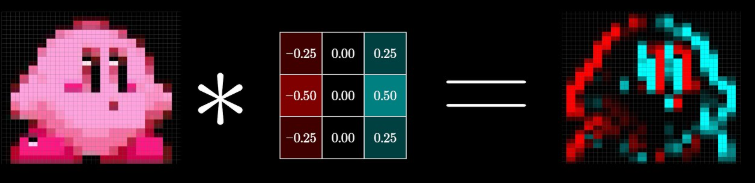

### Vrstva sdružování (Pooling)
Poolingové vrstvy se obvykle vkládají mezi konvoluční vrstvy. Jejich úkolem je snižovat prostorovou dimenzi (šířku a výšku) reprezentace, čímž se snižuje počet parametrů a výpočetní náročnost.

* **Max Pooling:** Nejčastější varianta, která z daného okna (např. 2x2) vybere pouze maximální hodnotu. Tím se zachovávají nejsilnější aktivace rysů.
* **Average Pooling:** Vypočítá průměr hodnot v okně.
* **Invariance:** Pooling pomáhá síti dosáhnout mírné **translační invariance** – pokud se hledaný rys v obraze mírně posune, po poolingu může jeho aktivace zůstat ve stejném "kbelíku".
* *Příklad: Max pooling 2x2 se stride 2 zmenší vstupní obraz 28x28 na 14x14, přičemž v každém bloku 2x2 pixelů ponechá jen ten nejvýraznější vizuální prvek.*

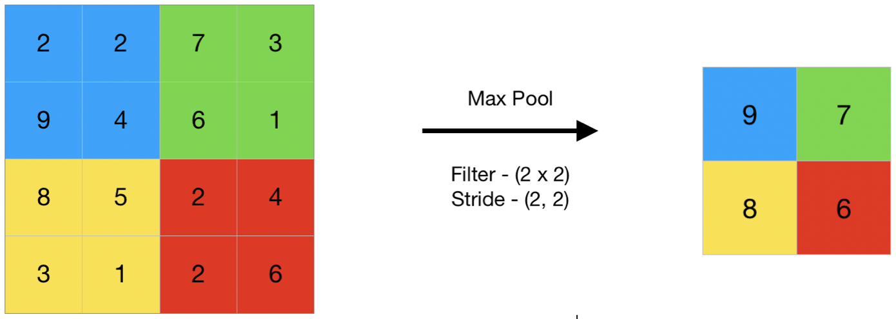

### Celková architektura a hierarchie
Typická konvoluční síť se skládá z bloků [Konvoluce + Aktivace (ReLU) + Pooling], za kterými následuje jedna nebo více plně propojených (Fully Connected) vrstev.

* **Hierarchie rysů:** Spodní vrstvy (blíže vstupu) se učí jednoduché koncepty jako hrany nebo textury. Vyšší vrstvy kombinují tyto informace do komplexnějších objektů (oči, kola, obličeje).
* **Plně propojené vrstvy:** Na konci sítě se feature mapy "zploští" (flatten) do jednoho vektoru a projdou klasickým MLP, který rozhodne o finální třídě.
* *Příklad: Architektura LeNet-5 byla jednou z prvních úspěšných CNN pro rozpoznávání rukou psaných číslic, využívající střídání konvolucí a sub-samplingu (poolingu).*

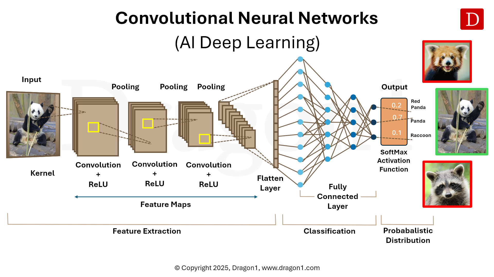

### Využití konvolučních sítí (CNN) dnes
CNN jsou dnes standardem pro jakoukoliv úlohu spojenou s počítačovým viděním. Jejich schopnost extrahovat hierarchické rysy z obrazu bez nutnosti ručního inženýrství příznaků je využívána v mnoha kritických odvětvích.

* ***Lékařská diagnostika:** CNN analyzují snímky z rentgenu, MRI nebo CT s přesností srovnatelnou s radiology. Dokáží detekovat nádory, zlomeniny nebo anomálie v tkáních.*
* ***Autonomní řízení:** Vozidla využívají konvoluční sítě v reálném čase k segmentaci vozovky, detekci chodců, dopravních značek a jiných vozidel z kamerových systémů.*
* ***Biometrie a bezpečnost:** Systémy rozpoznávání obličejů (např. FaceID) nebo analýza záznamů z bezpečnostních kamer pro detekci podezřelého chování.*
* ***Kontrola kvality v průmyslu:** Automatizovaná vizuální kontrola výrobků na linkách, kde CNN hledají mikrotrhliny nebo vady laku.*

## Rekurentní neuronové sítě (RNN)

Rekurentní neuronové sítě jsou určeny pro zpracování sekvenčních dat, kde na rozdíl od dopředných sítí závisí aktuální výstup nejen na aktuálním vstupu, ale i na historii předchozích stavů. Jsou ideální pro úlohy, kde má vstup nebo výstup proměnnou délku.

Základním rysem RNN je existence zpětných vazeb, které umožňují informaci kolovat uvnitř sítě. Síť si udržuje **skrytý stav** ($h_t$), který slouží jako vnitřní paměť uchovávající informace o tom, co síť viděla v předchozích časových krocích.

* **Výpočet stavu:** V čase $t$ se skrytý stav vypočítá jako funkce aktuálního vstupu $x_t$ a předchozího skrytého stavu $h_{t-1}$:
  $$h_t = \sigma(W_h h_{t-1} + W_x x_t + b)$$
  kde $W_h$ a $W_x$ jsou matice vah a $\sigma$ je nelineární aktivační funkce (obvykle tanh nebo ReLU).
* **Sdílení parametrů:** Klíčovým principem je, že matice vah $W$ jsou **stejné** pro každý časový krok. To umožňuje síti zobecňovat vzory nezávisle na jejich pozici v sekvenci.
* *Příklad: Při predikci dalšího slova ve větě "Kočka pije ..." musí síť vědět, že podmětem je "Kočka", aby správně odhadla sloveso v jednotném čísle.*

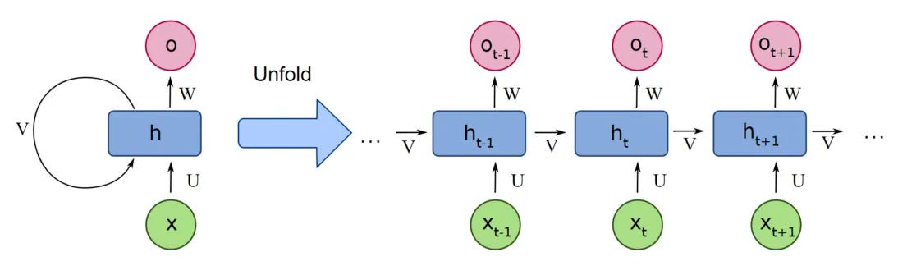

### Rozvinutí v čase (Unrolling)
Pro účely výpočtu a učení si RNN můžeme představit jako graf rozvinutý v čase. Rozvinutá síť vypadá jako velmi hluboká dopředná síť, kde každá vrstva reprezentuje jeden časový krok a všechny vrstvy sdílejí identické váhy.

* **Výpočetní graf:** Rozvinutí transformuje rekurenci na posloupnost operací, což umožňuje aplikovat standardní algoritmy pro optimalizaci.
* **Variabilita:** Díky rekurenci může síť zpracovat sekvence libovolné délky, aniž by se měnil počet parametrů modelu.
* *Příklad: Pokud věta má 5 slov, rozvineme síť do 5 "kopií", pokud má 10 slov, rozvineme ji do 10, přičemž matematické operace zůstávají stejné.*

### Učení pomocí BPTT
Algoritmus pro učení RNN se nazývá **Backpropagation Through Time (BPTT)**. Je to rozšíření klasické zpětné propagace pro rozvinuté grafy.

1. **Forward Pass:** Sekvence projde rozvinutou sítí a vypočítá se celková ztráta (Loss) jako součet chyb v jednotlivých časových krocích.
2. **Backward Pass:** Chyba se propaguje zpět od konce sekvence k začátku.
3. **Akumulace gradientů:** Protože váhy jsou v každém kroku sdílené, výsledný gradient pro každou váhu je součtem gradientů vypočítaných ve všech časových krocích.
* **Problém mizejícího gradientu:** Při dlouhých sekvencích (mnoho kroků zpět) se gradient při opakovaném násobení maticí vah buď zmenší k nule (vanishing), nebo nekontrolovaně naroste (exploding). To brání síti učit se dlouhodobé závislosti.

### Hradlové mechanismy (LSTM a GRU)
K vyřešení problémů s mizejícím gradientem a krátkou pamětí byly navrženy pokročilé architektury využívající tzv. hradla (gates), která řídí tok informací.

* **LSTM (Long Short-Term Memory):** Zavádí speciální "vnitřní buňku" (cell state), která funguje jako dálnice pro informaci. Gradient po ní může téct téměř bez změny.
    - **Forget Gate:** Rozhoduje, jakou část staré paměti zapomenout.
    - **Input Gate:** Rozhoduje, které nové informace uložit do paměti.
    - **Output Gate:** Určuje, co z paměti se propustí na výstup.
* **GRU (Gated Recurrent Unit):** Zjednodušená varianta LSTM, která kombinuje zapomínací a vstupní hradlo do jednoho "update" hradla. Má méně parametrů a je výpočetně efektivnější.
* *Příklad: LSTM dokáže v dlouhém odstavci textu "pamatovat", že na začátku byl hrdina mužského pohlaví, a správně používat zájmeno "on" i o pět vět později.*

## Využití rekurentních sítí (RNN) dnes
Ačkoliv v oblasti zpracování jazyka (NLP) přebírají prvenství Transformery, RNN a zejména LSTM zůstávají klíčové v úlohách s omezenými zdroji nebo tam, kde je kritické zpracování v reálném čase.

* ***Předpovídání časových řad:** Využití ve financích pro odhad vývoje cen akcií, v energetice pro predikci spotřeby elektřiny nebo v meteorologii.*
* ***Rozpoznávání řeči:** Systémy jako Siri nebo Alexa využívají rekurentní mechanismy ke zpracování zvukových vln a jejich převodu na text (Speech-to-Text).*
* ***Prediktivní údržba (Industry 4.0):** Analýza sekvencí dat ze senzorů (vibrace, teplota), která dokáže předpovědět poruchu stroje dříve, než k ní dojde.*
* ***Analýza sentimentu:** Hodnocení recenzí nebo příspěvků na sociálních sítích, kde RNN chápou kontext a pořadí slov, což je zásadní pro pochopení ironie nebo negace.*
* *Příklad: Klávesnice v mobilních telefonech používají lehké RNN modely k predikci dalšího slova, které se uživatel chystá napsat, na základě historie předchozích slov.*