# Neuronové sítě

> Vícevrstvé sítě a jejich výrazové schopnosti. 
> Učení neuronových sítí: Gradientní sestup, zpětná propagace, 
> praktické otázky učení (příprava dat, inicializace vah, volba a adaptace hyperparametrů). 
> Regularizace. Konvoluční sítě. Rekurentní sítě.
 

Neuronové sítě jsou výpočetní modely inspirované strukturou biologického
mozku. Skládají se z propojených neuronů, které zpracovávají informace
pomocí vah, biasů a aktivačních funkcí. Jejich hlavní výhodou je
schopnost automaticky se učit reprezentace dat přímo z příkladů bez
nutnosti ručně navrhovat příznaky (features).

První neuronové sítě vznikly již v 50. letech 20. století
(McCulloch-Pittsův neuron, perceptron), jejich masivní rozvoj však
nastal až po roce 2010 díky velkým datovým sadám, výkonným GPU a
pokroku v algoritmech učení. Dnes tvoří základ moderní umělé
inteligence.

Na rozdíl od mnoha klasických metod strojového učení (např. logistická
regrese, rozhodovací stromy nebo SVM) dokážou neuronové sítě samy
extrahovat složité hierarchické reprezentace dat. Díky tomu dosahují
špičkových výsledků zejména při zpracování obrazů, zvuku, textu a dalších
nestrukturovaných dat.

Mezi nejvýznamnější typy neuronových sítí patří:
- **MLP (Multilayer Perceptron)** – základní dopředné sítě pro obecné
  úlohy klasifikace a regrese.
- **CNN (Convolutional Neural Networks)** – specializované na zpracování
  obrazů a počítačové vidění.
- **RNN, LSTM, GRU** – sítě určené pro sekvenční data a časové řady.
- **Transformery** – současný standard pro zpracování jazyka a základ
  velkých jazykových modelů (LLM) jako GPT.

## Vícevrstvé sítě (MLP)
Vícevrstvý perceptron (Multilayer Perceptron – MLP) je dopředná neuronová síť (feed-forward), která obsahuje kromě vstupní a výstupní vrstvy také jednu nebo více **skrytých vrstev**. Právě skryté vrstvy umožňují síti vytvářet vnitřní reprezentace dat a chápat hierarchické vztahy.

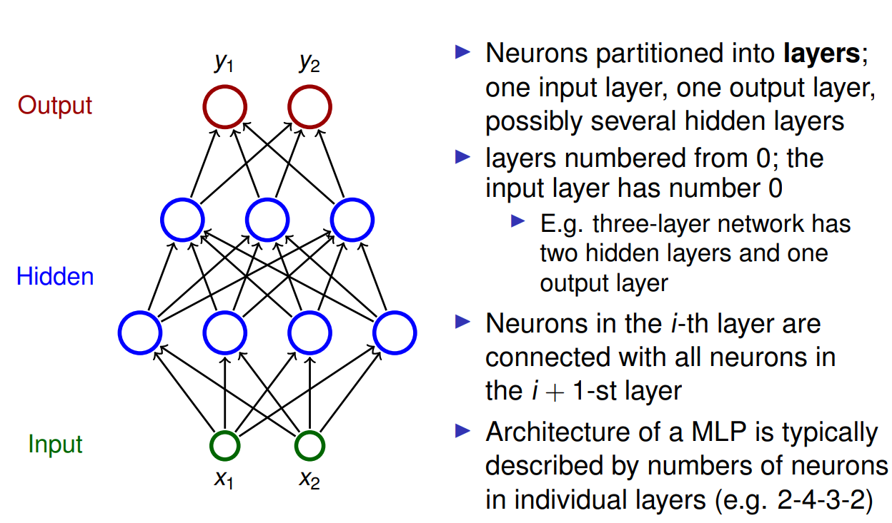

Každý neuron v jedné vrstvě je typicky spojen se všemi neurony v následující vrstvě (fully connected). Každý spoj má svou **váhu** ($w$) a každý neuron má svůj **práh/bias** ($b$).
Výstup neuronu se počítá jako

$$
y=\sigma\left(\sum_i w_i x_i+b\right),
$$

kde $x_i$ jsou vstupy, $w_i$ jejich váhy, $b$ bias a $\sigma$ aktivační
funkce.

Výpočet probíhá ve směru od vstupu k výstupu, kde výstupem neuronu je aplikovaná aktivační funkce na vážený součet vstupů.

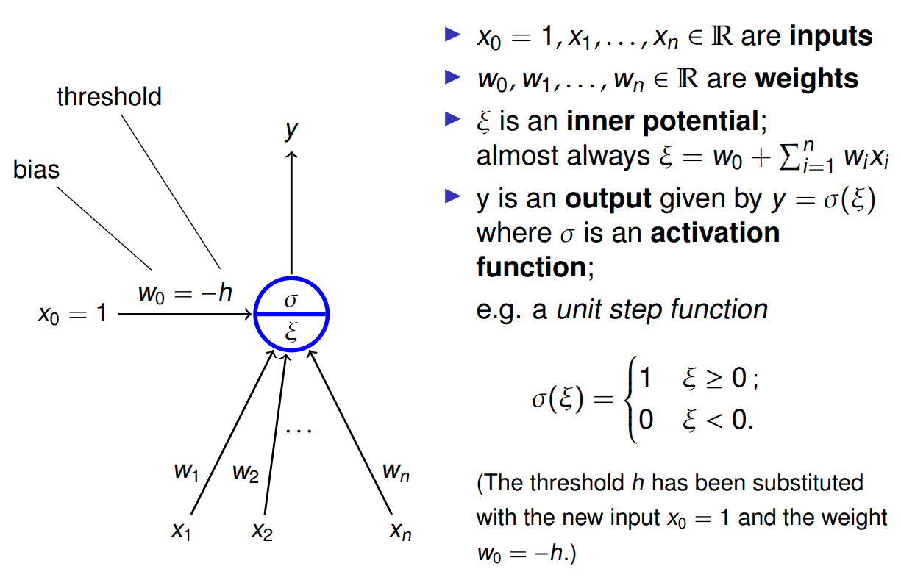

### Aktivační funkce

Aktivační funkce zavádějí do neuronové sítě **nelinearitu**. Bez nich by
se i síť s mnoha vrstvami zredukovala na jedinou lineární transformaci,
a její výrazová schopnost by nebyla větší než u obyčejné lineární
regrese. Díky nelineárním aktivacím se síť může učit složité vztahy,
rozhodovací hranice a aproximovat nelineární funkce.

Aktivační funkce musí být především **nelineární** a
**diferencovatelná** (alespoň téměř všude), aby bylo možné síť učit
pomocí backpropagation. Dále je žádoucí **nenulový gradient** ve většině
definičního oboru, aby se gradient během zpětné propagace neztrácel a
neurony se mohly efektivně učit. Výhodou je také **výpočetní
jednoduchost**, protože se aktivační funkce vyhodnocuje pro velké
množství neuronů při každém průchodu sítí, a její rychlý výpočet tak
významně ovlivňuje dobu trénování i inference.

Neuron nejprve spočítá vážený součet vstupů

$$
z = \sum_i w_i x_i + b
$$

a následně na něj aplikuje aktivační funkci

$$
y = \sigma(z).
$$

Výsledná aktivace se předává do dalších vrstev.

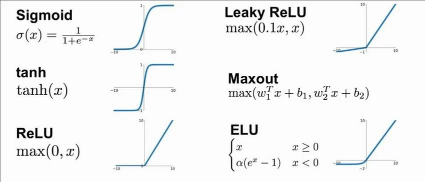

- **ReLU** ( $\max(0,x)$ ) – nejpoužívanější aktivace; rychlá, zmírňuje
  mizející gradient a urychluje učení hlubokých sítí. Nevýhoda:
  mrtvé neurony (Dying ReLU).

- **Sigmoida** ($\frac{1}{1+e^{-x}}$) – výstup v intervalu $(0,1)$,
  vhodná pro binární klasifikaci. Trpí saturací a mizejícím gradientem,
  výstupy nejsou centrovány kolem nuly.

- **tanh** – výstup v intervalu $(-1,1)$, podobná sigmoidě, ale
  centrovaná kolem nuly. Také trpí saturací a mizejícím gradientem.

- **Softmax** – převádí výstupy na pravděpodobnostní rozdělení
  (součet = 1), používá se ve výstupní vrstvě pro vícetřídní
  klasifikaci.

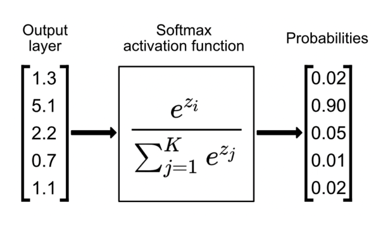

Další aktivační funkce:

- **Leaky ReLU:** $\max(\alpha x, x)$ – řeší problém mrtvých neuronů
  tím, že ponechává malý gradient i pro záporné vstupy.
- **PReLU:** podobná Leaky ReLU, ale parametr $\alpha$ se učí během
  trénování.
- **ELU:** pro záporné vstupy používá exponenciální část, zlepšuje tok
  gradientu.
- **GELU:** moderní hladká aktivace používaná v transformerech
  (BERT, GPT, T5).
- **SiLU (Swish):** $x \cdot \sigma(x)$, často používaná v moderních
  CNN a detekčních modelech (např. YOLO).
- **Mish:** novější hladká aktivace, někdy dosahuje lepších výsledků
  než ReLU, ale je výpočetně náročnější.

## Výrazové schopnosti
Výrazová schopnost sítě určuje, jak složité funkce je daná architektura schopna reprezentovat. Zatímco jednoduchý perceptron neumí vyřešit ani logickou operaci XOR (protože není lineárně separabilní), vícevrstvé sítě tento limit překonávají.
- **Řešení XOR:** MLP s alespoň jednou skrytou vrstvou dokáže transformovat vstupní prostor tak, že body operace XOR (vstupy [0,0], [1,1] vs. [0,1], [1,0]) se stanou lineárně oddělitelnými.

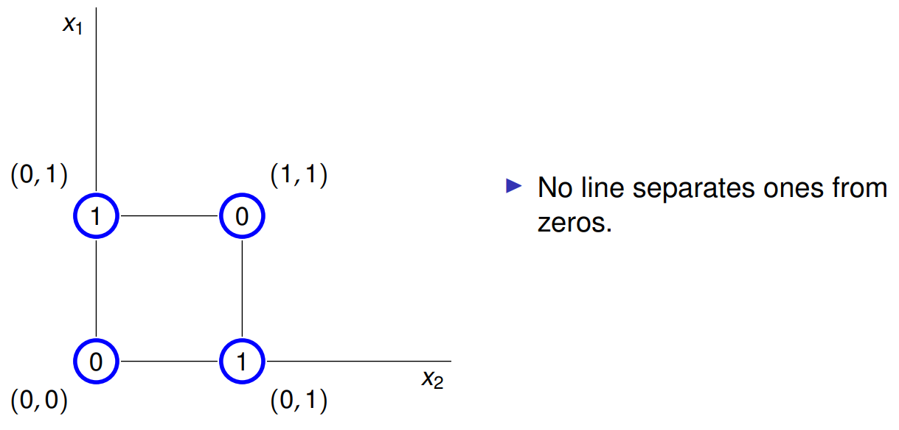

**Univerzální aproximační věta (Universal Approximation Theorem)** říká,
že dopředná neuronová síť s **jednou skrytou vrstvou**, dostatečně velkým
počtem neuronů a vhodnou **nelineární aktivační funkcí** (sigmoida, tanh,
ReLU aj.) dokáže aproximovat libovolnou **spojitou funkci**
$f : K \rightarrow \mathbb{R}$ na kompaktní množině $K \subseteq \mathbb{R}^n$
s libovolně malou chybou.

Formálně:

Pro každé $\varepsilon > 0$ existuje síť

$$
g(x)=\sum_{i=1}^{N} a_i \sigma(w_i^T x+b_i),
$$

taková, že

$$
|f(x)-g(x)| < \varepsilon
$$

pro všechna $x \in K$.

Důležité:
- Věta říká pouze **existenci** takové sítě, ne jak ji najít.
- Neříká nic o počtu neuronů potřebných k dosažení dané přesnosti.
- Neříká, že síť půjde efektivně natrénovat.
- V praxi bývají **hluboké sítě** efektivnější než jedna extrémně široká
  vrstva, protože dokážou reprezentovat složité funkce s menším počtem
  parametrů.

## Učení neuronových sítí

Učení neuronové sítě je proces optimalizace, jehož cílem je najít takové nastavení vah $w$ a biasů $b$, které minimalizuje chybovou funkci (Loss Function) $E$ na trénovací množině dat. Tento proces je typicky realizován pomocí iterativních algoritmů založených na výpočtu gradientu.

### Chybové funkce (Loss Functions)
Kvantifikují rozdíl mezi predikcí sítě ($\hat{y}$) a skutečností ($y$). Trénováním se tato penalizace minimalizuje. Musí být **diferencovatelná** pro výpočet gradientu.

**MLE (Metoda maximální věrohodnosti)** je zastřešující teoretický princip z matematické statistiky. Je to nástroj, který nám říká, jak chybové funkce správně odvodit. 
Minimalizace loss funkcí odpovídá maximalizaci věrohodnosti dat (Gaussovo rozdělení chyb $\rightarrow$ MSE, Bernoulliho $\rightarrow$ binární křížová entropie, Multinomické $\rightarrow$ kategoriální křížová entropie).

**1. Úlohy regrese (spojitý výstup)**

* **MSE (Mean Squared Error):** $E = \frac{1}{n} \sum (y_i - \hat{y}_i)^2$ – penalizuje velké chyby (odlehlé hodnoty).
* **MAE (Mean Absolute Error):** $E = \frac{1}{n} \sum |y_i - \hat{y}_i|$ – robustnější vůči odlehlým hodnotám.

**2. Úlohy klasifikace (kategorie)**

* **Binární křížová entropie:** $E = -\frac{1}{n} \sum [y_i \log(\hat{y}_i) + (1 - y_i) \log(1 - \hat{y}_i)]$ – pro 2 třídy, výstup: **Sigmoida**.
* **Kategoriální křížová entropie:** $E = -\sum y_i \log(\hat{y}_i)$ – pro $N$ tříd (One-Hot vektory), výstup: **Softmax**.
* **Sparse Categorical Cross-Entropy:** Stejná jako kategoriální, ale labely jsou celá čísla ($0, 1, 2...$). Šetří paměť.
* **Dice Loss:** $E = 1 - \frac{2 |X \cap Y|}{|X| + |Y|}$ – pro sémantickou segmentaci. Klíčová při **extrémní nevyváženosti tříd** (např. malý objekt na velkém pozadí), kde křížová entropie selhává.

## Gradientní sestup (Gradient Descent)
Gradientní sestup je základní optimalizační algoritmus používaný k hledání lokálního minima chybové funkce. Algoritmus využívá faktu, že gradient funkce $\nabla E(w)$ určuje směr nejstrmějšího růstu funkce, a proto pohyb proti směru gradientu vede k jejímu poklesu.

* **Aktualizační pravidlo:** V každém kroku učení aktualizujeme váhy podle vzorce:
  $w_{t+1} = w_t - \eta \nabla E(w_t)$
  kde $\eta$ (eta) je **learning rate** (rychlost učení), která určuje délku kroku v daném směru.
* **Typy gradientního sestupu:**
    * **Batch Gradient Descent:** Gradient se počítá z celé trénovací množiny najednou. Je stabilní, ale u velkých dat extrémně pomalý.
    * **Stochastic Gradient Descent (SGD):** Gradient se počítá po každém jednotlivém trénovacím vzorku. Je velmi rychlý, ale trajektorie k minimu je velmi "šumivá".
    * **Mini-batch Gradient Descent:** Kompromis, kde se gradient počítá z malých skupin vzorků (batches). Aktuálně nejpoužívanější metoda.
* **Problém lokálních minim:** U nelineárních sítí je chybová funkce nekonvexní, což znamená, že gradientní sestup může uvíznout v lokálním minimu nebo sedlovém bodě.
* *Příklad: Představte si horolezce v husté mlze, který se snaží najít nejnižší bod údolí. Jediné, co cítí, je sklon země pod nohama, a tak se vydává směrem, kde svah nejvíce klesá.*

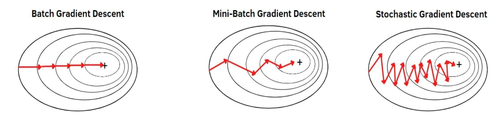
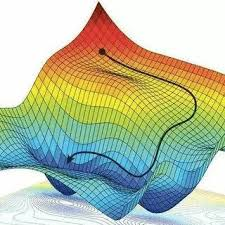

3Blue1Brown: Gradient Descent
https://youtu.be/IHZwWFHWa-w?si=SnQzatDbKhrtbOst

- **Epocha** – jeden průchod celou trénovací množinou.
- **Batch** – množina vzorků použitá pro jednu aktualizaci vah.
- **Mini-batch** – menší část datasetu (např. 32 nebo 128 vzorků),
  používaná v praxi nejčastěji.
- **Iterace** – jedna aktualizace vah na základě jednoho batchi.

Počet iterací v jedné epoše:

$$
\text{iterace}=
\frac{\text{počet vzorků}}{\text{batch size}}
$$

### Problém mizejícího a explodujícího gradientu

Při zpětné propagaci se gradient počítá pomocí opakovaného násobení
derivací aktivačních funkcí a vah jednotlivých vrstev.

**Mizející gradient (vanishing)**  
Pokud jsou derivace < 1 (např. sigmoida, tanh), gradient exponenciálně klesá:
$0.5 \cdot 0.5 \cdot 0.5 \cdot ... \rightarrow 0$
Důsledky: téměř nulové aktualizace prvních vrstev, pomalé učení, špatné zachycení dlouhých závislostí (hluboké sítě, RNN).

**Explodující gradient (exploding)**  
Pokud jsou derivace/váhy > 1, gradient exponenciálně roste:
$2 \cdot 2 \cdot 2 \cdot ... \rightarrow \infty$
Důsledky: nestabilita, divergence, NaN hodnoty, velké skoky vah.

Řešení:
- ReLU a její varianty.
- Xavier/He inicializace.
- Batch Normalization.
- Gradient Clipping (pro exploding gradient).
- LSTM a GRU u rekurentních sítí.
- Residual Connections (ResNet).

## Zpětná propagace (Backpropagation)
Zpětná propagace je efektivní algoritmus pro výpočet parciálních derivací chybové funkce vzhledem ke všem vahám v síti ($\frac{\partial E}{\partial w_{ij}}$). Bez tohoto algoritmu by byl výpočet gradientu u hlubokých sítí s miliony parametrů prakticky nemožný.

* **Princip řetězového pravidla (Chain Rule):** Algoritmus je založen na derivaci složené funkce. Pokud výstup neuronu závisí na vstupech z předchozí vrstvy, můžeme chybu "přenášet" zpětně z výstupu ke vstupu.
* **Fáze algoritmu:**
    1. **Forward pass:** Data projdou sítí od vstupu k výstupu, vypočítají se aktivace všech neuronů a hodnota chybové funkce $E$.
    2. **Backward pass:** Počítáme chybu (error signal) $\delta$ od výstupní vrstvy směrem zpět.
* **Klíčové vzorce:**
    * **Chyba na výstupu:** $\delta_j^{(L)} = \frac{\partial E}{\partial y_j} \cdot \sigma'(z_j^{(L)})$, kde $z$ je vážený součet a $y$ je aktivace.
    * **Propagace chyby do skryté vrstvy:** $\delta_i^{(l)} = \sigma'(z_i^{(l)}) \sum_j w_{ij}^{(l+1)} \delta_j^{(l+1)}$.
    * **Výpočet gradientu váhy:** $\frac{\partial E}{\partial w_{ij}^{(l)}} = y_i^{(l-1)} \delta_j^{(l)}$.
* **Výpočetní efektivita:** Díky tomu, že si během dopředného průchodu pamatujeme aktivace neuronů, stačí pro výpočet všech gradientů pouze jeden zpětný průchod sítí.

3Blue1Brown: Backpropagation calculus
https://youtu.be/tIeHLnjs5U8?si=4IoMuedi2SJ0W7j5

## Praktické otázky učení neuronových sítí

Úspěch učení neuronové sítě nezávisí pouze na algoritmu backpropagation, ale také na správném nastavení experimentu. Nevhodná příprava dat nebo špatná inicializace mohou vést k uvíznutí v sedlových bodech nebo k problému mizejícího gradientu.

## Příprava dat
Neuronové sítě jsou obecně náročnější na množství dat než většina
klasických metod strojového učení (např. rozhodovací stromy nebo SVM),
ale při dostatku dat obvykle dosahují lepších výsledků.

Kvalita a formát vstupních dat přímo ovlivňují tvar chybové funkce a rychlost konvergence gradientního sestupu. Cílem přípravy je zajistit, aby síť nepřikládala některým vstupům neúměrně velký význam jen kvůli jejich číselnému rozsahu.

* **Normalizace a Standardizace:** Vstupy by měly mít podobné číselné rozsahy. Často se používá **Z-score normalizace** (odečtení průměru a vydělení směrodatnou odchylkou), která zajistí průměr 0 a rozptyl 1.
Pokud mají vstupy různé rozsahy, chybová funkce je v některých směrech velmi protáhlá. Gradientní sestup pak "osciluje" a postupuje k minimu velmi pomalu.
* **Rozdělení dat:** Data se dělí na tři množiny:
    1. **Trénovací (Training):** Pro aktualizaci vah.
    2. **Validační (Validation):** Pro ladění hyperparametrů a sledování overfittingu.
    3. **Testovací (Test):** Pro finální, nestranný odhad kvality modelu.
* *Příklad: Při analýze realitního trhu má rozloha bytu hodnoty v řádu stovek, zatímco počet koupelen v řádu jednotek. Bez normalizace by síť reagovala téměř výhradně na rozlohu a ignorovala počet koupelen.*

## Inicializace vah

Před začátkem trénování je nutné nastavit počáteční hodnoty vah.
Inicializace má významný vliv na rychlost i stabilitu učení. Pokud jsou
váhy příliš malé, signál a gradient se při průchodu sítí postupně
ztrácejí (**vanishing gradient**). Pokud jsou naopak příliš velké,
aktivace a gradienty mohou nekontrolovaně růst (**exploding gradient**).

Cílem moderních inicializačních metod je zachovat přibližně stejný
rozptyl aktivací a gradientů napříč vrstvami.

**Symetrie**: Váhy nesmí být inicializovány na stejnou hodnotu (např. samé nuly).
Všechny neurony by pak produkovaly stejné výstupy, dostávaly stejné
gradienty a učily se identicky.

Proto se váhy inicializují náhodně:
$w_i \sim \mathcal{N}(0,\sigma^2)$
nebo
$w_i \sim U(-a,a)$, kde $\mathcal{N}$ označuje normální a $U$ rovnoměrné rozdělení.

### Xavier (Glorot) inicializace

Navržena pro aktivační funkce typu **sigmoida** a **tanh**.
Myšlenkou je zachovat přibližně stejný rozptyl signálu mezi vrstvami,
aby nedocházelo k jeho zesilování ani zeslabování.

Pro normální rozdělení:
$w \sim \mathcal{N}
\left(
0,
\frac{2}{n_{in}+n_{out}}
\right)$

Pro rovnoměrné rozdělení:
$w \sim
U
\left(
-\sqrt{\frac{6}{n_{in}+n_{out}}},
\sqrt{\frac{6}{n_{in}+n_{out}}}
\right)$

kde:
- $n_{in}$ je počet vstupních neuronů,
- $n_{out}$ je počet výstupních neuronů.

### He inicializace

Určena především pro **ReLU** a její varianty.
Protože ReLU pro záporné vstupy vrací nulu, přibližně polovina signálu
se během průchodu sítí ztrácí. He inicializace proto používá větší
rozptyl než Xavier.

Pro normální rozdělení:
$w \sim
\mathcal{N}
\left(
0,
\frac{2}{n_{in}}
\right)$

Pro rovnoměrné rozdělení:
$w \sim
U
\left(
-\sqrt{\frac{6}{n_{in}}},
\sqrt{\frac{6}{n_{in}}}
\right)$

Díky tomu lépe zachovává velikost aktivací a gradientů v hlubokých
sítích používajících ReLU.

| Aktivační funkce | Doporučená inicializace |
|------------------|-------------------------|
| Sigmoida | Xavier |
| tanh | Xavier |
| ReLU | He |
| Leaky ReLU | He |
| GELU | He |

Kromě Xavier a He existují i další méně běžné metody,
ale v praxi: většina moderních modelů používá Xavier / He, tyto jsou specifické pro konkrétní architektury nebo aktivace.

- **LeCun init** – pro SELU: $w \sim \mathcal{N}(0, \frac{1}{n_{in}})$
- **Orthogonal init** – váhy tvoří ortogonální matice, stabilní pro hluboké sítě a RNN.
- **Identity / Dirac init** – začíná jako (bloková) identita, používá se hlavně v ResNet pro stabilní start.
- **Uniform / Normal (defaultně neškálované)** – jednoduchá náhodná inicializace bez řízení variance, dnes spíš jen okrajově.

## Volba a adaptace hyperparametrů

Hyperparametry jsou hodnoty, které se neučí během trénování, ale musí je nastavit uživatel. Ovlivňují rychlost učení, stabilitu trénování i schopnost modelu generalizovat. Ladí se iterativně na základě experimentů.

Hyperparametry lze rozdělit na:
- optimalizační (jak se model učí)
- trénovací (jak probíhá proces učení)
- architektonické (jak je model postaven)
- regularizační (jak se omezuje overfitting)
- datové (jak jsou data prezentována modelu)

V praxi mají největší vliv learning rate, batch size, optimizer, regularizace a architektura modelu

### Optimalizace (learning dynamics)

- **Learning rate ($\eta$)** – určuje velikost kroku při aktualizaci vah  
  Příliš velké $\eta$ způsobuje divergence (přestřelování minima), příliš malé vede k pomalému učení nebo stagnaci.

- **Optimizers (adaptace kroku)** – určují, jak se aktualizují váhy během učení  
  - **Momentum** – přidává setrvačnost do gradientu, zrychluje konvergenci a tlumí oscilace  
  - **RMSProp / AdaGrad** – adaptují learning rate pro jednotlivé parametry podle velikosti gradientů, stabilizují učení  
  - **Adam / AdamW** – kombinuje momentum a adaptivní learning rate, dnes nejpoužívanější optimizer, dobře funguje v praxi bez složitého ladění

- **Learning rate schedule** – určuje, jak se learning rate mění v čase  
  Ovlivňuje stabilitu a finální kvalitu řešení (např. postupné snižování pro jemné doladění minima)

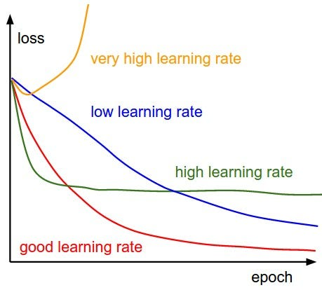

### Trénovací režim

- **Batch size** – počet vzorků na jednu aktualizaci vah  
  Ovlivňuje stabilitu gradientu a generalizaci: malý batch přidává šum (lepší generalizace), velký batch je stabilnější, ale hůře generalizuje a je náročnější na paměť

- **Počet epoch** – kolikrát se projdou všechna data  
  Ovlivňuje míru naučení; příliš málo → underfitting, příliš mnoho → overfitting

- **Early stopping** – ukončení tréninku při zhoršení validační chyby  
  Chrání před overfittingem a zbytečným přeučením modelu

### Architektura modelu

- **Počet vrstev (depth)** – určuje hloubku modelu  
  Ovlivňuje schopnost modelu zachytit složité vzory, ale i riziko vanishing gradient a náročnost trénování

- **Šířka vrstev (neurony/filtry)** – určuje kapacitu jednotlivých vrstev  
  Ovlivňuje paměť modelu a schopnost reprezentovat složitost dat

- **Aktivační funkce** – určuje nelinearitu modelu  
  Ovlivňuje stabilitu gradientů a rychlost učení (např. ReLU vs sigmoid)

- **Velikost kernelu (CNN)** – velikost konvolučního filtru  
  Ovlivňuje rozsah lokálního kontextu, který model vidí

- **Embedding dimension (NLP)** – velikost vektorové reprezentace slov/tokenů  
  Ovlivňuje informační kapacitu reprezentace

- **Typ vrstvy (Conv, RNN, Transformer)** – volba architektury  
  Ovlivňuje způsob zpracování dat (prostorová, sekvenční, attention)

### Regularizace

- **Dropout rate** – pravděpodobnost vypnutí neuronů během tréninku  
  Ovlivňuje robustnost modelu a snižuje overfitting

- **Weight decay (L2 regularizace)** – penalizuje velké váhy  
  Ovlivňuje hladkost modelu a zlepšuje generalizaci

- **Label smoothing** – změkčuje cílové distribuce tříd  
  Ovlivňuje jistotu modelu a snižuje přeučení na tvrdé labely

- **Data augmentation strength** – míra úprav trénovacích dat  
  Ovlivňuje robustnost modelu vůči variacím vstupů

- **Stochastic depth** – náhodné vynechávání vrstev  
  Ovlivňuje stabilitu hlubokých sítí a funguje jako regularizace

### Data pipeline

- **Shuffle dat** – náhodné promíchání vzorků  
  Ovlivňuje stabilitu a zabraňuje naučení pořadí dat

- **Batch sampling strategie** – způsob výběru batchů  
  Ovlivňuje rozložení dat během tréninku a stabilitu gradientu

- **Délka sekvence** – počet kroků u sekvenčních dat  
  Ovlivňuje paměťovou náročnost a schopnost zachytit dlouhé závislosti

- **Stride (sliding window)** – krok posunu okna nad daty  
  Ovlivňuje množství trénovacích vzorků a redundanci dat

## Regularizace

Regularizace je soubor technik navržených k omezení přeučení (overfittingu) modelu. Cílem není minimalizovat chybu na trénovacích datech, ale maximalizovat schopnost generalizace na nová data. Regularizace vnáší do učení určitou formu omezení nebo preference pro "jednodušší" modely (Occamova břitva).

### Penalizace norem (L2 a L1 regularizace)
Jedná se o nejrozšířenější formu regularizace, která modifikuje chybovou funkci $E$ přidáním penalizačního členu závislého na velikosti vah $w$.
* **L2 regularizace (Weight Decay):** K chybové funkci se přičte člen $\frac{\lambda}{2} \sum w^2$. Tato penalizace brání vahám v extrémním nárůstu. Malé váhy znamenají, že výstup sítě se mění hladce při malých změnách vstupu.
* **L1 regularizace:** Přidává člen $\lambda \sum |w|$. Tato technika vede k "řídkým" vahám (sparsity), což znamená, že mnoho vah se během učení vynuluje. Efektivně tak provádí automatický výběr příznaků.
* **Parametr $\lambda$:** Určuje sílu regularizace. Příliš velké $\lambda$ vede k podvečení (underfitting), příliš malé k přeučení.
* *Příklad: U lineární regrese L2 regularizace (hřebenová regrese) zajistí, že model nebude vytvářet extrémně strmé křivky jen proto, aby proložil šum v datech.*

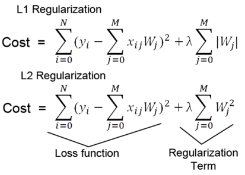

### Dropout
Dropout je moderní a velmi efektivní technika, která během každého kroku trénování náhodně "vypíná" (nastavuje na nulu) určitou část neuronů (typicky 20–50 %) v dané vrstvě.
* **Princip:** V každé iteraci se síť učí v jiné konfiguraci. Tím se zabraňuje sémantickému "spiknutí" neuronů (co-adaptation), kdy se jeden neuron spoléhá na konkrétní výstup jiného.
* **Robustnost:** Neurony jsou nuceny učit se robustnější rysy, které jsou užitečné nezávisle na přítomnosti ostatních specifických neuronů.
* **Testování:** Během testování (inference) jsou zapnuty všechny neurony, ale jejich výstupy jsou vynásobeny pravděpodobností jejich zapnutí během tréninku, aby byla zachována intenzita signálu.
* *Příklad: Dropout funguje podobně jako tým expertů, kde v každé fázi projektu náhodně chybí polovina lidí. Ostatní musí mít dostatečné znalosti, aby práci dokončili i bez chybějících kolegů.*

### Včasné ukončení (Early Stopping)
Tato technika využívá rozdělení dat na trénovací a validační množinu. Během učení sledujeme chybu na obou množinách současně.
* **Mechanismus:** Zatímco chyba na trénovací množině neustále klesá, chyba na validační množině po určité době začne stagnovat nebo stoupat. To je signál, že se model začíná přeučovat na šum v trénovacích datech.
* **Implementace:** Algoritmus si ukládá nejlepší dosažené váhy a učení ukončí ve chvíli, kdy se validační chyba nezlepší po určitý počet epoch (tzv. patience).
* *Příklad: Je to jako student, který se učí na zkoušku. Pokud začne memorovat pořadí slov v učebnici místo smyslu látky, jeho schopnost odpovědět na nové otázky (validační množina) se zhorší.*

### Rozšiřování dat (Dataset Augmentation)
Nejlepším způsobem regularizace je více dat. Pokud jich nemáme dostatek, můžeme je uměle vytvořit transformací stávajících vzorků.
* **Transformace:** V počítačovém vidění se používají rotace, ořezy (cropping), změny jasu, převrácení (flipping) nebo přidání šumu.
* **Vliv:** Model se díky tomu učí invariantnosti – pozná kočku bez ohledu na to, zda je vlevo, vpravo nebo vzhůru nohama.
* *Příklad: Pokud trénujeme čtečku SPZ, můžeme obrázky záměrně rozmazat nebo naklonit, aby si systém poradil i s nekvalitními záběry z reálných kamer.*

### Další techniky
* **Ensemble methods (Bagging):** Trénování více modelů nezávisle na sobě a následné průměrování jejich výsledků. Chyby jednotlivých modelů se vzájemně vyruší.
* **Noise Injection:** Přidávání šumu přímo do vah nebo do aktivací během trénování.
* **Batch Normalization:** Ačkoliv jde primárně o optimalizační techniku, má i mírný regularizační účinek díky šumu vnášenému výpočtem statistik přes malé dávky dat.

## Konvoluční neuronové sítě (CNN)

Konvoluční neuronové sítě jsou specializovaným typem dopředných sítí navrženým pro zpracování dat s mřížkovou topologií, typicky 2D obrazů. Jejich architektura vychází z poznatků o vizuálním kortexu savců, kde neurony reagují pouze na podněty v omezené části zorného pole (lokální receptivní pole).

Základním stavebním kamenem je konvoluční vrstva, která namísto plného propojení všech neuronů využívá operaci konvoluce. Tato vrstva extrahuje ze vstupu vizuální rysy (features) pomocí sady učitelných filtrů.

* **Lokální konektivita:** Neurony v konvoluční vrstvě jsou propojeny pouze s malou lokální oblastí předchozí vrstvy. To dramaticky snižuje počet parametrů sítě.
* **Sdílení vah (Shared Weights):** Jeden filtr (jádro/kernel) se aplikuje na všechna místa obrazu. Předpokládá se, že pokud je detektor hrany užitečný v levém horním rohu, bude užitečný i v pravém dolním.
* **Filtry a Feature Maps:** Výstupem aplikace jednoho filtru na celý obraz je tzv. **feature map**. Více filtrů v jedné vrstvě umožňuje detekovat různé rysy současně (vodorovné hrany, svislé hrany, barvy).
* **Matematická operace:** Hodnota pixelu na pozici $(i, j)$ ve feature mapě se vypočítá jako:
  $$y_{i,j} = \sigma \left( \sum_{m} \sum_{n} w_{m,n} \cdot x_{i+m, j+n} + b \right)$$
  kde $w$ je filtr o velikosti např. $3 \times 3$ a $x$ je vstupní obraz.
* *Příklad: Detekce hran – filtr s hodnotami [[-1, 0, 1], [-1, 0, 1], [-1, 0, 1]] zvýrazní v obraze svislé přechody mezi světlou a tmavou oblastí.*

Typická konvoluční síť se skládá z bloků [Konvoluce + Aktivace (ReLU) + Pooling], za kterými následuje jedna nebo více plně propojených (Fully Connected) vrstev.

* **Hierarchie rysů:** Spodní vrstvy (blíže vstupu) se učí jednoduché koncepty jako hrany nebo textury. Vyšší vrstvy kombinují tyto informace do komplexnějších objektů (oči, kola, obličeje).
* **Plně propojené vrstvy:** Na konci sítě se feature mapy "zploští" (flatten) do jednoho vektoru a projdou klasickým MLP, který rozhodne o finální třídě.
* *Příklad: Architektura LeNet-5 byla jednou z prvních úspěšných CNN pro rozpoznávání rukou psaných číslic, využívající střídání konvolucí a sub-samplingu (poolingu).*

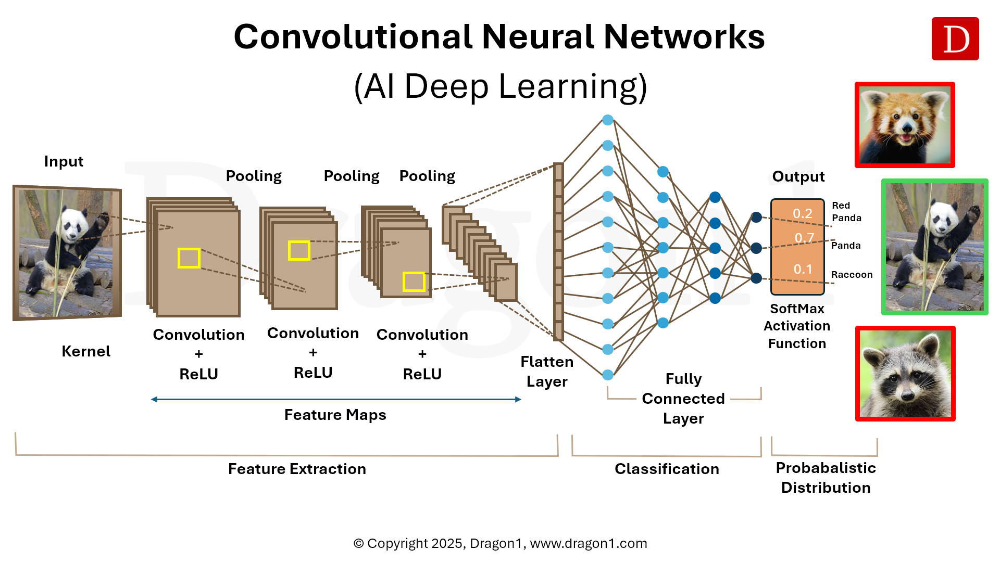

### Parametry konvoluce
Výsledná velikost a chování konvoluční vrstvy jsou určeny třemi klíčovými hyperparametry:
* **Stride (Krok):** Určuje, o kolik pixelů se filtr posouvá při skenování obrazu. Stride 1 znamená posun o jeden pixel, stride 2 obraz efektivně zmenšuje na polovinu.
* **Padding (Zarovnání):** Doplnění okrajů obrazu (obvykle nulami), aby bylo možné aplikovat filtr i na pixely u krajů a aby nedocházelo k nechtěnému zmenšování feature mapy v každé vrstvě.
* **Depth (Hloubka):** Počet použitých filtrů v dané vrstvě, což odpovídá počtu výsledných feature map.
* *Příklad: Pokud na obrázek 32x32 aplikujeme 10 filtrů velikosti 5x5 se stride 1 a bez paddingu, výsledkem bude 10 feature map o velikosti 28x28.*

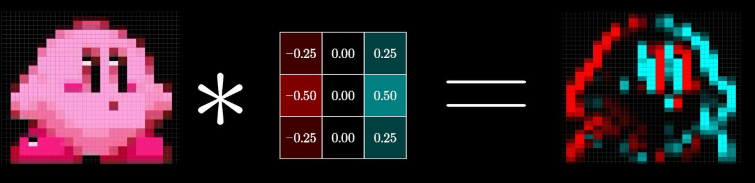

### Vrstva sdružování (Pooling)
Poolingové vrstvy se obvykle vkládají mezi konvoluční vrstvy. Jejich úkolem je snižovat prostorovou dimenzi (šířku a výšku) reprezentace, čímž se snižuje počet parametrů a výpočetní náročnost.

* **Max Pooling:** Nejčastější varianta, která z daného okna (např. 2x2) vybere pouze maximální hodnotu. Tím se zachovávají nejsilnější aktivace rysů.
* **Average Pooling:** Vypočítá průměr hodnot v okně.
* **Invariance:** Pooling pomáhá síti dosáhnout mírné **translační invariance** – pokud se hledaný rys v obraze mírně posune, po poolingu může jeho aktivace zůstat ve stejném "kbelíku".
* *Příklad: Max pooling 2x2 se stride 2 zmenší vstupní obraz 28x28 na 14x14, přičemž v každém bloku 2x2 pixelů ponechá jen ten nejvýraznější vizuální prvek.*

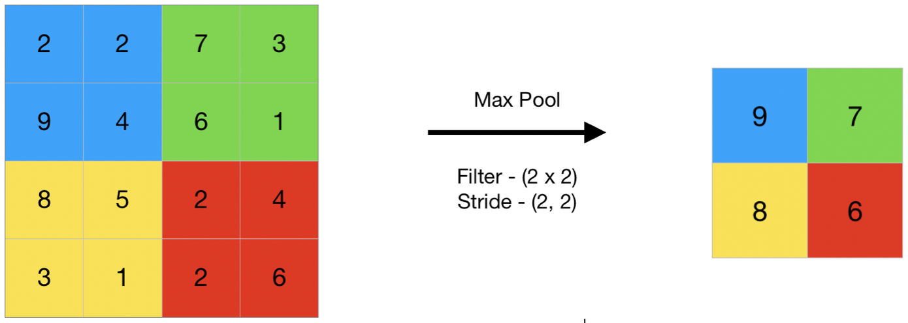

### Využití konvolučních sítí (CNN) dnes
CNN jsou dnes standardem pro jakoukoliv úlohu spojenou s počítačovým viděním. Jejich schopnost extrahovat hierarchické rysy z obrazu bez nutnosti ručního inženýrství příznaků je využívána v mnoha kritických odvětvích.

* ***Lékařská diagnostika:** CNN analyzují snímky z rentgenu, MRI nebo CT s přesností srovnatelnou s radiology. Dokáží detekovat nádory, zlomeniny nebo anomálie v tkáních.*
* ***Autonomní řízení:** Vozidla využívají konvoluční sítě v reálném čase k segmentaci vozovky, detekci chodců, dopravních značek a jiných vozidel z kamerových systémů.*
* ***Biometrie a bezpečnost:** Systémy rozpoznávání obličejů (např. FaceID) nebo analýza záznamů z bezpečnostních kamer pro detekci podezřelého chování.*
* ***Kontrola kvality v průmyslu:** Automatizovaná vizuální kontrola výrobků na linkách, kde CNN hledají mikrotrhliny nebo vady laku.*

## Rekurentní neuronové sítě (RNN)

Rekurentní neuronové sítě jsou určeny pro zpracování sekvenčních dat, kde na rozdíl od dopředných sítí závisí aktuální výstup nejen na aktuálním vstupu, ale i na historii předchozích stavů. Jsou ideální pro úlohy, kde má vstup nebo výstup proměnnou délku.

Základním rysem RNN je existence zpětných vazeb, které umožňují informaci kolovat uvnitř sítě. Síť si udržuje **skrytý stav** ($h_t$), který slouží jako vnitřní paměť uchovávající informace o tom, co síť viděla v předchozích časových krocích.

* **Výpočet stavu:** V čase $t$ se skrytý stav vypočítá jako funkce aktuálního vstupu $x_t$ a předchozího skrytého stavu $h_{t-1}$:
  $$h_t = \sigma(W_h h_{t-1} + W_x x_t + b)$$
  kde $W_h$ a $W_x$ jsou matice vah a $\sigma$ je nelineární aktivační funkce (obvykle tanh nebo ReLU).
* **Sdílení parametrů:** Klíčovým principem je, že matice vah $W$ jsou **stejné** pro každý časový krok. To umožňuje síti zobecňovat vzory nezávisle na jejich pozici v sekvenci.
* *Příklad: Při predikci dalšího slova ve větě "Kočka pije ..." musí síť vědět, že podmětem je "Kočka", aby správně odhadla sloveso v jednotném čísle.*

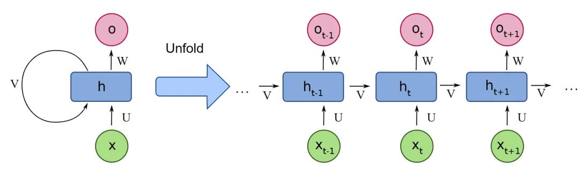

### Rozvinutí v čase (Unrolling)
Pro účely výpočtu a učení si RNN můžeme představit jako graf rozvinutý v čase. Rozvinutá síť vypadá jako velmi hluboká dopředná síť, kde každá vrstva reprezentuje jeden časový krok a všechny vrstvy sdílejí identické váhy.

* **Výpočetní graf:** Rozvinutí transformuje rekurenci na posloupnost operací, což umožňuje aplikovat standardní algoritmy pro optimalizaci.
* **Variabilita:** Díky rekurenci může síť zpracovat sekvence libovolné délky, aniž by se měnil počet parametrů modelu.
* *Příklad: Pokud věta má 5 slov, rozvineme síť do 5 "kopií", pokud má 10 slov, rozvineme ji do 10, přičemž matematické operace zůstávají stejné.*

### Učení pomocí BPTT
Algoritmus pro učení RNN se nazývá **Backpropagation Through Time (BPTT)**. Je to rozšíření klasické zpětné propagace pro rozvinuté grafy.

1. **Forward Pass:** Sekvence projde rozvinutou sítí a vypočítá se celková ztráta (Loss) jako součet chyb v jednotlivých časových krocích.
2. **Backward Pass:** Chyba se propaguje zpět od konce sekvence k začátku.
3. **Akumulace gradientů:** Protože váhy jsou v každém kroku sdílené, výsledný gradient pro každou váhu je součtem gradientů vypočítaných ve všech časových krocích.
* **Problém mizejícího gradientu:** Při dlouhých sekvencích (mnoho kroků zpět) se gradient při opakovaném násobení maticí vah buď zmenší k nule (vanishing), nebo nekontrolovaně naroste (exploding). To brání síti učit se dlouhodobé závislosti.

### Hradlové mechanismy (LSTM a GRU)
K vyřešení problémů s mizejícím gradientem a krátkou pamětí byly navrženy pokročilé architektury využívající tzv. hradla (gates), která řídí tok informací.

* **LSTM (Long Short-Term Memory):** Zavádí speciální "vnitřní buňku" (cell state), která funguje jako dálnice pro informaci. Gradient po ní může téct téměř bez změny.
    - **Forget Gate:** Rozhoduje, jakou část staré paměti zapomenout.
    - **Input Gate:** Rozhoduje, které nové informace uložit do paměti.
    - **Output Gate:** Určuje, co z paměti se propustí na výstup.
* **GRU (Gated Recurrent Unit):** Zjednodušená varianta LSTM, která kombinuje zapomínací a vstupní hradlo do jednoho "update" hradla. Má méně parametrů a je výpočetně efektivnější.
* *Příklad: LSTM dokáže v dlouhém odstavci textu "pamatovat", že na začátku byl hrdina mužského pohlaví, a správně používat zájmeno "on" i o pět vět později.*

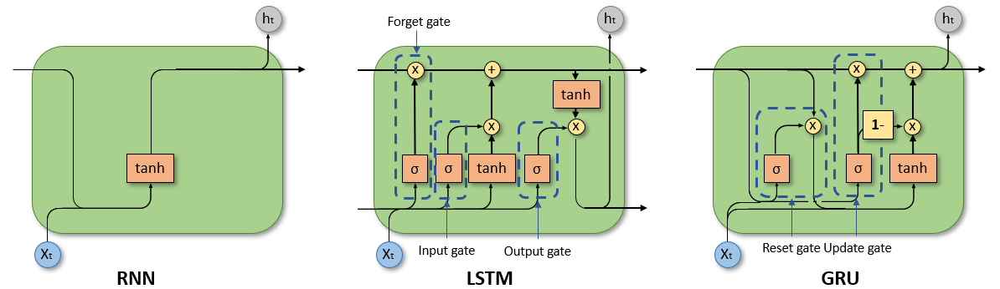

## Využití rekurentních sítí (RNN) dnes
Ačkoliv v oblasti zpracování jazyka (NLP) přebírají prvenství Transformery, RNN a zejména LSTM zůstávají klíčové v úlohách s omezenými zdroji nebo tam, kde je kritické zpracování v reálném čase.

* ***Předpovídání časových řad:** Využití ve financích pro odhad vývoje cen akcií, v energetice pro predikci spotřeby elektřiny nebo v meteorologii.*
* ***Rozpoznávání řeči:** Systémy jako Siri nebo Alexa využívají rekurentní mechanismy ke zpracování zvukových vln a jejich převodu na text (Speech-to-Text).*
* ***Prediktivní údržba (Industry 4.0):** Analýza sekvencí dat ze senzorů (vibrace, teplota), která dokáže předpovědět poruchu stroje dříve, než k ní dojde.*
* ***Analýza sentimentu:** Hodnocení recenzí nebo příspěvků na sociálních sítích, kde RNN chápou kontext a pořadí slov, což je zásadní pro pochopení ironie nebo negace.*
* *Příklad: Klávesnice v mobilních telefonech používají lehké RNN modely k predikci dalšího slova, které se uživatel chystá napsat, na základě historie předchozích slov.*