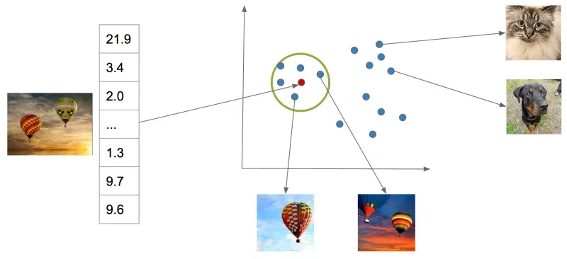
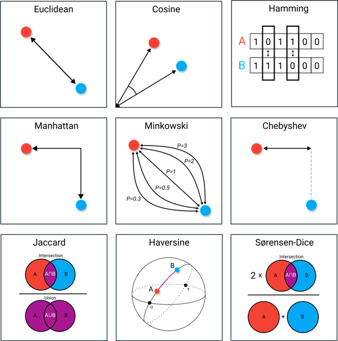
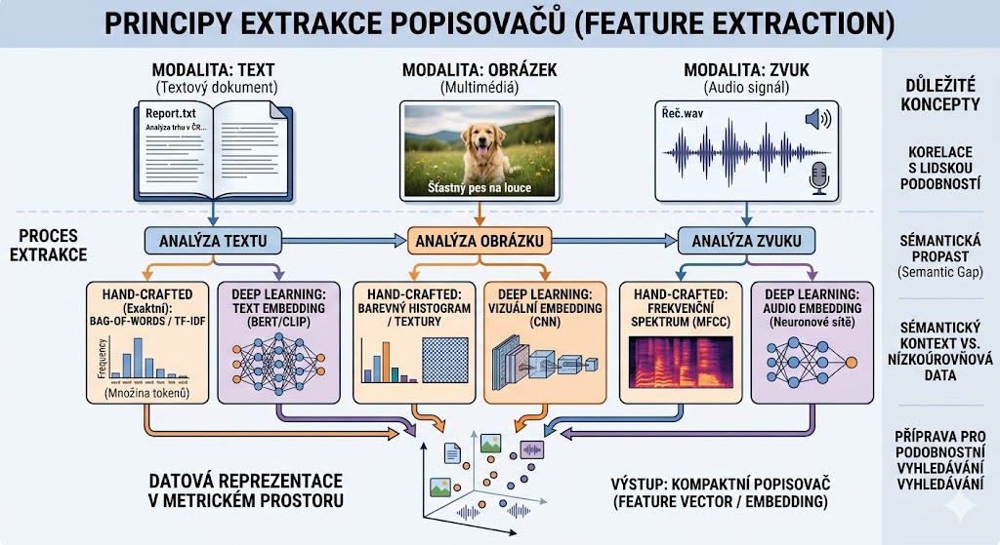
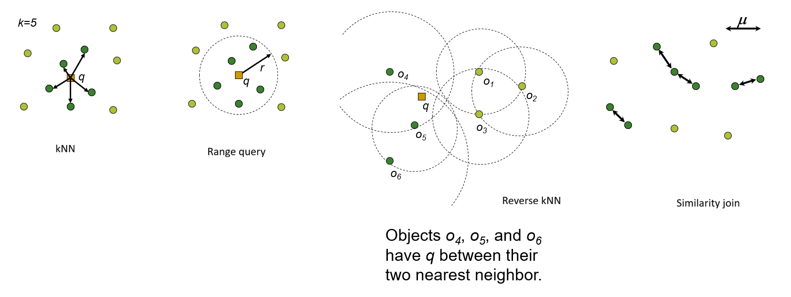
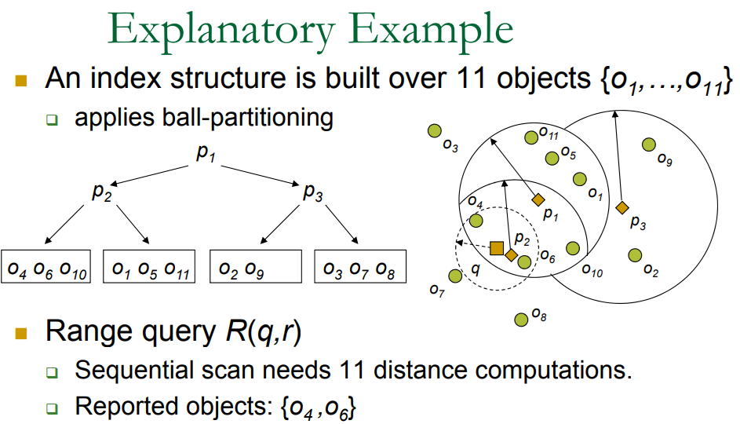
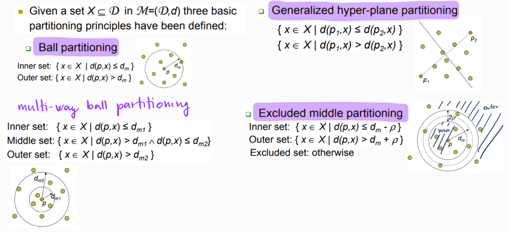
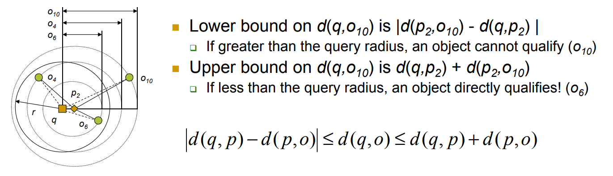
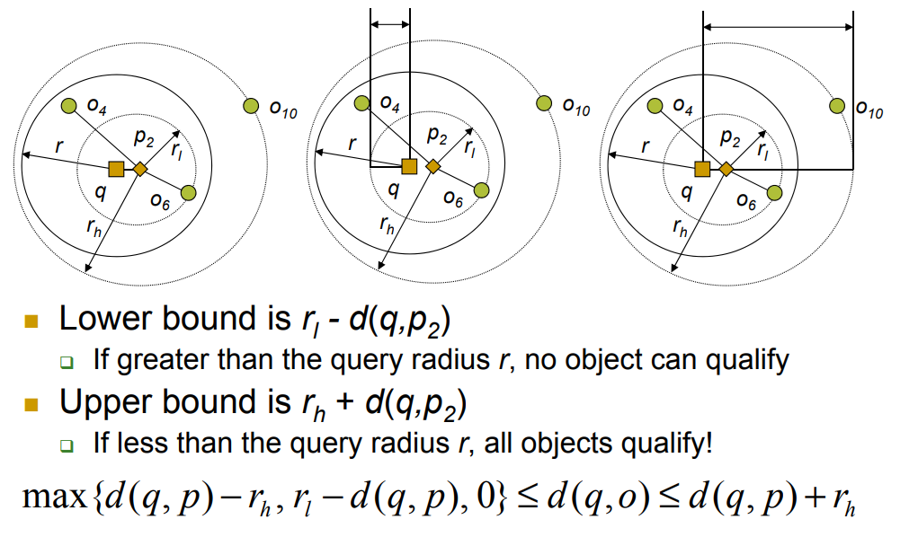
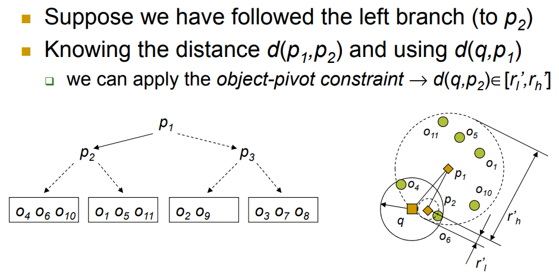
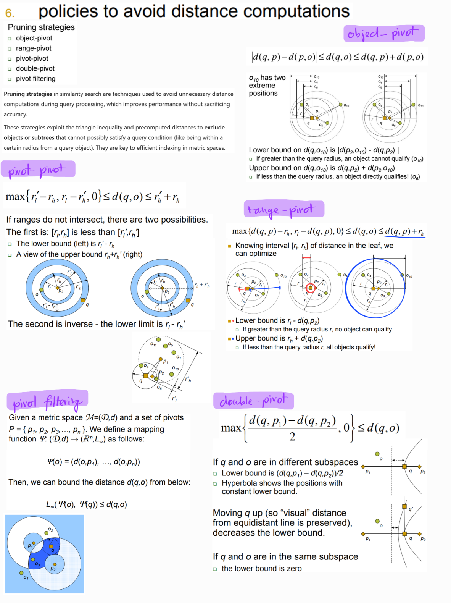

# Podobnostní hledání

povinné pro studium dle kontrolní šablony 2022/2023 nebo novější
> Principy podobnostního hledávání: metrický prostor, extrakce popisovačů a jejich vztah s člověkem vnímanou podobností, 
> typy dotazů a jejich definice. 
> Principy indexování: dělení dat, filtrování dat (pivoting). 
> Srovnání s tradičními indexy (B+ trees).

## Principy podobnostního hledání

Tradiční databázové systémy pracují s exaktním vyhledáváním (Exact Match) nad strukturovanými daty, 
která lze lineárně uspořádat. 
S nástupem nestrukturovaných multimediálních dat (obrázky, audio, video, textové embeddingy) se však 
paradigma mění na vyhledávání podle podobnosti. 
Základním matematickým konceptem pro exaktní formalizaci tohoto problému je **metrický prostor**.

### Formální model podobnostního hledání
Pro exaktní popis prvků a cílů vyhledávacího procesu definujeme následující systém:
* **Vstupní komponenty:**
    * $M$: Univerzum (doména) všech možných objektů.
    * $X$: Databáze reálných uložených objektů, přičemž platí $X \subseteq M$.
    * $d$: Vzdálenostní funkce (metrika) měřící míru odlišnosti mezi objekty ($d: M \times M \rightarrow \mathbb{R}$).
    * $q$: Dotazový objekt (query object), kde $q \in M$.
* **Cíl vyhledávání:** Nalézt podmnožinu objektů z databáze $X$, které vykazují minimální vzdálenost (maximální podobnost) k dotazovému objektu $q$.

*Při vyhodnocení dotazů rozlišujeme dva základní přístupy podle toho, zda je prioritou stoprocentní přesnost výsledků, nebo rychlost výpočtu:*
* ***Exaktní vyhledávání (Exact / Precise Search):** Garantuje 100% přesnost výsledků (Recall = 1).*
    * *Vrátí exaktně všechny objekty, které splňují matematickou definici daného dotazu.*
    * *Index slouží pouze k urychlení výpočtu, výsledek je shodný se sekvenčním skenováním.*

* ***Aproximované vyhledávání (Approximate Search - ANN):***
    * *Obětuje část přesnosti výměnou za výrazné zrychlení vyhledávání a snížení I/O nákladů.*
    * *Používá se v situacích, kdy pro uživatele není kritické najít absolutně nejbližší sousedy, ale stačí objekty „dostatečně blízké“.*
    * *Důvody zavedení: Extrémní rozsah datových sad a negativní dopady prokletí dimenzionality na exaktní indexy.*

## Metrický prostor
Metrický prostor je uspořádaná dvojice $(M, d)$, kde $M$ reprezentuje univerzum objektů (doménu) a $d$ je metrika neboli vzdálenostní funkce $d: M \times M \rightarrow \mathbb{R}$. Tato funkce každé dvojici objektů přiřazuje reálné číslo vyjadřující jejich míru odlišnosti (čím menší hodnota, tím větší podobnost).

Aby byla funkce $d$ regulérní metrikou, musí pro libovolné objekty $x, y, z \in M$ striktně splňovat následující **čtyři axiomy**:
1. **Nezápornost:** $d(x, y) \geq 0$
2. **Identita:** $d(x, y) = 0 \iff x = y$
3. **Symetrie:** $d(x, y) = d(y, x)$
4. **Trojúhelníková nerovnost:** $d(x, z) \leq d(x, y) + d(y, z)$

**Klíčový detail:** Trojúhelníková nerovnost je zcela fundamentální vlastnost, na které stojí veškeré metrické indexování. Umožňuje nám odvozovat spodní a horní odhady vzdáleností mezi objekty, aniž bychom tyto vzdálenosti museli reálně měřit, což slouží jako základ pro prořezávání (pruning) vyhledávacího prostoru.

### Varianty metrických prostorů při oslabení axiomů
* **Pseudometrika:** Nesplňuje axiom identity ve směru $\Leftarrow$. Platí $d(x, y) = 0 \Leftarrow x = y$, ale může nastat $d(x, y) = 0$ i pro $x \neq y$ (dva různé objekty mají nulovou vzdálenost).
* **Kvazimetrika:** Nesplňuje axiom symetrie, tedy $d(x, y) \neq d(y, x)$ (např. vzdálenost v dopravní síti s jednosměrnými ulicemi).
* **Semimetrika:** Nesplňuje trojúhelníkovou nerovnost. Nad semimetrickým prostorem nelze stavět standardní metrické indexy, protože nelze provádět prořezávání prostoru.

   

      Koncepční srovnání: metrický vs. vektorový prostor
   

V praxi se nejčastěji setkáváme s vícerozměrnými vektory (např. embeddingy), avšak z matematického a indexačního hlediska jde o zásadní rozdíl v abstrakci.
Každý normovaný vektorový prostor (kde umíme měřit délku vektoru) je metrickým prostorem, ale zdaleka ne každý metrický prostor je prostorem vektorovým.

* **Vektorový prostor (Lineární):** Je striktně definován kartézskými souřadnicemi a systémem os (např. vektor $[1.2, -0.4]$). Známe absolutní pozici bodů, objekty lze sčítat, násobit skalárem a existuje zde počátek souřadnic $[0,0,\dots,0]$.
* **Metrický prostor:** Je mnohem obecnější koncept. **Neexistují zde žádné osy, souřadnice ani počátek a objekty nelze sčítat.** Jediné, co máme k dispozici, je vzdálenostní funkce $d(x,y)$, která pro libovolnou dvojici objektů vrátí reálné číslo.

**Čistě metrické (ne-vektorové) prostory:**
V podobnostním vyhledávání existují obrovské rodiny dat, které nemají povahu bodů v prostoru, ale splňují axiomy metriky, takže nad nimi lze stavět indexy (např. M-Tree):
1. **Řetězce a texty (String Spaces):** Objekty jsou slova či texty a metrikou je *Levenshteinova (Edit) vzdálenost* (počet editačních operací).
2. **Množinová data (Set Spaces):** Objekty jsou nákupní košíky nebo seznamy zájmů a metrikou je *Jaccardova vzdálenost* měřící míru jejich překryvu.
3. **Grafy a sítě (Graph Spaces):** Objekty jsou uzly (např. v sociální nebo silniční síti) a metrikou je *nejkratší cesta v grafu*.

**Důsledek pro indexování:** Zatímco vektorový index (např. K-D strom) může prostor rozseknout v půlce podle fixní osy (např. $X > 5$), čistě metrický index (např. M-Tree) toto udělat nedokáže, protože osy nemá. Musí proto zvolit reálný objekt z databáze jako **pivot $p$** a prostor dělit relativně vůči němu (např. pomocí metrických koulí).

### Vzdálenostní funkce
Volba konkrétní metriky závisí na povaze indexovaných dat a sémantickém významu, který odráží člověkem vnímanou podobnost. Mezi standardně využívané funkce patří:
* **Minkowského vzdálenost ($L_p$ metriky):** Definuje rodinu metrik v lineárních prostorech $\mathbb{R}^n$:
    $$d(x, y) = \left( \sum_{i=1}^{n} |x_i - y_i|^p \right)^{1/p}$$
    * $p=1$: Manhattan (City-block) vzdálenost ($L_1$)
    * $p=2$: Eukleidovská vzdálenost ($L_2$) – nejčastější geometrická metrika.
    * $p \to \infty$: Čebyševova vzdálenost ($L_\infty$) – definována jako maximum z absolutních rozdílů složek: $\max_{i=1..n} |x_i - y_i|$.
* **Edit vzdálenost (Levenshtein):** Udává minimální počet editačních operací (vložení, smazání, záměna znaku) pro transformaci jednoho řetězce na druhý.
*Příklad:* Vzdálenost mezi řetězci `"kitten"` a `"sitting"` je 3 (1× záměna `k` $\to$ `s`, 1× záměna `e` $\to$ `i`, 1× vložení `g` na konec).
* **Jaccardova vzdálenost:** Využívána pro porovnávání množinových dat (např. tokeny v textu):
    $$d_J(A, B) = 1 - \frac{|A \cap B|}{|A \cup B|}$$

---

## Extrakce popisovačů (Feature Extraction)
Objekty reálného světa jsou pro přímé matematické porovnání příliš komplexní a nestrukturované. Proto nastupuje fáze **extrakce příznaků**, která transformuje surový objekt na kompaktní matematickou reprezentaci – **popisovač (feature descriptor / feature vector)**.

Tento proces může být:
1. **Založený na exaktních algoritmech (Hand-crafted features):** Např. barevné histogramy obrázků, textury, nebo frekvenční spektra u audia.
2. **Založený na hlubokém učení (Deep Learning):** Využití neuronových sítí (např. konvolučních sítí či transformátorů jako CLIP), kde je objekt promítnut do vícerozměrného vektorového prostoru, tzv. **embedding prostoru**.

### Vztah s člověkem vnímanou podobností a Sémantická propast
Hlavní výzvou podobnostního vyhledávání je **sémantická propast (Semantic Gap)**. Jde o rozdíl mezi tím, jak data reprezentuje počítač (nízkoúrovňové informace, např. matice RGB pixelů obrázku), a tím, jak je vnímá lidský uživatel (vysokoúrovňové koncepty, emoce, kontext – např. "šťastný pes na louce").

* **Cíl extrakce:** Dosáhnout stavu, kdy matematická blízkost popisovačů v metrickém prostoru věrně koreluje s kognitivní (sémantickou) podobností vnímání člověka.
* Pokud extrakční funkce selže a nedokáže sémantiku zachytit, index sice bude matematicky fungovat bezchybně, ale výsledky vyhledávání budou pro člověka irelevantní.

---

## Typy dotazů a jejich definice
Při zadání databáze (množiny objektů) $X \subseteq M$ a dotazového objektu $q \in M$ (query object) 
rozlišujeme typy podobnostních dotazů:

#### 1. Range Query (Rozsahový dotaz)
Vrátí všechny objekty z databáze $X$, jejichž vzdálenost od dotazu $q$ je menší nebo rovna specifikovanému poloměru vyhledávání $r$ ($r \geq 0$).
$$\text{Range}(q, r) = \{ x \in X \mid d(q, x) \leq r \}$$
* **Charakteristika:** Poloměr $r$ určuje pevnou uživatelskou toleranci k odlišnosti objektů. Nevýhodou je rigidita – u málo hustých datových prostorů může dotaz vrátit prázdnou množinu, u příliš hustých naopak obrovské množství objektů.

#### 2. k-Nearest Neighbor Query (k-NN / Dotaz na k nejbližších sousedů)
Vrátí množinu $A \subseteq X$ obsahující přesně $k$ objektů ($|A| = k$), pro které platí, že žádný objekt mimo tuto množinu není k dotazu $q$ blíže než objekty uvnitř ní.
$$\forall y \in A, \forall z \in X \setminus A: d(q, y) \leq d(q, z)$$
* **Charakteristika:** Garantuje uživateli stabilní počet výsledků ($k$). 
* **Implementační detail:** Vyhodnocení $k$-NN se v indexech typicky transformuje na rozsahový dotaz s dynamicky se zmenšujícím vyhledávacím poloměrem $r$, kde $r$ je v každém kroku algoritmu definováno jako aktuální vzdálenost k $k$-tému nejbližšímu doposud nalezenému objektu (ukládanému v prioritní frontě).

#### 3. Reverse k-Nearest Neighbor Query (Rk-NN / Reverzní dotaz na k nejbližších sousedů)
Vyhledá všechny objekty v databázi $X$, pro které je zadaný dotazový objekt $q$ jedním z jejich $k$ nejbližších sousedů.
$$\text{Rk-NN}(q) = \{ x \in X \mid q \in \text{k-NN}(x) \}$$
* **Charakteristika:** Zatímco standardní $k$-NN hledá objekty blízké z pohledu dotazu $q$, reverzní dotaz zkoumá situaci z pohledu samotných datových objektů. Odpovídá na otázku: *"Pro koho je tento nový objekt/produkt zajímavý či blízký?"* Výsledná množina může být klidně i prázdná.
* **Typické využití:** Cílený marketing (identifikace zákazníků, pro které je nový produkt nejvhodnější), detekce anomálií nebo analýza vlivu uzlu v síti.

#### 4. Similarity Join Query (Dotaz na podobnostní propojení)
Pracuje nad dvěma datovými množinami $X \subseteq M$ a $Y \subseteq M$ (případně nad jednou a touto samou množinou v případě *Similarity Self-Join*). Cílem je nalézt všechny dvojice objektů $(x, y)$, jejichž vzdálenost nepřekračuje zadanou prahovou hodnotu $\mu$.
$$X \bowtie_{\mu} Y = \{ (x, y) \in X \times Y \mid d(x, y) \leq \mu \}$$
* **Charakteristika:** Jde o analogii klasického operátoru `JOIN` z relačních databází, avšak namísto exaktní rovnosti atributů vyhodnocuje metrickou blízkost prvků napříč celými sadami. Výpočetně se jedná o extrémně náročnou operaci s naivní složitostí $\mathcal{O}(|X| \cdot |Y|)$.
* **Typické využití:** Čištění dat (identifikace duplicit a překlepů), párování entit ze dvou různých zdrojů nebo shluková analýza.
---

## 2. Principy indexování

Sekvenční procházení databáze (Sequential Scan / Brute Force) vyžaduje spočítat vzdálenost $d(q, x)$ pro každý objekt $x \in X$. Jelikož je výpočet metriky $d$ výpočetně nesmírně drahý (zejména u komplexních nebo high-dimensional popisovačů), je sekvenční skenování pro velké datové sady nepoužitelné ( $\mathcal{O}(N)$ ). Cílem indexování je organizovat data tak, aby bylo možné velkou část prostoru při vyhledávání bezpečně ignorovat.

### Dělení dat (Data Partitioning)
Metrické indexy rozdělují datový prostor na dílčí regiony (podprostory) reprezentované uzly stromové struktury. K tomuto dělení se využívají vybrané objekty zvané **pivoty (reference points)**. Na rozdíl od vektorových prostorů (kde lze dělit prostor fixními souřadnicovými osami) v čistě metrickém prostoru můžeme měřit pouze vzdálenosti mezi objekty. Existují dva základní principy dělení dat:

#### A) Ball Partitioning (Dělení do metrických koulí)
Zvolí se jeden pivot $p \in X$ a určí se dělící poloměr $r_m$ (zpravidla medián vzdáleností všech objektů k tomuto pivotu). Data se rozdělí do dvou disjunktních podmnožin:
* **Vnitřní region (uvnitř koule):** $X_{left} = \{ x \in X \mid d(p, x) \leq r_m \}$
* **Vnější region (vně koule):** $X_{right} = \{ x \in X \mid d(p, x) > r_m \}$

Tento princip tvoří základ hierarchických struktur jako je **VP-Tree (Vantage Point Tree)** nebo **Multi Vantage Point Tree (MVPT)**. Uzly si ukládají pivot $p$ a poloměr $r_m$.

#### B) Generalized Hyperplane Partitioning (Dělení zobecněnou nadrovinou)
Zvolí se dva pivoty $p_1, p_2 \in X$. Prostor se rozdělí pomyslnou nadrovinou, která se nachází přesně uprostřed mezi těmito dvěma body. Každý objekt je přiřazen k tomu pivotu, ke kterému má blíž:
* **Region pivotu $p_1$:** $X_{left} = \{ x \in X \mid d(p_1, x) \leq d(p_2, x) \}$
* **Region pivotu $p_2$:** $X_{right} = \{ x \in X \mid d(p_1, x) > d(p_2, x) \}$

Tento přístup využívá například **GHT (Generalized Hyperplane Tree)** nebo dynamický, diskově orientovaný **M-Tree**.

### Konceptuální rozdíly v principech dělení dat
* **Space Partitioning (Dělení prostoru):** Rozděluje samotný topologický prostor na pevně dané oblasti bez ohledu na přítomnost či polohu reálných datových objektů.
    * Výsledné regiony jsou striktně **disjunktní** (nepřekrývají se).
    * Regiony mohou zůstat zcela prázdné, pokud v dané části prostoru neleží žádná data.
    * *Příklad:* K-D strom, Quadtree.

* **Data Partitioning (Dělení dat):** Rozděluje množinu konkrétních existujících datových objektů do hierarchických shluků na základě jejich vzájemných vzdáleností.
    * Výsledné obalové regiony (např. metrické koule) se v prostoru velmi často **geometricky překrývají** (overlap).
    * Regiony se dynamicky přizpůsobují distribuci dat a nikdy nejsou prázdné.
    * *Příklad:* M-Tree, R-Tree.

---

## Filtrování dat (Pivoting) a prořezávání vyhledávacího prostoru

**Pivoting** je technika eliminace kandidátů bez nutnosti počítat jejich reálnou vzdálenost k dotazu $q$. Tento přístup je plně závislý na platnosti **trojúhelníkové nerovnosti**.

Mějme dotaz $q$, vyhledávací poloměr $r$ a zvoleného pivota $p$. Vzdálenosti mezi pivotem $p$ a všemi datovými objekty $o$, tedy hodnoty $d(p, o)$, jsou exaktně spočteny během fáze budování indexu a uloženy v paměti nebo na disku. Při provádění dotazu se spočítá pouze jediná vzdálenost, a to $d(q, p)$. Z trojúhelníkové nerovnosti pak přímo vyplývá vztah pro spodní odhad vzdálenosti:
$$|d(p, o) - d(q, p)| \leq d(q, o)$$

Chceme-li ověřit, zda objekt $o$ může být součástí výsledku rozsahového dotazu, aplikuje se **prořezávací podmínku (Pruning Condition)**:
$$\text{Pokud } |d(p, o) - d(q, p)| > r, \text{ pak zaručeně platí } d(q, o) > r.$$

Pokud je tato podmínka splněna, objekt $o$ (případně celý podstrom objektů ohraničený příslušnou metrickou koulí kolem pivota) se okamžitě **vyřadí (prořeže)** z dalšího zpracování a výpočet skutečné vzdálenosti $d(q, o)$ se zcela přeskočí. V závislosti na tom, jaké informace o vzdálenostech jsou předem spočítané a jaké elementy v nerovnostech kombinujeme, se rozlišují konkrétní **prořezávací pravidla (Pruning Rules)**:

### Pivot Filtering (Algoritmus vyhodnocení dotazu)
Jedná se o celkový vyhledávací mechanismus nad pivotovými strukturami (např. v algoritmu LAESA). Tento proces probíhá sekvenčně ve dvou fázích a aktivně využívá konkrétní matematická pravidla popsaná níže:
1. **Fáze filtrování (Filtering State):** Postupně se vyhodnocuje jeden pivot za druhým a počítá se vzdálenost $d(q, p)$. Okamžitě se aplikují prořezávací pravidla nad tabulkou předpočítaných vzdáleností, čímž se množina potenciálních kandidátů drasticky zužuje. V této fázi se pracuje pouze s výpočetně levnými skalárními operacemi, jako jsou rozdíly reálných čísel.
2. **Fáze ověřování (Refinement State):** Pro zbývající objekty, které prošly filtrem a nebyly prořezány, se musí spočítat reálná, výpočetně drahá metrická vzdálenost $d(q, o)$. Teprve objekty, které projdou tímto exaktním testem, tvoří finální výsledek vyhledávání.

### A) Object-Pivot Distance Constraint
Toto základní pravidlo využívá předpočítanou vzdálenost mezi datovým objektem $o$ a fixním pivotem $p$. Pracuje se přímo s absolutní hodnotou rozdílu vzdáleností, přičemž objekt se bezpečně eliminujeme v případě, kdy platí $|d(o, p) - d(q, p)| > r$. Pravidlo nachází klíčové využití v algoritmech typu AESA / LAESA a v lineárních tabulkových indexech (Pivot Tables), kde má každý objekt v databázi uložené vzdálenosti k pevné sadě globálních pivotů.

### B) Range-Pivot Distance Constraint
Tento přístup se aplikuje v hierarchických strukturách, jako je například **M-Tree**, kde uzly reprezentují celé podprostory vymezené metrickou koulí (Ball Regions). V indexu se neukládá přesná vzdálenost pro každý objekt zvlášť, ale objekty se seskupují do regionů vymezených minimálním poloměrem $r_l$ a maximálním poloměrem $r_h$ od daného pivota $p$. Každý podprostor je definován svým pivotem a poloměrem pokrytí $r_p$, což představuje maximální vzdálenost od pivota k jakémukoliv objektu uvnitř tohoto podstromu. Celý podstrom pod uzlem $p$ lze prořezat najednou, pokud platí:
$$d(q, p) - r_p > r \quad \text{nebo} \quad r_l - d(q, p) > r$$
Pokud je dotaz $q$ se svým poloměrem $r$ natolik vzdálen od pivota $p$, že nemůže zasáhnout hranice vymezeného regionu, ušetří se prořezáním celého podstromu tisíce výpočtů vzdáleností.

### C) Pivot-Pivot Distance Constraint
Tento princip uplatňuje předpočítané vzdálenosti mezi samotnými pivoty navzájem, typicky vyjádřené vztahem mezi nadřazeným pivotem $p_1$ a podřízeným pivotem $p_2$. Znalost vzdálenosti $d(p_1, p_2)$ umožňuje pomocí trojúhelníkové nerovnosti a odhadu polohy dotazu vůči nadřazenému uzlu eliminovat celý region okolo podřízeného pivota $p_2$, aniž by se musela reálně počítat vzdálenost dotazu $d(q, p_2)$.

### D) Double-Pivot Distance Constraint
Tato pokročilá technika zpřesňuje spodní odhad vzdálenosti zkombinováním informací od dvou různých pivotů ($p_1$ a $p_2$) vůči jednomu objektu $o$. Metoda je typická pro prostory dělené nadrovinou (např. struktury GHT), kde se datové objekty přiřazují k tomu pivotu, ke kterému mají geometricky blíže. Pokud se při vyhodnocování dotazu zjistí, že dotaz $q$ leží výrazně blíže k jednomu z pivotů, lze pomocí spodního odhadu vyřadit všechny objekty nacházející se v poloprostoru druhého pivota. Spodní odhad vzdálenosti $d(q, o)$ se konstruuje jako:

$$\max\left\\{ \frac{d(q, p_1) - d(q, p_2)}{2}, 0 \right\\}$$

K prořezání celého poloprostoru dochází v okamžiku, kdy je tato hodnota větší než poloměr vyhledávání $r$. Používá se pro maximalizaci prořezávacího efektu za cenu uložení většího objemu dat o vzdálenostech.

## Srovnání s tradičními indexy (B+ trees)

Abychom hloubkově porozuměli limitům vyhledávání, je nutné provést strukturální a geometrickou komparaci mezi klasickými strukturami z relačních databází (typicky B+ stromy) a moderními metrickými či vektorovými indexy.

| Vlastnost | Tradiční indexy (B+ Tree) | Podobnostní indexy (Metrické / Vektorové)                                                                               |
| :--- | :--- |:------------------------------------------------------------------------------------------------------------------------|
| **Dimenze dat** | Strictly 1D (jednorozměrná data – čísla, data, krátké řetězce). | High-dimensional (desítky, stovky až tisíce dimenzí).                                                                   |
| **Uspořádání domény** | **Totální uspořádání** (Total Ordering). Pro každé dva klíče $a, b$ lze exaktně určit vztah $a < b$, $a = b$, nebo $a > b$. | Žádné přirozené uspořádání. K dispozici je pouze **relativní vzdálenost** mezi dvojicemi objektů (vzdálenostní matice). |
| **Typ vyhledávání** | Exaktní shoda (Exact Match), intervalové/rozsahové dotazy na jedné ose. | Podobnostní dotazy (Range Query, $k$-NN, Rk-NN, Similarity Join).                                                       |
| **Geometrie regionů** | Disjunktní, ostře ohraničené a navazující intervaly na jednorozměrné přímce. | Překrývající se vícerozměrné regiony (metrické koule nebo hyperplány v prostoru).                                       |
| **Korektnost / Přesnost** | Vždy 100% deterministické a exaktní. | Buď exaktní (za cenu vysokých nákladů), nebo aproximované (**ANN** – Approximate Nearest Neighbor).                     |
| **Prokletí dimenzionality** | Neexistuje (prostor roste lineárně s počtem záznamů). | **Kritický faktor.** Způsobuje geometrickou degradaci indexu a růst překryvů.                                           |
| **Výpočetní náročnost** | Velmi nízká (skalární porovnání čísel procesorem na úrovni instrukcí). | Extrémně vysoká (výpočet metriky nad velkými vektory, např. odmocniny, sumace).                                         |

---

### Proč B+ Tree strukturálně selhává pro podobnostní vyhledávání?

#### 1. Absence lineárního uspořádání (No Total Ordering)
B+ Tree staví svou logaritmickou složitost vyhledávání $\mathcal{O}(\log N)$ na schopnosti binárně či vícecestně dělit data podle znamének *menší než* / *větší než*. Vícerozměrný prostor (např. 512-dimenzionální embedding obrázku) však nelze přirozeně seřadit na jednorozměrnou přímku, aniž by došlo k naprostému zničení informace o prostorové blízkosti bodů (tzv. sousedství). 

Jakékoliv pokusy o transformaci více dimenzí do jedné (např. mapování prostoru pomocí Space Filling Curves, jako je Z-order nebo Hilbertova křivka) fungují uspokojivě pouze do dimenze 2 až 3. Se stoupající dimenzí se toto zobrazení stává sémanticky chaotickým a objekty, které jsou v reálném prostoru těsně vedle sebe, skončí na jednorozměrné přímce kilometry daleko od sebe. B+ strom pak nedokáže efektivně prořezávat větve.

#### 2. Problém překrývání regionů (Region Overlap)
V jednorozměrném světě B+ stromu jsou dělicí body (klíče vnitřních uzlů) exaktní a podprostory (intervaly) jsou vůči sobě striktně **disjunktní**. Vyhledávací algoritmus při sestupu stromem vždy přesně ví, do kterého jediného uzlu má pokračovat.

U metrických prostorů jsou regiony definovány pomocí obalových koulí (Ball Regions) nebo nadrovin. Kvůli variabilitě dat a absenci ortogonálních os vykazují tyto regiony v indexech (např. v M-Tree) vysokou míru vzájemného geometrického **překryvu (overlap)**. Pokud dotaz $q$ se svým poloměrem vyhledávání $r$ zasáhne do oblasti, kde se překrývá více metrických koulí různých uzlů, vyhledávací algoritmus je nucen expandovat a prohledat **všechny tyto paralelní větve stromu**. Z logaritmického vyhledávání se tak stává prohledávání grafu.

#### 3. Geometrické efekty vysokých dimenzí (Prokletí dimenzionality, Curse of Dimensionality)
S rostoucí dimenzionalitou ($n \to \infty$) dochází v prostorech k paradoxnímu jevu – **koncentraci mír vzdálenosti** (Distance Concentration). Rozdíl mezi vzdáleností k nejbližšímu objektu a vzdáleností k nejvzdálenějšímu objektu se limitně blíží nule:

$$\lim_{n \to \infty} \frac{D_{\max} - D_{\min}}{D_{\min}} = 0$$

Zjednodušeně řečeno: ve vysoké dimenzi jsou všechny objekty od sebe přibližně stejně daleko a leží na hyperpovrchu prostoru. 
* Pro indexování to má fatální důsledek – obalové koule uzlů musí enormně zvětšit svůj poloměr $r_p$, aby vůbec dokázaly pojmout datové objekty. 
* Tím se index zaplní obřími, překrývajícími se regiony. Jakýkoliv dotaz $q$ s nenulovým poloměrem pak protne téměř 100 % všech regionů ve stromu. 

Indexová struktura v tomto bodě kompletně kolabuje a vyhodnocení dotazu degraduje na **sekvenční sken (Sequential Scan)** celé databáze. Ten je navíc v případě metrického stromu paradoxně *pomalejší* než naivní brute-force vyhledávání, protože systém musí platit masivní režijní náklady na správu, alokaci a procházení uzlů stromové struktury.

### Řešení a opatření proti prokletí dimenzionality

Snížení negativních dopadů vysoké dimenze na indexovací struktury se řeší ve dvou rovinách:

#### 1. Redukce dimenzionality (Dimensionality Reduction)
Cílem je transformovat high-dimensional prostor do prostoru s nižším počtem dimenzí (tzv. *intrinsic dimensionality*) při zachování co největšího množství sémantické informace a původních vzdáleností.
* **Lineární metody (PCA - Principal Component Analysis):** Najde osy největšího rozptylu dat a projektuje vektory do tohoto nového podprostoru. Méně významné dimenze se zahodí.
* **Nelineární metody a embeddingy (Autoenkodéry / UMAP / t-SNE):** Využití neuronových sítí k nelineárnímu stlačení dat. Autoenkodéry dokáží zakódovat komplexní vztahy do velmi kompaktního vektoru (např. z 1024 na 64 dimenzí).
* **Náhodná projekce (Johnson-Lindenstrauss lemma):** Matematická věta garantující, že pokud promítneme body z extrémně vysoké dimenze do náhodně zvoleného podprostoru s dostatečným (avšak výrazně nižším) počtem dimenzí, relativní vzdálenosti mezi body zůstanou s malou chybou zachovány.

#### 2. Aproximované vyhledávání nejbližších sousedů (ANN - Approximate Nearest Neighbor)
Namísto hledání absolutně přesného výsledku (který v high-dim kolabuje na sekvenční sken) indexy garantují nalezení *dostatečně blízkých* sousedů s vysokou pravděpodobností. Tím se dramaticky sníží I/O náklady a počet výpočtů vzdáleností.
* **Vektorové kvantování (Product Quantization - PQ):** Rozdělí vícerozměrný vektor na několik menších podvektorů a každý z nich reprezentuje pouze identifikátorem (centroidem) z předem natrénovaného číselníku (codebook). Vzdálenosti se pak počítají extrémně rychle pomocí lookup tabulek v paměti.
* **Grafové indexy (HNSW - Hierarchical Navigable Small World):** Současný state-of-the-art. Data se propojí do hierarchické sítě (grafu), kde horní vrstvy umožňují "dlouhé skoky" v prostoru a spodní vrstvy slouží k lokálnímu dohledání. Efektivně tím obchází geometrické kolapsy stromových struktur.
* **Lokalizované hashování (LSH - Locality-Sensitive Hashing):** Používá speciální hashovací funkce navržené tak, aby pro blízké objekty v prostoru generovaly stejný hash (kolizi) s vysokou pravděpodobností. Vyhledávání pak probíhá v konstantním čase prohledáním konkrétních hashovacích věder (buckets).

