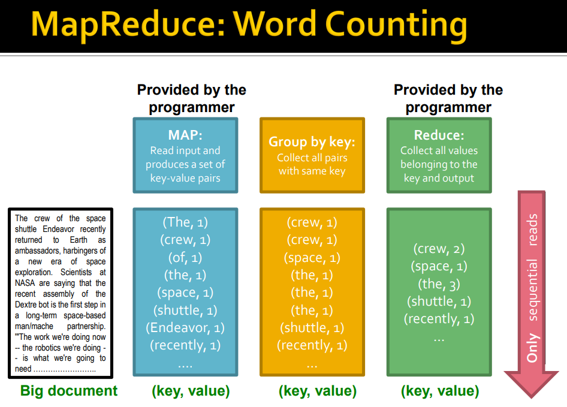
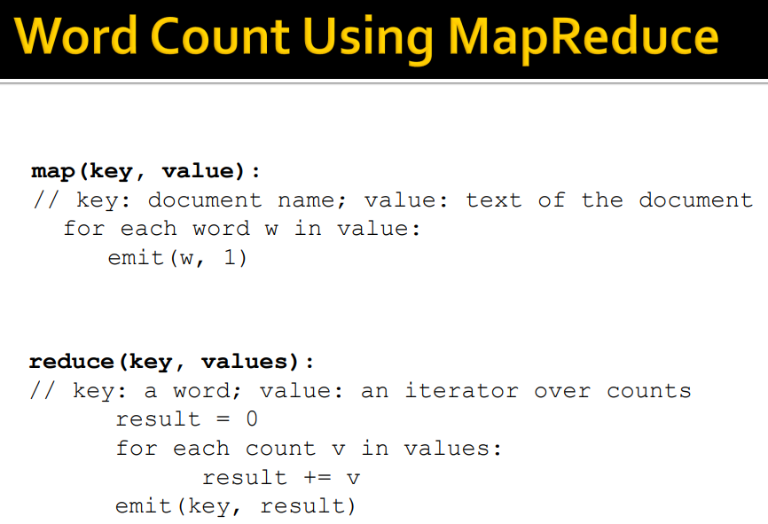
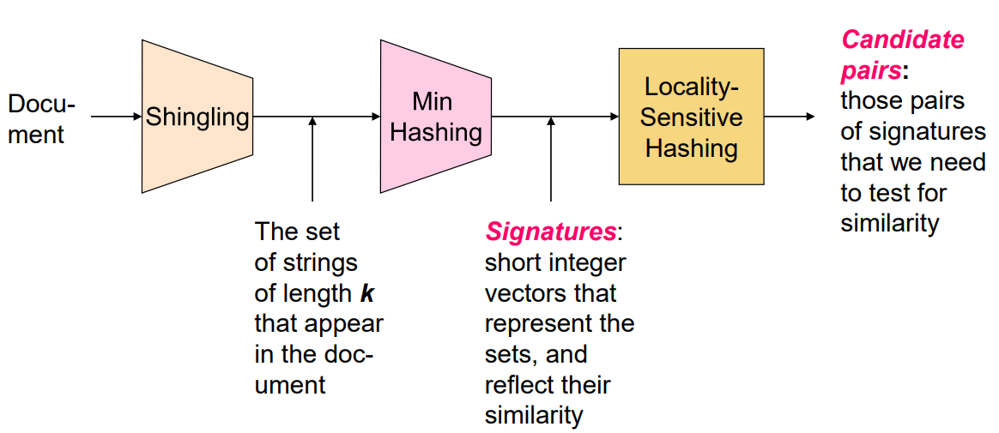
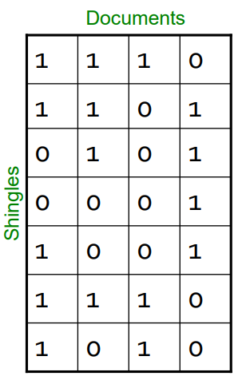
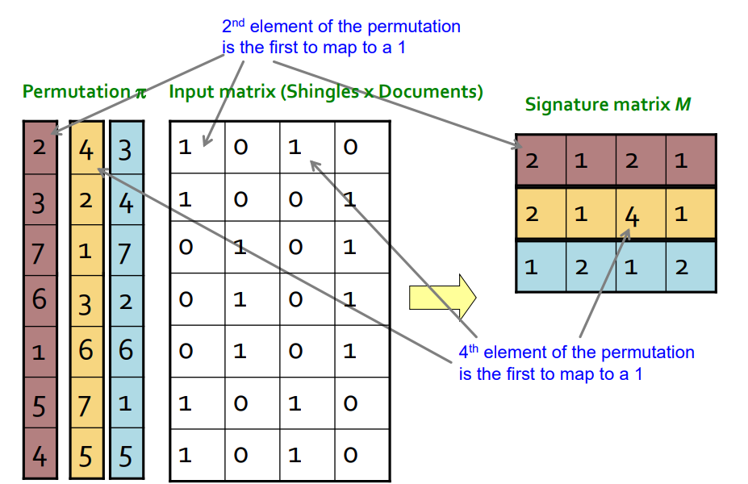
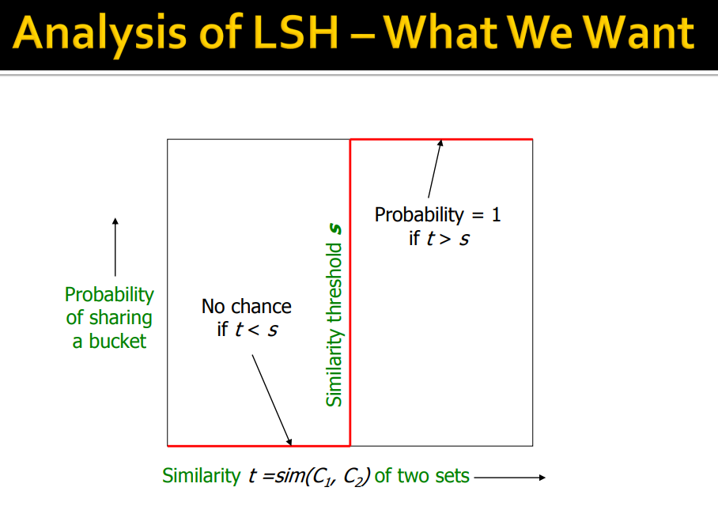
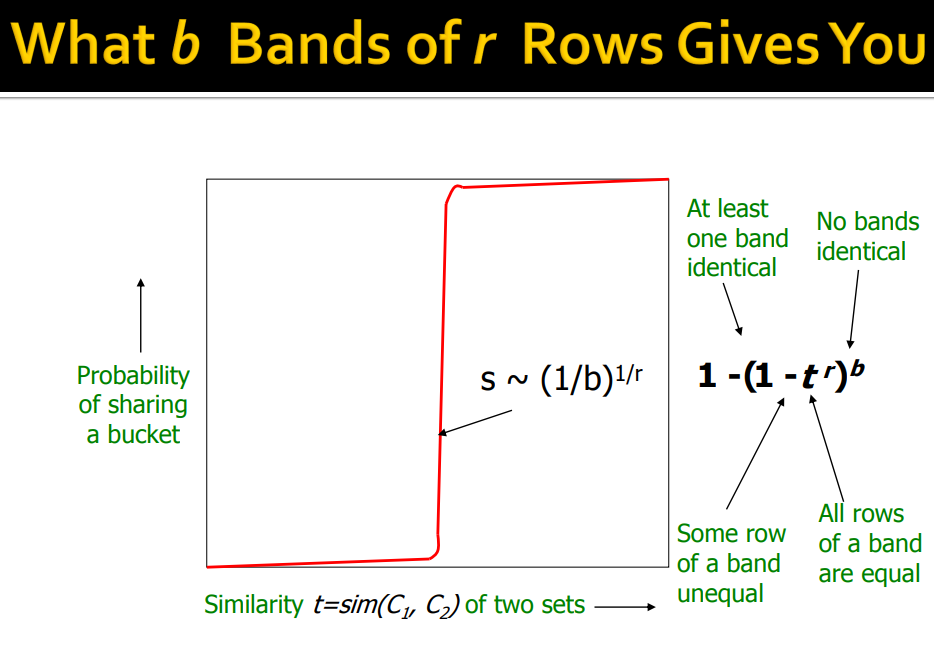
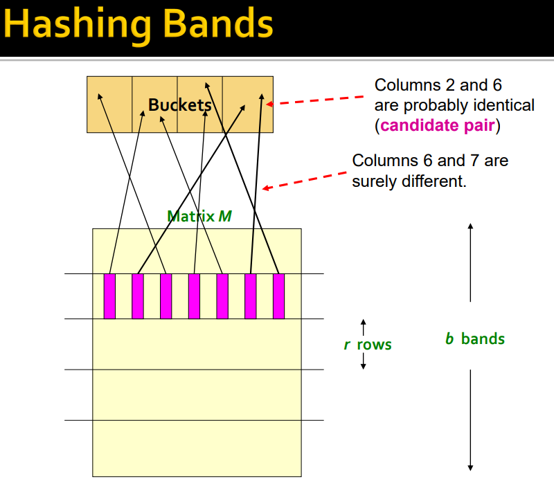

# Pokročilé techniky vyhledávání
povinné pro studium dle kontrolní šablony 2022/2023 nebo novější
> Zpracování dat pomocí přístupu Map-Reduce. 
> Vyhledávání pomocí technik Locality-Sensitive Hashing (LSH) a Min-Hashing. 
> Zpracování proudů dat (DGIM, Bloom filtry). 
> PageRank a jeho výpočet iterační metodou.

S nástupem éry Big Data přestala klasická architektura s jedním uzlem stačit. Hlavním úzkým hrdlem není jen výpočetní výkon (CPU), ale především rychlost čtení z disku a omezená paměť. Moderní vyhledávání proto vyžaduje distribuovaný přístup, kde se data i výpočty dělí mezi tisíce běžných serverů.

## Distribuovaná architektura a souborové systémy
Základem je cluster tvořený mnoha uzly (nodes) organizovanými v racích. Aby bylo možné zpracovávat terabyty dat, využívají se distribuované souborové systémy (např. HDFS), které data dělí na bloky (64 MB) a replikují je napříč clusterem pro zajištění dostupnosti.
- **Data Locality:** Výpočet se snažíme přesunout k datům, nikoliv data k výpočtu, čímž šetříme síťovou propustnost.
- **Replikace:** Zajišťuje, že při výpadku jednoho stroje jsou data stále dostupná na jiném uzlu.
- *Příklad: Pokud Google indexuje 400 TB webu, čtení na jednom stroji by trvalo měsíce, zatímco v distribuovaném systému s 1000 uzly proběhne paralelně za pár hodin.*

## Map-Reduce model
Map-Reduce je programovací model pro zpracování obrovských objemů dat (Big Data) pomocí dvou uživatelem definovaných funkcí: Map a Reduce. Model automaticky řeší paralelizaci, distribuci dat i odolnost proti chybám.
- Veškerá data jsou reprezentována jako dvojice **(klíč, hodnota)**.
- Uživatel se soustředí na logiku transformace, zatímco systém (framework) se stará o technickou realizaci distribuce.

6minutové vysvětlující video: https://www.youtube.com/watch?v=cvhKoniK5Uo

### Funkce Map
Funkce Map bere vstupní dvojici a generuje množinu mezilehlých (intermediate) dvojic. Tato fáze probíhá paralelně na mnoha uzlech (mapperech).
- Každý mapper zpracovává nezávisle svůj "split" dat.
- Výstupem mappers jsou dočasné soubory uložené na lokálních discích.
- *Příklad: V úloze Word Count (počítání slov) bere mapper řádek textu a pro každé nalezené slovo 'x' vypustí dvojici (x, 1).*

### Shuffle a Grouping
Tato fáze probíhá automaticky mezi Map a Reduce a je nejnáročnější na síťový provoz.
- **Seskupování:** Všechny hodnoty se stejným klíčem z různých mapperů jsou shromážděny a seřazeny.
- **Partitioning:** Klíče jsou rozděleny mezi reducery (např. pomocí hashovací funkce), aby byla zátěž rovnoměrná.
- *Příklad: Po fázi Map pro slovo "auto" systém shromáždí všechny jedničky ze všech uzlů a vytvoří pro reducer seznam: ("auto", [1, 1, 1, ...]).*

### Funkce Reduce
Reducer přijímá klíč a seznam všech hodnot k němu přiřazených. Jeho úkolem je tyto hodnoty agregovat.
- Výsledky z reducerů jsou ukládány přímo do distribuovaného souborového systému (HDFS).
- Počet výstupních souborů odpovídá počtu reducerů.
- *Příklad: Reducer pro slovo "auto" sečte všechny jedničky v seznamu a vydá finální výsledek ("auto", 542).*

### Combinery
Combiner je volitelná funkce, která provádí "lokální redukci" přímo na uzlu mappera předtím, než se data pošlou po síti.
- Slouží jako optimalizace pro snížení objemu dat přenášených ve fázi Shuffle.
- Lze jej použít pouze u asociativních a komutativních operací (jako je suma).
- *Příklad: Mapper místo deseti tisíc dvojic ("auto", 1) pošle díky combineru pouze jednu dvojici ("auto", 10000).*

### Odolnost proti chybám (Fault Tolerance)
V clusterech s tisíci stroji jsou selhání hardwaru na denním pořádku. Map-Reduce je navržen tak, aby je zvládal automaticky bez nutnosti restartovat celý job.
- **Worker Failure:** Master uzel pravidelně pingá workery (heartbeat). Pokud worker neodpovídá, master přeplánuje jeho úlohy na jiné uzly.
- **Map task re-execution:** Protože výstupy Map úloh jsou na lokálních discích, při pádu stroje se musí Map úlohy spustit znovu.
- **Master Failure:** Master je obvykle "single point of failure"; pokud spadne, job končí, ale stav lze obnovit z checkpointu.
- *Příklad: Pokud uprostřed výpočtu vyhoří uzel v racku, systém detekuje ztrátu, najde repliky dat na jiných discích a výpočet plynule dokončí jinde.*

---

## Vyhledávání podobných položek

Hledání podobných objektů (Near-Neighbor Search) ve vysokodimenzionálních prostorech je výpočetně náročné. Klasické porovnávání všech párů dokumentů má kvadratickou složitost $O(n^2)$, což je u velkých dat neúnosné. Proces se proto dělí do tří kroků: Shingling (převod na množiny), Min-Hashing (zkrácení na signatury) a LSH (rychlé nalezení kandidátů).

## Shingling
Prvním krokem je převod textového dokumentu na množinu krátkých řetězců délky $k$, nazývaných **k-shingles**. Dokument je tak reprezentován jako množina identifikátorů těchto řetězců.
- **Jaccardova podobnost:** Základní metrika pro porovnání množin $S_1$ a $S_2$. Počítá se jako poměr velikosti průniku k velikosti sjednocení: $J(S_1, S_2) = \frac{|S_1 \cap S_2|}{|S_1 \cup S_2|}$.
- *Příklad: Dokumenty "abac" a "ab" mají při k=2 shingles {ab, ba, ac} a {ab}. Jejich průnik je {ab}, sjednocení {ab, ba, ac}, tedy podobnost je 1/3.*

## Min-Hashing
Min-Hashing slouží k vytvoření krátkých "podpisů" (signatur) z velkých množin tak, aby byla zachována Jaccardova podobnost. Namísto uchovávání tisíců shingles ukládáme pouze stovky čísel.
- **Princip:** Máme matici, kde řádky jsou shingles a sloupce dokumenty. Náhodně permutujeme řádky a pro každý dokument (sloupec) definujeme $h(C)$ jako index prvního řádku (v permutovaném pořadí), který obsahuje jedničku.
- **Vlastnost:** Pravděpodobnost, že se min-hash hodnoty dvou dokumentů shodují, je přesně rovna jejich Jaccardově podobnosti: $P(h(C_1) = h(C_2)) = sim(C_1, C_2)$.
- **Signatura:** Opakováním postupu s $n$ různými permutacemi (nebo hashovacími funkcemi) získáme pro každý dokument signaturní vektor. Podobnost dokumentů pak odhadujeme jako podíl shodných prvků v jejich signaturách.
- *Příklad: Porovnání dvou stránek Wikipedie pomocí signatury o délce 100 čísel místo porovnávání všech slov v textu.*

### Příklad
*Mějme vstupní matici 7 řádků (shingles) a 4 dokumentů (sloupců). Zaměříme se na dokumenty D1 a D3.*

*Vstupní matice (1 = přítomnost shinglu):*
*D1 = {1, 2, 6, 7}*
*D3 = {1, 2, 7}*

| *Řádek* | *D1* | *D2* | *D3* | *D4* |
| :--- | :---: | :---: | :---: | :---: |
| *1* | *1* | *0* | *1* | *0* |
| *2* | *1* | *0* | *1* | *0* |
| *3* | *0* | *1* | *0* | *1* |
| *4* | *0* | *1* | *0* | *1* |
| *5* | *0* | *1* | *0* | *1* |
| *6* | *1* | *0* | *0* | *1* |
| *7* | *1* | *0* | *1* | *0* |

***Výpočet Jaccardovy podobnosti (D1, D3):***
- *Průnik: {1, 2, 7} (velikost 3)*
- *Sjednocení: {1, 2, 6, 7} (velikost 4)*
- *J(D1, D3) = 3 / 4 = 0,75*

***Výpočet Min-Hash signatury (D1, D3):***

*1. Permutace π1 (2, 3, 7, 6, 1, 5, 4):*
- *D1: První '1' v tomto pořadí je na řádku 2. h(D1) = 2.*
- *D3: První '1' v tomto pořadí je na řádku 2. h(D3) = 2.*
- *Výsledek: SHODA (2 vs 2).*

*2. Permutace π2 (4, 2, 1, 3, 6, 7, 5):*
- *D1: Řádek 4 (0), Řádek 2 (1). h(D1) = 2.*
- *D3: Řádek 4 (0), Řádek 2 (1). h(D3) = 2.*
- *Výsledek: SHODA (2 vs 2).*

*3. Permutace π3 (3, 4, 7, 2, 6, 1, 5):*
- *D1: Řádek 3 (0), Řádek 4 (0), Řádek 7 (1). h(D1) = 7.*
- *D3: Řádek 3 (0), Řádek 4 (0), Řádek 7 (1). h(D3) = 7.*
- *Výsledek: SHODA (7 vs 7).*

***Závěr příkladu:***
- *V tomto specifickém případě vykazují signatury 100% shodu (3/3), což je odhad Jaccardovy podobnosti. Skutečná hodnota je 0,75. Rozdíl mezi odhadem a skutečností je dán velmi malým počtem permutací; v praxi se používají stovky permutací, aby se odhad (Sig/Sig) stabilizoval na hodnotě Jaccardovy podobnosti (0,75).*

## Locality-Sensitive Hashing (LSH)
I když máme krátké signatury (např. 100 čísel), porovnat každý dokument s každým v milionech prvků je stále výpočetně nemožné ($O(n^2)$). LSH tento problém řeší tak, že dokumenty hashujeme do kbelíků (buckets) takovým způsobem, aby podobné dokumenty skončily ve stejném kbelíku s velmi vysokou pravděpodobností, zatímco nepodobné jen výjimečně.

### Princip pásem (Bands) a řádků (Rows)
Matici signatur rozdělíme na $b$ pásem, kde každé pásmo obsahuje $r$ řádků. Celková délka signatury je tedy $n = b \times r$.
- **Logika kandidátů:** Dva dokumenty se stanou **kandidáty** na porovnání pouze tehdy, pokud se jejich signatury **shodují úplně ve všech $r$ řádcích alespoň v jednom z $b$ pásem**.
- Pokud se dokumenty neshodnou v žádném pásmu, systém je dál neřeší a ušetří výpočetní čas.
- *Příklad: Máme signaturu o 100 číslech. Rozdělíme ji na 20 pásem po 5 číslech. Pokud se dokumenty D1 a D3 shodují v celém 5. pásmu (všech 5 čísel je stejných), jdou k detailní kontrole.*

### Matematika S-křivky
Pravděpodobnost, že se dva dokumenty s Jaccardovou podobností $s$ stanou kandidáty, je vyjádřena funkcí $1 - (1 - s^r)^b$. Tato funkce vytváří charakteristickou **S-křivku**:
1. **$s^r$**: Pravděpodobnost, že se dokumenty shodují ve všech řádcích jednoho konkrétního pásma.
2. **$1 - s^r$**: Pravděpodobnost, že se v daném pásmu aspoň v jednom řádku liší.
3. **$(1 - s^r)^b$**: Pravděpodobnost, že se dokumenty neliší ani v jednom z $b$ pásem (tedy se nikdy nestanou kandidáty).
4. **$1 - (1 - s^r)^b$**: Pravděpodobnost, že se shodují aspoň v jednom pásmu a stanou se kandidáty.

- **Chyby:** 
  - **Falešně negativní:** Podobné dokumenty, které náhodou nepadly do stejného pásma (lze minimalizovat zvýšením počtu pásem).
  - **Falešně pozitivní:** Nepodobné dokumenty, které se náhodou shodly v jednom pásmu (lze odfiltrovat následným přesným výpočtem podobnosti).

        