# Pokročilé techniky vyhledávání
povinné pro studium dle kontrolní šablony 2022/2023 nebo novější
> Zpracování dat pomocí přístupu Map-Reduce. 
> Vyhledávání pomocí technik Locality-Sensitive Hashing (LSH) a Min-Hashing. 
> Zpracování proudů dat (DGIM, Bloom filtry). 
> PageRank a jeho výpočet iterační metodou.

S nástupem éry Big Data přestala klasická architektura s jedním uzlem stačit. Hlavním úzkým hrdlem není jen výpočetní výkon (CPU), ale především rychlost čtení z disku a omezená paměť. Moderní vyhledávání proto vyžaduje distribuovaný přístup, kde se data i výpočty dělí mezi tisíce běžných serverů.

## Distribuovaná architektura a souborové systémy
Základem je cluster tvořený mnoha uzly (nodes) organizovanými v racích. Aby bylo možné zpracovávat terabyty dat, využívají se distribuované souborové systémy (např. HDFS), které data dělí na bloky (64 MB) a replikují je napříč clusterem pro zajištění dostupnosti.
- **Data Locality:** Výpočet se snažíme přesunout k datům, nikoliv data k výpočtu, čímž šetříme síťovou propustnost.
- **Replikace:** Zajišťuje, že při výpadku jednoho stroje jsou data stále dostupná na jiném uzlu.
- *Příklad: Pokud Google indexuje 400 TB webu, čtení na jednom stroji by trvalo měsíce, zatímco v distribuovaném systému s 1000 uzly proběhne paralelně za pár hodin.*

## Map-Reduce model
Map-Reduce je programovací model pro zpracování obrovských objemů dat (Big Data) pomocí dvou uživatelem definovaných funkcí: Map a Reduce. Model automaticky řeší paralelizaci, distribuci dat i odolnost proti chybám.
- Veškerá data jsou reprezentována jako dvojice **(klíč, hodnota)**.
- Uživatel se soustředí na logiku transformace, zatímco systém (framework) se stará o technickou realizaci distribuce.

6minutové vysvětlující video: https://www.youtube.com/watch?v=cvhKoniK5Uo

### Funkce Map
Funkce Map bere vstupní dvojici a generuje množinu mezilehlých (intermediate) dvojic. Tato fáze probíhá paralelně na mnoha uzlech (mapperech).
- Každý mapper zpracovává nezávisle svůj "split" dat.
- Výstupem mappers jsou dočasné soubory uložené na lokálních discích.
- *Příklad: V úloze Word Count (počítání slov) bere mapper řádek textu a pro každé nalezené slovo 'x' vypustí dvojici (x, 1).*

### Shuffle a Grouping
Tato fáze probíhá automaticky mezi Map a Reduce a je nejnáročnější na síťový provoz.
- **Seskupování:** Všechny hodnoty se stejným klíčem z různých mapperů jsou shromážděny a seřazeny.
- **Partitioning:** Klíče jsou rozděleny mezi reducery (např. pomocí hashovací funkce), aby byla zátěž rovnoměrná.
- *Příklad: Po fázi Map pro slovo "auto" systém shromáždí všechny jedničky ze všech uzlů a vytvoří pro reducer seznam: ("auto", [1, 1, 1, ...]).*

### Funkce Reduce
Reducer přijímá klíč a seznam všech hodnot k němu přiřazených. Jeho úkolem je tyto hodnoty agregovat.
- Výsledky z reducerů jsou ukládány přímo do distribuovaného souborového systému (HDFS).
- Počet výstupních souborů odpovídá počtu reducerů.
- *Příklad: Reducer pro slovo "auto" sečte všechny jedničky v seznamu a vydá finální výsledek ("auto", 542).*

### Combinery
Combiner je volitelná funkce, která provádí "lokální redukci" přímo na uzlu mappera předtím, než se data pošlou po síti.
- Slouží jako optimalizace pro snížení objemu dat přenášených ve fázi Shuffle.
- Lze jej použít pouze u asociativních a komutativních operací (jako je suma).
- *Příklad: Mapper místo deseti tisíc dvojic ("auto", 1) pošle díky combineru pouze jednu dvojici ("auto", 10000).*

### Odolnost proti chybám (Fault Tolerance)
V clusterech s tisíci stroji jsou selhání hardwaru na denním pořádku. Map-Reduce je navržen tak, aby je zvládal automaticky bez nutnosti restartovat celý job.
- **Worker Failure:** Master uzel pravidelně pingá workery (heartbeat). Pokud worker neodpovídá, master přeplánuje jeho úlohy na jiné uzly.
- **Map task re-execution:** Protože výstupy Map úloh jsou na lokálních discích, při pádu stroje se musí Map úlohy spustit znovu.
- **Master Failure:** Master je obvykle "single point of failure"; pokud spadne, job končí, ale stav lze obnovit z checkpointu.
- *Příklad: Pokud uprostřed výpočtu vyhoří uzel v racku, systém detekuje ztrátu, najde repliky dat na jiných discích a výpočet plynule dokončí jinde.*

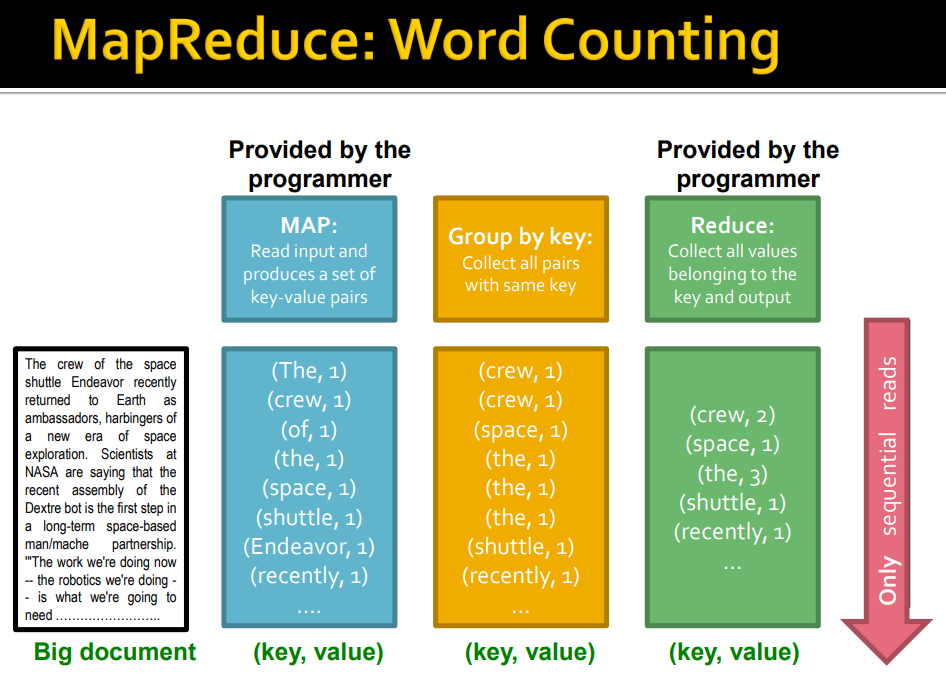

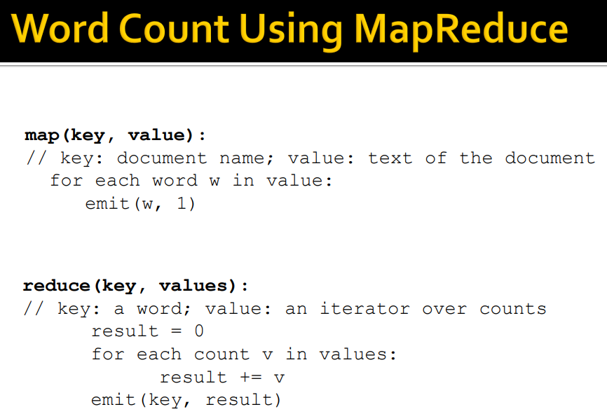

### Praktické příklady a využití Map-Reduce
* **Budování vyhledávacích indexů (Inverted Index):** Používá se pro mapování slov na dokumenty, ve kterých se vyskytují. 
    * *Mapper* vezme dokument a pro každé slovo vygeneruje `(slovo, ID_dokumentu)`. 
    * *Reducer* shromáždí všechna ID pro dané slovo a vytvoří seznam: `(slovo, [doc1, doc4, doc12])`. Přesně takhle Google původně indexoval web.
* **Analýza logů (Log Analysis):** Zpracování terabytů systémových logů z tisíců serverů.
    * *Mapper* filtruje logy a hledá chybové hlášky, např. vyhodí `("HTTP 500", 1)`.
    * *Reducer* chyby sečte a poskytne přehled o stabilitě systému v čase.
* **Sociální sítě (Analýza grafů přátel):** Hledání "společných přátel" nebo doporučování lidí ke sledování.
    * *Mapper* pro každého uživatele projde jeho přátele a vygeneruje dvojice potenciálních vazeb.
    * *Reducer* spočítá, kolikrát se stejná vazba objevila, a navrhne propojení.

### Limitace Map-Reduce (Kdy se nehodí)
Přestože je Map-Reduce extrémně robustní pro masivní dávkové zpracování (Batch Processing), má zásadní architektonická omezení, kvůli kterým ho v mnoha moderních úlohách nahradil např. Apache Spark:

* **Vysoká režie disků (Disk I/O Bottleneck):** Mezilehlé výsledky fáze Map se ukládají na lokální disky a výsledky fáze Reduce se zapisují do HDFS. Neustálé čtení a zápis z/na disk celý proces drasticky zpomaluje v porovnání s moderními In-Memory systémy (které drží data v RAM).
* **Nevhodné pro iterační algoritmy:** Algoritmy, které potřebují data zpracovávat v mnoha krocích za sebou (např. strojové učení, K-Means clustering nebo právě **iterační výpočet PageRanku**), musí v Map-Reduce pro každou jednu iteraci spustit kompletně nový job od nuly. To znamená znovu načíst data z disku a znovu je zapsat.
* **Vysoká latence (Batch-only):** Map-Reduce je navržen pro zpracování velkých dávek najednou. Spuštění jobu trvá sekundy až minuty (alokace zdrojů, inicializace tasků). Naprosto se proto nehodí pro real-time dotazy nebo interaktivní analýzu dat.
* **Náročný Shuffle:** Fáze Shuffle vyžaduje přenos obrovského množství dat přes síť mezi všemi uzly (all-to-all komunikace). Pokud není správně implementován combiner, síťová karta se snadno stane hlavním úzkým hrdlem celého výpočtu.

---

## Vyhledávání podobných položek

Hledání podobných objektů (Near-Neighbor Search) ve vysokodimenzionálních prostorech je výpočetně náročné. Klasické porovnávání všech párů dokumentů má kvadratickou složitost $O(n^2)$, což je u velkých dat neúnosné. Proces se proto dělí do tří kroků: Shingling (převod na množiny), Min-Hashing (zkrácení na signatury) a LSH (rychlé nalezení kandidátů).

Ilustrovaný blog: https://www.pinecone.io/learn/series/faiss/locality-sensitive-hashing/

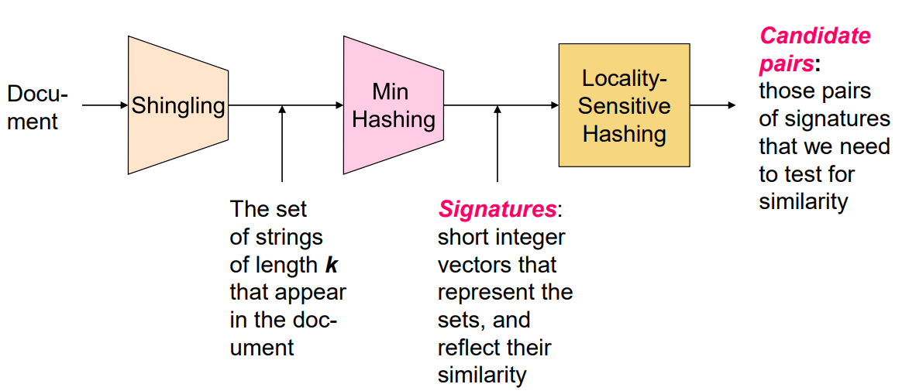

## Shingling
Prvním krokem je převod textového dokumentu na množinu krátkých řetězců délky $k$, nazývaných **k-shingles**. Dokument je tak reprezentován jako množina identifikátorů těchto řetězců.
- **Jaccardova podobnost:** Základní metrika pro porovnání množin $S_1$ a $S_2$. Počítá se jako poměr velikosti průniku k velikosti sjednocení: $J(S_1, S_2) = \frac{|S_1 \cap S_2|}{|S_1 \cup S_2|}$.
- *Příklad: Dokumenty "abac" a "ab" mají při k=2 shingles {ab, ba, ac} a {ab}. Jejich průnik je {ab}, sjednocení {ab, ba, ac}, tedy podobnost je 1/3.*

## Min-Hashing
Min-Hashing slouží k vytvoření krátkých "podpisů" (signatur) z velkých množin tak, aby byla zachována Jaccardova podobnost. Namísto uchovávání tisíců shingles ukládáme pouze stovky čísel.
- **Princip:** Máme matici, kde řádky jsou shingles a sloupce dokumenty. Náhodně permutujeme řádky a pro každý dokument (sloupec) definujeme $h(C)$ jako index prvního řádku (v permutovaném pořadí), který obsahuje jedničku.
- **Vlastnost:** Pravděpodobnost, že se min-hash hodnoty dvou dokumentů shodují, je přesně rovna jejich Jaccardově podobnosti: $P(h(C_1) = h(C_2)) = sim(C_1, C_2)$.
- **Signatura:** Opakováním postupu s $n$ různými permutacemi (nebo hashovacími funkcemi) získáme pro každý dokument signaturní vektor. Podobnost dokumentů pak odhadujeme jako podíl shodných prvků v jejich signaturách.
- *Příklad: Porovnání dvou stránek Wikipedie pomocí signatury o délce 100 čísel místo porovnávání všech slov v textu.*

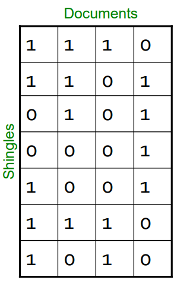

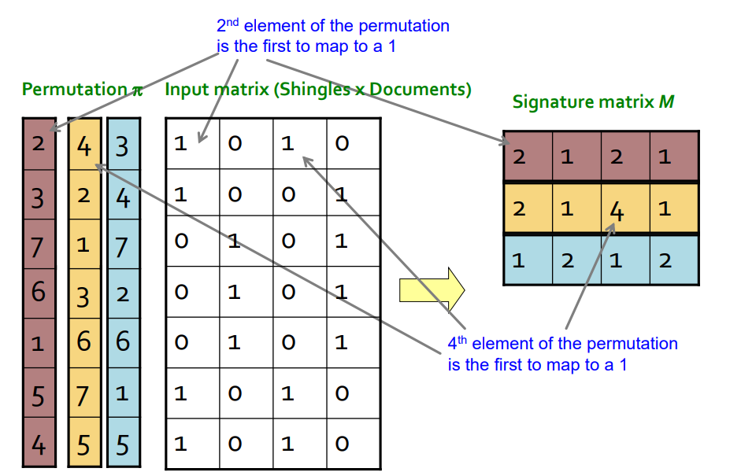

Názorné vysvětlení na příkladu

### Příklad
*Mějme vstupní matici 7 řádků (shingles) a 4 dokumentů (sloupců). Zaměříme se na dokumenty D1 a D3.*

*Vstupní matice (1 = přítomnost shinglu):*
*D1 = {1, 2, 6, 7}*
*D3 = {1, 2, 7}*

| *Řádek* | *D1* | *D2* | *D3* | *D4* |
| :--- | :---: | :---: | :---: | :---: |
| *1* | *1* | *0* | *1* | *0* |
| *2* | *1* | *0* | *1* | *0* |
| *3* | *0* | *1* | *0* | *1* |
| *4* | *0* | *1* | *0* | *1* |
| *5* | *0* | *1* | *0* | *1* |
| *6* | *1* | *0* | *0* | *1* |
| *7* | *1* | *0* | *1* | *0* |

***Výpočet Jaccardovy podobnosti (D1, D3):***
- *Průnik: {1, 2, 7} (velikost 3)*
- *Sjednocení: {1, 2, 6, 7} (velikost 4)*
- *J(D1, D3) = 3 / 4 = 0,75*

***Výpočet Min-Hash signatury (D1, D3):***

*1. Permutace π1 (2, 3, 7, 6, 1, 5, 4):*
- *D1: První '1' v tomto pořadí je na řádku 2. h(D1) = 2.*
- *D3: První '1' v tomto pořadí je na řádku 2. h(D3) = 2.*
- *Výsledek: SHODA (2 vs 2).*

*2. Permutace π2 (4, 2, 1, 3, 6, 7, 5):*
- *D1: Řádek 4 (0), Řádek 2 (1). h(D1) = 2.*
- *D3: Řádek 4 (0), Řádek 2 (1). h(D3) = 2.*
- *Výsledek: SHODA (2 vs 2).*

*3. Permutace π3 (3, 4, 7, 2, 6, 1, 5):*
- *D1: Řádek 3 (0), Řádek 4 (0), Řádek 7 (1). h(D1) = 7.*
- *D3: Řádek 3 (0), Řádek 4 (0), Řádek 7 (1). h(D3) = 7.*
- *Výsledek: SHODA (7 vs 7).*

***Závěr příkladu:***
- *V tomto specifickém případě vykazují signatury 100% shodu (3/3), což je odhad Jaccardovy podobnosti. Skutečná hodnota je 0,75. Rozdíl mezi odhadem a skutečností je dán velmi malým počtem permutací; v praxi se používají stovky permutací, aby se odhad (Sig/Sig) stabilizoval na hodnotě Jaccardovy podobnosti (0,75).*

## Locality-Sensitive Hashing (LSH)
Locality-Sensitive Hashing (LSH) řeší zásadní problém: Min-Hashing sice zkrátil dokumenty na krátké signatury, ale pokud máme 1 milion dokumentů, stále bychom museli provést zhruba 500 miliard porovnání ( $O(n^2)$ ), abychom našli ty podobné. 

LSH proto funguje jako **předvýběr (filtr)**. Rozdělí matici signatur na $b$ pásem po $r$ řádcích. 
* **S-křivka** je matematickým vyjádřením tohoto filtru. Ukazuje pravděpodobnost ($P$), že dva dokumenty se specifickou Jaccardovou podobností ($s$) projdou filtrem a stanou se kandidáty na detailní porovnání.
* **Logika filtru (AND/OR):** Aby se dva dokumenty shodovaly v rámci jednoho pásma, musí se shodovat ve **všech $r$ řádcích** (logické **AND**, pravděpodobnost je $s^r$). To funguje jako přísné síto, které propustí jen hodně podobné řádky. 
Aby se staly celkovými kandidáty, stačí, když se shodují v **alespoň jednom z $b$ pásem** (logické **OR**, pravděpodobnost roste na $1 - (1 - s^r)^b$). To dává podobným dokumentům "více šancí" uspět, i kdyby se v některých pásech kvůli náhodě lišily.
* Výsledná **S-křivka** má ostrý zlom kolem prahu $t \approx (1/b)^{1/r}$. Dokumenty s podobností nad tímto prahem propustí s pravděpodobností blížící se 100 %, zatímco dokumenty pod ním odfiltruje s pravděpodobností blížící se 0 %.

V klasickém hashování (např. MD5, SHA-256) chceme pravý opak: aby i minimální změna na vstupu (např. jedno písmenko) vedla k úplně jinému hashi (lavinový efekt) a minimalizovaly se kolize. V LSH naopak **chceme, aby podobné vstupy kolidovaly (skončily ve stejném kbelíku)**.
Konkrétní podoba hashovací funkce v LSH závisí na použitém typu dat a metriky podobnosti. Pro **Jaccardovu podobnost** se jako LSH funkce používá **kombinace Min-Hashingu a standardní hashovací funkce**.

### Princip pásem (Bands) a řádků (Rows)
Matici signatur rozdělíme na $b$ pásem, kde každé pásmo obsahuje $r$ řádků. Celková délka signatury je tedy $n = b \times r$.
- **Logika kandidátů:** Dva dokumenty se stanou **kandidáty** na porovnání pouze tehdy, pokud se jejich signatury **shodují úplně ve všech $r$ řádcích alespoň v jednom z $b$ pásem**.
- Pokud se dokumenty neshodnou v žádném pásmu, systém je dál neřeší a ušetří výpočetní čas.
- *Příklad: Máme signaturu o 100 číslech. Rozdělíme ji na 20 pásem po 5 číslech. Pokud se dokumenty D1 a D3 shodují v celém 5. pásmu (všech 5 čísel je stejných), jdou k detailní kontrole.*

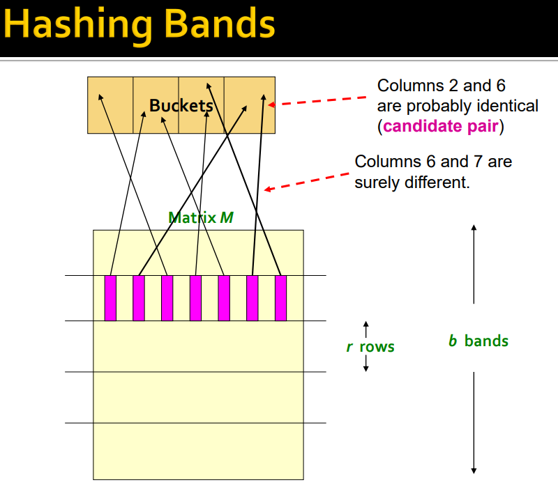

### S-křivka
**S-křivka slouží k** nastavení a vizualizaci citlivosti celého LSH filtru. Ukazuje, s jakou pravděpodobností ($P$) projdou dokumenty o určité reálné podobnosti ($s$) do stejného kbelíku, a stanou se tak kandidáty na porovnání. Pomáhá nám najít rovnováhu mezi množstvím falešně pozitivních a falešně negativních chyb.
Pravděpodobnost, že se dva dokumenty s Jaccardovou podobností $s$ stanou kandidáty, je vyjádřena funkcí $P = 1 - (1 - s^r)^b$. Tato funkce vytváří charakteristickou **S-křivku**:
1. **$s^r$**: Pravděpodobnost, že se dokumenty shodují ve všech řádcích jednoho konkrétního pásma.
2. **$1 - s^r$**: Pravděpodobnost, že se v daném pásmu aspoň v jednom řádku liší.
3. **$(1 - s^r)^b$**: Pravděpodobnost, že se dokumenty neliší ani v jednom z $b$ pásem (tedy se nikdy nestanou kandidáty).
4. **$1 - (1 - s^r)^b$**: Pravděpodobnost, že se shodují aspoň v jednom pásmu a stanou se kandidáty.

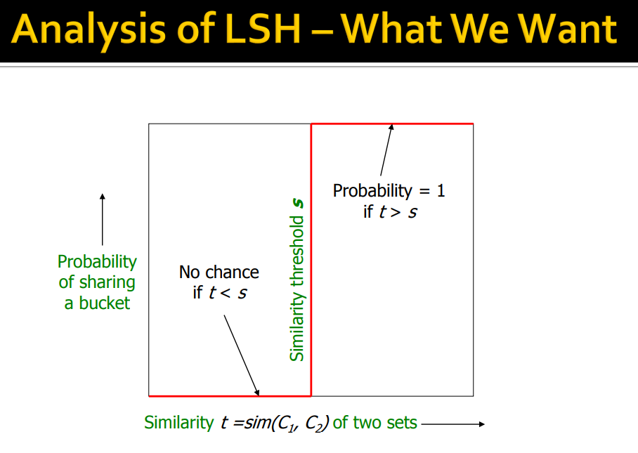

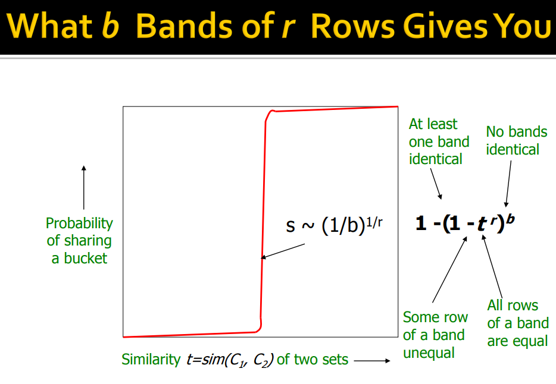

- **Osa X (s):** Podobnost vstupních dokumentů (Jaccardova podobnost) v rozmezí $[0, 1]$. Hodnota $1$ znamená identické dokumenty, $0$ naprosto odlišné.
- **Osa Y (P):** Pravděpodobnost, že se dokumenty stanou kandidáty (skončí ve stejném kbelíku) v rozmezí $[0, 1]$.
- **Parametr $r$ (rows):** Počet řádků v jednom pásmu. Ovlivňuje "přísnost" shody v rámci pásma (AND logika). Vyšší $r$ posouvá křivku doprava.
- **Parametr $b$ (bands):** Počet pásem. Udává, kolik "šancí" mají dokumenty na shodu (OR logika). Vyšší $b$ zvyšuje strmost křivky.

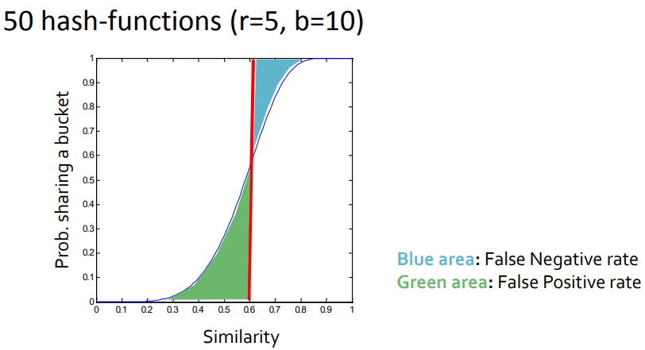

**Chyby:** 
- **Falešně negativní:** Podobné dokumenty, které náhodou nepadly do stejného pásma (lze minimalizovat zvýšením počtu pásem).
- **Falešně pozitivní:** Nepodobné dokumenty, které se náhodou shodly v jednom pásmu (lze odfiltrovat následným přesným výpočtem podobnosti).

Změnou parametrů $b$ (počet pásem) a $r$ (počet řádků) můžeme S-křivku posouvat a měnit její vlastnosti. Tím určujeme, jak přísný náš vyhledávací filtr bude. Práh podobnosti je definován jako $t \approx (1/b)^{1/r}$.

**Extrém 1: Velmi přísný filtr (Vysoké $r$, nízké $b$)**
* **Nastavení:** Např. $h = 100$ čísel v signatuře rozdělíme na $b = 5$ pásem po $r = 20$ řádcích.
* **Matematický práh:** $t \approx (1/5)^{1/20} \approx 0.92$
* **Chování systému:** Aby se dva dokumenty staly kandidáty, musí se v některém pásmu shodovat ve všech 20 číslech naráz (přísná AND logika). Mají na to navíc jen 5 pokusů (nízké OR).
* **Dopad na chyby:**
    * **Falešně pozitivní $\rightarrow$ Téměř NULA.** Do stejného kbelíku se omylem nedostane téměř nic nepodobného.
    * **Falešně negativní $\rightarrow$ Velmi VYSOKÉ.** I dokumenty s vysokou podobností (např. 85 %) filtr nekompromisně zahodí, protože neprojdou sítem 20 shodných řádků za sebou.
* **Využití:** Hledání **identických kopií a stoprocentních plagiátů** (např. nahrání ukradeného videa na YouTube, kde se liší jen pár pixelů).

**Extrém 2: Velmi volný filtr (Nízké $r$, vysoké $b$)**
* **Nastavení:** Např. $h = 100$ čísel v signatuře rozdělíme na $b = 50$ pásem po $r = 2$ řádcích.
* **Matematický práh:** $t \approx (1/50)^{1/2} \approx 0.14$
* **Chování systému:** Stačí, aby se dokumenty shodovaly v pouhých 2 řádcích (volná AND logika), a navíc k tomu mají 50 nezávislých šancí (obrovské OR).
* **Dopad na chyby:**
    * **Falešně pozitivní $\rightarrow$ Extremně VYSOKÉ.** V kbelících skončí obrovské množství dokumentů, které jsou si podobné třeba jen z 15 % a reálně spolu nesouvisí. Výrazně se tím prodlouží následné přesné dohledávání.
    * **Falešně negativní $\rightarrow$ Téměř NULA.** Systém nepřehlédne téměř žádný, byť jen vzdáleně podobný dokument.
* **Využití:** **Široké asociační vyhledávání**, medicína (hledání mutací genů, kde stačí zachytit drobnou shodu a nesmí nám nic uniknout) nebo doporučování obsahu (zajímá nás cokoliv vzdáleně podobného vkusu uživatele).

Názorný příklad

### Konkrétní numerický příklad (S-křivka v praxi)
Uvažujme nastavení parametrů $b = 20$ pásem a $r = 5$ řádků. Práh podobnosti je definován jako $t \approx (1/b)^{1/r} \approx (1/20)^{1/5} \approx 0.55$.

**Případ A: Vysoká podobnost ($s = 0.8$)**
1. $s^r = 0.8^5 \approx 0.328$ Pravděpodobnost, že se dokumenty shodují ve všech řádcích jednoho konkrétního pásma.
2. $1 - s^r = 1 - 0.328 = 0.672$ Pravděpodobnost, že se v daném pásmu aspoň v jednom řádku liší.
3. $(1 - s^r)^b = 0.672^{20} \approx 0.00035$ Pravděpodobnost, že se dokumenty neliší ani v jednom z $b$ pásem (tedy se nikdy nestanou kandidáty).
4. $P = 1 - 0.00035 = \mathbf{0.99965}$
Výsledek: Dokumenty s vysokou podobností se stanou kandidáty s pravděpodobností cca 99.97 %.

**Případ B: Nízká podobnost ($s = 0.2$)**
1. $s^r = 0.2^5 = 0.00032$ Pravděpodobnost, že se dokumenty shodují ve všech řádcích jednoho konkrétního pásma.
2. $1 - s^r = 1 - 0.00032 = 0.99968$ Pravděpodobnost, že se v daném pásmu aspoň v jednom řádku liší.
3. $(1 - s^r)^b = 0.99968^{20} \approx 0.9936$ Pravděpodobnost, že se dokumenty neliší ani v jednom z $b$ pásem (tedy se nikdy nestanou kandidáty).
4. $P = 1 - 0.9936 = \mathbf{0.0064}$ 
Výsledek: Dokumenty s nízkou podobností se stanou kandidáty s pravděpodobností pouze cca 0.64 %. 

### Příklady

Princip Shingling $\rightarrow$ Min-Hashing $\rightarrow$ LSH lze aplikovat na jakýkoliv problém, kde lze objekty reprezentovat jako množiny vlastností (features).

* **Doporučovací systémy (E-shopy a streamovací služby):**
    * **Položky:** Uživatelé.
    * **"Slova" (Množina):** Seznam zakoupených produktů nebo zhlédnutých filmů.
    * *Využití:* Hledání „vzhledově“ nebo zájmově podobných uživatelů (Collaborative Filtering). Pokud má uživatel A a uživatel B vysokou Jaccardovu podobnost své množiny zhlédnutých filmů, systém jim navzájem doporučí to, co ten druhý ještě neviděl. LSH zde brání tomu, aby systém musel porovnávat miliony uživatelů každý s každým.
* **Detekce plagiátů a autorských práv u obrázků (Image Retrieval):**
    * **Položky:** Digitální fotografie / obrázky.
    * **"Slova" (Množina):** Vizuální vlastnosti (např. lokální deskriptory jako SIFT, SURF, nebo barevné histogramy jednotlivých segmentů obrázku).
    * *Využití:* Vyhledávání vizuálně podobných obrázků (např. Google Obrázky). Pokud někdo vezme cizí fotku, ořízne ji a mírně změní barvy, množiny vizuálních prvků budou mít stále vysoký průnik. Min-Hashing a LSH bleskově najdou originál v databázi miliard obrázků.
* **Bioinformatika (Porovnávání DNA a proteinů):**
    * **Položky:** Genetické sekvence.
    * **"Slova" (Množina):** Tzv. *k-mers* (krátké podsledy nukleotidů o délce *k*, což je přímá obdoba k-shingles v textu).
    * *Využití:* Hledání podobných genů napříč různými organismy nebo identifikace mutací. Protože jsou genomy gigantické, klasické sekvenční porovnávání je extrémně pomalé. LSH dokáže okamžitě vyfiltrovat kandidátní sekvence, které vykazují vysokou shodu.
* **Detekce malwaru a kybernetická bezpečnost:**
    * **Položky:** Spustitelné soubory (.exe, .bin).
    * **"Slova" (Množina):** Posloupnosti systémových volání (API calls) nebo sekvence bajtů (n-gramy instrukcí).
    * *Využití:* Útočníci často vezmou známý virus a mírně upraví kód (přidají "junk" instrukce), aby obešli běžné antiviry založené na přesném kontrolním součtu (MD5/SHA256). Pokud se ale kód převede na množinu instrukcí, Jaccardova podobnost upraveného viru s původním zůstane velmi vysoká a LSH ho odhalí.
* **Detekce podvodů s kreditními kartami (Fraud Detection):**
    * **Položky:** Bankovní klienti.
    * **"Slova" (Množina):** Množina obchodníků, poloh (GPS) a časových oken, kde běžně realizují transakce.
    * *Využití:* Pokud se chování karty náhle radikálně odkloní od historické množiny typického chování daného uživatele (nebo naopak spadne do LSH kbelíku typického pro známé podvodné vzorce), systém transakci zablokuje.

---
# Zpracování proudů dat

U proudových dat (Data Streams) předpokládáme, že data přicházejí vysokou rychlostí, jsou potenciálně nekonečná a nelze je všechna uložit. Zpracování probíhá v reálném čase s omezenou pamětí, často pomocí klouzavých oken (Sliding Windows).

---
## Bloomovy filtry
Bloomův filtr je prostorově efektivní pravděpodobnostní datová struktura sloužící k rychlému testování příslušnosti prvku do množiny. Hlavní motivací je ušetřit obrovské množství operační paměti v situacích, kdy si nemůžeme dovolit ukládat skutečné prvky (např. miliardy URL adres), ale potřebujeme bleskově rozhodnout, zda jsme daný prvek už viděli.

Proč potřebujeme proudové algoritmy?

U proudových dat narážíme na **fyzikální limity hardwaru**. Představme si reálný scénář: monitorování provozu na páteřním síťovém routeru.

* **Vstupní data:** Routerem projde **1 milion IP paketů za sekundu**. Chceme v reálném čase (např. v klouzavém okně posledních 24 hodin) sledovat počet unikátních IP adres, abychom detekovali DDoS útok.
* **Analýza datového objemu:**
    * Jedna IPv4 adresa má 4 bajty (32 bitů). Pokud bychom ukládali každou IP adresu, za sekundu spotřebujeme 4 MB.
    * Za hodinu: $4 \text{ MB} \times 3600 = 14.4 \text{ GB}$.
    * Za 24 hodin: $14.4 \text{ GB} \times 24 \approx \mathbf{345 \text{ GB}}$ hrubých dat, která musíme udržovat v paměti pro jedno klouzavé okno.
* **Proč klasický přístup selže:**
    * **Omezení RAM:** Uložit 345 GB do rychlé operační paměti (RAM) jednoho běžného routeru nebo serveru je extrémně drahé nebo nemožné.
    * **Omezení disku (Latence):** Uložit data na SSD/disk sice lze, ale zápis a následné prohledávání (Lookup) milionu záznamů za sekundu vytvoří obrovské úzké hrdlo. Klasická databáze (např. SQL s `SELECT COUNT(DISTINCT ip)`) by měla latenci v řádu milisekund až sekund, což na síti znamená okamžitý kolaps a ztrátu paketů.
* **Proudové řešení:** Algoritmy jako Bloomovy filtry nebo DGIM tento problém řeší tak, že **zahazují samotná data (IP adresy)** a ukládají pouze extrémně komprimované bitové struktury (statistické indikátory). Místo stovek gigabajtů RAM jim stačí řádově **megabajty nebo desítky megabajtů**, přičemž operace kontroly a zápisu trvají fixní čas $O(1)$ v řádu nanosekund.

### Princip a fungování
Struktura se skládá z bitového pole o délce $m$ (všechny bity jsou na začátku 0) a $k$ nezávislých hashovacích funkcí $h_1, h_2, \dots, h_k$.
- **Vkládání (Insertion):** Pro prvek $x$ vypočítáme $k$ hashů a bity na pozicích $h_1(x), \dots, h_k(x)$ nastavíme na 1.
- **Dotaz (Query):** Pro prvek $y$ zkontrolujeme bity na pozicích $h_1(y), \dots, h_k(y)$. Pokud je alespoň jeden z těchto bitů 0, prvek v množině **určitě není** (žádné False Negatives). Pokud jsou všechny 1, prvek v množině **pravděpodobně je** (možné False Positives).
- **Klíčová vlastnost:** Bloomův filtr nikdy nelže, pokud řekne "NE". Pokud řekne "ANO", musíme počítat s malou pravděpodobností chyby, kterou lze ale matematicky minimalizovat.

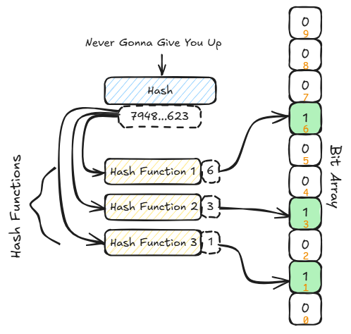

### Optimální nastavení a matematika
Klíčem k efektivitě je správný poměr mezi velikostí pole $m$, počtem vložených prvků $n$ a počtem hashovacích funkcí $k$.
- **Pravděpodobnost False Positive:** Přibližně $(1 - e^{-kn/m})^k$. Tato hodnota roste s počtem vložených prvků $n$. Pravděpodobnost False Positive závisí na zaplnění bitového pole. Pokud je $k$ příliš malé, kontrolujeme málo bitů a hrozí náhodná shoda. Pokud je $k$ příliš velké, pole se jedničkami zaplní příliš rychle ($n$ roste) a filtr začne bleskově vykazovat chyby.
- **Optimální hodnota $k$:** Abychom minimalizovali pravděpodobnost chyby pro dané $m$ a $n$, volíme počet hashovacích funkcí jako hodnotu, která v bitovém poli nastaví právě polovinu bitů na jedničku, což znamená, že pravděpodobnost nulového bitu po vložení prvků musí být $e^{-kn/m} = \frac{1}{2}$. Z této rovnosti zlogaritmováním dostaneme $- \frac{kn}{m} = \ln(\frac{1}{2}) = - \ln 2$, z čehož osamostatněním $k$ vyjde finální vzorec, tedy:

  $$k = \frac{m}{n} \ln 2 \approx 0.7 \times \frac{m}{n}$$
- Při tomto nastavení je zaplněna právě polovina bitového pole jedničkami, což poskytuje nejvyšší informační hodnotu.
- *Příklad: Pokud máme k dispozici 10 bitů na prvek (* $m/n = 10$ *), optimální* $k$ *je 7 a pravděpodobnost chyby klesne pod 1 %.*

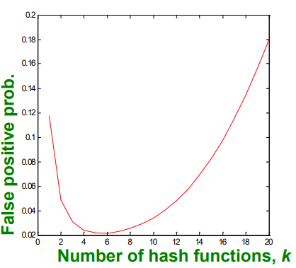

### Praktické využití
- *Webové prohlížeče: Google Chrome využívá Bloomův filtr ke kontrole, zda URL není na seznamu škodlivých stránek. Pokud filtr zahlásí "ANO", provede se teprve pak drahý dotaz na server pro potvrzení.*
- *Databáze: Apache Cassandra nebo Google BigTable používají filtry k tomu, aby zabránily zbytečnému čtení z disku pro neexistující klíče.*
- *Router filtrující spamové IP adresy – Bloomův filtr okamžitě propustí 99 % legitimního provozu bez nutnosti prohledávat obří databázi v RAM.*

---
## Algoritmus DGIM (Datar-Gionis-Indyk-Motwani)
DGIM řeší problém odhadu počtu jedniček v posledních $N$ bitech datového proudu (problém "Counting ones"). Protože uložení celého okna vyžaduje $N$ bitů, DGIM využívá logaritmickou kompresi pro úsporu místa za cenu mírné nepřesnosti (chyba max 50 %).
Při zpracování proudu o objemu **100 milionů bitů** (např. blesková detekce výpadků na síti) by klasické přesné řešení vyžadovalo v paměti neustále udržovat okno o velikosti 100 Mb (cca 12 MB RAM). Algoritmus DGIM dokáže zredukovat toto obří množství dat na pouhých **několik stovek bajtů** operační paměti, protože mu stačí uchovávat pouze logaritmicky komprimované kbelíky, a to za cenu maximálně 50% odchylky od skutečného počtu jedniček.

* **Struktura kbelíků (Buckets):** Proud je rozdělen na kbelíky, které uchovávají časovou značku konce a počet jedniček (velikost), která musí být mocninou 2.
* **Pravidla udržování:**
    * Kbelíky se nesmí překrývat a musí být řazeny podle času.
    * Pro každou povolenou velikost (1, 2, 4, 8, ...) mohou existovat maximálně dva kbelíky (nebo jeden).
    * Při příchodu nové 1 se vytvoří kbelík velikosti 1. Pokud jsou nyní tři kbelíky velikosti 1, nejstarší dva se sloučí do jednoho kbelíku velikosti 2. Tento proces se může řetězit (kaskádové slučování).
* **Odhad součtu:** Součet se spočítá jako součet velikostí všech kbelíků, které končí v okně $N$, přičemž z posledního (nejstaršího) kbelíku se započítá pouze polovina jeho velikosti.
* *Příklad: Monitorování počtu unikátních uživatelů za poslední hodinu v reálném čase – DGIM udržuje úspornou statistiku bez nutnosti držet miliony záznamů.*

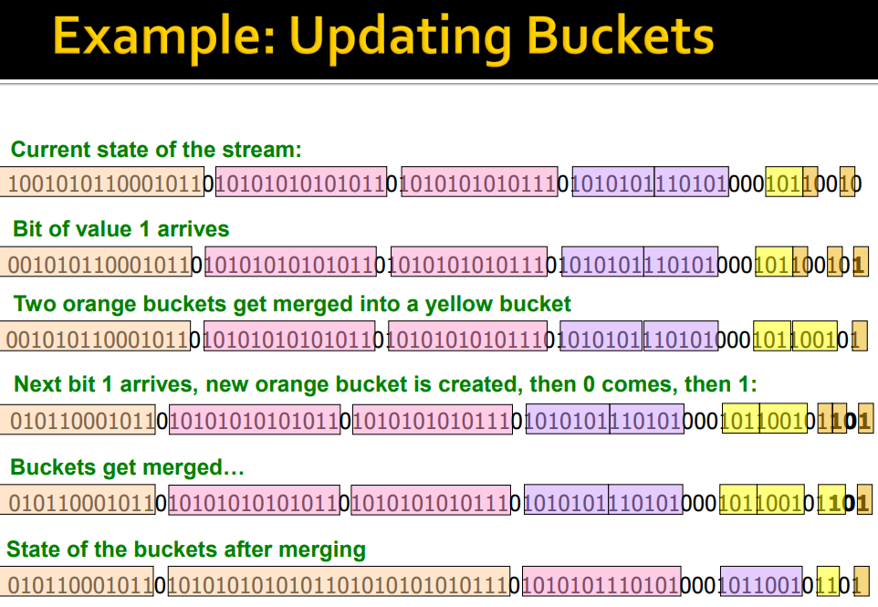

### Proč má DGIM maximální chybu právě 50 %?

Abychom pochopili, kde se bere chyba až 50 %, musíme se podívat na to, jak DGIM odhaduje výsledek na konci (při dotazu na posledních $N$ bitů):

1. **Uvnitř okna:** Všechny kbelíky, které do okna $N$ spadají celé, započítá DGIM stoprocentně. Tam žádná chyba nevzniká.
2. **Na hraně okna:** Problém nastává u **úplně posledního (nejstaršího) kbelíku**, který do okna zasahuje jen zčásti. DGIM neví, kde přesně uvnitř tohoto kbelíku se ty jedničky nacházejí (zda jsou na jeho začátku, konci, nebo rovnoměrně rozložené) – pamatuje si jen celkovou velikost kbelíku a jeho koncový čas.
3. **Pravidlo odhadu:** DGIM situaci řeší kompromisem: z tohoto posledního kbelíku o velikosti $C$ započítá do odhadu **přesně polovinu**, tedy $C/2$.

**Extrémní scénáře (Kde vzniká největší chyba):**
Představme si, že nejstarší kbelík, který zasáhl do našeho okna, má velikost $C = 64$ (obsahuje 64 jedniček). DGIM z něj automaticky započítá $64 / 2 = 32$ jedniček. 

* **Nejhorší případ A (Skutečnost je 0):** Všechny jedničky z tohoto kbelíku ve skutečnosti leží *mimo* naše okno $N$ (staly se těsně před ním). Skutečný počet jedniček z tohoto kbelíku v našem okně je **0**. DGIM ale přičetl **32**. Nadhodnotil výsledek o 32.
* **Nejhorší případ B (Skutečnost je 64):** Všechny jedničky z tohoto kbelíku ve skutečnosti leží *uvnitř* našeho okna $N$ (staly se těsně po začátku okna). Skutečný počet je **64**. DGIM ale přičetl jen **32**. Podhodnotil výsledek o 32.

Protože pravidla DGIM striktně nařizují, že celkový součet všech *předchozích* (novějších) kbelíků v okně musí být prokazatelně větší nebo roven velikosti tohoto posledního kbelíku, tato absolutní chyba na hraně (která je maximálně $C/2$) nikdy nepřesáhne **50 % celkového odhadovaného součtu**.

### Příklady využití DGIM

DGIM se v technologických firmách nasazuje všude tam, kde je potřeba v reálném čase sledovat frekvenci nějaké události v klouzavém okně (např. za poslední hodinu, den či týden), aniž by se musely ukládat gigabajty surových dat.

* **Detekce DDoS útoků na Cloudflare / síťových routerech:**
    * **Problém:** Síťový poskytovatel potřebuje vědět, zda na server v posledních 5 minutách nepřišel kritický počet požadavků (např. více než 1 milion paketů) z jedné IP adresy. 
    * **Využití DGIM:** Systém pro každou IP adresu udržuje miniaturní DGIM strukturu (proud jedniček a nul představuje, zda v danou milisekundu paket přišel, či nikoliv). Místo ukládání miliard síťových logů do RAM stačí routeru pár stovek bajtů na každou IP adresu. Pokud DGIM odhadne, že frekvence jedniček překročila bezpečný limit, firewall IP adresu okamžitě zablokuje.

* **Sledování Trendů na sociálních sítích (X / Twitter, TikTok):**
    * **Problém:** Platforma chce v reálném čase zobrazovat „Trending Topics“ (témata, o kterých se zrovna teď mluví). Potřebuje vědět, kolikrát byl daný hashtag (např. `#Volby2026`) použit v posledních 24 hodinách.
    * **Využití DGIM:** Pro každý populární hashtag běží samostatný DGIM stream, kde `1` znamená, že uživatel hashtag právě použil. TikTok tak nemusí v paměti držet obří databázi stovek milionů tweetů/postů z celého dne jen proto, aby mohl udělat průběžný součet. DGIM mu dává okamžitý, permanentně aktualizovaný odhad s minimální paměťovou režií.

* **Počítání unikátních uživatelů (SaaS a Web Analytics):**
    * **Problém:** Velké zpravodajské weby (např. iDNES.cz nebo NYTimes) sledují aktuální nápor na servery. Potřebují vědět, kolik uživatelů kliklo na hlavní článek za poslední hodinu (okno $N$), aby věděli, zda funguje monetizace a servery stíhají.
    * **Využití DGIM:** Každé kliknutí generuje `1` do DGIM proudu daného článku. Vývojáři nemusí složitě doptávat SQL databázi přes drahé agregační dotazy typu `COUNT`, které by databázi při milionech přístupů za sekundu shodily. DGIM analytickému dashboardu okamžitě v čase $O(\log N)$ vrátí spolehlivý odhad návštěvnosti.

---
## PageRank

Web lze vnímat jako obrovský orientovaný graf, kde uzly jsou stránky a hrany jsou hypertextové odkazy. PageRank je algoritmus, který určuje důležitost (autoritu) stránek na základě struktury těchto odkazů, navržený Larry Pagem a Sergeyem Brinem, tvořící základ vyhledávače Google. 

Základní myšlenkou PageRanku je, že odkaz ze stránky $A$ na stránku $B$ lze interpretovat jako "hlas" pro důležitost stránky $B$.
- Důležitost stránky není dána pouze počtem příchozích odkazů, ale také důležitostí stránek, které na ni odkazují.
- Hlas z důležité stránky má větší váhu než hlas ze stránky nevýznamné.
- Pokud má stránka mnoho odchozích odkazů, její váha se mezi ně rovnoměrně dělí.
- *Příklad: Odkaz z domovské stránky Seznam.cz má pro cílový web mnohem větší hodnotu než odkaz z neznámého osobního blogu.*

### Maticová formulace
Pro matematický popis a výpočet PageRanku využíváme stochastickou matici přechodu $M$ a vektor hodnocení $r$.
- **Matice přechodu $M$:** Pokud stránka $j$ má $d_j$ odchozích odkazů a jeden z nich vede na $i$, pak prvek matice $M_{ij} = 1/d_j$. Jinak je roven 0.
- **Vlastní vektor:** PageRank hledáme jako stacionární distribuci (vlastní vektor), pro kterou platí rovnice: $r = M \cdot r$.
- Součet všech prvků ve vektoru $r$ je roven 1.

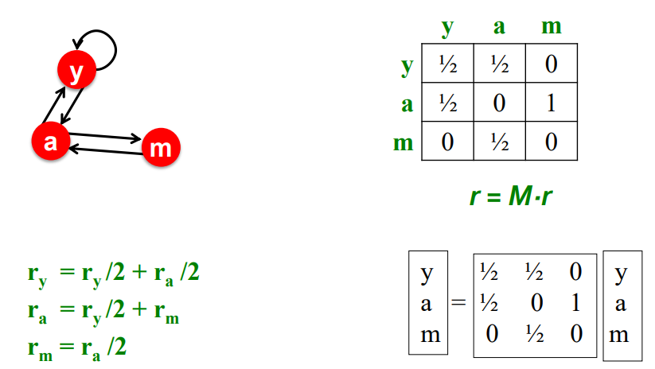

### Dead ends a Spider traps
Reálný webový graf obsahuje struktury, které způsobují, že se "tok důležitosti" v grafu chová nekorektně při prosté iteraci.
- **Dead ends (Slepé uličky):** Stránky bez odchozích odkazů. Způsobují, že se PageRank z grafu "vylévá" a celková důležitost v systému klesá k nule.
- **Spider traps (Pavoučí pasti):** Skupiny stránek, které odkazují pouze samy na sebe. Tyto struktury do sebe "nasají" veškerý PageRank z ostatních částí grafu.
- *Příklad: Stránka, která odkazuje pouze sama na sebe, postupně získá PageRank roven 1, zatímco zbytek internetu bude mít 0.*

### Koncept náhodného surfaře (Random Surfer Model)
Aby se zabránilo uváznutí v pastech nebo ztrátě ranku v dead endech, zavedl Google koncept "náhodného surfaře" (Random Surfer Model).
- **Teleportace:** S určitou pravděpodobností (typicky $1-\beta = 0.15$) surfař neklikne na odkaz, ale skočí na náhodnou stránku v grafu.
- **Rovnice se zdaněním:** $r = \beta M r + (1-\beta) \frac{1}{n} \mathbf{1}$.
- Parametr $\beta$ (damping factor) se obvykle nastavuje na 0.85. To zajišťuje, že rank v grafu neustále cirkuluje a výpočet konverguje.
- *Příklad: Pokud surfař narazí na slepou uličku nebo nudnou past, prostě do adresního řádku napíše novou náhodnou adresu a pokračuje jinde.*

---
## Iterační výpočet PageRanku (Power Iteration)
PageRank lze matematicky chápat jako soustavu lineárních rovnic. Proč se ale v praxi používá **mocninná iterace** namísto přímého řešení rovnic (např. Gaussovou eliminací)?

1. **Extrémní rozměry (Scale):** Web obsahuje miliardy stránek. Přímé řešení soustavy o $10^9$ neznámých má složitost $O(n^3)$, což je výpočetně neproveditelné.
2. **Řídkost matice (Sparsity):** Matice $M$ je extrémně řídká (většina stránek odkazuje jen na pár dalších). Iterační metoda využívá násobení matice vektorem, které je pro řídké matice velmi efektivní ($O(k \cdot nz)$, kde $nz$ je počet nenulových prvků).
3. **Konvergence:** PageRank konverguje velmi rychle. K získání dostatečně přesného odhadu pro miliardy stránek stačí obvykle pouze 50 až 100 iterací.
4. **Distribuované zpracování:** Výpočet násobení matice vektorem lze snadno paralelizovat pomocí přístupu Map-Reduce, což u přímých metod řešení rovnic není u takto velkých dat možné.

**Algoritmus:**
- **Inicializace:** $r^{(0)} = [1/n, 1/n, \dots, 1/n]^T$.
- **Iterační krok:** $r^{(t+1)} = \beta M r^{(t)} + \frac{1-\beta}{n} \mathbf{1}$.
- **Konvergence:** Opakujeme, dokud $\lvert r^{(t+1)} - r^{(t)} \rvert < \epsilon$.
- *Příklad: V každém kroku se "hladina" ranku přelévá po hranách grafu, dokud nedosáhne stabilního stavu (rovnováhy).*

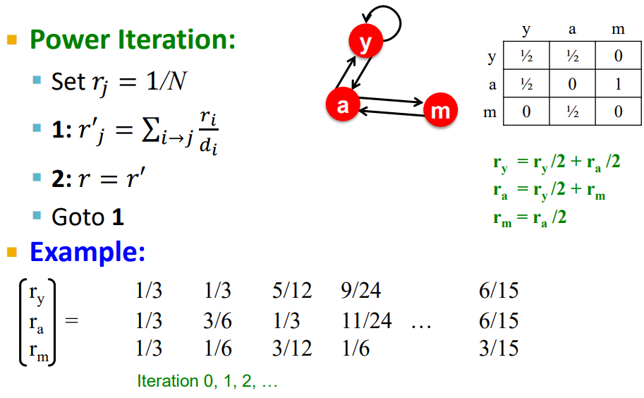

Příklad výpočtu iterační metdoy

### Konkrétní příklad výpočtu PageRanku iterační metodou (Power Iteration)

Mějme jednoduchý webový graf se 3 stránkami (**A**, **B**, **C**):
* Stránka **A** odkazuje na **B** a **C**.
* Stránka **B** odkazuje pouze na **C**.
* Stránka **C** odkazuje pouze na **A**.

Pro zjednodušení v tomto příkladu nepoužijeme zdanění ($\beta = 1$, tedy bez náhodného surfaře). Hledáme stabilní stav podle základní rovnice $r = M \cdot r$.

#### 1. Sestavení matice přechodu $M$
Sloupce představují odchozí odkazy, řádky příchozí odkazy.
* **Sloupec A:** Odkazuje na 2 stránky (B, C), takže váha se dělí: $M_{BA} = 1/2$, $M_{CA} = 1/2$.
* **Sloupec B:** Odkazuje na 1 stránku (C), takže celá váha jde tam: $M_{CB} = 1$.
* **Sloupec C:** Odkazuje na 1 stránku (A), takže celá váha jde tam: $M_{AC} = 1$.

Stochastická matice přechodu $M$ vypadá takto:
$$M = \begin{pmatrix} 0 & 0 & 1 \\ 1/2 & 0 & 0 \\ 1/2 & 1 & 0 \end{pmatrix}$$

#### 2. Inicializace (Iterace 0)
Na začátku rozdělíme celkovou důležitost (rovnu 1) rovnoměrně mezi všechny 3 stránky:
$$r^{(0)} = \begin{pmatrix} 1/3 \\ 1/3 \\ 1/3 \end{pmatrix} \approx \begin{pmatrix} 0.333 \\ 0.333 \\ 0.333 \end{pmatrix}$$

#### 3. První iterační krok ($r^{(1)} = M \cdot r^{(0)}$)
Vynásobíme matici $M$ naším počátečním vektorem $r^{(0)}$:
* $r_A^{(1)} = 0 \cdot (1/3) + 0 \cdot (1/3) + 1 \cdot (1/3) = 1/3 \approx 0.333$
* $r_B^{(1)} = (1/2) \cdot (1/3) + 0 \cdot (1/3) + 0 \cdot (1/3) = 1/6 \approx 0.167$
* $r_C^{(1)} = (1/2) \cdot (1/3) + 1 \cdot (1/3) + 0 \cdot (1/3) = 1/6 + 1/3 = 1/2 = 0.500$

$$r^{(1)} = \begin{pmatrix} 0.333 \\ 0.167 \\ 0.500 \end{pmatrix}$$

#### 4. Druhý iterační krok ($r^{(2)} = M \cdot r^{(1)}$)
Nyní vezmeme nový vektor $r^{(1)}$ a znovu ho přenásobíme maticí $M$:
* $r_A^{(2)} = 0 \cdot 0.333 + 0 \cdot 0.167 + 1 \cdot 0.500 = 0.500$
* $r_B^{(2)} = 0.5 \cdot 0.333 + 0 \cdot 0.167 + 0 \cdot 0.500 \approx 0.167$
* $r_C^{(2)} = 0.5 \cdot 0.333 + 1 \cdot 0.167 + 0 \cdot 0.500 = 0.167 + 0.167 \approx 0.333$

$$r^{(2)} = \begin{pmatrix} 0.500 \\ 0.167 \\ 0.333 \end{pmatrix}$$

#### 5. Třetí iterační krok ($r^{(3)} = M \cdot r^{(2)}$)
* $r_A^{(3)} = 1 \cdot 0.333 = 0.333$
* $r_B^{(3)} = 0.5 \cdot 0.500 = 0.250$
* $r_C^{(3)} = 0.5 \cdot 0.500 + 1 \cdot 0.167 = 0.250 + 0.167 = 0.417$

$$r^{(3)} = \begin{pmatrix} 0.333 \\ 0.250 \\ 0.417 \end{pmatrix}$$

#### Kam výpočet směřuje (Konvergence)
Tento proces opakujeme (obvykle 50 až 100krát), dokud se hodnoty mezi dvěma kroky nepřestanou téměř měnit ($\lvert r^{(t+1)} - r^{(t)} \rvert < \epsilon$). Pokud bychom pokračovali dál, hodnoty by se stabilizovaly na přesném výsledku:

$$r^{(\infty)} = \begin{pmatrix} 0.444 \\ 0.222 \\ 0.333 \end{pmatrix}$$

**Závěr:** Nejdůležitější stránkou v grafu je stránka **A** (PageRank 0.444), protože na ni odkazuje stránka C, do které se slévá velká část ranku z celého grafu. Každým dalším násobením se tato "hladina" ranku jen přelévá po hranách, ale celkový součet zůstává vždy roven 1.

### K čemu slouží PageRank a proč určujeme důležitost stránek?

Hlavním cílem PageRanku je **seřadit výsledky vyhledávání podle kvality a relevance**, aby uživatel našel to, co skutečně hledá, hned na první dobrou.

**1. Řešení problému relevance (Kvalita vs. Kvantita)**
Před PageRankem vyhledávače fungovaly naivně: spočítaly, kolikrát se hledané slovo na stránce vyskytuje (tzv. term frequency). 
* **Důsledek:** Pokud někdo vytvořil prázdnou stránku a napsal na ni tisíckrát slovo „pivo“, staré vyhledávače ji vyhodnotily jako nejlepší výsledek.
* **S PageRankem:** Vyhledávač sice stále kontroluje, zda stránka obsahuje slovo „pivo“, ale díky PageRanku navíc ví, jestli je ta stránka autoritativní web (např. Wikipedie nebo oficiální web Pilsner Urquell), nebo bezvýznamný spam. Ukáže ti weby, které mají vysokou globální důležitost.

**2. Obrana proti spamu (SEO manipulace)**
Tvůrci webů se odjakživa snaží podvádět vyhledávače, aby na jejich stránky chodilo víc lidí. 
* PageRank zavedl princip, že **důležitost stránky nelze snadno zfalšovat přímo na té stránce samotné**. Tvoji důležitost ti musí „odvysílat“ ostatní stránky tím, že na tebe odkážou. 
* Aby tvůj web získal vysoký PageRank, musí na tebe odkázat jiné důležité weby. Oklamat systém vytvořením tisíce vlastních falešných blogů nepomůže, protože ty blogy budou mít samy o sobě PageRank nula a nepředají ti žádnou váhu.

**3. Efektivní procházení webu (Crawl Priority)**
Google nepoužívá PageRank jen při samotném vyhledávání, ale i při indexování internetu (tzv. crawling).
* Internet je příliš obrovský na to, aby robot stíhal neustále procházet úplně všechny stránky světa každou minutu.
* **Využití:** Googlebot navštěvuje stránky s vysokým PageRankem (např. zpravodajské servery jako iDNES.cz nebo NYTimes) klidně každých pár minut, protože ví, že jsou důležité a často se mění. Naopak zapadlé osobní weby s nízkým PageRankem navštíví třeba jen jednou za měsíc.