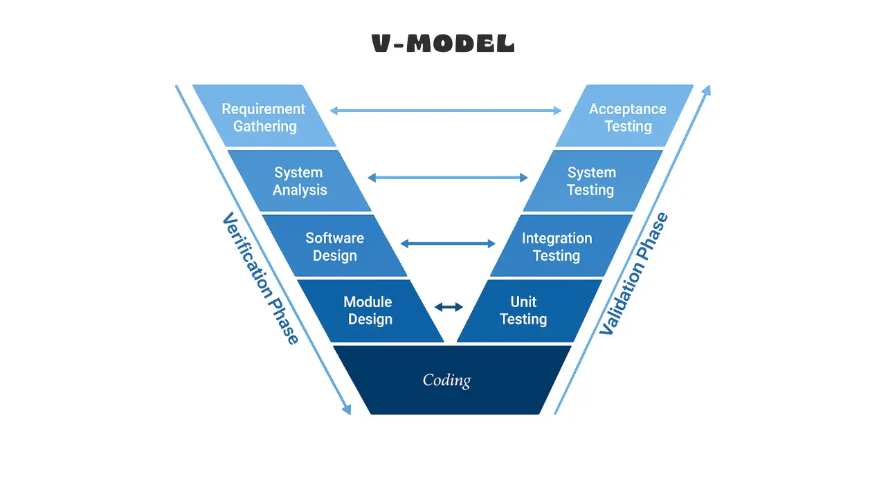

# Softwarové inženýrství

> Proces vývoje SW. 
> Metodika Rational Unified Process. 
> Agilní vývoj SW. 
> Fáze testování a typy testů. 
> Softwarové metriky, refaktoring kódu. 
> Kvalita softwaru. 
> Odhadování nákladů a času vývoje SW. 
> Údržba a znovupoužitelnost.

## Proces vývoje SW

Proces vývoje softwaru (Software Process) je systematický, inženýrský a kontrolovaný soubor 
činností, jejichž cílem je transformovat uživatelské a byznys požadavky v plně funkční, 
spolehlivý a dlouhodobě udržitelný softwarový produkt při dodržení časových a finančních limitů.

Vývoj softwaru dělíme na dva základní přístupy:
* **Programming-in-the-small:** Vývoj v malém měřítku. *Příklad: Jeden programátor vyvíjí jednoduchý interní skript pro automatické zálohování souborů, kde si vystačí s vlastní verifikací kódu.*
* **Programming-in-the-large:** Vývoj ve velkém měřítku. *Příklad: Mezinárodní tým stovek vývojářů, analytiků a manažerů buduje komplexní bankovní systém, což vyžaduje striktní plánování, dělení práce a řízení rizik.*

### Klíčové vlastnosti softwarového procesu

Aby byl proces efektivní, musí vykazovat následující vlastnosti:
1. **Comprehensiveness (Srozumitelnost/Úplnost):** Nakolik jsou procesní aktivity jasně definovány.
2. **Visibility (Viditelnost):** Zda je vnější manažer schopen objektivně sledovat reálný progres vývoje. *Příklad: Pokud proces vyžaduje pravidelné odevzdávání schválených dokumentů a běžících prototypů, manažer jasně vidí pokrok (vysoká viditelnost). Pokud vývojáři pouze programují bez milníků, manažer do procesu nevidí (nízká viditelnost).*
3. **Reliability (Spolehlivost):** Schopnost procesu odhalovat chyby a předcházet jim.
4. **Acceptability (Akceptovatelnost):** Míra, do jaké inženýři proces přijímají a skutečně využívají.
5. **Robustness (Robustnost):** Schopnost procesu vyrovnat se s neočekávanými problémy. *Příklad: Když klíčový vývojář náhle onemocní, robustní proces zajistí, že díky zastupitelnosti a dokumentaci může v práci okamžitě pokračovat někdo jiný.*
6. **Maintainability (Udržovatelnost procesu):** Jak snadno lze samotný proces modifikovat podle nových potřeb.
7. **Speed (Rychlost):** Rychlost, s jakou proces vede k finální dodávce produktu.
8. **Supportability (Podporovatelnost):** Míra, do jaké je proces podporován CASE nástroji.

### Základní fáze softwarového cyklu (SDLC – Software Development Life Cycle)

1. **Analýza a specifikace požadavků:** Proces zjišťování, dokumentace a validace potřeb 
   zúčastněných stran (stakeholders). Výstupem je dokument **SRS (Software Requirements 
   Specification)**. Požadavky striktně dělíme na:
    * *Funkční požadavky:* Definují chování systému. *Příklad: „Systém umožní uživateli po přihlášení stornovat objednávku do 10 minut od jejího vytvoření.“*
    * *Nefunkcionální požadavky:* Definují provozní limity a systémové kvality. *Příklad: „Odezva systému na storno objednávky nesmí překročit 200 ms při zátěži 5000 simultánních uživatelů.“*
2. **Návrh (Architecture & Design):** Dekompozice systému do subsystémů. Řeší se softwarová 
   architektura, datové modely a návrh rozhraní.
3. **Implementace (Kódování):** Přepis návrhu do spustitelného zdrojového kódu v daném jazyce.
4. **Verifikace a validace (V&V):**
    * *Verifikace:* „Stavíme produkt správně?“ – Kontrola, zda kód odpovídá specifikaci. *Příklad: Kontrola, zda implementovaná metoda přesně provádí matematický výpočet popsaný v analytické dokumentaci.*
    * *Validace:* „Stavíme správný produkt?“ – Ověření, zda produkt plní reálné potřeby uživatele. *Příklad: Předvedení hotového programu zákazníkovi, aby potvrdil, zda toto řešení skutečně řeší jeho byznys problém (např. zda je pro něj formulář přehledný).*
5. **Nasazení (Deployment):** Transfer otestovaného softwaru do produkčního prostředí, instalace a konfigurace infrastruktury.
6. **Provoz a údržba:** Kontinuální správa softwaru, opravy chyb z provozu a adaptace na nové podmínky.

### Základní procesní modely

#### Vodopádový model (Waterfall)
Rigorózní sekvenční model, kde každá fáze začíná až po dokončení a formálním schválení fáze 
předchozí. Mezi fázemi existují pevné milníky.
* *Výhody:* Snadné plánování, jasně definované výstupy a vysoká dokumentovanost.
* *Nevýhody:* Rigidita – změna požadavků v pokročilé fázi je extrémně drahá. Funkční software 
  vidí zákazník až na úplném konci. Nevhodný pro projekty s dynamickým zadáním.

#### Inkrementální a iterační model
* *Iterace:* Opakování celého cyklu SDLC v menších časových oknech s cílem postupně zpřesňovat 
  a vylepšovat systém (vertikální růst – zpřesňování). *Příklad: V první iteraci vytvoříme nahrubo celý e-shop s jednoduchým textovým rozhraním, ve druhé iteraci vylepšíme design a ve třetí doladíme detaily a rychlost.*
* *Inkrement:* Postupné přidávání hotových, funkčních částí (přírůstků) k systému (horizontální 
  růst – rozšiřování funkcionality). *Příklad: V prvním měsíci dodáme funkční katalog zboží, ve druhém měsíci přidáme modul nákupního košíku a ve třetím měsíci platební bránu.*

#### Spirálový model (Spiral - Boehm)
Iterační model postavený na **systematické analýze rizik**. Vývoj probíhá v cyklech (obrátkách 
spirály), přičemž každá obrátka se skládá ze čtyř kvadrantů:
1. Určení cílů, alternativ a omezení.
2. Vyhodnocení alternativ, identifikace a mitigace rizik. *Příklad: Pokud hrozí riziko, že uživatelé nezvládnou nové rozhraní, v tomto kvadrantu se vytvoří klikatelný maketový prototyp pro otestování reakcí.*
3. Vývoj, implementace a testování další verze produktu.
4. Plánování následující iterace.
* *Užití:* Velmi rozsáhlé, komplexní a rizikové systémy.

---

## Metodika Rational Unified Process

Rational Unified Process (RUP) / Unified Process (UP) je robustní, těžká (heavyweight), objektově orientovaná softwarová 
metodika. Je charakterizována třemi základními pilíři: je **řízena případy užití** (Use-Case Driven), 
**soustředěna na architekturu** (Architecture-Centric) a je **iterační a inkrementální**. Pro 
vizuální modelování využívá jazyk **UML** (Unified Modeling Language).

### 4 klíčové fáze životního cyklu RUP
Životní cyklus je rozdělen v čase horizontálně do čtyř fází, z nichž každá je zakončena jasně definovaným milníkem:

1. **Inception (Zahájení):** Definice byznys záměru, rozsahu projektu a odhad hrubých nákladů. Identifikují se klíčové případy užití na makroúrovni.
   * *Milník:* **Vision** (shoda na rozsahu a ekonomické smysluplnosti).
2. **Elaboration (Projektování / Elaborace):** Zaměřuje se na mitigaci technologických rizik a stabilizaci architektury. Vytváří se spustitelný architektonický prototyp.
   * *Milník:* **Baseline Architecture** (architektura je zafixována a ověřena).
3. **Construction (Realizace / Konstrukce):** Masivní kódování a implementace zbývajících use cases na bázi stabilní architektury. Dochází k integraci komponent a intenzivnímu testování.
   * *Milník:* **Initial Capability** (produkt je funkční a připraven na první nasazení/testy).
4. **Transition (Předání / Transice):** Nasazení softwaru k uživatelům. Zahrnuje testování, opravy chyb z reálného provozu a školení uživatelů.
   * *Milník:* **Product Release** (finální předání a ukončení vývojového cyklu).

### 6 inženýrských disciplín (Workflows)
Činnosti v RUP probíhají vertikálně napříč všemi fázemi s různou intenzitou v čase a dělí se do 6 základních inženýrských disciplín:
1. **Business Modelling:** Pochopení procesů organizace a kontextu systému.
2. **Requirements:** Sběr, analýza a specifikace use cases a požadavků.
3. **Analysis and Design:** Transformace požadavků do architektury a UML diagramů (diagramy tříd, sekvenční).
4. **Implementation:** Samotné kódování, vývoj komponent a jednotkové testy.
5. **Test:** Verifikace a validace systému, hledání chyb.
6. **Deployment:** Balení, distribuce, instalace a migrace softwaru k uživateli.

---

## Agilní vývoj SW

Agilní vývoj je empirický přístup k řízení projektů postavený na flexibilitě, adaptabilitě, 
minimalizaci byrokracie, průběžné dodávce funkčního softwaru a úzké spolupráci se zákazníkem.

### Agilní manifest (4 základní hodnoty)
Formulován v roce 2001. Definujeme priority tak, že položky vlevo mají vyšší hodnotu než 
položky vpravo:
1. **Jednotlivci a interakce** před procesy a nástroji.
2. **Fungující software** před obsáhlou dokumentací.
3. **Spolupráce se zákazníkem** před vyjednáváním o smlouvách.
4. **Reagování na změnu** před dodržováním plánu.

V agilním přístupu se mění i charakter smluv. Namísto prediktivních smluv typu *Fixed Time, Fixed Price* (pevný čas a cena, které špatně reagují na změny) se využívají agilní smlouvy typu **Time & Material Contract**, kde se platí za reálně spotřebovaný čas, úsilí a zdroje, což umožňuje flexibilní úpravu zadání. *Příklad: Pokud zákazník uprostřed vývoje zjistí, že původně plánovaný modul pro export do PDF již nepotřebuje, ale nutně chce export do Excelu, smlouva Time & Material umožní vývojářům plynule změnit prioritu bez nutnosti zdlouhavého sepisování dodatků ke smlouvě.*

### Klíčové agilní metodiky

#### Scrum
Projektový rámec založený na pevných časových oknech zvaných **Sprinty** (1–4 týdny), na jejichž 
konci musí být potenciálně nasaditelný produktový inkrement.
* **Role:**
    * *Product Owner:* Reprezentuje byznys/zákazníka. Spravuje a prioritizuje Product Backlog.
    * *Scrum Master:* Fasilitátor. Odstraňuje překážky, chrání tým před vnějšími vlivy, učí Scrum.
    * *Vývojový tým (Developers):* Cross-funkční, samoorganizující se tým odpovědný za realizaci.
* **Artefakty:**
    * *Product Backlog:* Prioritizovaný seznam všech požadovaných vlastností a chyb.
    * *Sprint Backlog:* Podmnožina úkolů vybraná pro aktuální Sprint.
    * *Inkrement:* Funkční kus kódu splňující firemní definici hotového (**DoD - Definition of Done**).
* **Události (Ceremonie):** Sprint Planning (plánování), Daily Scrum (denní 15min synchronizace), 
  Sprint Review (předvedení inkrementu zákazníkovi), Sprint Retrospective (zlepšování procesů).

#### Feature-Driven Development (FDD)
Agilní metodika orientovaná na klientem oceňované vlastnosti (funkcionality) – *features*. Vývoj probíhá v krátkých iteracích (obvykle do 2 týdnů) a skládá se z 5 fází:
1. Vývoj celkového modelu (Develop an overall model).
2. Budování seznamu vlastností (Build a features list). *Příklad vlastnosti v FDD: „Vypočítat celkovou prodejní cenu položky“ nebo „Ověřit PIN kód uživatele“.*
3. Plánování podle vlastností (Plan by feature).
4. Návrh podle vlastností (Design by feature).
5. Realizace podle vlastností (Build by feature).

#### Extrémní programování (XP)
Metodika zaměřená na technickou excelenci vývojářů a inženýrské praktiky, která staví na principu „co se v praxi osvědčuje, dovedeme do extrému“:
* *TDD (Test-Driven Development):* Vývoj řízený testy – nejdříve se píší testy, teprve pak kód aplikace.
* *Párové programování (Pair Programming):* Dva vývojáři pracují společně u jednoho počítače na stejném kódu.
* *Refaktorizace (Refactoring):* Průběžné čištění kódu bez změny jeho chování.
* *Průběžné testy a integrace:* Neustálé ověřování funkčnosti celého systému.

---

## Fáze testování a typy testů

Testování je proces exekuce systému s cílem detekovat defekty a ověřit shodu s požadavky. Podle Myersovy definice: *„Úspěšný test je takový, který odhalí dosud neodhalenou chybu.“* Testování může ukázat přítomnost defektů, ale nikdy nemůže dokázat jejich úplnou nepřítomnost.

### Fáze (úrovně) testování podle granularity

1. **Jednotkové testy (Unit Testing):** Izolované testování nejmenších celků (metody, třídy, funkce) autorem kódu. *Příklad: Testování jedné konkrétní funkce pro validaci formátu e-mailové adresy, zda správně vrátí „true“ pro vstup „test@muni.cz“.*
2. **Integrační testy (Integration Testing):** Ověřování interakcí a datových toků mezi integrovanými 
   moduly. Přístupy: *Top-Down* (pomocí stubů), *Bottom-Up* (pomocí driverů), *Big-Bang* (vše naráz). *Příklad: Ověření, zda objednávkový modul po úspěšném dokončení nákupu správně předá data fakturačnímu modulu a ten vygeneruje správné ID faktury.*
3. **Systémové testy (System Testing):** Validace kompletního systému jako celku v prostředí 
   blízkém produkci. Testují se celkové funkční i nefunkční vlastnosti.
4. **Akceptační testy (Acceptance Testing):** Ověření zákazníkem, zda systém splňuje kontrakt a zadání (UAT).
    * *Alpha testování:* Prováděno interními lidmi (vývojáři/testery) v prostředí vývojáře.
    * *Beta testování:* Prováděno reálnými koncovými uživateli v reálném provozu před finálním vydáním. *Příklad: Skupina vybraných hráčů dostane přístup k rozpracované verzi videohry, aby v reálném domácím prostředí odhalili skryté chyby.*

### Typy testů podle přístupu k vnitřní struktuře

| Přístup | Znalost kódu | Metodika a cíle | Typické techniky / Metriky |
| :--- | :--- | :--- | :--- |
| **Black-box** | Žádná | Testování funkčnosti na základě specifikace bez pohledu do kódu. | Ekvivalentní třídění, analýza hraničních hodnot. |
| **White-box** | Úplná | Testování vnitřních logických cest, struktur a kódu. | Pokrytí příkazů, větví, podmínek (**Code Coverage**). |
| **Grey-box** | Částečná | Kombinace; tester zná např. schéma DB či vnitřní struktury, ale testuje zvenčí. | Integrační testy, testování webových služeb. |

*Příklad analýzy hraničních hodnot (Black-box): Pokud formulář akceptuje věk od 15 do 99 let, otestujeme přesně hodnoty 14, 15, 16 a 98, 99, 100.*

### Typy testů podle účelu
* **Funkcionální testy:** Ověřují, *co* systém dělá (byznys logika).
* **Nefunkcionální testy:** Ověřují vlastnosti systému:
    * *Performance, Load a Stress testing:* Odezva a stabilita při standardní, maximální a extrémní zátěži. *Příklad Stress testu: Skokové navýšení zátěže na pětinásobek kapacity serveru s cílem zjistit, zda systém bezpečně odmítne nové požadavky (Graceful Degradation) bez toho, aby mu zkolabovala nebo se poškodila celá databáze.*
    * *Security testing:* Hledání zranitelností a ověření zabezpečení dat.
* **Regresní testy:** Opakované spouštění testů po změně kódu (oprava, úprava). Cílem je 
  garantovat, že nová změna nerozbila stávající funkčnost softwaru. *Příklad: Opravili jsme chybu se špatným zobrazováním diakritiky v patičce webu. Regresní testy spustíme proto, abychom se ujistili, že tato úprava omylem nerozbila přihlašování uživatelů.*

### Statické testování a formální přezkoušení (Inspekce)
Kromě dynamických testů se provádí statické přezkoumání textů a kódu formou **inspekce**. Inspekční tým pracuje s recenzními formuláři a má jasně rozdělené role:
* *Moderátor:* Řídí setkání a celý proces inspekce.
* *Zapisovatel (Reader/Scribe):* Zaznamenává nalezené chyby a nedostatky.
* *Autor:* Tvůrce revidovaného dokumentu/kódu (vysvětluje nejasnosti, ale schůzku neřídí).
* *Inspektor:* Odborník, který dokument kriticky prochází a hledá v něm vady.

### Klasifikace a závažnost chyb
Chyby zjištěné při testování se evidují a dělí podle závažnosti:
1. **Kritická (Critical):** Způsobí pád systému, ztrátu dat, nelze pokračovat v práci, neexistuje obchvat (workaround). *Příklad: Kliknutí na tlačítko „Zaplatit“ způsobí pád celé aplikace do modré obrazovky (BSOD) a smaže rozpracovanou objednávku.*
2. **Vážná (Major):** Výrazná ztráta funkcionality, ale systém jako takový běží nebo existuje náhradní řešení. *Příklad: Nefunguje automatické odesílání potvrzení e-mailem, ale administrátor může e-mail odeslat ručně přes administrační panel.*
3. **Středně závažná (Medium):** Systém vykazuje nesprávné chování v méně podstatných funkcích.
4. **Málo závažná (Minor):** Kosmetické vady, chyby v textovém výpisu, dokumentaci nebo UI. *Příklad: Gramatická chyba v textu nápovědy nebo špatně zarovnané logo v záhlaví stránky.*

Z hlediska analýzy chyb se používá **Ortogonální klasifikace defektů (ODC - Orthogonal Defect Classification)** vyvinutá IBM. Každá chyby je jednoznačně zatříděna do jedné z nezávislých kategorií (např. *Funkce, Rozhraní, Ověřování, Přiřazení, Časování, Sestavení, Dokumentace, Algoritmus*), což umožňuje statisticky vyhodnotit, v jaké etapě vývoje proces nejvíce selhává. *Příklad využití ODC: Pokud analýza ukáže, že 60 % všech chyb je typu „Rozhraní“, manažer ví, že tým v etapě návrhu špatně definoval komunikaci mezi moduly a je třeba na tuto etapu příště nasadit přísnější inspekce.*

---

## Softwarové metriky, refaktoring kódu

### Softwarové metriky
Kvantitativní nástroje pro objektivní měření vlastností softwarového produktu a procesu.

#### Produktové a strukturální metriky (Statická analýza)
* **LOC (Lines of Code):** Počet řádků kódu (fyzické / logické příkazy). Má nízkou vypovídající hodnotu o skutečné složitosti softwaru.
* **Cykloatická komplexita (McCabeova):** Vyjadřuje strukturální složitost kódu na základě počtu lineárně nezávislých cest v grafu řízení toku. Vzorec:
  $$M = E - V + 2P$$
  kde $E$ je počet hran, $V$ je počet uzlů a $P$ je počet komponent (pro jednu metodu $P=1$). Hodnota doporučeně nemá přesáhnout 10. *Příklad: Jednoduchá sekvenční metoda bez podmínek a cyklů má cykloatickou komplexitu 1. Metoda, která v sobě obsahuje pět vnořených podmínek „if-else“, bude mít komplexitu minimálně 6, což znamená, že k jejímu kompletnímu otestování budeme potřebovat minimálně 6 různých testovacích scénářů.*
* **Halsteadova Software Science:** Metrika složitosti odvozená čistě z počtu operátorů a operandů v kódu. Sleduje:
    * $n_1$ - počet unikátních operátorů, $n_2$ - počet unikátních operandů. *Příklad: V příkazu `x = y + 5;` jsou operátory `=` a `+` ($n_1$), operandy jsou `x`, `y` a `5` ($n_2$).*
    * $N_1$ - celkový počet operátorů, $N_2$ - celkový počet operandů.
    * Definuje slovník $n = n_1 + n_2$, délku programu $N = N_1 + N_2$ a objem programu $V = N \cdot \log_2(n)$.
* **McClureova metrika složitosti:** Zaměřuje se na složitost řídicích struktur. Hodnotí se na základě počtu rozhodování (porovnání) $C$ a počtu řídicích proměnných $V$ v daném modulu.
* **Metriky architektury (Card & Glass):** Hodnotí složitost návrhu na úrovni modulů:
    * Strukturální složitost modulu: $S(i) = \text{fout}^2(i)$, kde $\text{fout}$ je počet volaných modulů (fan-out).
    * Datová složitost modulu: $D(i)$, závislá na počtu předávaných proměnných.
    * Celková systémová složitost: $C(i) = S(i) + D(i)$.
* **Soudržnost (Cohesion) a Vázanost (Coupling):** Cílem je **vysoká soudržnost** uvnitř modulu (prvky plní jeden logický úkol) a **nízká vázanost** mezi moduly (změna v jednom neodpálí druhý). *Příklad: Třída „Fakturace“, která obsahuje pouze metody pro výpočet DPH a generování PDF faktur, má vysokou soudržnost. Pokud by tatáž třída navíc přímo odesílala SMS zprávy a logovala chyby do databáze, má nízkou soudržnost (dělá příliš mnoho nesouvisejících věcí).*

### Refaktoring kódu
Systematický proces úpravy vnitřní struktury zdrojového kódu bez jakékoli změny jeho vnějšího 
chování (API, funkčnost a výsledky zůstávají identické).
* *Cíl:* Redukce technického dluhu, odstranění nepřehlednosti a zvýšení udržovatelnosti kódu.
* *Podmínka:* Bezpečně ho lze provádět pouze tehdy, pokud existují spolehlivé a rychlé automatizované testy, které po každé drobné úpravě ověří, že chování zůstalo zachováno. *Příklad refaktoringu: Přepsání složité, nepřehledné sekvence deseti vnořených podmínek do čitelné struktury „switch-case“, přičemž vstupy a výstupy metody zůstávají naprosto stejné.*

---

## Kvalita softwaru

Kvalita softwaru je míra, do jaké softwarový produkt splňuje explicitní požadavky (specifikované 
v SRS) a implicitní očekávání uživatelů.

### McCallův model kvality (1977)
Tento klasický hierarchický model definuje kvalitu softwaru pomocí 3 hlavních perspektiv, které se dále dělí na produktové faktory kvality:

1. **Product Operation (Provoz produktu):**
    * *Korektnost (Correctness):* Nakolik software splňuje specifikaci.
    * *Spolehlivost (Reliability):* Schopnost plnit funkci bez selhání v čase (metriky MTBF - střední doba mezi poruchami, MTTR - střední doba opravy).
    * *Efektivnost (Efficiency):* Využití hardwarových zdrojů (čas procesoru, paměť).
    * *Integrita (Integrity):* Zabezpečení softwaru před neautorizovaným přístupem.
    * *Použitelnost (Usability):* Snadnost obsluhy a naučení se se systémem pracovat.
2. **Product Revision (Revize produktu):**
    * *Udržovatelnost (Maintainability):* Úsilí potřebné k nalezení a opravě chyby v kódu.
    * *Flexibilita (Flexibility):* Snadnost modifikace softwaru pro nové funkce. *Příklad: Pokud do systému potřebujeme přidat podporu pro novou měnu (např. JPY) a architektura nám to umožní pouhým přidáním jednoho řádku do konfigurace, systém vykazuje vysokou flexibilitu.*
    * *Testovatelnost (Testability):* Úsilí nutné k otestování systému a ověření korektnosti.
3. **Product Transition (Přechod produktu):**
    * *Přenositelnost (Portability):* Snadnost přechodu z jednoho HW/SW prostředí do druhého. *Příklad: Webová aplikace běží bez jakýchkoli úprav kódu stejně dobře na serveru s Linuxem i se systémem Windows.*
    * *Znovupoužitelnost (Reusability):* Možnost použít části kódu v jiných aplikacích.
    * *Schopnost spolupráce (Interoperability):* Snadnost propojení s jinými systémy.

Pro hodnocení nefunkčních požadavků se používá také akronym **FURPS** (Functionality, Usability, Reliability, Performance, Supportability).

### Zajištění kvality (QA vs. QC)

* **Quality Assurance (QA - Zajištění kvality):** *Proaktivní a preventivní* proces zaměřený na **vývojový proces**. Cílem je předcházet vzniku chyb. *Příklad QA: Zavedení povinného párového programování a nastavení automatické kontroly formátování kódu před jeho odevzdáním.*
* **Quality Control (QC - Řízení kvality):** *Reaktivní* proces zaměřený na **výsledný produkt**. Cílem je detekovat a opravit chyby v hotovém kódu. *Příklad QC: Manuální klikání testera podle testovacího scénáře za účelem nalezení chyb v hotové beta verzi aplikace.*

---

## Odhadování nákladů a času vývoje SW

Odhadování (Software Estimation) je predikce lidského úsilí (člověkoměsíce - Person-Months), kalendářního času a finančních nákladů.

### Problémy odhadování a Kužel nejistoty (Cone of Uncertainty)
Odhadování na samém začátku projektu (ve fázi iniciace a před specifikací) je zatíženo masivní chybou. Kužel nejistoty ukazuje, že počáteční odhad se může lišit od reality **až čtyřikrát (4:1) oběma směry** ($0.25\times$ až $4\times$). S postupným upřesňováním specifikace a fází vývoje se odhad zpřesňuje a nejistota se zužuje k realitě ($1\times$). *Příklad: Pokud na první schůzce nad hrubým nápadem odhadneme čas vývoje na 12 měsíců, realita může kvůli Kuželu nejistoty skončit kdekoli v rozmezí od 3 do 48 měsíců.*

### Brooksův zákon
Klíčové manažerské pravidlo pro odhadování a řízení zpožděných projektů říká:
*„Přidání technického pracovníka do zpožděného softwarového projektu může způsobit jeho ještě větší zpoždění.“*
Důvodem je overhead spojený s komunikací v týmu a čas, který musí stávající vývojáři věnovat zaškolení nového člověka namísto samotné práce. *Příklad: Projekt s pěti vývojáři má zpoždění dva týdny před termínem. Manažer přidá dva nové programátory. Původní vývojáři teď musí strávit 4 dny tím, že nováčkům vysvětlují architekturu a nastavují jim prostředí, čímž se reálná práce na projektu téměř zastaví a zpoždění se ještě zvětší.*

### Základní přístupy k odhadování

#### Expertní odhady a tříbodový odhad (PERT)
Založeny na zkušenostech seniorních inženýrů. Pro potlačení subjektivity se definují tři scénáře: Optimistický ($O$), Pesimistický ($P$) a Nejvíc pravděpodobný ($M$).
* *Očekávané úsilí:* $$E = \frac{O + 4M + P}{6}$$
*Příklad PERT: Expert odhadne, že za ideálních podmínek zabere úkol 2 dny ($O$), standardně 3 dny ($M$), a když selže server, tak až 10 dní ($P$). Očekávané úsilí bude $E = (2 + 4\times3 + 10) / 6 = 4$ dny.*

#### Algoritmické modely: COCOMO (Constructive Cost Model)
B. Boehm (1981). Hlavním indikátorem velikosti a práce je počet tisíc řádků zdrojového kódu (**KSLOC** / #SLOC). 

**COCOMO 1** rozlišuje tři vývojové módy projektu:
1. **Organický (Organic):** *Příklad: Tým tří dobře se znajících programátorů vyvíjí jednoduchý interní docházkový systém pro malou firmu.*
2. **Bezprostřední / Střední (Semidetached):** *Příklad: Vývoj nového e-shopu na zelené louce se středně velkým týmem, kde se kombinují zkušení vývojáři s juniory.*
3. **Vázaný / Komplexní (Embedded):** *Příklad: Vývoj vestavěného softwaru pro řízení brzdového asistenta v automobilech, s extrémními nároky na spolehlivost a hardware.*

Práce (Effort $E$ v člověkoměsících) a doba vývoje ($T$ v měsících) se počítají pomocí empirických vzorců:
$$E = A \cdot (\text{KSLOC})^B \cdot \text{EAF}$$
$$T = C \cdot E^D$$
Konstanty $A, B, C, D$ se liší podle výše uvedeného módu. $\text{EAF}$ (Effort Adjustment Factor) je koeficient násobení dán hodnocením 15 atributů (vlastnosti produktu, personálu, hardware a projektu).

**COCOMO II** (modernější verze) dělí odhad do 3 modelů podle pokročilosti fáze vývoje:
1. *Application Composition Model (ACM):* Pro rané fáze, prototypování, využívá Object Points.
2. *Early Design Model (EDM):* Fáze hrubého návrhu, pracuje s funkčními body či KSLOC.
3. *Post Architecture Model (PAM):* Nejdetailnější model po stabilizaci architektury. Využívá 5 měřítkových faktorů (Scale Factors – PREC, FLEX, RESL, TEAM, PMAT) pro výpočet upraveného exponentu složitosti.

#### Analýza funkčních bodů (FPA - Function Point Analysis)
Měří velikost systému z pohledu uživatelských požadavků **nezávisle na použitém programovacím jazyce a technologii**. Hodnotí se výskyt a složitost (daná počtem DET - Data Element Types, RET - Record Element Types, FTR - File Types Referenced) pěti základních komponent:
* *Datové funkce:* Interní logické soubory (**ILF**), Externí rozhraní (**EIF**).
* *Transakční funkce:* Externí vstupy (**EI**), Externí výstupy (**EO**), Externí dotazy (**EQ**).

*Příklad komponent v FPA: Přihlašovací formulář je „Externí vstup“ (EI). Vygenerovaná tabulka s přehledem prodejů za minulý měsíc je „Externí výstup“ (EO). Tabulka uživatelů uložená uvnitř naší databáze je „Interní logický soubor“ (ILF).*

#### Softwarová fyzika a Putnamův model
Putnamova rovnice matematicky popisuje vztah mezi pracností ($N$), časem ($T$) a velikostí softwaru. Klíčovým důsledkem softwarové fyziky je zjištění, že **programy psané ve spěchu jsou delší**, a že lidské úsilí nelze lineárně zaměňovat za kalendářní čas. Vztah ukazuje extrémní nelinearitu:
*Při zkrácení plánovaného termínu na 83 % je výsledná pracnost (úsilí) dvojnásobná.*
Graficky model definuje tzv. **nedosažitelnou oblast** (stlačení času pod kritickou mez Rayleighovy vlny způsobí selhání projektu bez ohledu na množství peněz či programátorů). *Příklad: Pokud optimální čas vývoje systému vychází na 12 měsíců při zapojení 5 lidí, nelze projekt dokončit za 2 měsíce tím, že na něj manažer nasadí 30 lidí. Projekt se nachází v nedosažitelné oblasti a zkolabuje.*

#### Agilní relativní odhadování
* **Story Points:** Abstraktní jednotka složitosti, velikosti a neurčitosti úkolu. Využívá se upravená Fibonacciho posloupnost (1, 2, 3, 5, 8, 13, 21...), protože u větších úkolů přirozeně roste míra nejistoty. *Příklad relativního odhadu: Pokud vytvoření jednoduchého textového políčka pro jméno odhadne tým jako 1 Story Point, pak napojení komplexní platební brány s nutností řešit bankovní certifikáty odhadne relativně k tomu jako 13 Story Points.*
* **Planning Poker:** Kolektivní technika odhadování, kde všichni členové týmu vyloží karty se svými odhady současně, což eliminuje efekt ukotvení (Anchoring Effect). O extrémních odhadech se diskutuje do dosažení konsenzu.

---

## Údržba a znovupoužitelnost

### Údržba softwaru (Software Maintenance)
Činnosti realizované po předání softwaru do provozu. Náklady na údržbu dlouhodobých systémů dominují celkovému životnímu cyklu a tvoří běžně **60 % až 80 % celkových nákladů** (TCO - Total Cost of Ownership).

#### 4 typy údržby podle Lehmanova rozdělení
1. **Korektivní údržba (Corrective):** Reaktivní oprava chyb a poruch zjištěných v produkčním provozu. *Příklad: Uživatelé hlásí, že po kliknutí na odeslání formuláře v prohlížeči Safari aplikace spadne. Vývojář chybu najde a opraví kód.*
2. **Adaptivní údržba (Adaptive):** Úpravy softwaru vynucené změnami v okolním prostředí. *Příklad: Stát od nového roku změní sazbu DPH z 21 % na 23 %, nebo vyjde nová verze operačního systému Android a aplikace se jí musí přizpůsobit, aby na nových telefonech vůbec fungovala.*
3. **Perfektivní údržba (Perfective):** Implementace nových požadavků a funkcí od uživatelů za účelem vylepšení systému v provozu. *Příklad: Manažeři z provozu požádají, aby systém nově uměl generovat reporty nejen do formátu CSV, ale i do grafů přímo na nástěnce.*
4. **Preventivní údržba (Preventive):** Proaktivní zásahy s cílem zvýšení budoucí udržovatelnosti a čitelnosti softwaru, opravit skryté vady a zpomalit stárnutí systému. *Příklad: Programátor vidí, že kus starého kódu je příliš složitý a špatně se v něm vyzná. Stráví dva dny jeho refaktoringem a pročištěním, aby v něm v budoucnu mohl kdokoli snadno provádět změny.*

#### Lehmanovy zákony softwarové evoluce
Na základě dlouhodobého sledování reálných systémů byly formulovány zákony, které řídí údržbu:
* *Zákon neustálé změny:* E-typ systémů (provozovaných v reálném světě) se musí neustále měnit, jinak se stávají postupně méně užitečnými.
* *Zákon rostoucí složitosti:* Jak se softwarový systém vyvíjí, jeho složitost roste, pokud se aktivně nepracuje na jejím snižování (preventivní údržba/refaktorizace).
* *Zákon seberegulace:* Proces evoluce velkých systémů vykazuje statisticky stabilní trendy a dynamiku v čase.

### Znovupoužitelnost (Software Reuse)
Záměrný inženýrský přístup, kdy se artefakty (kód, návrhy, architektura) záměrně projektují tak, aby mohly být opakovaně využity v jiných projektech. To snižuje chybovost a čas uvedení na trh (Time-to-Market).

#### Úrovně znovupoužitelnosti
* *Zdrojový kód (Ad-hoc reuse):* Kopírování částí kódu (Copy-Paste). Nebezpečný anti-pattern vedoucí k duplicitám a kriticky náročné budoucí údržbě. *Příklad: Vývojář zkopíruje kus kódu pro validaci rodného čísla z jednoho projektu do druhého. Pokud se v něm později najde chyba, opraví se jen v prvním projektu a v druhém zůstane skrytá chyba.*
* *Knihovny a komponenty:* Zapouzdřené balíčky s jasně definovaným rozhraním. *Příklad: Využití oficiálního, celosvětově otestovaného balíčku pro šifrování hesel namísto vymýšlení vlastního matematického algoritmu.*
* *Návrhové vzory (Design Patterns):* Osvědčená, koncepční řešení typických architektonických problémů v objektovém návrhu. *Příklad: Použití vzoru „Singleton“, pokud potřebujeme v celé aplikaci garantovat existenci právě jedné instance třídy zajišťující připojení k databázi.*
* *Frameworky:* Komplexní kostry aplikací určující celkovou architekturu. Využívají princip **Inversion of Control (IoC)** – framework definuje tok a volá kód vývojáře, nikoli vývojář framework.

#### Překážky znovupoužitelnosti
* **Pravidlo třetího použití (Rule of Three):** Návrh, vývoj, testování a zdokumentování skutečně generické a znovupoužitelné komponenty je **3× dražší** než napsání jednoúčelového kódu. Investice se začíná vracet až při jejím třetím úspěšném nasazení v jiném projektu. *Příklad: Pokud napsání kalendáře pro jeden e-shop trvá 5 dní, vytvoření univerzálního kalendáře (balíčku), který půjde bez úprav vložit do jakéhokoli budoucího e-shopu, zabere 15 dní kvůli nutnosti precizního testování, dokumentace a zobecnění rozhraní.*
* **Syndrom Not Invented Here (NIH):** Psychologický blok vývojářů, kteří a priori odmítají cizí řešení/knihovny a preferují psaní vlastního kódu od nuly, přestože řešení již existuje.