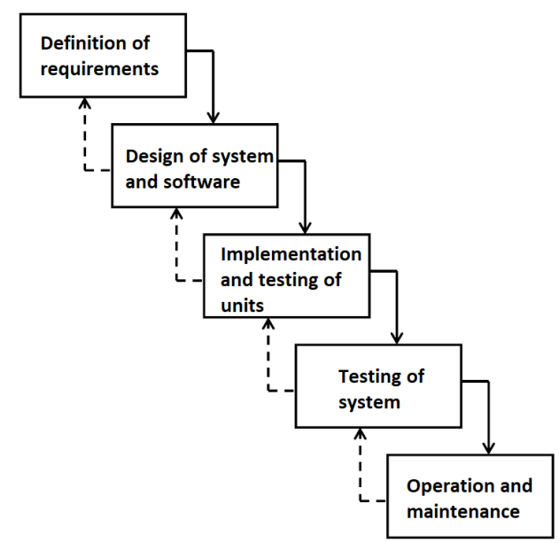
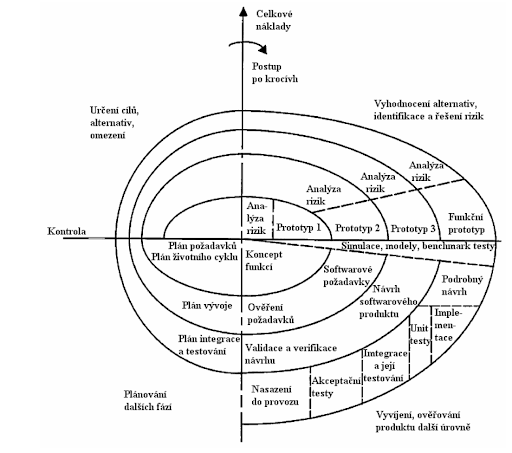
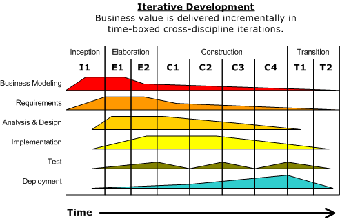
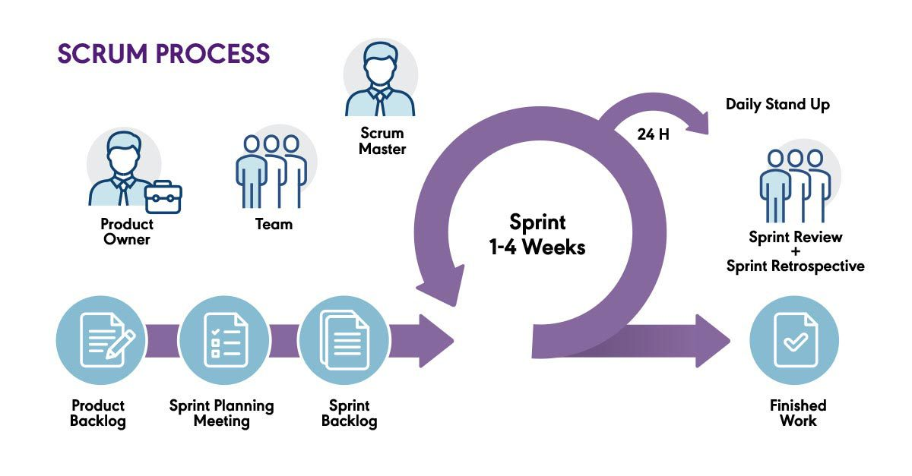
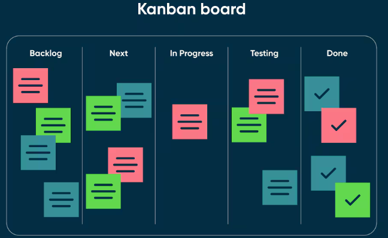

# Softwarové inženýrství

> Proces vývoje SW. 
> Metodika Rational Unified Process. 
> Agilní vývoj SW. 
> Fáze testování a typy testů. 
> Softwarové metriky, refaktoring kódu. 
> Kvalita softwaru. 
> Odhadování nákladů a času vývoje SW. 
> Údržba a znovupoužitelnost.

## Proces vývoje SW

Proces vývoje softwaru (Software Process) je systematický, inženýrský a kontrolovaný soubor 
činností, jejichž cílem je transformovat uživatelské a byznys požadavky v plně funkční, 
spolehlivý a dlouhodobě udržitelný softwarový produkt při dodržení časových a finančních limitů.

### Základní fáze softwarového cyklu (SDLC – Software Development Life Cycle)

1. **Analýza a specifikace požadavků:** Proces zjišťování, dokumentace a validace potřeb 
   zúčastněných stran (stakeholders). Výstupem je dokument **SRS (Software Requirements 
   Specification)**. Požadavky striktně dělíme na:
    * *Funkční požadavky:* Definují chování systému (např. „Systém umožní storno objednávky“).
    * *Nefunkcionální požadavky:* Definují provozní limity a kvality (např. latence do 200 ms, 
      dostupnost 99.9 %, shoda s GDPR, bezpečnostní standardy).
2. **Návrh (Architecture & Design):** Dekompozice systému do subsystémů. Řeší se softwarová 
   architektura (např. mikroslužby vs. monolit), datové modely, komunikační protokoly (REST, gRPC) 
   a návrh rozhraní (API).
3. **Implementace (Kódování):** Přepis návrhu do spustitelného zdrojového kódu v daném jazyce 
   při dodržení interních standardů a čistoty kódu.
4. **Verifikace a validace (V&V):**
    * *Verifikace:* „Stavíme produkt správně?“ – Kontrola, zda kód odpovídá specifikaci.
    * *Validace:* „Stavíme správný produkt?“ – Ověření, zda produkt plní reálné potřeby uživatele.
5. **Nasazení (Deployment):** Transfer otestovaného softwaru do produkčního prostředí. Zahrnuje 
   konfiguraci infrastruktury (IaC), datové migrace a nastavení CI/CD linek.
6. **Provoz a údržba:** Kontinuální správa softwaru, opravy chyb z provozu a adaptace na nové 
   podmínky (upgrady OS, legislativní změny).

### Základní procesní modely

#### Vodopádový model (Waterfall)
Rigorózní sekvenční model, kde každá fáze začíná až po dokončení a formálním schválení fáze 
předchozí. Mezi fázemi existují pevné milníky.
* *Výhody:* Snadné plánování, jasně definované výstupy a vysoká dokumentovanost.
* *Nevýhody:* Rigidita – změna požadavků v pokročilé fázi je extrémně drahá. Funkční software 
  vidí zákazník až na úplném konci. Nevhodný pro projekty s dynamickým zadáním.

#### Inkrementální a iterační model
* *Iterace:* Opakování celého cyklu SDLC v menších časových oknech s cílem postupně zpřesňovat 
  a vylepšovat systém (vertikální růst – zpřesňování).
* *Inkrement:* Postupné přidávání hotových, funkčních částí (přírůstků) k systému (horizontální 
  růst – rozšiřování funkcionality). Každý inkrement je samostatně otestovaný a funkční celistvost.

#### Spirálový model (Spiral - Boehm)
Iterační model postavený na **systematické analýze rizik**. Vývoj probíhá v cyklech (obrátkách 
spirály), přičemž každá obrátka se skládá ze čtyř kvadrantů:
1. Určení cílů, alternativ a omezení.
2. Vyhodnocení alternativ, identifikace a mitigace rizik (např. tvorba prototypů).
3. Vývoj, implementace a testování další verze produktu.
4. Plánování následující iterace.
* *Užití:* Velmi rozsáhlé, komplexní a rizikové systémy (např. letecké řídicí systémy).

---

## Metodika Rational Unified Process

Rational Unified Process (RUP) je robustní, těžká (heavyweight), objektově orientovaná softwarová 
metodika. Je charakterizována třemi základními pilíři: je **řízena případy užití** (Use-Case Driven), 
**soustředěna na architekturu** (Architecture-Centric) a je **iterační a inkrementální**. Pro 
vizuální modelování využívá výhradně jazyk **UML** (Unified Modeling Language).

### 4 klíčové fáze životního cyklu RUP
Životní cyklus je rozdělen v čase horizontálně do čtyř fází, zakončených jasným milníkem:

1. **Inception (Zahájení):** Definice byznys záměru a rozsahu projektu. Identifikují se klíčové 
   případy užití na makroúrovni a hlavní aktéři. Odhadují se hrubé náklady.
   * *Milník:* Lifecycle Objectives (shoda na rozsahu a ekonomické smysluplnosti).
2. **Elaboration (Projektování / Elaborace):** Nejkritičtější fáze. Zaměřuje se na **mitigaci 
   technologických rizik** a stabilizaci architektury. Vytváří se spustitelný architektonický 
   prototyp (Executable Architecture Baseline). Detailně se specifikuje většina požadavků.
   * *Milník:* Lifecycle Architecture (architektura je zafixována a ověřena).
3. **Construction (Realizace / Konstrukce):** Masivní kódování a implementace zbývajících use 
   cases na bázi stabilní architektury. Dochází k integraci komponent a intenzivnímu testování.
   * *Milník:* Initial Operational Capability (produkt je funkční a připraven na beta testy).
4. **Transition (Předání / Transice):** Nasazení softwaru k uživatelům. Zahrnuje beta testování, 
   opravy chyb z reálného provozu, migraci dat, optimalizaci výkonu a školení uživatelů.
   * *Milník:* Product Release (finální předání a ukončení vývojového cyklu).

### Základní disciplíny (Workflows)
RUP rozděluje činnosti logicky do 9 disciplín, které probíhají vertikálně napříč všemi fázemi, 
avšak s různou intenzitou v čase (např. Requirements vrcholí v elaboraci, Implementation 
v konstrukci).

* *Inženýrské disciplíny:* Business Modeling (pochopení procesů), Requirements (sběr use cases), 
  Analysis & Design (UML diagramy tříd/sekvencí), Implementation (kódování), Test (verifikace), 
  Deployment (nasazení).
* *Podpůrné disciplíny:* Configuration & Change Management (verzování v Gitu, správa změn), 
  Project Management (plánování iterací, rizika), Environment (správa nástrojů a IDE).

---

## Agilní vývoj SW

Agilní vývoj je empirický přístup k řízení projektů postavený na flexibilitě, adaptabilitě, 
minimalizaci byrokracie, průběžné dodávce funkčního softwaru a úzké spolupráci se zákazníkem.

### Agilní manifest (4 základní hodnoty)
Formulován v roce 2001. Definujeme priority tak, že položky vlevo mají vyšší hodnotu než 
položky vpravo:
1. **Jednotlivci a interakce** před procesy a nástroji.
2. **Fungující software** před obsáhlou dokumentací.
3. **Spolupráce se zákazníkem** před vyjednáváním o smlouvách.
4. **Reagování na změnu** před dodržováním plánu.

### Klíčové agilní metodiky

#### Scrum
Projektový rámec založený na pevných časových oknech zvaných **Sprinty** (1–4 týdny), na jejichž 
konci musí být potenciálně nasaditelný produktový inkrement.
* **Role:**
    * *Product Owner:* Reprezentuje byznys/zákazníka. Spravuje a prioritizuje Product Backlog.
    * *Scrum Master:* Fasilitátor. Odstraňuje překážky, chrání tým před vnějšími vlivy, učí Scrum.
    * *Vývojový tým (Developers):* Cross-funkční, samoorganizující se tým odpovědný za realizaci.
* **Artefakty:**
    * *Product Backlog:* Prioritizovaný seznam všech požadovaných vlastností a chyb.
    * *Sprint Backlog:* Podmnožina úkolů vybraná pro aktuální Sprint.
    * *Inkrement:* Funkční kus kódu splňující firemní definici hotového (**DoD - Definition of Done**).
* **Události (Ceremonie):** Sprint Planning (plánování), Daily Scrum (denní 15min synchronizace), 
  Sprint Review (předvedení inkrementu zákazníkovi), Sprint Retrospective (zlepšování procesů).

#### Kanban
Metoda řízení toku práce založená na vizualizaci na tabuli. Nemá pevné iterace ani role.
* **WIP Limit (Work In Progress Limit):** Klíčový koncept. Striktní omezení počtu úkolů, které 
  mohou být simultánně v daném sloupci (např. max 3 úkoly v "In Test"). Zabraňuje vzniku úzkých 
  hrdel (bottlenecks), nutí tým dokončovat práci místo neustálého začínání nových úkolů 
  (*"Stop starting, start finishing"*).

#### Extrémní programování (XP)
Metodika zaměřená na technickou excelenci vývojářů a inženýrské praktiky:
* *TDD (Test-Driven Development):* Cyklus **Red-Green-Refactor**. Nejdřív se napíše selhávající 
  test, pak minimální kód, aby prošel, a následně se kód vyčistí (refaktoruje).
* *Párové programování (Pair Programming):* Dva vývojáři u jednoho PC. **Driver** píše kód, 
  **Navigator** v reálném čase kód reviduje, přemýšlí nad architekturou a edge-cases.
* *Kontinuální integrace (CI):* Časté začleňování kódu do hlavní větve, spojené s automatickým 
  spouštěním buildů a testů.
* *Společné vlastnictví kódu (Collective Code Ownership):* Kdokoliv může měnit jakoukoliv část kódu.

---

## Fáze testování a typy testů

Testování je proces exekuce systému s cílem detekovat defekty a ověřit shodu s požadavky.

### Fáze (úrovně) testování podle granularity

1. **Jednotkové testy (Unit Testing):** Izolované testování nejmenších celků (metody, funkce). 
   Využívá se vzor **AAA (Arrange-Act-Assert)**. Externí závislosti (databáze, sítě) se izolují 
   pomocí **Test Doubles**:
    * *Stubs:* Poskytují fixní, předpřipravené odpovědi na volání během testu.
    * *Mocks:* Objekty, u kterých se na konci testu ověřuje, zda a jak byly zavolány 
      (např. ověření, že metoda `sendEmail` byla zavolána přesně jednou).
2. **Integrační testy (Integration Testing):** Ověřování interakcí a datových toků mezi integrovanými 
   moduly. Přístupy: *Top-Down* (pomocí stubů), *Bottom-Up* (pomocí driverů), *Big-Bang* (vše naráz).
3. **Systémové testy (System Testing):** Validace kompletního systému jako celku v prostředí 
   blízkém produkci. Testují se end-to-end scénáře.
4. **Akceptační testy (Acceptance Testing):** Ověření zákazníkem, zda systém splňuje kontrakt (UAT).
    * *Alpha testování:* Prováděno interními lidmi v prostředí vývojáře.
    * *Beta testování:* Prováděno reálnými koncovými uživateli v reálném provozu (pilot).

### Typy testů podle přístupu k vnitřní struktuře

| Přístup | Znalost kódu | Metodika a cíle | Typické techniky / Metriky |
| :--- | :--- | :--- | :--- |
| **Black-box** | Žádná | Testování funkčnosti na základě specifikace. | Ekvivalentní třídění, analýza hraničních hodnot. |
| **White-box** | Úplná | Testování vnitřních logických cest a struktur. | Pokrytí příkazů, větví, podmínek (**Code Coverage**). |
| **Grey-box** | Částečná | Kombinace; tester zná např. schéma DB či API. | Integrační testy, testování webových služeb. |

### Typy testů podle účelu
* **Funkcionální testy:** Ověřují, *co* systém dělá (byznys logika).
* **Nefunkcionální testy:** Ověřují, *jak* to dělá (systémové kvality):
    * *Performance testing:* Odezva při standardní zátěži.
    * *Load testing:* Stabilita při dlouhodobé maximální očekávané zátěži.
    * *Stress testing:* Hledání bodu selhání při extrémním přetížení nad limity a ověření korektního 
      zotavení (*Graceful Degradation*).
    * *Security testing:* Hledání zranitelností (např. SQL Injection, XSS dle OWASP Top 10).
* **Regresní testy:** Opakované spouštění testů po změně kódu (oprava, refaktoring). Cílem je 
  garantovat, že nová úprava nezpůsobila regresi (nerozbila stávající funkčnost).

---

## Softwarové metriky, refaktoring kódu

### Softwarové metriky
Kvantitativní nástroje pro objektivní měření vlastností kódu a procesu.

#### Produktové metriky (Statická analýza)
* **LOC (Lines of Code):** Počet řádků. *Physical LOC* (všechny řádky), *Logical LOC* (jen příkazy). 
  Nízká vypovídající hodnota o složitosti, závislá na syntaxi jazyka.
* **Cykloatická komplexita (McCabeova):** Vyjadřuje strukturální složitost kódu na základě počtu 
  lineárně nezávislých cest v grafu řízení toku (Control Flow Graph). Vzorec:
  $$M = E - V + 2P$$
  kde $E$ je počet hran (edges), $V$ je počet uzlů (vertices) a $P$ je počet komponent (pro 
  jednu metodu $P=1$). Hodnoty nad 10 značí kód rizikový, těžko srozumitelný a náročný na testování 
  (je potřeba minimálně $M$ unit testů pro plné pokrytí větví).
* **Soudržnost (Cohesion):** Míra, do jaké prvky uvnitř jedné třídy/modulu spolupracují na jediné 
  odpovědnosti (Single Responsibility Principle). Cílem je **vysoká soudržnost** (High Cohesion).
* **Vázanost (Coupling):** Míra vzájemných závislostí mezi moduly. Vysoká vázanost způsobuje, že 
  změna v jednom modulu rozbije jiné moduly. Cílem je **nízká vázanost** (Loose Coupling).

### Refaktoring kódu
Systematický proces úpravy vnitřní struktury zdrojového kódu bez jakékoli změny jeho vnějšího 
chování (API, funkčnost zůstávají identické).
* *Cíl:* Redukce technického dluhu (Technical Debt), zvýšení čitelnosti a udržovatelnosti kódu.
* *Základní pravidlo:* Refaktoring lze bezpečně provádět pouze nad kódem, který je pokryt 
  **spolehlivými a rychlými automatizovanými testy**. Po každé mikro-změně se testy spustí.
* *Základní inženýrské principy:* **DRY** (Don't Repeat Yourself - neodpustit duplicitu), **KISS** (Keep It Simple, Stupid - jednoduchost), **YAGNI** (You Aren't Gonna Need It - nepsat kód dopředu).

#### Code Smells (Zápachy kódu)
Symptomy indikující nutnost refaktoringu:
* *Duplicated Code:* Stejný kód na více místech (porušení DRY).
* *Long Method:* Metoda s příliš mnoha řádky a vysokou cykloatickou komplexitou.
* *Large Class (God Object):* Třída, která dělá všechno, porušuje Single Responsibility Principle.
* *Feature Envy:* Metoda třídy A neustále přistupuje k datům třídy B. Metoda by měla patřit do třídy B.

#### Typické techniky refaktoringu
* *Extract Method:* Vyčlenění logického bloku z dlouhé metody do nové, jasně pojmenované metody.
* *Rename Variable/Method:* Změna kryptických názvů na samovysvětlující.
* *Introduce Parameter Object:* Sdružení vysokého počtu parametrů metody do jednoho objektu.
* *Replace Conditional with Polymorphism:* Nahrazení větvení `if-else` či `switch` polymorfismem.

---

## Kvalita softwaru

Kvalita softwaru je míra, do jaké softwarový produkt splňuje explicitní požadavky (specifikované 
v SRS) a implicitní očekávání uživatelů.

### Standard ISO/IEC 25010
Tento mezinárodní standard definuje model kvality softwaru rozdělením do 8 hlavních charakteristik:

1. **Funkční vhodnost (Functional Suitability):** Zda funkce pokrývají reálné potřeby. Zahrnuje 
   funkční úplnost, správnost (přesnost výsledků) a přiměřenost.
2. **Výkonová efektivita (Performance Efficiency):** Výkon vzhledem k využitým zdrojům. Sleduje 
   se doba odezvy (Response Time), propustnost (Throughput) a využití CPU/RAM.
3. **Kompatibilita (Compatibility):** Schopnost koexistence (sdílení HW/SW prostředí bez 
   interferencí) a interoperability (výměna informací s jinými systémy).
4. **Použitelnost (Usability):** Snadnost pochopení, naučení a ovládání; uživatelská zkušenost (UX).
5. **Spolehlivost (Reliability):** Schopnost plnit funkce za daných podmínek v čase. Metriky:
    * *MTBF (Mean Time Between Failures):* Střední doba mezi poruchami.
    * *MTTR (Mean Time To Repair):* Střední doba opravy.
    * *Dostupnost (Availability):* $A = \frac{MTBF}{MTBF + MTTR}$ (vyjádřená v procentech, např. 99.9 %).
    * *Odolnost vůči chybám (Fault Tolerance):* Schopnost zachovat provoz při částečném výpadku.
6. **Bezpečnost (Security):** Ochrana dat. Zahrnuje důvěrnost (Confidentiality), integritu 
   (Integrity), neodpopiratelnost (Non-repudiation), autentizaci a autorizaci.
7. **Udržovatelnost (Maintainability):** Snadnost modifikace kódu vývojáři. Zahrnuje modularitu, 
   znovupoužitelnost, analyzovatelnost, modifikovatelnost a **testovatelnost**.
8. **Přenositelnost (Portability):** Snadnost přesunu do jiného prostředí (instalovatelnost, 
   adaptabilita, nahraditelnost).

### Zajištění kvality (QA vs. QC)

* **Quality Assurance (QA - Zajištění kvality):** *Proaktivní a preventivní* proces zaměřený na 
  **vývojový proces**. Cílem je předcházet vzniku chyb (např. nastavení code-standards, CI/CD, 
  metodiky, code reviews).
* **Quality Control (QC - Řízení kvality):** *Reaktivní* proces zaměřený na **výsledný produkt**. 
  Cílem je detekovat a opravit chyby v hotovém kódu (např. spouštění manuálních a automatických 
  testů).

---

## Odhadování nákladů a času vývoje SW

Odhadování (Software Estimation) je predikce lidského úsilí (člověkoměsíce - Person-Months), 
kalendářního času a finančních nákladů.

### Problémy odhadování a Kužel nejistoty (Cone of Uncertainty)
Odhadování na začátku projektu je zatíženo masivní chybou. **Kužel nejistoty** ukazuje, že ve 
fázi iniciace (před analýzou) může být odhad zatížen chybou $0.25\times$ až $4\times$. S postupným 
ujasňováním požadavků a fixací architektury se nejistota zužuje k realitě ($1\times$).

### Základní přístupy k odhadování

#### Expertní odhady (Expert Judgment)
Založeny na intuici seniorních inženýrů. Často se používá **Tříbodový odhad (PERT)** pro snížení 
subjektivity. Expert definuje tři scénáře: Optimistický ($O$), Pesimistický ($P$) a Nejvíc 
pravděpodobný ($M$).
* *Očekávané úsilí:* $$E = \frac{O + 4M + P}{6}$$
* *Směrodatná odchylka (míra rizika):* $$\text{SD} = \frac{P - O}{6}$$

#### Algoritmické (Parametrické) modely
Využívají statistické vzorce z historických dat.
* **COCOMO (Constructive Cost Model):** Základní proměnnou je velikost vyjádřená v tisících řádků 
  kódu (**KLOC**). Vzorec pro úsilí:
  $$\text{Effort} = A \cdot (\text{KLOC})^B \cdot \text{EAF}$$
  Konstanty $A, B$ závisí na režimu projektu (organic - jednoduchý, semidetached - střední, 
  embedded - kritický, komplexní). $\text{EAF}$ (Effort Adjustment Factor) je koeficient dán 15 
  atributy (schopnosti týmu, spolehlivost, složitost platformy).
* **FPA (Function Point Analysis):** Měří velikost z pohledu uživatele, **nezávisle na jazyce 
  a technologii**. Hodnotí se počet a komplexita pěti prvků: *externí vstupy, externí výstupy, 
  externí dotazy, interní logické soubory, externí rozhraní*. Výsledné neupravené funkční body 
  (UFP) se přepočtou koeficientem složitosti systému (VAF) na upravené funkční body (AFP).

#### Agilní relativní odhadování
* **Story Points:** Abstraktní jednotka vyjadřující velikost, složitost a inherentní riziko úkolu. 
  Využívá se **upravená Fibonacciho posloupnost** (1, 2, 3, 5, 8, 13, 21...). Nelineární růst 
  reflektuje fakt, že s velikostí úkolu roste jeho neurčitost.
* **Planning Poker:** Kolektivní technika. Tým současně ukáže karty se Story Points. Lidé s 
  extrémními odhady (nejnižší vs. nejvyšší) vysvětlí svůj pohled, proběhne diskuse a kolo se opakuje 
  do dosažení konsenzu. Eliminuje to efekt ukotvení (Anchoring Effect).

---

## Údržba a znovupoužitelnost

### Údržba softwaru (Software Maintenance)
Činnosti po předání softwaru do provozu. Náklady na údržbu dlouhodobých systémů dominují a tvoří 
**60 % až 80 % celkových nákladů** (TCO).

#### 4 typy údržby podle Lehmanova rozdělení
1. **Korektivní údržba (Corrective):** Reaktivní oprava funkčních chyb zjištěných až v produkci.
2. **Adaptivní údržba (Adaptive):** Modifikace softwaru, aby fungoval v měnícím se prostředí 
   (např. migrace na novou verzi OS, nová databáze, změna daňové legislativy).
3. **Perfektivní údržba (Perfective):** Přidávání nových funkcí, vylepšování UX nebo optimalizace 
   výkonu na základě požadavků uživatelů z provozu.
4. **Preventivní údržba (Preventive):** Proaktivní úpravy za účelem zvýšení udržovatelnosti a 
   čitelnosti kódu (refaktoring, odstranění code smells, aktualizace dokumentace). Cílem je 
   zpomalit softwarové stárnutí (růst softwarové entropie).

### Znovupoužitelnost (Software Reuse)
Záměrný inženýrský přístup, kdy se artefakty (kód, návrhy, testy) navrhují tak, aby mohly být 
použity v jiných projektech. Snižuje Time-to-Market a chybovost (používá se ověřený kód).

#### Úrovně znovupoužitelnosti
* *Zdrojový kód (Ad-hoc reuse):* Copy-Paste. Nebezpečný anti-pattern způsobující duplicity a 
  extrémně náročnou údržbu chyb.
* *Knihovny a komponenty:* Balíčky s jasným rozhraním spravované balíčkovacími systémy (npm, Maven, 
  NuGet). Řeší generické problémy (např. logování, validace).
* *Návrhové vzory (Design Patterns):* Koncepční, znovupoužitelná řešení architektonických problémů 
  v OOP (např. *Strategy, Singleton, Observer*).
* *Frameworky:* Komplexní kostry aplikací určující architekturu. Využívají **Inversion of Control 
  (IoC)** – framework volá kód vývojáře, ne vývojář framework.
* *Mikroslužby / SOA:* Znovupoužitelnost celých byznys celků běžících jako nezávislé služby za 
  stabilním síťovým API (např. jednotná autentizační služba pro celou korporaci).

#### Překážky znovupoužitelnosti
* **Pravidlo třetího použití (Rule of Three):** Vývoj, testování a dokumentace skutečně 
  znovupoužitelné komponenty je **3× dražší** než napsání jednoúčelového kódu. Investice se vrací 
  až při třetím úspěšném nasazení.
* **Syndrom Not Invented Here (NIH):** Psychologická bariéra programátorů, kteří odmítají cizí 
  knihovny a preferují psaní vlastních (často horších) řešení od nuly.
* **Dependency Hell (Peklo závislostí):** Riziko kaskádových, nekompatibilních závislostí na 
  knihovnách třetích stran, což komplikuje budoucí upgrady systému.