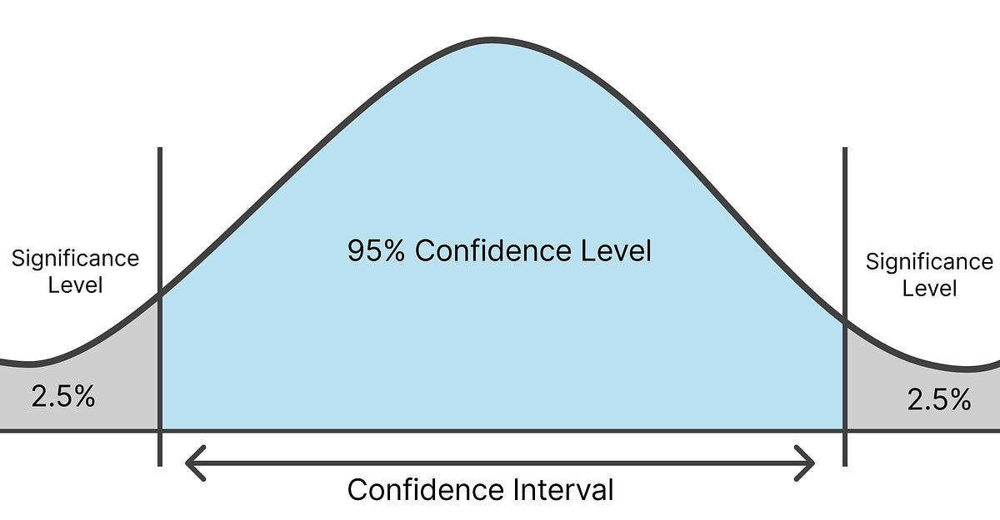
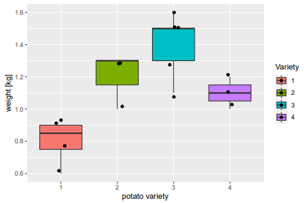
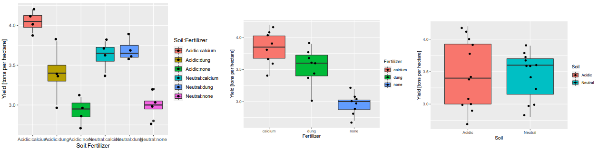
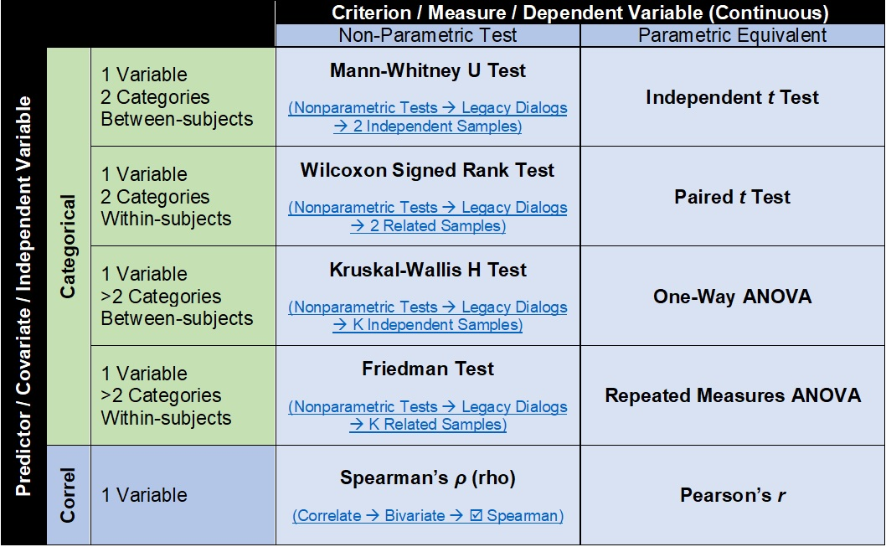
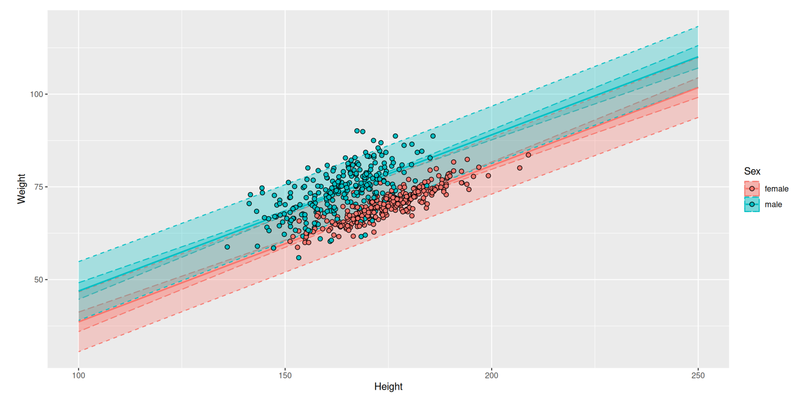
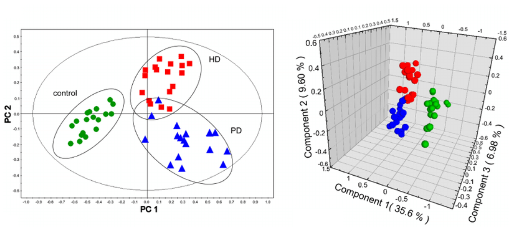
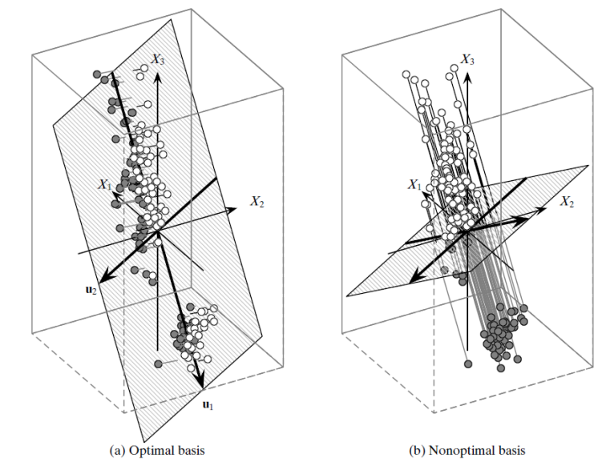
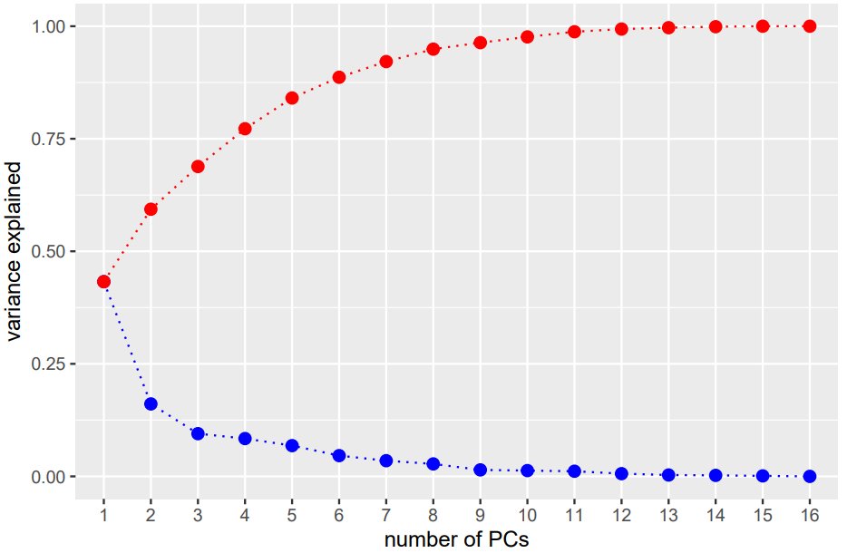

# Statistika

> Základní statistické metody (bodové odhady, intervaly spolehlivosti, testování statistických hypotéz). ANOVA. Neparametrické testy hypotéz. Mnohonásobná lineární regrese, autokorelace, multikolinearita. Analýza hlavních komponent (PCA). (MA012)

## 1. Základní statistické metody

Slouží k tomu, abychom z dat **výběru** (vzorku) vyvodili závěry o celém **základním souboru** (populaci) pomocí pravděpodobnostních modelů.

### 1.1 Bodové odhady
Bodový odhad je jediné číslo, které slouží jako nejlepší aproximace neznámého parametru populace (např. střední hodnoty $\mu$ nebo rozptylu $\sigma^2$).

* **Výběrový průměr ($\bar{x}$):** Odhad střední hodnoty $\mu$.
    $$\bar{x} = \frac{1}{n} \sum_{i=1}^{n} x_i$$
* **Výběrový rozptyl ($s^2$):** Odhad populačního rozptylu $\sigma^2$. Používáme dělení $(n-1)$, aby byl odhad **nestranný** (nezkreslený).
    $$s^2 = \frac{1}{n-1} \sum_{i=1}^{n} (x_i - \bar{x})^2$$

**Vlastnosti dobrého odhadu:**
* **Nestrannost (Unbiasedness):** Střední hodnota odhadu se rovná skutečné hodnotě parametru.
* **Konzistence:** S rostoucím rozsahem výběru ($n$) se odhad přibližuje skutečné hodnotě.
* **Efektivita:** Odhad má co nejmenší rozptyl (je "přesný").

### Centrální limitní věta (CLV):**
Je klíčový pilíř statistiky. Říká, že rozdělení výběrového průměru se s rostoucím rozsahem výběru ($n \to \infty$) blíží **normálnímu rozdělení**, a to i v případě, že původní data (populace) normální rozdělení nemají. 
* **V praxi:** Díky CLV můžeme u velkých výběrů (obvykle $n > 30$) používat parametrické testy a intervaly spolehlivosti založené na normálním rozdělení, i když data nejsou dokonale symetrická.

### Metoda maximální věrohodnosti (MLE - Maximum Likelihood Estimation)

Dalším přístupem k odhadu parametrů je **metoda maximální věrohodnosti**.

- Volí takové parametry, které maximalizují pravděpodobnost pozorovaných dat.
- Často vede ke stejným odhadům jako nestranné odhady (např. průměr), ale ne vždy.
---

### 1.2 Intervaly spolehlivosti (CI)
Protože bodový odhad se téměř nikdy netrefí přesně do skutečné hodnoty, používáme **interval spolehlivosti**. Je to rozmezí sestrojené z výběrových dat tak, že při opakovaném výběru by 100(1−α) % těchto intervalů obsahovalo skutečný parametr populace.
Parametr populace je fixní (ne náhodný), náhodný je samotný interval.

* **Hladina významnosti ($\alpha$):** Pravděpodobnost, že parametr v intervalu **nebude** (např. 0,05).
* **Spolehlivost ($1-\alpha$):** Při opakovaném výběru by 95 % takto sestrojených intervalů **obsahovalo** skutečný parametr.

**Šířka intervalu závisí na:**
1.  **Variabilitě dat ($s$):** Čím větší rozptyl, tím širší (méně přesný) interval.
2.  **Velikosti výběru ($n$):** Čím více dat, tím užší (přesnější) interval.
3.  **Hladině spolehlivosti:** Pokud chceme 99% jistotu, interval musí být širší než pro 95% jistotu.

---

### 1.3 Testování statistických hypotéz
Proces rozhodování o platnosti určitého předpokladu (hypotézy) o populaci na základě dat z výběru.

**Základní postup:**
1.  **Formulace hypotéz:**
    * $H_0$ (Nulová): "Stav beze změny" – např. lék nefunguje, rozdíl mezi skupinami je nulový.
    * $H_1$ (Alternativní): Konkurenční hypotéza vůči $H_0$, která reprezentuje efekt / rozdíl / odchylku
2.  **Volba hladiny významnosti ($\alpha$):** Standardně 0,05 (5 %).
3.  **Výpočet testové statistiky:** Číslo vyjadřující, jak moc se data liší od $H_0$ (např. t-statistika, Z-statistika).
4.  **Rozhodnutí pomocí p-hodnoty:**
    * **p-hodnota** je pravděpodobnost, že bychom získali stejná nebo extrémnější data, pokud by skutečně platila $H_0$.
    * **$p \le \alpha \implies$ Zamítáme $H_0$** (Výsledek je statisticky významný).
    * **$p > \alpha \implies$ Nezamítáme $H_0$** (Nemáme dost důkazů pro změnu názoru).

**Chyby v testování:**
Při rozhodování se můžeme dopustit dvou typů chyb:

| Skutečnost \ Rozhodnutí | Nezamítáme $H_0$ | Zamítáme $H_0$                                 |
| :--- | :--- |:-----------------------------------------------|
| **$H_0$ ve skutečnosti platí** | Správné rozhodnutí | **Chyba I. typu ($\alpha$)** (Falešný poplach) |
| **$H_1$ ve skutečnosti platí** | **Chyba II. typu ($\beta$)** (Nepoznaný efekt) | Správné rozhodnutí (Síla testu $1-\beta$)      |

**Příklady testů:**
- **t-test** – testování průměru (malé výběry, neznámý rozptyl),
- **z-test** – testování průměru (velké výběry nebo známý rozptyl),
- **chí-kvadrát test** – testování rozdělení nebo nezávislosti.
---

## 2. ANOVA
ANOVA (ANalysis Of VAriance – analýza rozptylu) je statistická metoda pro porovnávání průměrů tří a více skupin. Zjišťuje, zda nezávislé kategorické proměnné (faktory) statisticky významně ovlivňují spojitou závislou proměnnou, a to rozkladem celkové variability na rozptyl mezi skupinami a uvnitř skupin.

_Například mám 4 různé odrůdy brambor sesbírané po trsech s různou hmotností. Zajímá mě, jestli je některá odrůda výnosnější než jiná (průměrná hmotnost trsu se liší na základě odrůdy)_

$H_0$: Předpokládá, že všechny průměry skupin jsou stejné. $$\mu_i = \dots = \mu_k \quad \text{pro všechna } i = 1, \dots, k$$

$H_1$: Alespoň jeden průměr skupiny je odlišný. $$\exists\, i,j \in \{1,\dots,k\},\ i \neq j:\ \mu_i \neq \mu_j$$

Předpoklady ANOVA
1) **Nezávislost výběrů**  Jednotlivá pozorování musí být na sobě nezávislá. Pokud nejsou, mění se rozdělení testové statistiky i p-hodnota → výsledky nejsou spolehlivé.
2) **Normalita dat**  Ověřuje se pomocí Q-Q grafu nebo testů (např. Shapiro–Wilk). ANOVA je poměrně odolná – pokud má každá skupina alespoň ~20 pozorování a data nejsou silně vychýlená, malé porušení nevadí, při silném porušení použijeme neparametrický test (např. Kruskal–Wallis).
3) **Shoda rozptylů (homogenita variancí)**  Ověřuje se např. Leveneho nebo Bartlettovým testem, mírné porušení většinou nevadí, pokud mají skupiny podobnou velikost.

Jednofaktorová ANOVA zkoumá vliv jedné nezávislé proměnné (faktoru). Vícefaktorová ANOVA (dvou- či více-) analyzuje vliv dvou a více faktorů současně, včetně jejich vzájemných interakcí na závislou proměnnou.

_Například mám 3 různé druhy hnojiva a 2 různé typy půdy, a výnos polí. Zajímá mě, jestli je některá kombinace hnojiva a typu půdy výnosnější než jiná. Mám faktory hnojivo a typ půdy._

 U dvoufaktorové ANOVA rozlišujeme model **bez interakce** a model **s interakcí** mezi faktory.
 - bez interakce předpokládáme, že vliv jednoho faktoru je stejný bez ohledu na úroveň druhého faktoru  _Například hnojivo A zvyšuje výnos vždy o +2 kg bez ohledu na typ půdy_
 - s interakcí připouštíme, že efekt jednoho faktoru závisí na úrovni druhého faktoru. _Hnojivo A je nejlepší na jílovité půdě, ale na písčité půdě je lepší hnojivo B._

### Rozklad variability a F-test

ANOVA rozkládá celkovou variabilitu na dvě složky:
- **variabilita mezi skupinami (SS_between)** – rozdíly mezi průměry skupin,
- **variabilita uvnitř skupin (SS_within)** – variabilita uvnitř jednotlivých skupin.

Celkový součet čtverců:
$$
SS_{total} = SS_{between} + SS_{within}
$$

Z těchto veličin se počítají střední čtverce:
$$
MS_{between} = \frac{SS_{between}}{k - 1}, \quad
MS_{within} = \frac{SS_{within}}{n - k}
$$

Testová statistika:
$$
F = \frac{MS_{between}}{MS_{within}}
$$

- Pokud jsou průměry skupin stejné, očekáváme $F \approx 1$.
- Velká hodnota $F$ vede k zamítnutí $H_0$.

### Post-hoc testy
Pokud ANOVA zamítne $H_0$, víme, že existuje rozdíl, ale nevíme, mezi kterými konkrétními skupinami. K tomu slouží post-hoc testy:
- **Tukey HSD:** Porovnává všechny dvojice a koriguje hladinu významnosti.
- **Bonferroniho korekce:** Velmi přísná metoda, dělí $\alpha$ počtem prováděných testů.
Bez těchto korekcí by při mnoha testech hrozilo, že najdeme "náhodný" rozdíl, který ve skutečnosti neexistuje.

Rozšíření: sums of squares, F test mezi nimi, anova model, co jsou post hoc testy

---

## 3. Neparametrické testy hypotéz
Nevyžadují konkrétní tvar **rozdělení** (typicky normalitu) a často pracují s pořadím (ranks) místo s původními hodnotami. Používají se hlavně tehdy, když:
- data nejsou normální (silná šikmost, outliery),
- máme malé výběry a normalitu nelze rozumně předpokládat,
- závislá proměnná je ordinální (pořadová škála: „souhlasím–nesouhlasím“, škály bolesti, známky…),
- porušujeme předpoklad homogenity rozptylů (u některých situací),
- chceme robustnější postup vůči extrémům.

Neparametrické testy bývají „konzervativnější“ (méně citlivé) než parametrické testy, pokud jsou předpoklady parametrických testů splněny. Naopak při silném porušení normality nebo při outlierech mohou být neparametrické testy spolehlivější.

### Wilcoxonův párový test (= Wilcoxon signed-rank)
Neparametrická alternativa k párovému t-testu. Hodí se, když máme stejné subjekty měřené dvakrát (před/po), nebo páry, a rozdíly nejsou normální. _Typicky před a po: např. krevní tlak před a po podání léku._
### Mann-Whitneyův test  (= Wilcoxon rank-sum)
Porovnává dvě nezávislé skupiny bez předpokladu normality. Intuitivně ověřuje, zda hodnoty v jedné skupině mají tendenci být větší než ve druhé. Testuje rozdíl rozdělení (často interpretováno jako mediány, ale není to přesně totéž) _Například mám dva typy hnojiva A a B a měřím výnos (kg) na nezávislých polích. Data jsou silně šikmá kvůli pár extrémně výnosným polím. Chci zjistit, jestli se výnosy mezi hnojivy liší._
### Kruskal-Wallisův test
Kruskal–Wallisův test je neparametrická alternativa k jednofaktorové ANOVA pro tři a více nezávislých skupin. _Například mám 4 odrůdy brambor, ale hmotnosti trsů jsou výrazně nenormální a s outliery. Chci zjistit, zda se odrůdy liší._

Rozšíření: Jednotlivé hypotézy a testové statistiky

---

## 4. Mnohonásobná lineární regrese

Zkoumá vztah mezi **jednou spojitou závislou proměnnou a více nezávislými proměnnými**. Cílem je popsat, jak se mění hodnota závislé proměnné při změně několika vysvětlujících proměnných současně, a odhadnout jejich samostatný vliv při kontrole ostatních proměnných.

_např. cena bytu = $\beta_0 + \beta_1*$výměra $+ \beta_2 *$počet pokojů_

### Předpoklady lineární regrese

Aby byly odhady a testy spolehlivé, musí platit:

1. **Linearita** – vztah mezi $Y$ a $X_j$ je lineární.
2. **Nezávislost chyb** – rezidua $\varepsilon_i$ jsou nezávislá.
3. **Homoskedasticita** – konstantní rozptyl chyb.
4. **Normalita chyb** – důležitá pro testování hypotéz (t-testy, intervaly).

### Model
$$
Y_i = \beta_0 + \beta_1 X_{i1} + \beta_2 X_{i2} + \dots + \beta_p X_{ip} + \varepsilon_i
$$

- $Y_i$ je hodnota závislé proměnné u $i$-tého pozorování,
- $\beta_0$ je absolutní člen,
- $\beta_1, \beta_2, \dots, \beta_p$ jsou regresní koeficienty,
- $X_{i1}, X_{i2}, \dots, X_{ip}$ jsou hodnoty vysvětlujících proměnných,
- $\varepsilon_i$ je náhodná chyba.

_Graf: hmotnost člověka ~ výška a pohlaví_

Pozor, neplést s jednoduchou regresí s více parametry! Záleží na tom, kolik je prediktorů ($X_j$ - u mnohonásobné musí být aspoň 2), ne parametrů ($\beta$). Každý koeficient $\beta_j$ vyjadřuje, o kolik se v průměru změní závislá proměnná $Y$, když se proměnná $X_j$ zvýší o 1 jednotku a ostatní proměnné zůstanou stejné.

Parametry $\beta$ spočítám metodou nejmenších čtverců, ale pak ještě testuji jejich celkovou významnost pomocí F-testu.

- $H_0$: žádná vysvětlující proměnná nemá vliv na $Y$, $\beta_1 = \beta_2 = \dots = \beta_p = 0$
- $H_1$: alespoň jedna proměnná vliv má, $\text{alespoň jedno } \beta_j \neq 0$

Taky se testují jednotlivé významnosti pomocí t-testu.

- $H_0$: daná proměnná nemá při zohlednění ostatních proměnných vliv na $Y$, $\beta_j = 0$

- $H_1$: vliv dané proměnné je nenulový. $\beta_j \neq 0$

### Koeficient determinace R²
Kvalitu modelu často popisujeme pomocí **koeficientu determinace**, který udává, jaká část variability závislé proměnné je vysvětlena modelem.

$$
R^2 = \frac{S_R}{S_T} = 1 - \frac{S_e}{S_T}
$$

- $S_T$ je celkový součet čtverců,
- $S_e$ je reziduální součet čtverců.
- $S_R$ je regresní součet čtverců. $S_R = S_T − S_e ≥ 0$

_Např. $R^2 = 0.8$ znamená, že model vysvětluje 80 % variability závislé proměnné._

Protože při přidávání dalších proměnných $R^2$ skoro vždy roste, používá se i **adjustované $R^2$**, které zohledňuje počet proměnných v modelu a penalizuje zbytečně složitý model (penalizuje overfitting).

$$
R^2_{adj} = 1 - \frac{\frac{S_e}{(n-p-1)}}{\frac{S_T}{(n-1)}}
$$

I když model na první pohled vychází dobře, mohou se v něm objevit problémy, které zkreslují závěry. Typicky jde o **multikolinearitu** a **autokorelaci**.

## Multikolinearita
Multikolinearita znamená, že některé vysvětlující proměnné jsou mezi sebou silně lineárně závislé. Model pak obtížně rozlišuje jejich samostatný vliv na závislou proměnnou.

_např. v modelu mzdy použiju současně věk, délku praxe a počet let od ukončení školy – tyto proměnné spolu úzce souvisejí_

Důsledkem multikolinearity je, že odhady regresních koeficientů mohou být nestabilní, mají větší směrodatné chyby a jednotlivé proměnné pak mohou vycházet jako statisticky nevýznamné, i když ve skutečnosti se závislou proměnnou souvisejí. Model tedy může dobře predikovat, ale hůře se interpretuje.

obrázek

Často se sleduje pomocí ukazatele VIF (Variance Inflation Factor)

$$
VIF_j = \frac{1}{1 - R_j^2}
$$

- $R_j^2 > 0 => VIF_j > 1$ vysoká korelace mazi vysvětlujícími proměnnými vede k vyššímu $VIF$,
- $VIF_j \approx 1$ – bez problému,
- $VIF_j > 5$ – možný problém,
- $VIF_j > 10$ – silná multikolinearita.

Nalezení vhodného modelu při velkém počtu prediktorů může být obtížné kvůli korelacím a vztahům mezi nimi. Neexistuje žádný algoritmus, který by obecně našel nejlepší model. Existuje mnoho různých kritérií, některá jsou citlivá na specifický datový typ, některá jsou relativní. 
Jednou z metod je **postupná regrese (stepwise regression method)**, která vybírá proměnné podle kritérií (např. Akaike information criterion AIC→ min).
Tato metoda má omezení – může vést k overfittingu, nestabilním modelům a ignoruje teoretický kontext.

## Autokorelace
Autokorelace nastává v situaci, kdy jsou náhodné chyby (rezidua) $\varepsilon_i$ v modelu na sobě závislé. Nejčastěji se vyskytuje u **časových řad**, kde hodnota v čase $t$ přímo souvisí s hodnotou v čase $t-1$.
 
* **Důsledek:** Odhady koeficientů $\beta$ zůstávají nestranné (za splnění ostatních předpokladů), ale nejsou efektivní – mají větší rozptyl. To vede k **neplatnosti t-testů a p-hodnot** (model se tváří jako významný, i když nemusí být).
* **Detekce:** **Durbin-Watsonův test** (nabývá hodnot 0 až 4):
    * $DW \approx 2$: Rezidua jsou nezávislá (v pořádku).
    * $DW \approx 0$: Silná kladná autokorelace.
    * $DW \approx 4$: Silná záporná autokorelace.
* **Řešení:** Použití metod pro časové řady (např. zobecněné nejmenší čtverce – GLS).

## 5. Analýza hlavních komponent (PCA)
PCA (Principal Component Analysis – analýza hlavních komponent) je metoda redukce dimenze, která převádí původní (často korelované) proměnné na menší počet nových proměnných – hlavních komponent.
PCA lze chápat jako projekci dat do nového podprostoru nižší dimenze tak, aby byla minimalizována rekonstrukční chyba (ztráta informace).
Nevýhodou PCA je nemožnost interpretace PC (např. kvůli nekompatibilitě použitých fyzikálních jednotek), protože každá PC je nějakou lineární kombinací původních proměnných.

PCA se používá hlavně tehdy, když máme mnoho proměnných a chceme:
- zjednodušit data,
- odstranit redundanci mezi silně korelovanými proměnnými,
- zobrazit vícerozměrná data ve 2D nebo 3D,
- použít menší počet nových proměnných v dalších analýzách.

_např. mám 10 měření tělesných proporcí člověka, která spolu silně souvisejí, a chci je nahradit 2–3 hlavními komponentami_

_Redukce dimenzí ze 3D na 2D_

PCA hledá nové osy v prostoru dat tak, aby:
- první osa měla co největší rozptyl dat,
- druhá osa měla co největší rozptyl ze zbytku variability a byla kolmá na první,
- další komponenty se určují obdobně.

První hlavní komponenta tedy zachycuje největší možnou část informace obsažené v datech, další komponenty zachycují zbývající variabilitu.

_Optimální a neoptimální báze_

### Matematický tvar hlavních komponent

Každá hlavní komponenta je lineární kombinací původních proměnných:

$$
PC_1 = a_{11}X_1 + a_{12}X_2 + \dots + a_{1p}X_p
$$

$$
PC_2 = a_{21}X_1 + a_{22}X_2 + \dots + a_{2p}X_p
$$

obecně

$$
PC_k = a_{k1}X_1 + a_{k2}X_2 + \dots + a_{kp}X_p
$$

kde:
- $X_1, \dots, X_p$ jsou původní proměnné,
- $a_{kj}$ jsou koeficienty určující směr komponenty.

Tyto koeficienty tvoří **vlastní vektory (eigenvektory)** kovarianční nebo korelační matice.

### Výpočet PCA

Před použitím PCA je často potřeba data **standardizovat**, zejména pokud jsou proměnné v různých jednotkách nebo mají velmi rozdílné rozptyly. Jinak by proměnné s větším měřítkem měly nepřiměřeně velký vliv.

Pak se spočítá:
- **kovarianční matice**, pokud mají proměnné srovnatelné jednotky,
- nebo **korelační matice**, pokud jsou proměnné v různých jednotkách.

Z této matice se určují:
- **vlastní vektory** – směry hlavních komponent,
- **vlastní čísla** – rozptyl vysvětlený jednotlivými komponentami.

Platí:

$$
\mathbf{S}\mathbf{a}_k = \lambda_k \mathbf{a}_k
$$

kde:
- $\mathbf{S}$ je kovarianční nebo korelační matice,
- $\mathbf{a}_k$ je vlastní vektor,
- $\lambda_k$ je vlastní číslo příslušné $k$-té komponentě.

### Vysvětlená variabilita

Každé vlastní číslo udává, kolik variability vysvětluje daná komponenta. Podíl vysvětlené variability $k$-tou komponentou je:

$$
\frac{\lambda_k}{\sum_{j=1}^p \lambda_j}
$$

Kumulativní vysvětlená variabilita prvních $m$ komponent je:

$$
\frac{\sum_{k=1}^m \lambda_k}{\sum_{j=1}^p \lambda_j}
$$

Podle toho se rozhodujeme, kolik komponent ponechat.

### Volba počtu komponent

Počet ponechaných komponent se volí tak, aby se zachovala co největší část informace a zároveň došlo ke zjednodušení dat. Často se používají tato kritéria:
- ponechat tolik komponent, aby kumulativně vysvětlily např. 80–90 % variability,
- **Kaiserovo pravidlo** – ponechat komponenty s vlastním číslem větším než 1,
- **scree plot** (sutinový graf) – graf vlastních čísel, hledá se „zlom“, za kterým už další komponenty přidávají málo informace.

_Scree plot_

### Scores a loadings

U PCA se často rozlišují:
- **loadings** – koeficienty, které říkají, jak silně se původní proměnné podílejí na jednotlivých komponentách,
- **scores** – nové souřadnice pozorování v prostoru hlavních komponent.

Díky scores můžeme zobrazit objekty v prostoru prvních dvou nebo tří komponent a hledat shluky, odlehlá pozorování nebo strukturu dat.

### Interpretace PCA

PCA je užitečná pro redukci dimenze, ale interpretace komponent bývá obtížná. Každá hlavní komponenta je kombinací více proměnných, takže často není možné jí dát jednoznačný věcný význam.

Například pokud první komponenta silně souvisí s výškou, délkou končetin a hmotností, můžeme ji interpretovat jako „celkovou velikost těla“, ale tato interpretace je vždy jen přibližná.

### Vlastnosti PCA

- komponenty jsou navzájem nekorelované,
- celková variabilita se zachovává pouze při použití všech komponent; při redukci dimenze se část variability ztrácí,
- první komponenty nesou nejvíce informace,
- poslední komponenty často obsahují jen malou část variability a někdy hlavně šum.

### Omezení PCA

- PCA je lineární metoda,
- je citlivá na měřítko proměnných, proto bývá nutná standardizace,
- může být citlivá na odlehlá pozorování,
- hlavní komponenty nemusí mít snadnou interpretaci,
- vysoká vysvětlená variabilita ještě nemusí znamenat dobrou praktickou interpretovatelnost.
