# Statistika

> Základní statistické metody (bodové odhady, intervaly spolehlivosti, testování statistických hypotéz). ANOVA. Neparametrické testy hypotéz. Mnohonásobná lineární regrese, autokorelace, multikolinearita. Analýza hlavních komponent (PCA).

---

## 1. Základní statistické metody

Slouží k tomu, abychom z dat **výběru** (vzorku o rozsahu $n$) vyvodili zobecňující závěry o celém **základním souboru** (populaci) pomocí pravděpodobnostních modelů.

### 1.1 Bodové odhady
Bodový odhad je jedno konkrétní číslo vypočítané z výběrových dat, které slouží jako nejlepší aproximace neznámého parametru populace (např. střední hodnoty $\mu$ nebo rozptylu $\sigma^2$).

* **Výběrový průměr ($\bar{x}$):** Nejlepší odhad střední hodnoty $\mu$.
  $$\bar{x} = \frac{1}{n} \sum_{i=1}^{n} x_i$$
* **Výběrový rozptyl ($s^2$):** Odhad populačního rozptylu $\sigma^2$. Používáme dělení $(n-1)$ namísto $n$ (tzv. Besselova korekce), aby byl odhad **nestranný**.
  $$s^2 = \frac{1}{n-1} \sum_{i=1}^{n} (x_i - \bar{x})^2$$

#### 1.1.1 Vlastnosti kvalitního bodového odhadu:
* **Nestrannost (Unbiasedness):** Střední hodnota odhadu se přesně rovná skutečné hodnotě odhadovaného parametru. Odhad systematicky nenadhodnocuje ani nepodhodnocuje.
* **Konzistence (Consistency):** S rostoucím rozsahem výběru ($n \to \infty$) se pravděpodobnost, že se odhad liší od skutečného parametru o více než libovolně malé $\varepsilon$, blíží nule.
* **Efektivita (Efficiency):** Mezi všemi nestrannými odhady má tento odhad nejmenší možný rozptyl (značí maximální přesnost).

#### 1.1.2 Centrální limitní věta (CLV)
Zásadní pilíř matematické statistiky. Říká, že pokud je rozsah výběru $n$ dostatečně velký, má výběrový průměr $\bar{x}$ přibližně **normální rozdělení**, a to bez ohledu na to, jaké rozdělení má původní populace.
* **Matematická formulace:** $$\bar{X}_n \xrightarrow{d} N\left(\mu, \frac{\sigma^2}{n}\right)$$
* **Praktický dopad:** U velkých výběrů (obvykle $n > 30$) můžeme bezpečně používat parametrické testy a standardní intervaly spolehlivosti, i když původní data vykazují nenormální rozdělení.

#### 1.1.3 Metoda maximální věrohodnosti (MLE - Maximum Likelihood Estimation)
Principiálně odlišný přístup k odhadu parametrů rozdělení. Hledá takové hodnoty parametrů, pro které je pravděpodobnost získání reálně pozorovaných dat maximální.
* **Věrohodnostní funkce (Likelihood function):** Pro nezávislá pozorování je definována jako součin jejich hustot pravděpodobnosti (nebo pravděpodobnostních funkcí):
  $$L(\theta) = \prod_{i=1}^{n} f(x_i; \theta)$$
* **Postup:** V praxi maximalizujeme logaritmus této funkce ( $\ln L(\theta)$ ), což transformuje součin na součet a zjednodušuje derivování. MLE odhady jsou asymptoticky nestranné, normální a efektivní, avšak pro malé výběry mohou být vychýlené (např. MLE odhad rozptylu dělí číslem $n$, nikoliv $n-1$).

#### 1.1.4 Kovarianční a korelační matice
Při zkoumání vztahů mezi více proměnnými (bivariate neboli vícerozměrný případ) rozlišujeme teoretické vlastnosti rozdělení (pravděpodobnost) a jejich odhady z dat (statistika). Data uspořádáváme do matice náhodného výběru $Z$, kde každý řádek reprezentuje jedno pozorování a sloupce jednotlivé proměnné, zatímco výsledná kovarianční matice je čtvercová a symetrická.
**Výběrová kovariance** měří směr a sílu lineárního vztahu v původních jednotkách, **výběrová korelace** tento vztah standardizuje do bezrozměrného intervalu $\langle -1, 1 \rangle$ a **kovarianční (variační-kovariační) matice** tyto vztahy uspořádává pro více proměnných najednou.

#### 1. Výběrová kovariance ($S_{XY}$)
Měří směr a sílu lineárního vztahu mezi dvěma proměnnými $X$ a $Y$. Na rozdíl od rozptylu může být i záporná (když jedna proměnná roste a druhá klesá).
$$S_{XY} = \frac{1}{n-1} \sum_{i=1}^{n} (X_i - \bar{X})(Y_i - \bar{Y})$$

*Poznámka ke kovarianční matici:* $k$ *proměnných uspořádáváme do čtvercové symetrické **kovarianční matice** (často nazývané též **variační-kovariační matice**, značí se* $C$ *nebo* $\Sigma$*). Na její hlavní diagonále leží výběrové rozptyly jednotlivých proměnných (* $S_X^2, S_Y^2$ *atd.) a mimo diagonálu leží vzájemné kovariance (* $S_{XY}$ *).*

#### 2. Výběrová korelace (Pearsonův korelační koeficient — $r_{XY}$)
Kovariance je závislá na jednotkách. Proto se standardizuje podělením směrodatnými odchylkami obou proměnných. Tím získáme bezrozměrné číslo v mezích $r_{XY} \in \langle -1, 1 \rangle$.
$$r_{XY} = \frac{S_{XY}}{S_X \cdot S_Y} = \frac{\sum_{i=1}^{n} (X_i - \bar{X})(Y_i - \bar{Y})}{\sqrt{\sum_{i=1}^{n} (X_i - \bar{X})^2 \sum_{i=1}^{n} (Y_i - \bar{Y})^2}}$$

*Poznámka ke korelační matici: Stejně tak uspořádáváme korelace do **korelační matice** (značí se* $R$ *). Na její hlavní diagonále jsou vždy jedničky (protože korelace každé proměnné se sebou samou je* $r_{XX} = 1$ *) a mimo diagonálu jsou hodnoty vzájemných lineárních vztahů.*

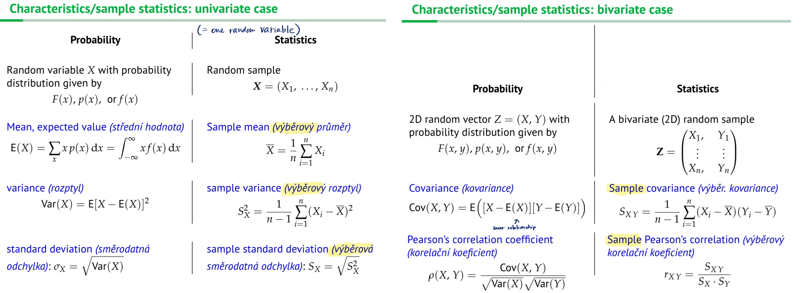

---

### 1.2 Intervaly spolehlivosti (CI - Confidence Interval)
Protože se bodový odhad téměř nikdy netrefí přesně do skutečné hodnoty parametru, konstruujeme interval spolehlivosti. Je to náhodný interval, který s předem zvolenou vysokou pravděpodobností $1-\alpha$ (spolehlivost) pokrývá neznámý pevný parametr populace.

* **Hladina významnosti ($\alpha$):** Pravděpodobnost, že parametr v intervalu nebude obsažen (standardně $\alpha = 0,05$, tj. 5 %).
* **Interpretace:** Pokud bychom nezávisle opakovali výběr dat a pokaždé sestrojili 95% interval spolehlivosti, pak přesně 95 % těchto intervalů bude skutečný populační parametr obsahovat a 5 % jej mine. Parametr je fixní, náhodný je samotný interval.

#### Faktory ovlivňující šířku intervalu:
1. **Variabilita dat (směrodatná odchylka $s$):** Vyšší rozptyl v datech znamená větší nejistotu a širší interval.
2. **Rozsah výběru ($n$):** Větší množství dat snižuje standardní chybu odhadu a interval se zužuje.
3. **Požadovaná spolehlivost ($1-\alpha$):** Pokud chceme vyšší jistotu (např. 99% místo 95%), musíme kritickou hodnotu zvětšit, čímž se interval rozšíří.

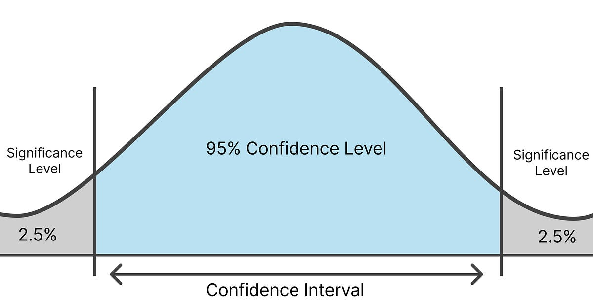

---

### 1.3 Testování statistických hypotéz
Formalizovaný proces rozhodování o vlastnostech populace na základě dat z náhodného výběru.

#### Standardní postup:
1. **Formulace hypotéz:**
   * $H_0$ (Nulová hypotéza): Předpokládá absenci efektu, shodu nebo stav "beze změny" (např. lék nefunguje, rozdíl mezi skupinami je nulový).
   * $H_1$ (Alternativní hypotéza): Konkurenční tvrzení, které chceme daty prokázat (reprezentuje efekt / rozdíl / odchylku).
2. **Volba hladiny významnosti ($\alpha$):** Maximální přípustná pravděpodobnost chyby I. typu (standardně 0,05).
3. **Výběr a výpočet testové statistiky:** Náhodná veličina s přesně známým teoretickým rozdělením za předpokladu platnosti $H_0$ (např. t-statistika, Z-statistika).
4. **Rozhodnutí pomocí p-hodnoty:**
   * **p-hodnota:** Pravděpodobnost, že za platnosti $H_0$ bychom získali testovou statistiku stejně nebo více extrémní, než je ta naše reálně pozorovaná.
   * Pokud $p \le \alpha \implies$ **Zamítáme $H_0$** (výsledek je statisticky významný).
   * Pokud $p > \alpha \implies$ **Nezamítáme $H_0$** (nemáme dostatek důkazů pro prokázání změny).

#### Chyby v rozhodovacím procesu:
Při testování se můžeme dopustit dvou typů chyb:

| Skutečnost \ Rozhodnutí | Nezamítáme $H_0$ | Zamítáme $H_0$ |
| :--- | :--- | :--- |
| **$H_0$ ve skutečnosti platí** | Správné rozhodnutí | **Chyba I. typu ($\alpha$)** (Falešný poplach) |
| **$H_1$ ve skutečnosti platí** | **Chyba II. typu ($\beta$)** (Nepoznaný efekt) | Správné rozhodnutí (Síla testu $1-\beta$) |

#### Síla testu ($1-\beta$)
Vyjadřuje pravděpodobnost, že test správně zamítne neplatnou nulovou hypotézu $H_0$ (tj. rozpozná skutečně existující efekt či rozdíl a nedopustí se chyby II. typu). 
* **Interpretace:** Čím vyšší je síla testu, tím menší je riziko, že přehlédneme důležitý objev. V praxi se požaduje síla testu alespoň 80 % ($1-\beta = 0,80$).
* **Faktory zvyšující sílu testu:**
  1. **Větší rozsah výběru ($n$):** Více dat snižuje standardní chybu a zpřesňuje test.
  2. **Větší velikost efektu (Effect Size):** Výrazné rozdíly v populaci se prokazují snáze než miniaturní odchylky.
  3. **Menší variabilita dat ($\sigma$):** Homogennější data snižují množství šumu.
  4. **Zvýšení hladiny významnosti ($\alpha$):** Snížením přísnosti (např. z 5 % na 10 %) sice zvýšíme sílu testu, ale za cenu vyššího rizika falešného poplachu (chyby I. typu).

#### Základní příklady testů:
* **t-test:** Testování průměru pro malé výběry při neznámem populačním rozptylu.
* **z-test:** Testování průměru pro velké výběry nebo při známém rozptylu.
* **chí-kvadrát test:** Testování shody rozdělení nebo nezávislosti nominálních znaků.

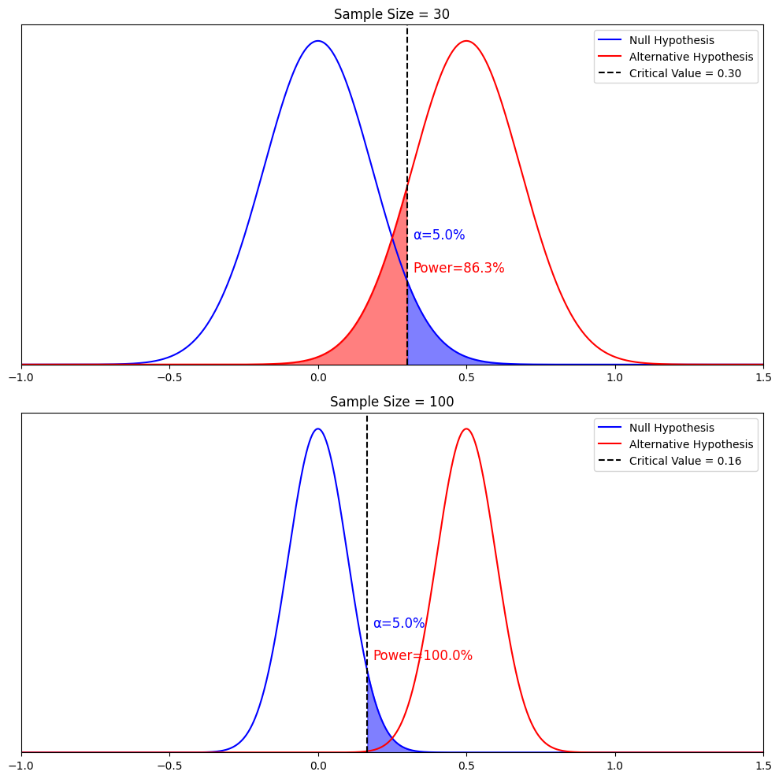

Obrázek graficky znázorňuje, jak **rozsah výběru ($n$) ovlivňuje sílu testu (Power)** při zachování stejné hladiny významnosti ($\alpha = 5\ \%$) a stejné velikosti efektu (vzdálenost středů modré a červené křivky je stále $0,5$).

* **Levý graf ($n = 30$):** Variabilita (šířka křivek) je větší, což způsobuje výrazný překryv rozdělení pod nulovou ($H_0$) a alternativní ($H_1$) hypotézou. Abychom udrželi chybu I. typu na $5\ \%$ (modrá plocha napravo od kritické hodnoty $0,30$), kritická hodnota musí být posunuta poměrně daleko doprava. V důsledku toho je síla testu (červená plocha napravo od kritické hodnoty) pouze **$86,3\ \%$**. Riziko chyby II. typu ($\beta$) je zbylých $13,7\ \%$.
* **Pravý graf ($n = 100$):** S větším množstvím dat se podle Centrální limitní věty standardní chyba zmenšuje – křivky jsou výrazně užší a "špičatější". Překryv obou rozdělení je minimální. Kritická hodnota se posouvá doleva na $0,16$, přičemž modrá plocha ($\alpha$) stále drží svých $5\ \%$. Červená plocha pod křivkou $H_1$ však nyní pokrývá téměř **$100\ \%$** plochy. 
* **Závěr:** Zvýšením rozsahu výběru z $30$ na $100$ jsme zpřesnili odhady, snížili šum a dosáhli téměř stoprocentní jistoty, že reálně existující efekt detekujeme.

---

## 2. ANOVA (Analysis of Variance - Analýza rozptylu)

ANOVA je statistická metoda pro testování rovnosti středních hodnot u **tří a více nezávislých skupin**. Zjišťuje, zda nezávislé kategorické proměnné (faktory) statisticky významně ovlivňují spojitou závislou proměnnou, a to rozkladem celkové variability na rozptyl mezi skupinami a uvnitř skupin. *Příklad: Máme 4 různé odrůdy brambor sesbírané po trsech s různou hmotností. Zajímá nás, jestli je některá odrůda výnosnější než jiná (průměrná hmotnost trsu se liší na základě odrůdy).*

* **$H_0$:** Všechny skupinové průměry jsou stejné: $\mu_1 = \dots = \mu_k$ pro všechna $i = 1, \dots, k$.
* **$H_1$:** Alespoň jeden pár skupinových průměrů se liší: $\exists\, i,j \in \{1,\dots,k\},\ i \neq j:\ \mu_i \neq \mu_j$.

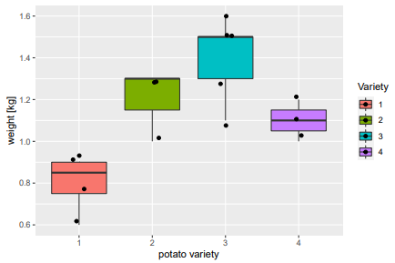

#### Předpoklady ANOVA:
1. **Nezávislost výběrů:** Jednotlivá pozorování musí být na sobě zcela nezávislá. Pokud nejsou, mění se rozdělení testové statistiky i p-hodnota a výsledky nejsou spolehlivé.
2. **Normalita dat:** Ověřuje se pomocí Q-Q grafu nebo testů (např. Shapiro–Wilk). ANOVA je poměrně odolná – pokud má každá skupina alespoň ~20 pozorování a data nejsou silně vychýlená, mírné porušení nevadí. Při silném porušení použijeme neparametrický test (např. Kruskal–Wallis).
3. **Shoda rozptylů (homogenita variancí):** Ověřuje se např. Leveneho nebo Bartlettovým testem. Mírné porušení většinou nevadí, pokud mají srovnávané skupiny podobný rozsah.

#### Formální modelové vyjádření ANOVA
ANOVA lze chápat jako speciální případ lineárního regresního modelu (kde prediktory jsou kategorické proměnné). Každé jednotlivé pozorování můžeme rozložit na teoretické složky pomocí lineárního modelu:

$$Y_{ij} = \mu + \alpha_i + \varepsilon_{ij}$$

Kde:
* $Y_{ij}$ je naměřená hodnota $j$-tého pozorování v $i$-té skupině (např. hmotnost konkrétního trsu brambor z konkrétní odrůdy).
* $\mu$ je **celkový průměr** (grand mean) napříč všemi skupinami bez rozdílu.
* $\alpha_i$ je **efekt $i$-té skupiny** (faktoru), který vyjadřuje odchylku průměru dané skupiny od celkového průměru ($\alpha_i = \mu_i - \mu$). Pro jednoznačnost modelu platí dodatečná podmínka $\sum \alpha_i = 0$, efekty skupin jsou definovány jako odchylky od celkového průměru - jejich součet je 0.
* $\varepsilon_{ij}$ je **náhodná chyba** (reziduum) daného pozorování, která představuje přirozenou variabilitu (šum). Předpokládá se, že tyto chyby jsou nezávislé a mají normální rozdělení s nulovou střední hodnotou a konstantním rozptylem, tedy $\varepsilon_{ij} \sim N(0, \sigma^2)$.

#### Jednofaktorová vs. Vícefaktorová ANOVA
Jednofaktorová ANOVA zkoumá vliv jedné nezávislé proměnné (faktory). Vícefaktorová ANOVA analyzuje vliv dvou a více faktorů současně, včetně jejich vzájemných interakcí na závislou proměnnou.

* *Příklad:* Máme 3 různé druhy hnojiva, 2 různé typy půdy a výnos polí. Zajímá nás, jestli je některá kombinace hnojiva a typu půdy výnosnější než jiná. Máme faktory hnojivo a typ půdy.

U dvoufaktorové ANOVA rozlišujeme model **bez interakce** a model **s interakcí** mezi faktory:
* **Bez interakce:** Předpokládáme, že vliv jednoho faktoru je stejný bez ohledu na úroveň druhého faktoru. *Například hnojivo A zvyšuje výnos vždy o +2 kg bez ohledu na typ půdy.*
* **S interakcí:** Připouštíme, že efekt jednoho faktoru závisí na úrovni druhého faktoru. *Hnojivo A je nejlepší na jílovité půdě, ale na písčité půdě je lepší hnojivo B.*

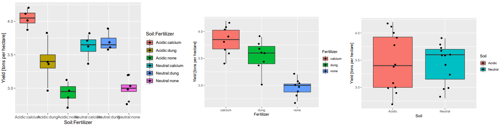

### 2.1 Rozklad variability a F-test

ANOVA rozkládá celkovou variabilitu na dvě základní složky:
* **Meziskupinový součet čtverců ($SS_{between}$ / Teoretický):** Vyjadřuje variabilitu způsobenou faktorem (rozdíly mezi průměry skupin a celkovým průměrem).
  $$SS_{between} = \sum_{i=1}^{k} n_i (\bar{y}_i - \bar{y})^2$$
* **Vnitroskupinový součet čtverců ($SS_{within}$ / Reziduální):** Vyjadřuje náhodnou variabilitu (šum uvnitř skupin).
  $$SS_{within} = \sum_{i=1}^{k} \sum_{j=1}^{n_i} (y_{ij} - \bar{y}_i)^2$$
* **Celkový součet čtverců ($SS_{total}$):** Celková variabilita dat kolem celkového průměru.
  $$SS_{total} = \sum_{i=1}^{k} \sum_{j=1}^{n_i} (y_{ij} - \bar{y})^2$$
  
  $$SS_{total} = SS_{between} + SS_{within}$$

Kde $k$ je počet porovnávaných skupin, $n_i$ je rozsah (počet pozorování) v $i$-té skupině a $n$ je celkový počet všech pozorování v experimentu ($n = \sum n_i$).

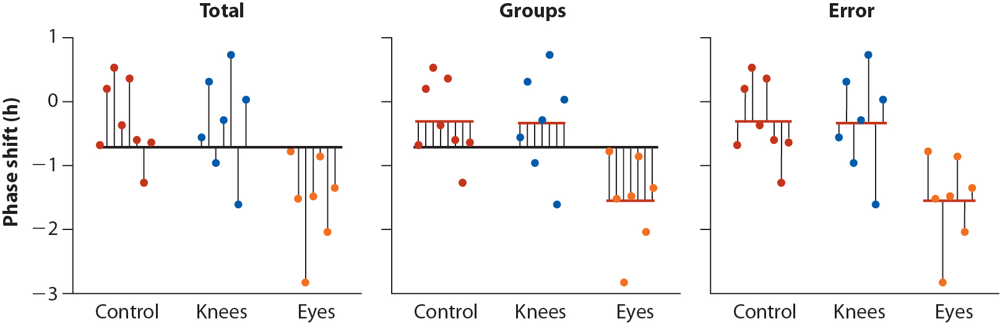

Z těchto veličin se počítají střední čtverce (MS) podělením příslušnými stupni volnosti:
$$MS_{between} = \frac{SS_{between}}{k - 1}, \quad MS_{within} = \frac{SS_{within}}{n - k}$$

Výsledná testová statistika F:
$$F = \frac{MS_{between}}{MS_{within}}$$

* Pokud jsou průměry skupin stejné, očekáváme $F \approx 1$.
* Výrazně velká hodnota $F$ překračující teoretickou kritickou hodnotu vede k zamítnutí $H_0$.

### Proč nepoužít vícero párových t-testů místo ANOVA?
*Pokud máme např. 4 skupiny a chtěli bychom porovnat každou s každou pomocí klasického t-testu, museli bychom provést* $C(4,2) = 6$ *samostatných testů. S každým dalším testem se však dramaticky kumuluje **chyba I. typu (falešný poplach)**.* 

*Pokud je hladina významnosti jednoho testu* $\alpha = 0,05$ *(tedy 5% šance, že najdeme rozdíl tam, kde není), pak pravděpodobnost, že při 6 nezávislých testech uděláme *alespoň jednu* chybu I. typu, stoupne na:*
$$1 - (1 - 0,05)^6 \approx 0,265 \implies 26,5\ \%$$
*Místo kontrolovaných 5 % tak riskujeme falešný objev ve více než čtvrtině případů (tzv. Family-wise error rate). ANOVA tento problém řeší tak, že nejprve provede jeden **globální (omnibusový) F-test** na jednotné hladině významnosti. Teprve pokud ten vyjde statisticky významný, přicházejí na řadu post-hoc testy se speciálními korekcemi (Tukey, Bonferroni), které chybu I. typu udrží pod kontrolou.*

### 2.2 Post-hoc testy
Pokud ANOVA zamítne $H_0$, víme, že existuje rozdíl, ale nevíme, mezi kterými konkrétními skupinami. K tomu slouží post-hoc testy:
* **Tukey HSD:** Porovnává všechny dvojice a matematicky koriguje hladinu významnosti.
* **Bonferroniho korekce:** Velmi přísná metoda, přímo dělí hladinu významnosti $\alpha$ celkovým počtem prováděných testů.
Bez těchto korekcí by při vícenásobném testování hrozilo, že najdeme "náhodný" rozdíl, který ve skutečnosti neexistuje (kumulace chyby I. typu).

---

## 3. Neparametrické testy hypotéz

Nevyžadují konkrétní tvar **rozdělení** (typicky normalitu) a nejčastěji pracují s pořadím (ranks) namísto původních hodnot. Používají se tehdy, když:
* Data vykazují silnou nenormalitu (šikmost, outliery).
* Máme malé výběry a normalitu nelze rozumně předpokládat.
* Závislá proměnná je ordinálního typu (např. škály bolesti, známky, spokojenost).
* Je porušen předpoklad homogenity rozptylů.
* Chceme robustnější postup vůči extrémním hodnotám.

Neparametrické testy bývají „konzervativnější“ (mají nižší sílu testu) než parametrické testy, pokud jsou předpoklady parametrických testů splněny. Naopak při silném porušení normality nebo přítomnosti outlierů mohou být výrazně spolehlivější.

### 3.1 Wilcoxonův test (jednovýběrový a párový)
Používá se jako neparametrická alternativa k **jednovýběrovému** nebo **párovému** t-testu při porušení normality.

* **Jednovýběrový test:** Porovnává medián jednoho výběru se zadanou konstantou $c$ ($H_0: \tilde{x} = c$).
  * *Příklad:* Testujeme, zda lidé odhadnou minutu přesně (medián odhadů = 60 s). Odchylka se počítá jako $Y_i = X_i - 60$.
* **Párový test:** Testuje, zda je medián rozdílů mezi dvěma měřeními u stejných subjektů roven nule ($H_0: \tilde{x}_{D} = 0$).
  * *Příklad:* Měření tlaku krve před podáním léku a po něm. Odchylka (rozdíl) se počítá v rámci každé dvojice: $Y_i = X_{i,\text{před}} - X_{i,\text{po}}$.

#### Princip výpočtu:
1. Pro každé pozorování se spočítá odchylka $Y_i$ (od konstanty nebo v rámci páru). Nulové odchylky se vyřadí.
2. Vezmou se absolutní hodnoty těchto odchylek $|Y_i|$, seřadí se vzestupně a přiřadí se jim **pořadí (ranks)** $R_i^+$ (1 pro nejmenší odchylku, $n$ pro největší).
3. Pořadím se vrátí původní znaménka odchylek ( $\text{sgn}(Y_i)$ ).
4. Zvlášť se sečtou kladná pořadí ($T^+$) a záporná pořadí ($T^-$).
5. Za platnosti $H_0$ by měly být sumy $T^+$ a $T^-$ přibližně vyrovnané. Výrazný nepoměr mezi nimi vede k nízké p-hodnotě a zamítnutí $H_0$.

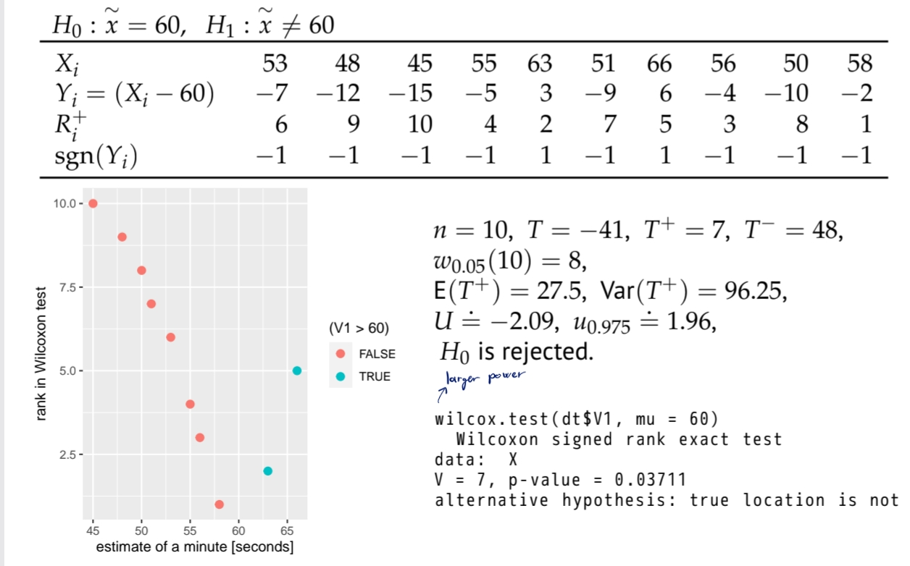

### 3.2 Mann-Whitneyův test (Wilcoxon Rank-Sum Test)
Porovnává dvě nezávislé skupiny bez předpokladu normality dat. Ověřuje, zda hodnoty v jedné skupině mají tendenci být systematicky větší než ve druhé (testuje rozdíl rozdělení polohy).
* **$H_0$:** Distribuce obou nezávislých skupin jsou totožné.
* **$H_1$:** Distribuce polohy obou skupin se liší (hodnoty jedné skupiny mají tendenci převyšovat druhou).
* Data z obou nezávislých skupin se spojí do jednoho velkého souboru o rozsahu $n_1 + n_2$ a seřadí se vzestupně od nejmenší po největší hodnotu. Každému pozorování je přiděleno jeho **globální pořadí** (při shodě hodnot se dává průměrné pořadí). Následně se pořadí sečtou separátně pro první skupinu ($R_1$) a druhou skupinu ($R_2$). Pokud jedna ze skupin obsahuje systematicky větší hodnoty, získá i výrazně vyšší sumu pořadí, což vede k zamítnutí $H_0$.
* *Příklad:* Máme dva typy hnojiva A a B a měříme výnos (kg) na nezávislých polích. Data jsou silně šikmá kvůli několika extrémně výnosným polím a chceme zjistit, jestli se výnosy liší.

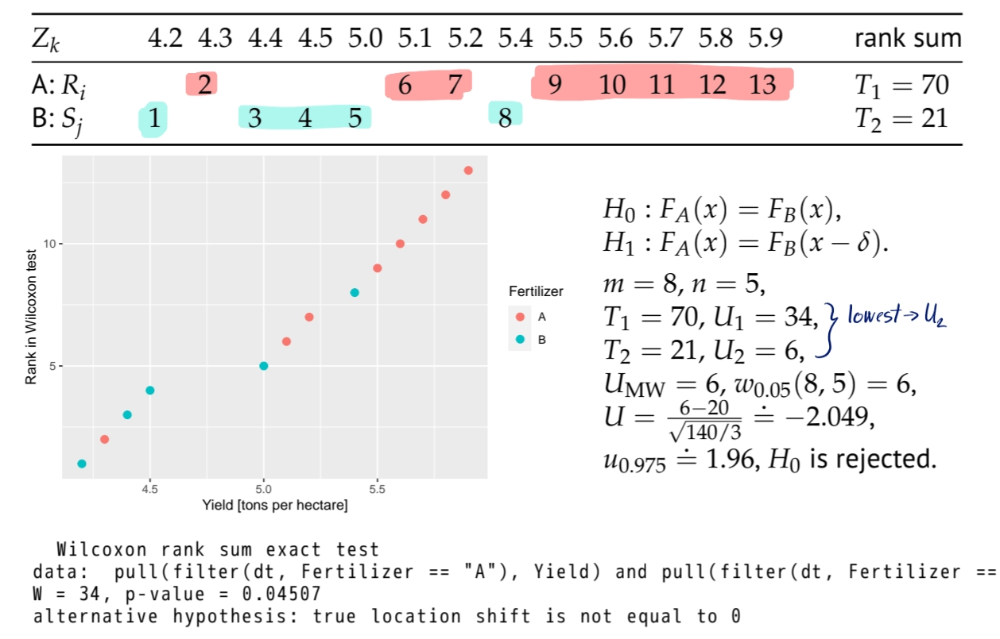

### 3.3 Kruskal-Wallisův test
Neparametrická alternativa k jednofaktorové ANOVA pro tři a více nezávislých skupin.
* **$H_0$:** Všechny srovnávané skupiny pocházejí ze stejného rozdělení (mediány skupin jsou shodné).
* **$H_1$:** Alespoň jedna skupina se liší distribucí polohy od ostatních.
* Funguje jako zobecnění Mann-Whitneyho testu pro $k$ skupin. Všechna pozorování napříč všemi skupinami se spojí, seřadí a přiřadí se jim globální pořadí. Následně se spočítají průměrná pořadí pro každou jednotlivou skupinu. Testová statistika $H$ porovnává, jak moc se průměrná pořadí jednotlivých skupin odlišují od celkového průměrného pořadí. Pro větší výběry má statistika $H$ přibližně $\chi^2$ (chí-kvadrát) rozdělení s $k-1$ stupni volnosti.
* *Příklad:* Máme 4 odrůdy brambor, ale hmotnosti trsů jsou výrazně nenormální s outliery. Chceme zjistit, zda se odrůdy liší.

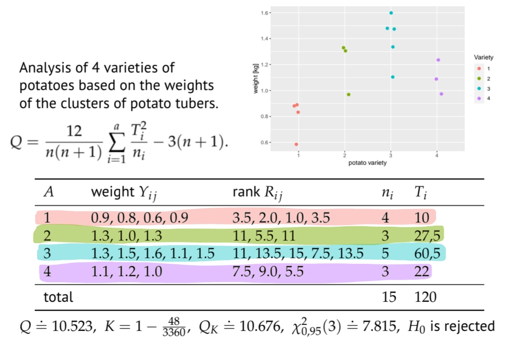

### 3.4 Znaménkový test (Sign Test)
Mimořádně jednoduchý test, který je sice méně silný než Wilcoxonův test (zahazuje část informace), ale nevyžaduje ani předpoklad symetrie rozdělení kolem mediánu.

* **Jednovýběrový:** Testuje, zda je medián roven konstantě ($H_0: \tilde{x} = c$).
* **Párový:** Testuje, zda je medián rozdílů mezi dvěma měřeními roven nule ($H_0: \tilde{x}_{D} = 0$).

##### Princip výpočtu:
1. Pro každou hodnotu se spočítá odchylka (od konstanty nebo v rámci páru). Případy, kdy je odchylka přesně $0$, se z testu vyřadí.
2. Sleduje se pouze **znaménko** této odchylky:
   * Kolik hodnot skončilo nad mediánem/konstantou (počet znamének `+`).
   * Kolik hodnot skončilo pod mediánem/konstantou (počet znamének `-`).
3. Za platnosti $H_0$ by měl být poměr plusů a mínusů vyrovnaný (přibližně 50 : 50). Rozdělení počtu znamének se řídí **binomickým rozdělením** $Bi(n, p=0,5)$. Pokud je poměr příliš vychýlený (např. 9 plusů a 1 mínus z 10 měření), $H_0$ se zamítá.

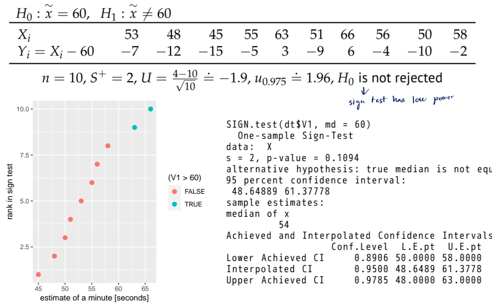

Přehled parametrických a neparametrických testů:

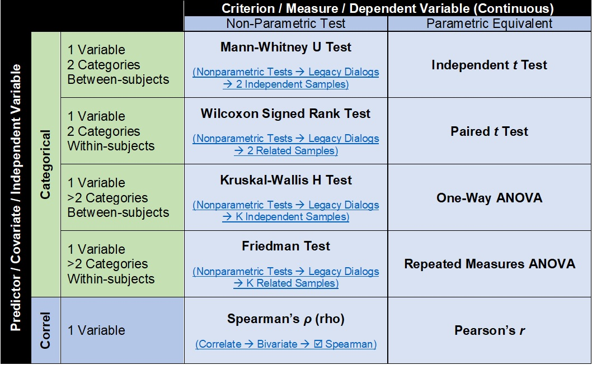

---

## 4. Mnohonásobná lineární regrese

Zkoumá lineární vztah mezi **jednou spojitou závislou proměnnou a více nezávislými proměnnými (prediktory)**. Cílem je popsat, jak se mění hodnota závislé proměnné při změně několika vysvětlujících proměnných současně, a odhadnout jejich samostatný vliv při kontrole ostatních proměnných.

* *Příklad:* $\text{Cena bytu} = \beta_0 + \beta_1 \cdot \text{výměra} + \beta_2 \cdot \text{počet pokojů}$
* *Hmotnost člověka v závislosti na výšce a pohlaví viz graf.*

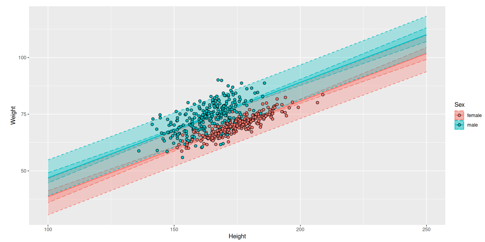

Pozor, nezaměňovat jednoduchou regresi s více parametry s mnohonásobnou regresí. Záleží na počtu prediktorů ($X_j$ – u mnohonásobné musí být aspoň $k \ge 2$), ne na počtu parametrů $\beta$. Každý koeficient $\beta_j$ vyjadřuje, o kolik se v průměru změní $Y$, když se $X_j$ zvýší o 1 jednotku a ostatní proměnné zůstanou konstantní.

### 4.1 Základní předpoklady lineární regrese
Aby byly odhady stabilní a testy spolehlivé, musí platit:
1. **Linearita:** Vztah mezi závislou proměnnou $Y$ a prediktory $X_j$ je lineární.
2. **Nezávislost chyb:**  Náhodné chyby $\varepsilon_i$ jsou na sobě nezávislá.
3. **Homoskedasticita:** Konstantní rozptyl náhodných chyb.
4. **Normalita chyb:** Náhodné chyby $\varepsilon_i$ mají normální rozdělení, což je klíčové pro platnost t-testů a intervalů spolehlivosti.
5. **Absence dokonalé multikolinearity:** Mezi vysvětlujícími proměnnými nesmí existovat přesný lineární vztah ani extrémně silná korelace. Pokud by byly proměnné dokonale závislé, matice prediktorů by byla singulární a matematicky nelze jednoznačně odhadnout regresní koeficienty $\beta$.

*Poznámka: Tyto předpoklady jsou formulovány pro teoretické **náhodné chyby** (* $\varepsilon_i$ *), což jsou neviditelné náhodné složky v populaci, které nikdy nemůžeme přesně změřit, protože neznáme skutečné parametry přírody. V praxi proto všechny tyto předpoklady ověřujeme a testujeme na **reziduích** (* $r_i$ *), která představují svislé odchylky reálných dat od našeho odhadnutého modelu a slouží jako nejlepší dostupný odhad těchto teoretických chyb.*

### 4.2 Matematický model a výpočet OLS

Pro $n$ nezávislých pozorování s $k$ prediktory zapisujeme lineární vztah pro $i$-té pozorování následovně:

$$Y_i = \beta_0 + \beta_1 x_{i1} + \beta_2 x_{i2} + \dots + \beta_k x_{ik} + \varepsilon_i$$

V maticovém tvaru celý model odpovídá zápisu $Y = X\beta + \varepsilon$:

$$
\begin{pmatrix} Y_1 \\\\ \vdots \\\\ Y_n \end{pmatrix} = \begin{pmatrix} 1 & x_{11} & \cdots & x_{1k} \\\\ \vdots & \vdots & \ddots & \vdots \\\\ 1 & x_{n1} & \cdots & x_{nk} \end{pmatrix} \begin{pmatrix} \beta_0 \\\\ \beta_1 \\\\ \vdots \\\\ \beta_k \end{pmatrix} + \begin{pmatrix} \varepsilon_1 \\\\ \vdots \\\\ \varepsilon_n \end{pmatrix}
$$

Kde $X$ je **matice plánu** (design matrix), jejíž první sloupec tvoří jedničky patřící k absolutnímu členu $\beta_0$.

#### Metoda nejmenších čtverců (OLS)
Cílem OLS je najít takové odhady koeficientů $\hat{\beta}_j$, které minimalizují součet čtverců **reziduí** ($r_i = Y_i - \hat{Y}_i$), což jsou svislé vzdálenosti skutečných bodů od regresního modelu:

$$S(\beta_0, \beta_1, \dots, \beta_k) = \sum_{i=1}^{n} r_i^2 = \sum_{i=1}^{n} (Y_i - \hat{Y}_i)^2 = \sum_{i=1}^{n} (Y_i - (\beta_0 + \beta_1 x_{i1} + \dots + \beta_k x_{ik}))^2 = \sum_{i=1}^{n} (Y_i - \beta_0 - \sum_{j=1}^{k} \beta_j x_{ij})^2 \to \min$$

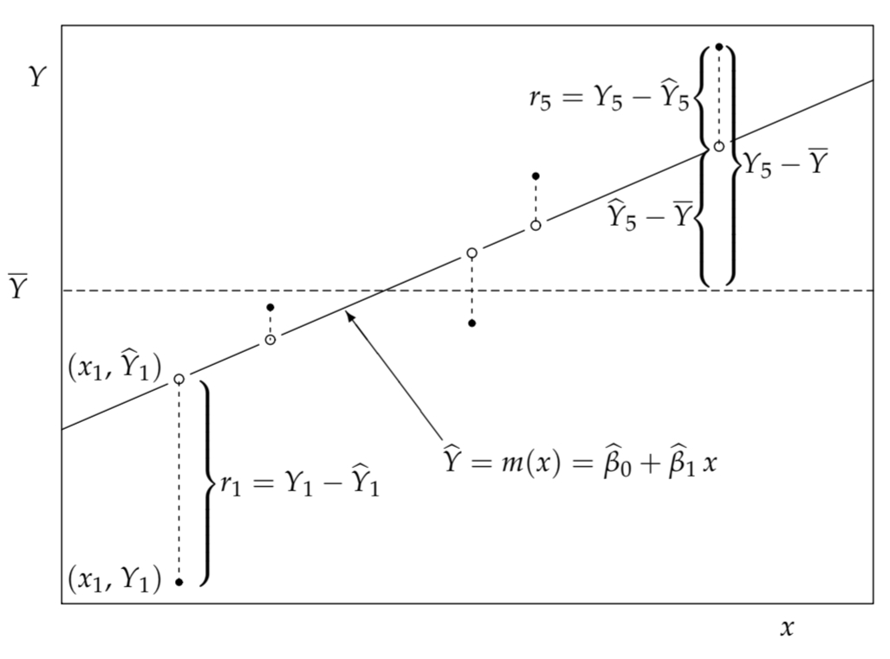

Odhady koeficientů získáme tak, že funkci $S$ parciálně zderivujeme podle každého parametru $\beta_j$ a derivace položíme rovny nule (protože hledáme globální minimum této funkce, kde je tečná rovina dokonale vodorovná a sklon (derivace) je tedy roven nule). Tím dostaneme **soustavu normálních rovnic**:

$$\begin{aligned}
\sum_{i=1}^{n} (Y_i - \hat{\beta}_0 - \hat{\beta}_1 x_{i1} - \dots - \hat{\beta}_k x_{ik}) &= 0 \\
\sum_{i=1}^{n} x_{i1} (Y_i - \hat{\beta}_0 - \hat{\beta}_1 x_{i1} - \dots - \hat{\beta}_k x_{ik}) &= 0 \\
&\ \ \vdots \\
\sum_{i=1}^{n} x_{ik} (Y_i - \hat{\beta}_0 - \hat{\beta}_1 x_{i1} - \dots - \hat{\beta}_k x_{ik}) &= 0
\end{aligned}$$

V maticovém vyjádření má tato soustava tvar $X^T X \hat{\beta} = X^T Y$. Pokud v datech chybí dokonalá multikolinearita (matice $X^T X$ je regulární), získáme jednoznačný odhad koeficientů:

$$\hat{\beta} = (X^T X)^{-1} X^T Y$$

*Poznámka k maticovému výpočtu: Výraz **regulární matice** je maticový ekvivalent toho, že číslo před neznámou není nula. Stejně jako v běžné matematice nemůžeme rovnici* $0 \cdot x = 10$ *vyřešit dělením nulou, v maticové algebře nemůžeme spočítat inverzní matici* $(X^T X)^{-1}$*, pokud se matice chová jako nula. Taková matice se nazývá **singulární**. Tento stav nastává právě při **dokonalé multikolinearitě** (kdy jsou prediktory lineárně závislé). Pokud tedy data nejsou kolineární, matice není singulární, ale **regulární**, lze ji invertovat a výpočet koeficientů proběhne okamžitě na jeden zátah.*

### 4.3 Testování významnosti v regresi (F-test vs. t-test)

V regresní analýze používáme dva typy testů současně, protože každý hodnotí model z jiné perspektivy:

1. **Globální F-test (Celkový přínos modelu):** Zkoumá, zda má model jako **celek** vůbec nějakou vypovídací hodnotu, nebo zda lépe predikuje pouhý celkový průměr $\bar{Y}$.
   * $H_0: \beta_1 = \beta_2 = \dots = \beta_k = 0$ (žádný prediktor nemá vliv).
   * $H_1: \text{alespoň jedno } \beta_j \neq 0$ (model nese užitečnou informaci).

2. **Individuální t-testy (Přínos jednotlivých proměnných):** Pokud globální F-test vyjde významný, t-testy zkoumají každý koeficient **samostatně**. Zjišťují, zda konkrétní prediktor přináší do modelu unikátní informaci *při kontrole (zohlednění) všech ostatních proměnných*.
   * $H_0: \beta_j = 0$ (daná proměnná je v přítomnosti ostatních zbytečná).
   * $H_1: \beta_j \neq 0$ (proměnná má prokazatelný samostatný vliv).

### 4.4 Koeficient determinace $R^2$

Udává, jaká část celkové variability závislé proměnné je vysvětlena modelem. Výpočet přímo vychází z geometrického rozkladu variability na regresní přímce:

$$R^2 = \frac{S_R}{S_T} = 1 - \frac{S_e}{S_T}$$

#### Výpočet jednotlivých součtů čtverců ($S$):
Pro každé $i$-té pozorování pracujeme se skutečnou hodnotou $Y_i$, modelem předpovězenou hodnotou $\hat{Y}_i$ a celkovým průměrem $\bar{Y}$:

* **$S_T$ (Celkový součet čtverců):** Měří celkovou variabilitu $Y$ kolem průměru.
  $$S_T = \sum_{i=1}^{n} (Y_i - \bar{Y})^2$$
* **$S_e$ (Reziduální součet čtverců):** Měří nevysvětlenou variabilitu (sumu čtverců chyb $r_i$ vůči modelu).
  $$S_e = \sum_{i=1}^{n} r_i^2 = \sum_{i=1}^{n} (Y_i - \hat{Y}_i)^2$$
* **$S_R$ (Regresní součet čtverců):** Měří variabilitu vysvětlenou samotnými prediktory (vzdálenost modelu od průměru).
  $$S_R = \sum_{i=1}^{n} (\hat{Y}_i - \bar{Y})^2$$

Celková variabilita se rozpadá na obě složky: $S_T = S_R + S_e$.

#### Adjustovaný koeficient determinace ($R^2_{adj}$)
Protože hodnota $R^2$ s přidáním jakéhokoliv dalšího prediktoru uměle roste, používá se k porovnávání modelů upravené $R^2_{adj}$. To penalizuje model za zbytečnou komplexnost (prevence overfittingu) a zohledňuje rozsah výběru ($n$) i počet prediktorů ($k$):

$$R^2_{adj} = 1 - \frac{\frac{S_e}{n-k-1}}{\frac{S_T}{n-1}}$$

### 4.5 Výběr proměnných a postupná regrese (Stepwise Regression)
Nalezení optimálního podmodelu při velkém počtu prediktorů bývá náročné kvůli vztahům mezi nimi. Jednou z metod je **postupná regrese**, která automaticky přidává nebo odebírá proměnné na základě statistických kritérií (např. minimalizace Akaikeho informačního kritéria AIC).

Jedná se o čistě mechanický algoritmus, který může vést k overfittingu, nestabilním modelům při kolinearitě a zcela ignoruje věcný či teoretický kontext kauzality v daném oboru.

---

## 5. Multikolinearita
Multikolinearita znamená, že některé vysvětlující proměnné ($X$) jsou mezi sebou silně lineárně závislé (korelované). Model pak velmi obtížně rozlišuje jejich samostatný izolovaný vliv na závislou proměnnou.

* *Příklad:* V modelu mzdy použijeme současně věk, délku praxe a počet let od ukončení školy – tyto proměnné spolu extrémně úzce souvisejí.

#### Důsledky multikolinearity:
Odhady regresních koeficientů jsou nestabilní, mají obrovské směrodatné chyby a jednotlivé proměnné mohou vycházet jako statisticky nevýznamné, i když se závislou proměnnou silně souvisejí. Model sice dobře predikuje, ale nelze jej spolehlivě interpretovat.

Míra multikolinearity se detekuje pomocí ukazatele **VIF (Variance Inflation Factor)**:
$$VIF_j = \frac{1}{1 - R_j^2}$$

* $VIF_j \approx 1$: Bez problému (absence kolinearity).
* $VIF_j > 5$: Možný problém s kolinearitou.
* $VIF_j > 10$: Silná, kritická multikolinearita.

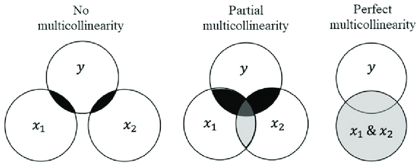

---

## 6. Autokorelace
Autokorelace nastává v situaci, kdy náhodné chyby (rezidua) $\varepsilon_i$ v modelu nejsou nezávislé, ale vykazují vzájemnou závislost. Nejčastěji se vyskytuje u **časových řad**, kde hodnota v čase $t$ přímo souvisí s hodnotou v čase $t-1$.

#### Důsledky autokorelace:
Odhady koeficientů $\beta$ zůstávají nestranné, ale nejsou efektivní (mají velký rozptyl). OLS systematicky podhodnocuje rozptyl chyb, což vede k **neplatnosti t-testů a p-hodnot** (model indikuje falešnou významnost prediktorů).

Detekuje se nejčastěji pomocí **Durbin-Watsonova testu** (hodnoty v rozsahu 0 až 4):
* $DW \approx 2$: Rezidua jsou nezávislá (v pořádku).
* $DW \to 0$: Silná pozitivní autokorelace.
* $DW \to 4$: Silná negativní autokorelace.

*Řešení:* Použití metod upravených pro časové řady (např. zobecněné nejmenší čtverce GLS).

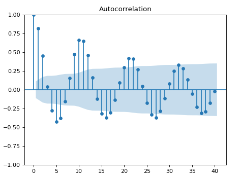

---

## 7. Analýza hlavních komponent (PCA - Principal Component Analysis)

PCA je statistická metoda redukce dimenze, která převádí původní (často silně korelované) proměnné na menší počet nových, lineárně nezávislých proměnných – **hlavních komponent (PC)**. PCA lze chápat jako ortonormální projekci dat do nového podprostoru nižší dimenze tak, aby byla minimalizována ztráta informace o celkové variabilitě.

* *Příklad:* Máme 10 různých měření tělesných proporcí člověka, která spolu úzce souvisejí, a chceme je pro zjednodušení nahradit 2–3 hlavními komponentami.

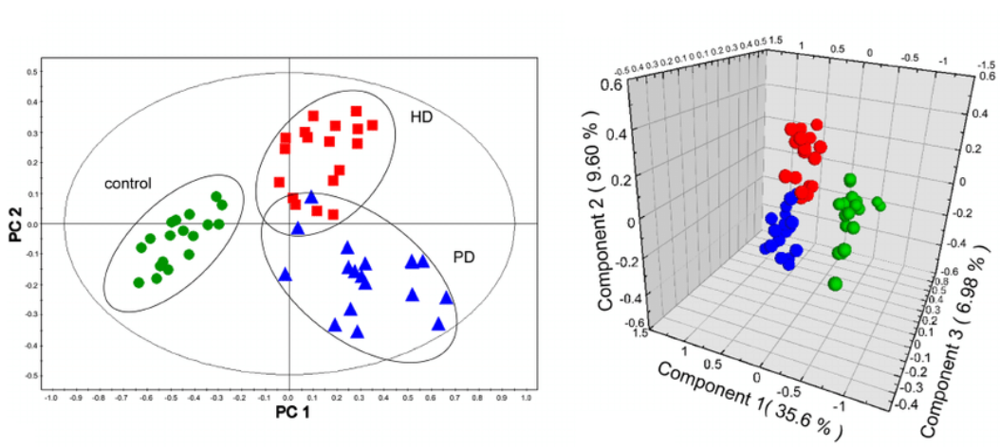

*Redukce dimenzí ze 3D na 2D*

PCA hledá nové osy v prostoru dat tak, aby:
* První osa ($PC_1$) vykazovala co největší možný rozptyl dat.
* Druhá osa ($PC_2$) měla co největší rozptyl ze zbytku variability a byla striktně kolmá na první osu.
* Další komponenty se určují analogicky.

První hlavní komponenta tedy zachycuje největší část informace obsažené v datech, zatímco poslední komponenty často nesou jen minimální rozptyl nebo náhodný šum.

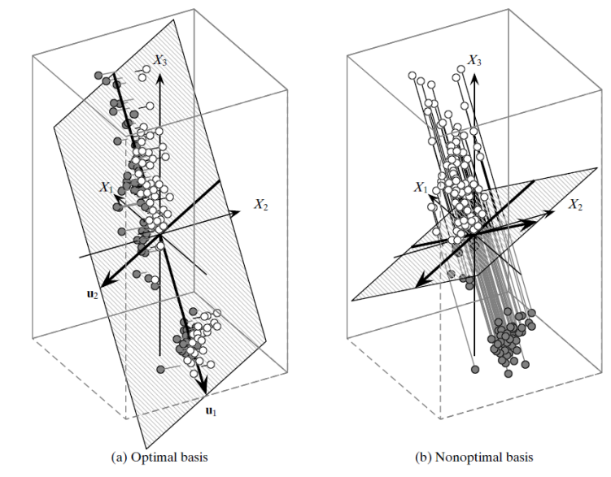

*Optimální a neoptimální báze*

### 7.1 Matematický tvar hlavních komponent
Každá hlavní komponenta je lineární kombinací původních proměnných:
$$PC_k = a_{k1}X_1 + a_{k2}X_2 + \dots + a_{kp}X_p$$

Kde $X_j$ jsou původní proměnné a $a_{kj}$ jsou koeficienty určující směr komponenty (*loadings*). Tyto koeficienty tvoří **vlastní vektory** kovarianční nebo korelační matice.

### 7.2 Výpočet PCA
Před použitím PCA je nezbytné data **standardizovat**, zejména pokud jsou proměnné v různých fyzikálních jednotkách, jinak by proměnné s přirozeně větším měřítkem zkreslily celou analýzu.

Následně se určí charakteristická rovnice matice:
$$\mathbf{S}\mathbf{a}_k = \lambda_k \mathbf{a}_k$$

Kde $\mathbf{S}$ je kovarianční nebo korelační matice (můžeme si vybrat – korelační matici volíme ve většině případů, protože odpovídá situaci, kdy data před analýzou standardizujeme, abychom je očistili od rozdílných fyzikálních jednotek), $\mathbf{a}_k$ je vlastní vektor a $\lambda_k$ je **vlastní číslo**, které vyjadřuje rozptyl vysvětlený danou $k$-tou komponentou.

*Charakteristická rovnice je matematický nástroj, který převádí maticový problém hledání nových os na obyčejnou algebraickou rovnici. Určujeme ji proto, abychom z výpočtu dočasně eliminovali neznámé směry komponent (vektory) a osamostatnili výpočet pro neznámá vlastní čísla* $\lambda_k$ *představující rozptyly. Vynulováním determinantu navíc garantujeme, že nově nalezené osy budou nenulové (matice bude singulární).*

*Proces hledání neznámých vlastních čísel* $\lambda$ *probíhá z této základní rovnice následovně:*
1. *Převedením všech členů na levou stranu a vynásobením jednotkovou maticí* $\mathbf{I}$ *získáme homogenní soustavu rovnic:* $(\mathbf{S} - \lambda_k \mathbf{I})\mathbf{a}_k = 0$.
2. *Hledáme netriviální (nenulové) řešení pro směr komponenty* $\mathbf{a}_k$*. Soustava má nenulové řešení pouze tehdy, když je matice soustavy singulární. Sestavíme proto charakteristickou rovnici vynulováním jejího determinantu:* $\det(\mathbf{S} - \lambda \mathbf{I}) = 0$.
3. *Rozvinutím determinantu se matice roznásobí do podoby obyčejné algebraické rovnice (např. pro 2 proměnné vznikne kvadratická rovnice* $\lambda^2 + b\lambda + c = 0$*, obecně nazývaná polynom p-tého stupně). Vyřešením této rovnice získáme konkrétní hodnoty pro vlastní čísla* $\lambda$*.*

*Příklad pro 3 původní proměnné (p = 3): Odčítání* $\lambda$ *od diagonály matice vztahů* $\mathbf{S}$ *a následný výpočet determinantu vypadá v obecném zápisu takto:*

$$
\det(\mathbf{S} - \lambda \mathbf{I}) = \det 
\begin{pmatrix} 
S_{11} - \lambda & S_{12} & S_{13} \\ 
S_{21} & S_{22} - \lambda & S_{23} \\ 
S_{31} & S_{32} & S_{33} - \lambda 
\end{pmatrix} = 0
$$

4. *Vlastní čísla seřadíme sestupně od největšího po nejmenší:* $\lambda_1 \ge \lambda_2 \ge \dots \ge \lambda_p \ge 0$*. Největší* $\lambda_1$ *odpovídá první hlavní komponentě* ($PC_1$), *protože zachycuje největší podíl rozptylu.*

Podíl vysvětlené variability $k$-tou komponentou odpovídá zlomku:
$$\frac{\lambda_k}{\sum_{j=1}^p \lambda_j}$$

### 7.3 Volba počtu komponent
Počet ponechaných komponent se volí na základě několika kritérií:
* Ponechat tolik komponent, aby kumulativně vysvětlily cca 80–90 % celkové variability.
* **Kaiserovo pravidlo:** Ponechat pouze komponenty s vlastním číslem $\lambda_k > 1$.
* **Scree plot (Sutinový graf):** Vizuální graf vlastních čísel, kde se hledá zlom ("koleno"), za kterým už další komponenty přinášejí zanedbatelné množství informace.

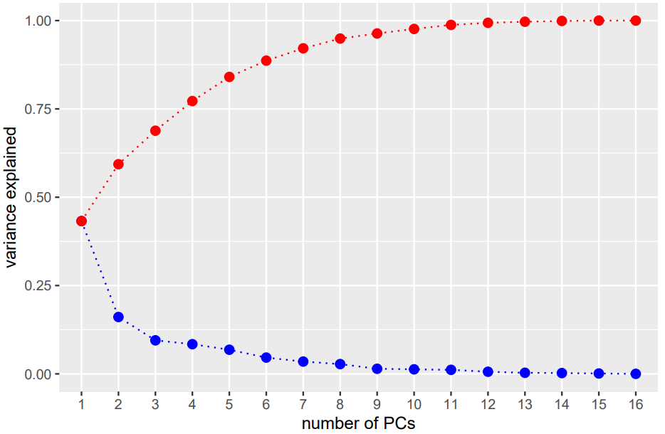

*Scree plot*

### 7.4 Scores a Loadings
* **Loadings:** Koeficienty definující váhu původních proměnných v komponentě (říkají, jak silně proměnné s PC korelují).
* **Scores:** Nově vypočítané souřadnice konkrétních pozorování v prostoru hlavních komponent, které lze vizualizovat v grafech.

#### Hlavní omezení PCA:
Jedná se o čistě lineární metodu, která je velmi citlivá na odlehlá pozorování. Hlavní nevýhodou je často obtížná nebo nemožná věcná interpretace jednotlivých PC (např. kvůli kombinaci nekompatibilních fyzikálních jednotek v jedné rovnici).
