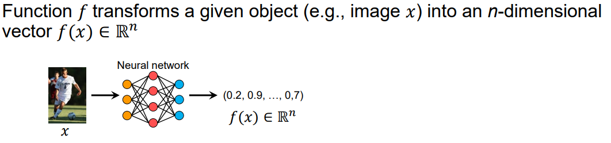
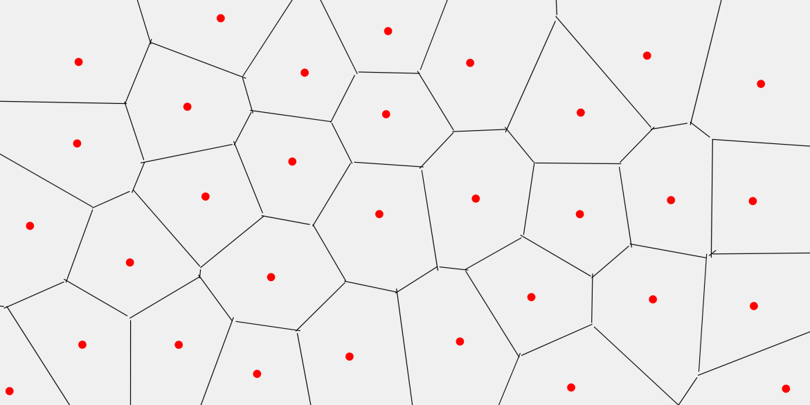
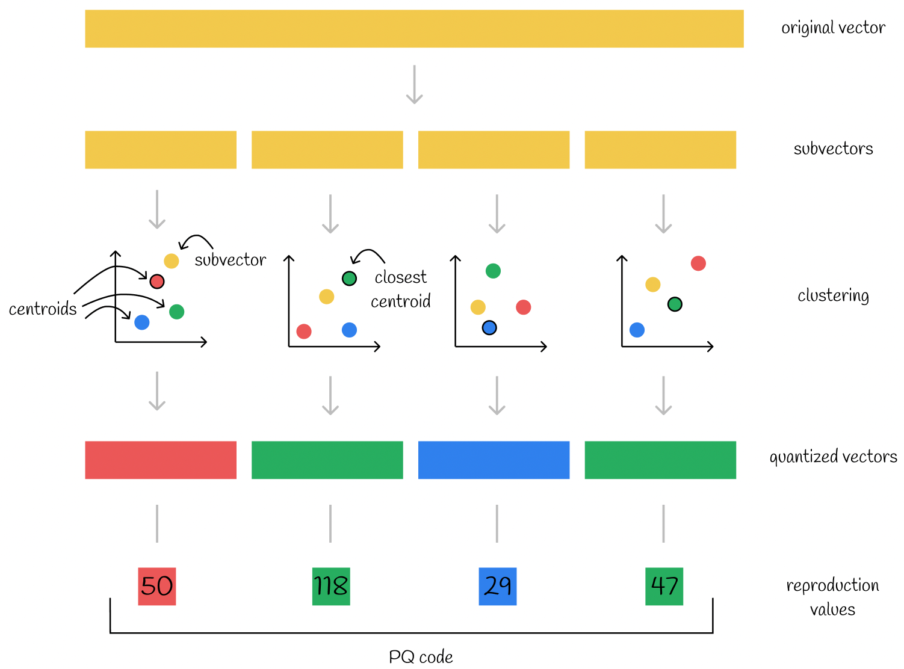
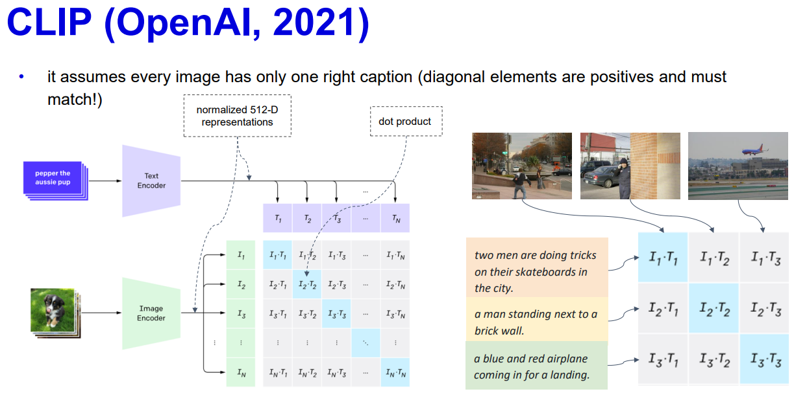

# Strojové učení

(PV056) pro absolventy předmětu od jara 2025 včetně
> Základy strojového učení (supervizované, semi-supervizované a nesupervizované učení; 
> operace klasifikace, regrese, detekce anomálií). 
> Učení metrik (kontrastivní učení, triplet-loss učení). 
> Vektorová/produktová kvantizace s využitím pro aproximované hledání. 
> Principy křížově-modálního (cross-modal) učení (CLIP).

## Základy strojového učení (ML)

Strojové učení definujeme jako schopnost počítačových systémů zlepšovat svůj výkon při řešení dané úlohy na základě zkušenosti (dat), aniž by byly pro tuto úlohu explicitně naprogramovány. V moderním pojetí jde o hledání matematických funkcí, které nejlépe aproximují vztahy skryté v datech.

### Supervizované učení
Učení s učitelem je založeno na trénovací množině párů $(x, y)$, kde $x$ je vstupní vektor příznaků a $y$ je známý label (štítek). Model se snaží minimalizovat ztrátovou funkci (Loss Function), která měří rozdíl mezi predikcí $\hat{y}$ a skutečnou hodnotou $y$. Učení s učitelem je založeno na trénovací množině párů $(x, y)$, kde model minimalizuje ztrátovou funkci (Loss Function). Klíčovým konceptem je **generalizace** – schopnost modelu podávat dobrý výkon na testovacích datech. 
Pokud se model naučí trénovací data "nazpaměť" včetně šumu, mluvíme o **overfittingu** (přeučení).
- Proces učení probíhá iterativně (např. pomocí gradientního sestupu), dokud model nedosáhne požadované přesnosti na testovacích datech.
- Vyžaduje rozsáhlé "gold standard" datasety, které musí často ručně vytvořit experti.
- *Příklad 1: Detekce objektů v autonomních vozidlech, kde jsou tisíce snímků označeny obdélníky vymezujícími chodce a jiná auta.*
- *Příklad 2: Analýza sentimentu v recenzích, kde jsou texty označeny jako "pozitivní", "negativní" nebo "neutrální".*
- *Příklad 3: Předpověď odchodu zákazníků (churn prediction) u mobilních operátorů na základě historie jejich volání a plateb.*

### Semi-supervizované učení
Tento přístup řeší problém nedostatku označených dat tím, že kombinuje malé množství supervizovaných dat s velkým objemem dat neoznačených. Předpokládá se, že neoznačená data sdílejí stejnou distribuci a strukturu jako ta označená.
- Často využívá "shlukovací hypotézu" (body ve stejném shluku mají pravděpodobně stejný label) nebo metodu samoučení (Self-training).
- Je ideální pro oblasti, kde je sběr dat levný (scraping internetu), ale jejich anotace drahá (práce lékaře, lingvisty).
- *Příklad 1: Rozpoznávání řeči, kdy máme stovky hodin nahrávek, ale jen pár hodin má přesný textový přepis.*
- *Příklad 2: Klasifikace webových stránek, kde jsou ručně označeny pouze domovské stránky, ale model využívá strukturu odkazů na miliardy dalších podstránek.*
- *Příklad 3: Identifikace proteinových struktur, kde jsou experimentálně potvrzeny jen tisíce vzorků, ale k dispozici jsou miliony necharakterizovaných sekvencí.*

### Nesupervizované učení
Učení bez učitele se snaží najít vnitřní strukturu v datech bez jakýchkoliv labelů. Model nehledá správnou odpověď, ale snaží se data co nejlépe popsat, seskupit nebo zjednodušit.
- **Clustering (Shlukování):** Rozdělení dat do skupin na základě podobnosti (např. algoritmus K-means).
- **Redukce dimenzionality:** Snížení počtu vstupních proměnných při zachování maximum informace (např. PCA), což pomáhá s vizualizací nebo bojem proti "prokletí dimenzionality".
- *Příklad 1: Analýza nákupních košů pro zjištění, které produkty lidé často kupují společně (asociační pravidla).*
- *Příklad 2: Komprese obrazu nebo zvuku pomocí nalezení redundantních informací v datech.*
- *Příklad 3: Astronomický výzkum při hledání nových typů galaxií seskupováním milionů pozorovaných objektů s podobným spektrem.*

### Klasifikace
Klasifikace je proces predikce diskrétní (kategorické) hodnoty. Cílem je nalézt optimální rozhodovací hranici (Decision Boundary), která v prostoru příznaků co nejlépe odděluje jednotlivé třídy.
- Rozlišujeme binární klasifikaci (Ano/Ne), multikvadrátovou (např. druhy zvířat) a víceštítkovou (jeden objekt patří do více kategorií zároveň).
- Hodnocení probíhá pomocí metrik jako Accuracy, Precision, Recall nebo F1-score.
- *Příklad 1: Medicínská diagnostika – určení, zda je nádor na snímku z mamografu benigní, nebo maligní.*
- *Příklad 2: Filtrování spamu – rozhodnutí, zda příchozí e-mail doručit do doručené pošty, nebo do složky nevyžádané pošty.*
- *Příklad 3: Biometrie – identifikace uživatele podle otisku prstu nebo skenu obličeje.*

### Regrese
Regrese se zabývá předpovídáním spojitých číselných hodnot. Model se snaží proložit daty křivku (nebo nadrovinu), která minimalizuje čtverec odchylek (Mean Squared Error).
- Na rozdíl od klasifikace může mít výstup regrese nekonečně mnoho hodnot v daném intervalu.
- Je klíčová pro pochopení kauzálních vztahů a trendů v čase.
- *Příklad 1: Finanční trhy – předpověď kurzu akcií nebo kryptoměn na následující obchodní den.*
- *Příklad 2: Meteorologie – odhad přesné teploty vzduchu v konkrétní hodinu na základě tlaku a vlhkosti.*
- *Příklad 3: Logistika – výpočet předpokládaného času příjezdu (ETA) kurýra na základě aktuální dopravy a počasí.*

### Detekce anomálií
Detekce anomálií (Outlier Detection) identifikuje vzorky, které neodpovídají běžnému vzorci chování zbytku dat. Hawkins definuje anomálii jako pozorování, které vzbuzuje podezření, že bylo generováno jiným mechanismem.
- **Kontextuální anomálie:** Bod je anomální jen v určitém kontextu (např. vysoká spotřeba elektřiny je v noci anomálie, ale ve dne nikoliv).
- **Kolektivní anomálie:** Skupina bodů je anomální jen tehdy, když se vyskytnou společně (např. sekvence akcí v PC, které samy o sobě jsou v pořádku, ale dohromady značí útok).
- *Příklad 1: Kybernetická bezpečnost – detekce neobvyklých síťových toků, které mohou značit probíhající DDoS útok.*
- *Příklad 2: Prediktivní údržba – monitorování vibrací motoru letadla, kdy i drobná odchylka od normálu signalizuje blížící se mechanickou závadu.*
- *Příklad 3: Monitoring zdraví – upozornění na arytmii u pacienta s chytrými hodinkami na základě náhlé změny v EKG křivce.*

---

## Učení metrik (kontrastivní učení, triplet-loss učení)

Cílem je naučit model takovou transformaci dat, aby vzdálenost ve výsledném vektorovém prostoru odpovídala sémantické podobnosti objektů.

### Cíle učení metrik a tvorba embeddingů
Základním úkolem učení metrik je nalézt funkci $f$, která mapuje datové objekty (např. obrázky, texty) na numerické vektory, nazývané **embeddingy**. V ideálním případě chceme, aby podobné objekty měly vektory blízko u sebe, zatímco nepodobné objekty byly v prostoru daleko od sebe.
- Tradiční přístupy spoléhaly na ručně definované příznaky, zatímco moderní metody využívají neuronové sítě k automatickému učení těchto reprezentací přímo z dat.
- Výsledný vektorový prostor umožňuje provádět pokročilé úlohy, jako je vyhledávání podle podobnosti, klastrování nebo detekce anomálií.
- *Příklad: Fotografie stejného obličeje pořízené z různých úhlů by měly mít v embeddingovém prostoru velmi malou euklidovskou vzdálenost.*

### Paradigma kontrastivního učení (Contrastive Learning)
Kontrastivní učení není jedna konkrétní funkce, ale široké paradigma. Učí model rozpoznávat rozdíly mezi vzorky tím, že je mezi sebou "kontrastuje".
- Namísto klasifikace do tříd (např. "pes") model řeší otázku: "Jsou tyto dvě věci stejné nebo jiné?"
- Využívá se k učení společného prostoru pro různé modality (obraz + text) i pro učení bez učitele (Self-Supervised Learning).
- Implementuje se nejčastěji pomocí **Pairwise Loss** (práce s dvojicemi) nebo **Triplet Loss** (práce s trojicemi).
- *Příklad: Model CLIP se učí kontrastivně tím, že v rámci jedné dávky dat hledá správný pár (obrázek-text) mezi mnoha nesprávnými kombinacemi.*

### Pairwise kontrastivní loss (Práce s dvojicemi)
Jedná se o nejjednodušší formu kontrastivního učení, která optimalizuje vzdálenost mezi dvěma vzorky najednou.
- **Pozitivní pár:** Dva podobné objekty. Loss funkce se snaží minimalizovat jejich vzdálenost (stlačit ji k nule).
- **Negativní pár:** Dva odlišné objekty. Loss funkce se snaží maximalizovat jejich vzdálenost, ale jen do určité **$m$ (margin)**. Pokud jsou již dál než $m$, loss je nulová.
- **Omezení:** Model se učí pouze v absolutních hodnotách (blízko/daleko), což může být méně stabilní než porovnávání relativní.
- *Příklad: Pokud porovnáváme podpis majitele s pokusem o padělek, pairwise loss zajistí, aby padělek byl v prostoru od originálu alespoň o hodnotu $m$.*

### Triplet-loss učení a relativní uspořádání
Triplet-loss posouvá kontrastivní učení k relativnímu porovnávání, což vede k lepším výsledkům v úlohách vyhledávání.
- **Struktura:** Pracuje s trojicí: **Kotva** (Anchor), **Pozitivní** (Positive) a **Negativní** (Negative) vzorek.
- **Cíl:** Zajistit, aby pozitivní vzorek byl ke kotvě blíž než ten negativní, a to o minimální marži $\alpha$: $d(a, p) + \alpha < d(a, n)$.
- **Výhoda:** Model nemusí tlačit pozitivní vzorky k nule a negativní do nekonečna. Stačí, když je zachováno správné relativní pořadí, což dává prostoru větší flexibilitu.
- *Příklad: U vyhledávání obrázků stačí, aby "auto v dálce" bylo sémanticky blíž k "detailu kola" než k "obrázku lesa".*

### Praktické aplikace a vztah ke CLIP
Pairwise loss optimalizuje absolutní vzdálenost mezi dvěma vzorky, zatímco Triplet loss je pokročilejší metoda zaměřená na relativní uspořádání trojice vzorků.
Učení metrik a kontrastivní principy jsou klíčové pro propojování různých datových typů (cross-modal learning) a efektivní vyhledávání.
- **CLIP:** Tento model využívá kontrastivní učení v obrovském měřítku. Místo klasických trojic se snaží v rámci jedné dávky (batch) zarovnat embeddingy odpovídajících si obrázků a textových popisků.
- **Vyhledávání (Retrieval):** Naučené metriky umožňují efektivní vyhledávání nejbližších sousedů (k-NN) v embeddingovém prostoru, což se často kombinuje s technikami jako produktová kvantizace pro zrychlení.
- Tyto metody jsou dnes standardem pro biometrické systémy (rozpoznávání obličejů), doporučovací systémy i propojování obrazu a přirozeného jazyka.
- *Příklad: Uživatel zadá text "červené šaty na svatbu" a systém v embeddingovém prostoru vyhledá obrázky produktů, jejichž vizuální embeddingy mají nejvyšší kosinovou podobnost s textovým embeddingem dotazu.*
---

## Vektorová/produktová kvantizace s využitím pro aproximované hledání

Téma se zabývá efektivním ukládáním a rychlým vyhledáváním ve vysokodimenzionálních prostorech, kde standardní metody selhávají kvůli paměťové náročnosti a výpočetní složitosti.
Více podrobností zde: https://towardsdatascience.com/similarity-search-product-quantization-b2a1a6397701/

### Základy vektorové kvantizace (VQ)
Vektorová kvantizace je metoda ztrátové komprese, která mapuje vektory z vysokodimenzionálního prostoru na konečnou množinu reprezentativních vektorů, nazývaných centroidy.
- Celý prostor je rozdělen na tzv. Voroného cely. Každý vstupní vektor je nahrazen indexem nejbližšího centroidu z předem naučeného číselníku (codebook).
- Hlavním přínosem je drastické snížení paměťových nároků, protože místo uložení celého vektoru (např. 1024 floatů) ukládáme pouze jeden celočíselný index.
- *Příklad: Pokud máme číselník o velikosti 256, můžeme libovolně dlouhý vektor reprezentovat pouhým 1 bajtem.*

Vektorová kvantizace funguje jako diskretizace spojitého vysokodimenzionálního prostoru. Namísto uchování přesných souřadnic bodu jej "zaokrouhlíme" na nejbližší známý prototyp.
- **Vytvoření číselníku (Training):** Pomocí algoritmu k-means se trénovací data rozdělí do $k$ klastrů. Středy těchto klastrů (centroidy) tvoří číselník (codebook).
- **Kódování (Encoding):** Pro libovolný vstupní vektor $x$ najdeme v číselníku nejbližší centroid $c_i$. Namísto vektoru $x$ pak uložíme pouze index $i$.
- **Geometrický pohled:** Číselník definuje tzv. Voroného diagram – rozdělení prostoru na buňky, kde každý bod v buňce je reprezentován stejným centroidem.
- **Ztrátovost:** Při rekonstrukci (decoding) získáme zpět pouze centroid, nikoliv původní data. Rozdíl mezi nimi se nazývá kvantizační chyba (distortion).
- *Příklad: Představte si barvy v RGB prostoru. Místo uložení přesné hodnoty (212, 54, 30) uložíme pouze informaci, že jde o "cihlově červenou" s indexem 42 z našeho vzorníku.*

### Produktová kvantizace (PQ) a dekompozice prostoru
Produktová kvantizace řeší hlavní omezení standardní VQ – neschopnost zachytit jemné rozdíly bez obrovského číselníku. Funguje na principu rozdělení vektoru na menší části.
- Vstupní vektor o dimenzi $d$ je rozdělen na $m$ podvektorů (sub-vectors). Každý tento podvektor je kvantován nezávisle pomocí vlastního (menšího) číselníku.
- Výsledná reprezentace vektoru je pak n-tice indexů. Díky kartézskému součinu těchto pod-číselníků dokáže PQ reprezentovat obrovské množství kombinací s minimálními nároky na paměť.
- *Příklad: Rozdělíme-li 128-rozměrný vektor na 8 částí po 16 dimenzích a pro každou část použijeme 256 centroidů, můžeme reprezentovat $256^8$ unikátních stavů pomocí pouhých 8 bajtů.*

### Rozdíl mezi VQ a PQ
- Vektorová kvantizace (VQ): Bere celý vektor (např. o 128 dimenzích) a snaží se pro něj najít jeden nejbližší "vzor" (centroid) z číselníku. Výsledkem je jeden index.
- Produktová kvantizace (PQ): Nejdříve vektor rozdělí na několik menších podvektorů (např. 8 částí po 16 dimenzích). Každou tuto část pak kvantuje nezávisle pomocí VQ. Výsledkem je seznam indexů.

VQ je dobrá pro jednoduchou kompresi nebo hrubé rozdělení prostoru (např. v IVF indexu), zatímco PQ je nezbytná pro efektivní a přesné aproximované hledání (ANN) ve velkých měřítkách, protože umožňuje extrémně vysokou rozlišovací schopnost při minimální spotřebě paměti.

### Aproximované hledání nejbližších sousedů (ANN)
Aproximované hledání (Approximate Nearest Neighbor search) obětuje stoprocentní přesnost výměnou za řádové zrychlení vyhledávání a úsporu paměti. V kontextu kvantizace se využívá především technika ADC.
- **Asymmetric Distance Computation (ADC):** Při dotazu do databáze se nekvantuje dotazový vektor, ale počítají se vzdálenosti mezi "čistým" dotazem a kvantovanými vektory v databázi pomocí předpočítaných tabulek vzdáleností k centroidům.
- Tento přístup je extrémně rychlý, protože výpočet vzdálenosti se redukuje na několik nahlédnutí do tabulky (look-ups) a sčítání.
- *Příklad: Hledání podobných obrázků v databázi o miliardě prvků. Místo porovnávání surových databázových vektorů s dotazem sčítáme pouze předpočítané hodnoty z tabulek.*

### Indexování a praktické nasazení (IVF a FAISS)
Pro vyhledávání v obrovských měřítkách se kvantizace často kombinuje s technikou Inverted File System (IVF), aby se omezil počet vektorů, které je nutné prohledat.
- **IVF (Inverted File):** Prostor se nejprve hrubě rozdělí na klastry. Při hledání se určí nejbližší klastry k dotazu a prohledávají se pouze vektory v těchto klastrech (tzv. coarse quantization).
- **FAISS (Facebook AI Similarity Search):** Je nejpoužívanější knihovna, která tyto principy implementuje. Umožňuje efektivní využití GPU pro trénování číselníků a provádění dotazů.
- Volba parametrů (počet klastrů, počet podvektorů v PQ) určuje "Trade-off" mezi přesností (Recall) a rychlostí/pamětí.
- *Příklad: U databáze s 10 miliony vektorů může index IVF1024 prohledávat pouze 1/1024 databáze, což v kombinaci s PQ umožňuje dosáhnout milisekundových časů odezvy při vysoké přesnosti.*

---

## Principy křížově-modálního (cross-modal) učení (CLIP)
### Definice modality a křížově-modálního učení
Modalita je specifický způsob, jakým je informace vyjádřena nebo vnímána. V AI se nejčastěji setkáváme s textem, obrazem, audiem nebo videem. Křížově-modální (cross-modal) učení se pak snaží o interakci mezi těmito typy dat.
- Cílem je překonat tzv. "propast mezi modalitami" a najít v datech korelace, které umožní například popsat obrázek slovy nebo najít video na základě zvuku.
- Mezi základní úlohy patří vyhledávání napříč modalitami (cross-modal retrieval), popisování obrázků (captioning) nebo vizuální odpovídání na otázky (VQA).
- *Příklad: Vyhledání fotografie konkrétního psa v galerii zadáním textového dotazu "zlatý retrívr hrající si s míčkem".*

### Společný reprezentativní prostor a Triplet Loss
Moderní systémy nestojí na složitých pravidlech, ale na vytvoření společného vnořeného prostoru (Common Embedding Space). V tomto prostoru jsou data z různých modalit reprezentována jako vektory stejné dimenze.
- Klíčem k úspěchu je "zarovnání" (alignment), kdy sémanticky podobné koncepty leží v prostoru blízko sebe bez ohledu na to, zda jde o obrázek nebo text.
- Před nástupem CLIPu se k tomuto účelu využívala metoda **Triplet Loss**. Ta pracuje s trojicemi dat: kotva (anchor), pozitivní příklad (shodný s kotvou) a negativní příklad.
- Model je penalizován, pokud je negativní příklad v prostoru blíže ke kotvě než ten pozitivní (včetně určité bezpečnostní marže).
- *Příklad: Pokud je kotvou obrázek jablka, pozitivním příkladem je slovo "jablko" a negativním slovo "automobil". Model se učí zmenšovat vzdálenost k "jablku" a zvětšovat k "automobilu".*

### Architektura CLIP (Contrastive Language-Image Pre-training)
CLIP, představený společností OpenAI v roce 2021, radikálně zjednodušil a škáloval proces učení společných reprezentací. Namísto klasifikace do pevně daných tříd se učí porozumět vztahu mezi obrazem a textem jako celkem.
- **Dva enkodéry:** CLIP využívá Image Encoder (často Vision Transformer - ViT, případně ResNet) a Text Encoder (Transformer).
- **Kontrastivní trénink:** Model se trénuje na obrovském množství párů (obrázek, text) z internetu. V rámci jedné dávky (batch) o velikosti $N$ se snaží najít správných $N$ párů mezi všemi $N \times N$ možnými kombinacemi.
- **Efektivita:** Maximalizuje se kosinová podobnost u správných dvojic a minimalizuje u všech ostatních (negativních) párů v dané dávce.
- *Příklad: V dávce obsahující fotku letadla a fotku lodi se CLIP učí, že text "stroj letící v oblacích" patří k prvnímu obrázku a nikoliv k druhému.*

### Zero-shot klasifikace a vyhledávání
Jednou z nejrevolučnějších vlastností CLIPu je schopnost generalizace na neznámé úkoly bez nutnosti dalšího dotrénování, což označujeme jako zero-shot učení.
- **Fungování:** Místo pevného výstupního layeru pro třídy (např. 1000 tříd ImageNetu) se názvy tříd převedou na textové prompty.
- **Prompt engineering:** Texty typu *"a photo of a [class]"* jsou zakódovány textovým enkodérem. Obrázek je zakódován obrazovým enkodérem a následně se hledá textový embedding s nejvyšší podobností.
- Tento přístup umožňuje klasifikovat objekty, které model v životě neviděl jako explicitní popisky, pokud rozumí sémantice daných slov.
- *Příklad: Model dokáže identifikovat "steampunkové hodinky", i když v trénovacích datech nebyla tato konkrétní kategorie, protože rozumí slovu "hodinky" i vizuálnímu stylu "steampunk".*

### Evaluace a další multimodální aplikace
Pro hodnocení úspěšnosti v cross-modal úlohách se využívají metriky založené na pořadí (ranking).
- **Recall@K (R@1, R@5, R@10):** Udává, jak často se správný výsledek objeví mezi prvními K nalezenými položkami.
- **Median Rank (MedR):** Střední hodnota pořadí, na kterém se nachází správný výsledek (ideálně 1).
- Principy CLIPu dnes pohánějí generativní AI (DALL-E, Stable Diffusion), kde CLIP slouží jako "průvodce", který hlídá, aby generovaný obraz odpovídal zadání.
- Rozšířením jsou také Video-Text modely nebo multimodální LLMs (např. GPT-4o), které nativně chápou vizuální svět.
- *Příklad: Použití metriky R@1 při vyhledávání v databázi o milionu fotek – pokud model hned na prvním místě vrátí správnou fotku pro dotaz "západ slunce nad Prahou", je R@1 roven 100 %.*

        