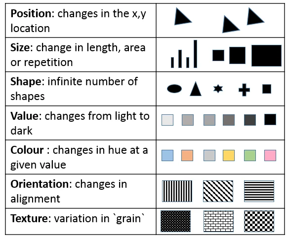
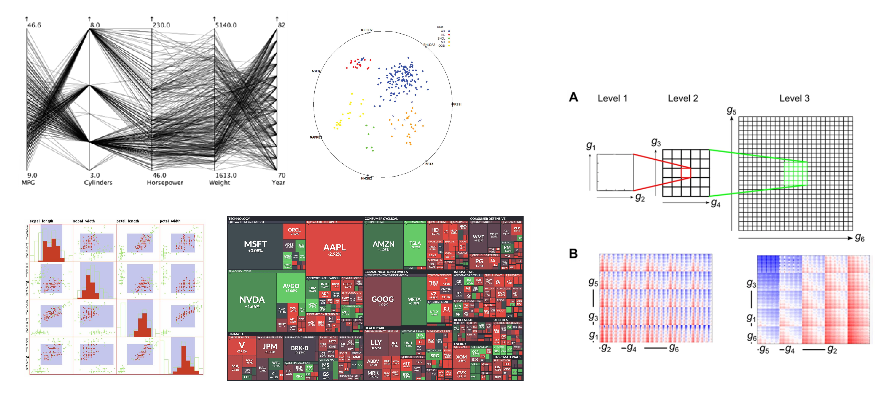
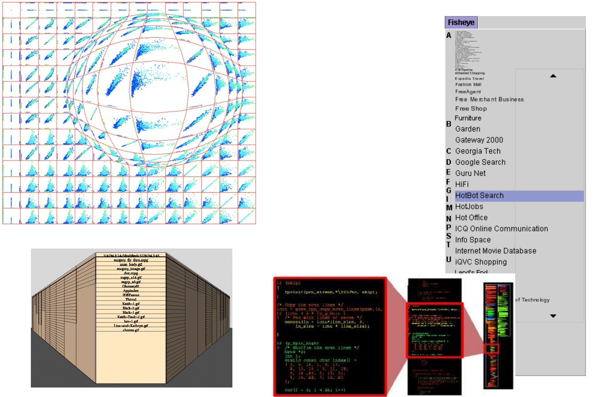

# Vizualizace

> Základní metriky pro hodnocení kvality vizualizace (efektivita a expresivita), 
> osm základních vizuálních proměnných. 
> Základní vizualizační techniky pro 1D, 2D, 3D (explicitní a implicitní reprezentace povrchu). 
> Techniky pro vizualizaci multidimenzionálních dat 
> (paralelní souřadnice, RadViz, scatterplot matrices, dimensional stacking) a 
> hierarchických struktur (treemaps). Základní třídy interakčních technik (fisheye, perspektivní stěny), 
> specifika aplikace interakčních technik v prostoru samotných dat a v prostoru jejich atributů.

## Základní metriky pro hodnocení kvality vizualizace

Kvalita vizualizace se hodnotí dvěma protichůdnými, ale doplňujícími se kritérii:

* **Expresivita (Expressiveness):** Vyjadřuje poměr mezi zobrazenou informací a informací, kterou chceme původně vyjádřit. 
    * **Matematický vztah:** $$M_{exp} = \frac{\text{zobrazená informace}}{\text{informace k vyjádření}}$$ kde platí $0 \le M_{exp} \le 1$.
    * **Ideální stav ($M_{exp} = 1$):** Vizualizace obsahuje přesně to, co má. Pokud je hodnota nižší, informace chybí, nebo naopak přebývá šum, který v původních datech nebyl.
* **Efektivita (Effectiveness):** Hodnotí úspěšnost přenosu informace k uživateli na základě správnosti, rychlosti lidské interpretace a technické rychlosti vykreslování na obrazovku.
    * **Matematický vztah:** $$M_{eff} = \frac{1}{1 + \text{interpretace} + \text{vykreslování}}$$ kde se hodnota opět pohybuje v rozmezí $0 \le M_{eff} \le 1$.
    * **Ideální stav (blíží se 1):** Čas potřebný pro kognitivní interpretaci člověkem i pro technické renderování na GPU je minimální.

---

## Osm základních vizuálních proměnných

Slouží jako stavební kameny pro efektivní přenos informací do lidského vnímání.

* **Pozice (Position):** Nejdůležitější proměnná. Ideálně má každý datový prvek unikátní místo v lineárním či logaritmickém měřítku, čímž se předchází nežádoucím překryvům.
* **Tvar (Shape):** Reprezentuje geometrickou povahu prvků (body, linie, regiony, specifické symboly nebo písmena).
* **Velikost (Size):** Dobře použitelná pro bodové prvky a křivky u sad s malou kardinalitou. Je nevhodná pro plošné regiony, kde lidské oko hůře odhaduje přesný poměr obsahů.
* **Jas (Brightness):** Využívá jasovou stupnici (lineární či nelineární) pro mapování hodnot datových proměnných.
* **Barva (Color):** Charakterizována odstínem (*hue*) a saturací. Nevhodná volba palety může vytvářet umělé hranice v datech (typický problém kritizované duhové palety).
* **Orientace (Orientation):** Určuje natočení nebo specifický úhel vizuálního prvku na obrazovce.
* **Textura (Texture):** Mění své percepční prvky, jako je výška, hustota a míra náhodnosti uspořádání. Lidský zrak dokáže velmi dobře rozlišit zejména hustotu a velikost prvků.
* **Pohyb (Motion):** Může být asociován s jakoukoliv jinou proměnnou (směr pohybu, blikání, oscilace). Změny v obraze přirozeně přitahují pozornost a zlepšují kognici.

---

## Základní vizualizační techniky pro 1D, 2D, 3D

Vizualizační techniky se striktně liší podle počtu prostorových dimenzí, které data obsahují.

* **1D data (sekvence s jednou proměnnou):**
    * *Techniky:* Klasické linkové a sloupcové grafy, barevný pruh (*color bar*).
    * *Vícerozměrná 1D data:* Využívá se buď **juxtapositioning** (umisťování grafů vedle sebe), nebo **superimpositioning** (překrývání grafů v jednom souřadném systému).
* **2D data (hodnoty mapované přímo na plochu obrazovky):**
    * *Techniky:* **Scatterplot** (zobrazení bodů bez interpolace), **geografické mapy** (s liniemi a polygony), **rastrový obraz** (s interpolací mezi sousedními pixely), **cityscape** (zobrazení 3D bloků v rovině) a **kontury/izobary** (spojnice míst se stejnou hodnotou).
* **3D data (diskrétní vzorky spojitého fenoménu nebo sady 3D vrcholů a hran):**
    * **Explicitní reprezentace povrchu:** Povrch je přesně definován konkrétním výčtem prvků. Obsahuje seznam 3D vrcholů (*vertices*), hran (*edges*) a rovinných polygonů (*faces*), popřípadě sadu parametrických rovnic propojených bodů (např. polygonální síť).
    * **Implicitní reprezentace povrchu:** Povrch je definován jako izohladina (nulová úroveň) matematické funkce o více proměnných ve tvaru $f(x, y, z) = 0$. Popisuje plochy odpovídající zadaným prahovým hodnotám bez nutnosti explicitně generovat a ukládat polygony.

---

## Techniky pro multidimenzionální data a hierarchické struktury

Metody pro převod komplexních vícerozměrných vztahů do srozumitelného 2D prostoru.

* **Paralelní souřadnice (Parallel coordinates):** Namísto klasických ortogonálních os umisťuje osy paralelně vedle sebe (vertikálně či horizontálně). Každá datová položka je reprezentována jako lomená čára (*polyline*) protínající tyto osy v místech odpovídajících hodnot.
* **RadViz:** Technika inspirovaná Hookeovým zákonem o elasticitě, která hledá rovnovážnou polohu bodu. Kotvy jednotlivých $N$ dimenzí jsou rovnoměrně rozmístěny po obvodu kružnice a simulují pružiny, které přitahují datový bod silou úměrnou hodnotě dané dimenze.
* **Scatterplot matrices (SPLOM):** Symetrická matice o velikosti $N \times N$, která obsahuje dvourozměrné bodové grafy pro všechny možné dvojice dimenzí. Na hlavní diagonále jsou obvykle umístěny popisy dimenzí nebo histogramy.
* **Dimensional stacking:** Mapuje data z diskrétního $N$-dimenzionálního prostoru do jednoho 2D obrazu pomocí rekurzivního vnořování souřadných systémů. Dvojice hlavních dimenzí rozdělí obrazovku na makro-sekce a každá sekce se vnitřně dále dělí podle dvojic méně významných dimenzí.
* **Treemaps (pro hierarchické struktury):** Specifická *space-filling* metoda, která zobrazuje stromová data jako do sebe rekurzivně vnořené obdélníky. Prostor obrazovky se postupně dělí střídavě horizontálními a vertikálními liniemi podle hierarchie. Celková plocha obdélníku odpovídá kvantitativní vlastnosti (např. počtu listů).

---

## Základní třídy interakčních technik

Interakce umožňují efektivní navigaci a prozkoumávání rozsáhlých datových sad.

### Deformační operátory
* **Fisheye (Rybí oko):** Aplikuje se v prostoru obrazovky. Uživatel definuje střed transformace (ohnisko), poloměr lupy a míru deformace. Centrální oblast se zvětší pro detailní analýzu, zatímco okolní kontext zůstane viditelný, ale je plynule komprimován k okrajům.
* **Perspektivní stěny (Perspective walls):** Řeší navigaci v prostoru objektů tak, že data horizontálně rozprostřou na trojdílnou stěnu. Centrální panel (kolmo k pohledu) zobrazuje detail, zatímco boční panely se plynule svažují do pozadí pomocí perspektivní deformace, čímž udržují přehled o okolí.

### Specifika aplikace podle prostoru
* **V prostoru samotných dat (Space of data values):** Interakce přímo ovlivňují hodnoty, strukturu nebo uspořádání dat.
    * *Příklady:* Filtrování rozsahů hodnot pomocí posuvníků, datově řízené propojování a zvýrazňování v různých grafech současně (**brushing**), nebo změna topologie (přeskupování pořadí os u paralelních souřadnic, odstraňování hran).
* **V prostoru atributů (Space of attributes):** Interakce operují pouze nad vizuálními komponentami grafických entit a nemění samotná data.
    * *Příklady:* Změna barevného mapování, úprava jasu, ladění kontrastu nebo interaktivní modifikace přenosových funkcí (**transfer functions**), které určují míru průhlednosti a barvy při vizualizaci objemových dat.